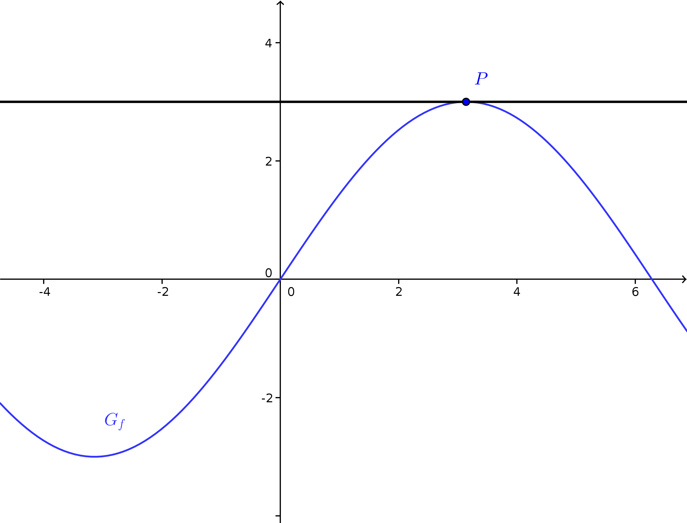

<!--
author:   Marco Hamann

email:    marco.hamann@htw-dresden.de

version:  0.0.1

language: de

comment:  Dieser Kurs richtet sich an Studierende der Hochschule für Technik und Wirtschaft Dresden im Studiengang Fahrzeugtechnik im 2. Semester.

script:   https://cdn.rawgit.com/davidedc/Algebrite/master/dist/algebrite.bundle-for-browser.js
@Algebrite.eval: <script> Algebrite.run(`@input`)</script>
-->


# Mathematik 2 (I995)

Dieser Kurs richtet sich an Studierende der Hochschule für Technik und Wirtschaft Dresden im Studiengang Fahrzeugtechnik im 2. Semester.

Sie können diesen Kurs auf [LiaScript](https://liascript.github.io/course/?https://github.com/marco-hamann/Mathe2/blob/main/README.md) oder [Opal](https://bildungsportal.sachsen.de/opal/auth/RepositoryEntry/16640933900) aufrufen. Das Repository zu diesem Kurs finden Sie unter

https://github.com/marco-hamann/Mathe2


## Integralrechnung

Thema dieses Kapitels ist die Vertiefung der Integralrechnung für reelle Funktionen einer reellen Veränderlichen.

Schwerpunkte sind u. a. die numerische Integration sowie Anwendungen der Integralrechnung in der Berechnung von Flächen- und Volumeninhalten, von Kurvenlängen, von Massenschwerpunkten etc.

__Zentrale Fragen__ sind dabei die folgenden:

* Zusammenhang zwischen Integrierbarkeit einer Funktion und Infimum bzw. Supremum der Ober- bzw. Untersummen aller Zerlegungen des Integrationsintervalls
* Verfahren wie Trapezformel und Simpsonsche Formel zur numerischen Integration (d. i. der näherungsweisen Berechnung von bestimmten Integralen)
* Anwendung bestimmter Integrale zur Berechnung von Flächeninhalten, Volumen von Rotationskörpern, Massenschwerpunkten und Kurvenlängen


### Numerische Integration

Gegeben ist eine Funktion $f:[a,b]\to\mathbb{R}$, die nach oben und unten beschränkt ist, d. h. es gilt
$$
  m\leq f(x)\leq M
$$  
für alle $x\in[a,b]$ und Konstanten $m$ und $M$.

Hier ist $m\geq0$ vorausgesetzt, damit ist $f(x)\geq0$ für alle $x\in[a,b]$. Das bestimmte Integral ist dann als Flächeninhalt interpretierbar.
$$
  A=\int_{a}^b{f(x)}\,\mathrm{d}x
$$
Ziel ist, einen Näherungswert für den Flächeninhalt zu ermitteln.


Abschätzung des gesuchten Flächeninhaltes $A$
=============================================

1. Zerlegung $Z$ des Integrationsintervalls $[a,b]$ in Teilintervalle $[x_{k-1},x_k]$, $k\in\{1,2,\ldots,m\}$ mit $$ a=x_0<x_1<x_2<\ldots<x_{k-1}<x_k<\ldots<x_m=b $$
2. In $[x_{k-1},x_k]$ wird $f(x)$ durch einen festen Wert $f_k$ ersetzt. Dann ist $$ \sum_{k=1}^m{f_k\cdot\Delta x_k},\quad\Delta x_k=x_k-x_{k-1} $$ ein Näherungswert für den gesuchten Flächeninhalt A, worin $\Delta x_k$ die Intervallbreite bezeichnet.
3. Der Wert $f_k$ genügt wegen der Beschränktheit von $f$ der Bedingung $$ m_k=\inf_{x\in[x_{k-1},x_k]}{f(x)}\;\leq\; f_k\;\leq\; \sup_{x\in[x_{k-1},x_k]}{f(x)}=M_k $$ Die __Untersumme__ $s_Z$ und die __Obersumme__ $S_Z$ einer gegebenen Zerlegung $Z$ sind Schranken für den Flächeninhalt $A$. Es gilt: $$ s_Z=\sum_{k=1}^m{m_k\cdot\Delta_k}\;\leq\; A\;\leq\; \sum_{k=1}^m{M_k\cdot\Delta_k}=S_Z $$
4. Wird die Zerlegung $Z$ verfeinert, d. h. werden zusätzliche Stellen $x_j^\star\in[a,b]$, $j\in J$, hinzugefügt, entsteht eine verfeinerte Zerlegung $Z^\star$. Hierbei gilt: $$ s_Z\leq s_{Z^\star}\leq A \leq S_{Z^\star}\leq S_Z $$ d. h. die untere Schranke für $A$ wächst, wohingegen die obere Schranke für $A$ kleiner wird.[^1]
5. Existieren das Supremum der Untersummen und das Infimum der Obersummen aller Zerlegungen $Z$ $$ \sup_{\text{alle }Z}{s_Z}=\underline{A}\,,\quad \inf_{\text{alle }Z}{S_Z}=\overline{A} $$ so folgt $\underline{A}\leq A\leq\overline{A}$.

> Die Existenz des bestimmten Integrals $\int_a^b{f(x)}\mathrm{d}x$ kann gekoppelt werden an die Gleichheit $\underline{A}=\overline{A}$.

**Bemerkung.** Aus der Stetigkeit von $f$ auf $[a,b]$ folgt die Integrierbarkeit auf diesem Intervall.

Die Verwendung von Ober- bzw. Untersummen zur Berechnung eines bestimmten Integrals ist auch erklärt in

!?[youtube](https://www.youtube.com/watch?v=2bW8Zr7oTlY)

die Verwendung der Obersumme zur Zerlegungszahl $n$ bzw. für den Grenzübergang $n\to\infty$ an einem Beispiel in

!?[youtube](https://www.youtube.com/watch?v=wyG4IJmmAmY)

!?[youtube](https://www.youtube.com/watch?v=MBsHRSxuDKM)


Einige numerische Berechnungsmethoden
=====================================

Rechteckregel
-------------

Das Integrationsintervall $[a,b]$ wird in $n$ Teilintervalle gleicher Länge $$ h=\frac{b-a}{n}\quad \left(n\in\mathbb{N}\,, n\geq1\right) $$ zerlegt. Für die Zerlegung $$ Z:\,a=x_0<x_1<\ldots<x_n=b\,,\quad x_k=a+k\cdot h $$ kann beispielsweise $$ A=\int_{a}^b{f(x)}\mathrm{d}x \approx \sum_{k=1}^n{y_k\cdot h}\,,\quad y_k=f(x_k) $$ gesetzt werden, d. h. das als Flächeninhalt unter dem Graph der Funktion interpretierbare bestimmte Integral wird mittels achsenparalleler __Rechteckflächen__ genähert, deren "Höhe" durch den Funktionswert an der rechten Intervallgrenze bestimmt ist.

Die vorstehende Formel liefert eine näherungsweise Berechnung des bestimmten Integrals unter Benutzung der Funktionswerte $y_k=f(x_k)$ der Zerlegung $Z$ und der Intervallbreite $h$.

**Bemerkung.** Die Festlegung der Höhe der Rechtecke in der Rechteckregel durch den Funktionswert $y_k=f(x_k)$ ist willkürlich und kann durch den Funktionswert an einer beliebigen Stelle $x_k^\star\in[x_{k-1},x_k]$ ersetzt werden, beispielsweise $$ f(x_{k-1})\quad\text{bzw.}\quad f\left(\frac{1}{2}\cdot(x_k+x_{k-1})\right) $$ für den Funktionswert der linken Intervallgrenze beziehungsweise der Intervallmitte.


Trapezregel
-----------

Mit dem Ansatz der Rechteckregel wird das arithmetische Mittel der Inhalte $$ y_k\cdot h\quad\text{und}\quad y_{k-1}\cdot h $$ der Rechteckflächen mit den Funktionswerten $y_k$ an rechter und $y_{k-1}$ an linker Grenze des Intervalls $[x_{k-1},x_k]$ als Höhen gebildet. Dies entspricht dem Flächeninhalt $$ \frac{1}{2}\cdot\left(y_{k-1}+y_k\right)\cdot h $$ eines __Trapez__ über dem Intervall $[x_{k-1},x_k]$.

Das bestimmte Integral kann somit genähert werden durch $$ A=\int_a^b{f(x)}\mathbb{d}x\,\approx\,\frac{h}{2}\cdot\sum_{k=1}^n{\left(y_{k-1}+y_k\right)}=\frac{h}{2}\cdot\left(y_0+y_n+2\cdot\sum_{k=1}^{n-1}{y_k}\right) $$

Die vorstehende Formel liefert eine näherungsweise Berechnung des bestimmten Integrals unter Benutzung der Funktionswerte $y_k=f(x_k)$ der Zerlegung $Z$ und der Intervallbreite $h$.


Simpson-Regel
-------------

Zu einer besseren Näherung des bestimmten Integrals kommt man, wenn jeweils drei zur Zerlegung $Z$ gehörende, benachbarte Punkte auf dem Funktionsgraph $$ (x_k,f(x_k))\,,\quad (x_{k+1},f(x_{k+1}))\,,\quad (x_{k+2},f(x_{k+2})) $$ durch eine quadratische Funktion (Parabel) interpoliert werden. Für eine Näherung des bestimmten Integrals ist das Integrationsintervall $[a,b]$ hierfür in eine gerade Anzahl $m=2\cdot n$, $n\in\mathbb{N}\setminus\{0\}$, von Teilintervallen der Breite $$ h=\frac{b-a}{2\cdot n} $$ zu zerlegen.

Das bestimmte Integral wird hierdurch genähert mittels $$ A=\int_a^b{f(x)}\mathbb{d}x\,\approx\,\frac{h}{3}\cdot\left(y_0+y_n+4\cdot\sum_{j=1}^{n}{y_{2\cdot j-1}}+2\cdot\sum_{k=1}^{n-1}{y_{2\cdot k}}\right) $$
(Nachweis, siehe Abschnitt [Simpson-Regel](#Simpson-Regel))

Wie bei den vorstehenden Methoden liefert diese Formel eine näherungsweise Berechnung des bestimmten Integrals unter Benutzung der Funktionswerte $y_k=f(x_k)$ der Zerlegung $Z$ und der Intervallbreite $h$.

**Bemerkung.** Die Näherungsformeln der Trapez- und Simpson-Regel gelten unabhängig ihrer geometrischen Interpretation für jede auf dem Intervall $[a,b]$ stetige Funktion $f$. Beide Näherungen konvergieren für $n\to\infty$ gegen den Wert des bestimmten Integrals.

Ein interaktives Beispiel zur Simpsonregel ist dargestellt unter [Simpsonregel](https://www.geogebra.org/m/GynQV3W6), ein Überblick über die dargestellten Verfahren zur numerischen Integration unter [Numerische Integration](https://www.geogebra.org/m/bgHmPgMf).


Sicher gewusst?
===============

Sie können Ihr Wissen gern bei der Beantwortung der nachstehenden Fragen testen.

**Frage 1.** Die Berechnung des bestimmten Integrals $$ \int_a^b{f(x)}\,\mathrm{d}x $$ einer reellen Funktion einer reellen Variablen mittels der Simpson-Regel ist __exakt__ für

[( )] keine Funktion $f$.
[( )] jede auf dem Intervall $[a,b]$ stetige Funktion $f$.
[(X)] beliebige quadratische Funktion $f$.
[( )] jede lineare Funktion $f$.
[[?]] Bei Anwendung der Simpson-Regel lässt sich der Graph des Integranden $f$ im Integrationsintervall $[a,b]$ durch Parabelbögen durch je drei benachbarte Stützpunkte genähert interpretieren.
****************************************

Die Graphen quadratischer reeller Funktionen $f:x\mapsto y=a\cdot x^2+b\cdot x+c$, $D\subseteq\mathbb{R}$, sind Parabeln / -bögen, die mit den stückweise definierten quadratischen Funktionen übereinstimmen.

****************************************

**Frage 2.** Der bei der Berechnung des bestimmten Integrals $$ \int_0^\pi{\sin{x}}\,\mathrm{d}x $$ mittels Trapez-Regel für $n=2$ entstandene Fehler beträgt rund

[( )] $0.1$
[( )] $0.04$
[(X)] $0.4$
[[?]] Das bestimmte Integral kann als Flächeninhalt zwischen Sinuskurve und $x$-Achse interpretiert werden. Durch Anwendung der Trapez-Regel ergibt sich ein Dreieck mit den Eckpunkten $$ (0,0)\,,\quad \left(\frac{\pi}{2},1\right)\,,\quad (\pi,0) $$ als Ersatzfläche.
****************************************

Das bestimmte Integral berechnet sich unmittelbar zu $$\int_0^\pi{\sin{x}}\,\mathrm{d}x=2 $$ Durch Anwendung der Trapezregel für $n=2$ wird dieser Wert durch $\frac{\pi}{2}\approx1.57$ (Flächeninhalt) genähert.

****************************************

**Frage 3.** Ermitteln Sie - falls existent - den Grenzwert $$ \lim_{n\to\infty}{\frac{\pi}{2\cdot n}\cdot\left(\cos{\frac{\pi}{2\cdot n}}+\cos{\frac{2\cdot\pi}{2\cdot n}}+\cos{\frac{3\cdot\pi}{2\cdot n}}+\ldots+\cos{\frac{n\cdot\pi}{2\cdot n}}\right)} $$ unter Benutzung der geometrischen Interpretation der Rechteck-Regel.

[(X)] $1$
[( )] $\infty$
[( )] $2$
[[?]] Fassen Sie den Grenzwert (einer Summe) als bestimmtes Integral $$ \int_0^{\frac{\pi}{2}}{f(x)}\,\mathrm{d}x $$ auf. Bestimmen Sie $f(x)$.
****************************************

Die Summanden haben die Form $h\cdot\cos{\left(k\cdot h\right)} $ mit $$ h=\frac{\pi}{2\cdot n}=\frac{\frac{\pi}{2}-0}{n} $$ Die Summe im Argument des Limes kann als Inhaltssumme von $n$ im Intervall $$ \left[0,\frac{\pi}{2}\right] $$ entlang der $x$-Achse zusammenhängenden, achsenparallelen Rechtecken der Breite $h$ und der Höhe $y_k=\cos{(k\cdot h)}$ aufgefasst werden, also $$\int_0^{\frac{\pi}{2}}{\cos{x}}\,\mathrm{d}x=1 $$

****************************************


[^1]: Für zwei beliebige Zerlegungen $Z$ und $Z'$ und für die gemeinsame Verfeinerung $Z^\star$ gilt stets $$ s_Z\leq s_{Z^\star}\leq A\leq S_{Z^\star}\leq S_{Z'} $$


### Trapezregel

Die Berechnung eines Näherungswertes für das bestimmte Integral $$ \int_a^b{f(x)\,\mathrm{d}x} $$ über die Funktion $f$ mit $$ x\mapsto y=f(x)\,,\quad [a,b]\subseteq D_f\,,\quad f(x)\geq0\;\;\forall x\in[a,b] $$ mit Hilfe der Trapezformel erfolgt durch nachstehende Rechenschritte.


Rechenverfahren Trapezregel
----------------------------

1. Lege die Anzahl $n$ $(n\geq 1)$ der Teilintervalle gleicher Länge fest, in die das Integrationsintervall zerlegt werden soll. Berechne die __Länge__ eines Teilintervalls $$ h=\frac{b-a}{n} $$
2. Zerlege das Integrationsintervall $[a,b]$ in die Teilintervalle $$ [a,b]=[x_0,x_1]\cup[x_1,x_2]\cup\ldots\cup[x_{n-1},x_n] $$ worin sich die __Stützstellen__ berechnen mittels $$ x_i=a+h\cdot i\,,\quad i\in\{0,1,2,\ldots,n\} $$ Insbesondere sind $x_0=a$ und $x_n=b$.
3. Berechne die $n+1$ __Stützwerte__ $y_i=f(x_i)$, d. s. die Funktionswerte an den Stützstellen $x_i$.
4. Berechne einen Näherungswert für das bestimmte Integral mittels $$ \int_{a}^b{f(x)}\mathrm{d}x\approx \frac{h}{2}\cdot(y_0+y_1) + \frac{h}{2}\cdot(y_1+y_2) + \ldots \frac{h}{2}\cdot(y_{n-1}+y_n) $$ Es ergibt sich schließlich
> Trapezformel $$ \int_{a}^b{f(x)}\mathrm{d}x\approx\frac{h}{2}\cdot\left(y_0+y_n+2\cdot\sum_{k=1}^{n-1}{y_k}\right)$$

Eine Erklärung der Trapezregel zur näherungsweisen Berechnung des bestimmten Integrals ist erklärt in

!?[Trapezregel](https://www.youtube.com/watch?v=6hqHufW0dD4)

**Bemerkung.** Die vorstehende Formel ist ein Spezialfall der _Gaußschen Trapezformel_, mit der sich der Flächeninhalt $A$ eines einfachen Polygons berechnen lässt. $$ 2\cdot A=\sum_{i=1}^n{\left(y_i+y_{i+1}\right)\cdot\left(x_i-x_{i+1}\right)} $$ Die Koordinaten $x_i$ und $y_i$ mit $i\in\{1,2,\ldots,n\}$ bezeichnen darin die Koordinaten der Eckpunkte des Polygons, des Weiteren sind in der Formel $x_{n+1}=x_1$ und $y_{n+1}=y_1$ zu setzen. Siehe auch [wikipedia](https://de.wikipedia.org/wiki/Gaußsche_Trapezformel).

**Beispiel.** Gegeben ist die Funktion $f:\mathbb{R}\to\mathbb{R}$ mit $$ x\mapsto y=f(x)=\exp{\left(x^2\right)} $$ sowie das Intervall $[a,b]=[0,1]$. Zu berechnen ist ein Näherungswert des bestimmten Integrals $$ \int_{0}^1{\exp{\left(x^2\right)}}\,\mathrm{d}x $$ für eine Zerlegung des Integrationsintervalls in $n=3$ Teilintervalle gleicher Länge.

1. Mit $n=3$ ergibt sich die Länge $$ h=\frac{1}{3} $$ der Teilintervalle.
2. Das Integrationsintervall wird zerlegt in $$ [0,1]=\left[0,\frac{1}{3}\right]\cup\left[\frac{1}{3},\frac{2}{3}\right]\cup\left[\frac{2}{3},1\right] $$ d. h. mit den Stützstellen $$ x_0=0\,,\quad x_1=\frac{1}{3}\,,\quad x_2=\frac{2}{3}\quad\text{und}\quad x_3=1 $$
3. Die Stützwerte berechnen sich zu $y_i=f(x_i)=\exp{\left((x_i)^2\right)}$ mit $$ y_0=1\,,\quad y_1\approx 1.1175\,,\quad y_2\approx 1.5596\quad\text{und}\quad y_3=\exp{1}\approx 2.7183 $$
4. Das bestimmte Integral besitzt den Näherungswert $$ \int_{0}^1{\exp{\left(x^2\right)}}\,\mathrm{d}x\approx \frac{h}{2}\cdot\left(y_0+y_3+2\cdot(y_1+y_2)\right)\approx 1.5121 $$

Wird hingegen eine Zerlegung von $[0,1]$ in $n=4$ Teilintervalle gleicher Länge vorgenommen, so ergibt sich mithilfe der Trapezregel ein Näherungswert $$\int_{0}^1{\exp{\left(x^2\right)}}\,\mathrm{d}x\approx 1.4907 $$

```javascript
n=4
h=1/n
f=exp(x^2)
float(h/2*(exp(0)+exp(1)+2*sum(subst(i*h,x,f),i,1,n-1)))
```
@Algebrite.eval

Halbiert man die Länge der Teilintervalle, d. h. verdoppelt man die Anzahl $n$ der Intervalle, so kann auf die vorangegangene Rechnung zurückgegriffen werden.


Verfahrensfehler Trapezregel
-----------------------------

Der mittels Trapezregel berechnete der Näherungswert $T_n(f)$ für das bestimmte Integral lässt sich darstellen $$ \int_a^b{f(x)}\,\mathrm{d}x = T_n(f)+\delta_n(f) $$ worin $\delta_n(f)$ den gemachten __Verfahrensfehler__ bezeichnet.

>Ist $f$ zweimal differenzierbar, so kann der Verfahrensfehler abgeschätzt werden mittels $$ |\delta_n(f)|\leq\frac{b-a}{12}\cdot h^2\cdot\max_{a\leq x\leq b}{|f^{\prime\prime}(x)|} $$

Hieraus lässt sich schließen, dass sich bei Halbierung der Länge der Teilintervalle die obere Schranke für $|\delta_n(f)|$ mit dem Faktor $\frac{1}{4}$ verkleinert. Durch sukzessives Verkleinern der Länge $h$ der Teilintervalle kann der Verfahrensfehler beliebig klein gemacht werden.


### Simpson-Regel

Zunächst ist die in der Simpson-Regel verwendete Approximation zu betrachten.

>**Satz.** Gelten für Punkte $(x_0,y_0)$, $(x_1,y_1)$ und $(x_2,y_2)$ die Beziehungen $$ x_0\not= x_2\quad\wedge\quad x_1=\frac{1}{2}\cdot(x_0+x_2) $$ so berechnet sich das bestimmte Integral der die Punkte interpolierenden quadratischen Funktion $$ \int_{x_0}^{x_2}{(a\cdot x^2+b\cdot x+c)}\,\mathrm{d}x=\frac{h}{3}\cdot(y_0+4\cdot y_1+y_2) $$ worin $h=x_2-x_1=x_1-x_0$ bedeutet.

**Beweisidee.** Die Koeffizienten $a$, $b$ und $c$ im Integranden sind durch die Koordinaten $(x_i,y_i)$ der zu interpolierenden Punkte eindeutig festgelegt. Für den Nachweis der Gleichheit von linker und rechter Seite reicht es jedoch aus:
* das bestimmte Integral auf der linken Seite mittels Hauptsatz der Differential- und Integralrechnung zu berechnen $$ \int_{x_0}^{x_2}{(a\cdot x^2+b\cdot x+c)}\,\mathrm{d}x=\frac{a}{3}\cdot \left(x_2^3-x_0^3\right)+\frac{b}{2}\cdot \left(x_2^2-x_0^2\right)+c\cdot\left(x_2-x_0\right) $$
* in der linken Seite $y_i=a\cdot x_i^2+b\cdot x_i+c$ mit $i\in\{0,1,2\}$ zu setzen sowie $x_1=\frac{1}{2}\cdot(x_0+x_2)$ zu verwenden
um die Gleichheit nachzuweisen. Die konkrete Gestalt der Koeffizienten wird hierfür nicht benötigt. $\square$


Rechenverfahren Simpson-Regel
----------------------------

Die Berechnung eines Näherungswertes für das bestimmte Integral $$ \int_a^b{f(x)\,\mathrm{d}x} $$ über die Funktion $f$ mit $$ x\mapsto y=f(x)\,,\quad [a,b]\subseteq D_f\,,\quad f(x)\geq0\;\;\forall x\in[a,b] $$ mit Hilfe der Simpson-Regel erfolgt analog zum vorigen Abschnitt durch nachstehende Rechenschritte.

1. Lege die Anzahl $m=2\cdot n$ $(n\geq 1)$[^1] der Teilintervalle gleicher Länge fest, in die das Integrationsintervall zerlegt werden soll. Berechne die __Länge__ eines Teilintervalls $$ h=\frac{b-a}{m}=\frac{b-a}{2\cdot n} $$
2. Zerlege das Integrationsintervall $[a,b]$ in die Teilintervalle $$ [a,b]=[x_0,x_1]\cup[x_1,x_2]\cup\ldots\cup[x_{2\cdot n-1},x_{2\cdot n}] $$ worin sich die __Stützstellen__ berechnen mittels $$ x_i=a+h\cdot i\,,\quad i\in\{0,1,2,\ldots,n\} $$ Insbesondere sind $x_0=a$ und $x_n=b$.
3. Berechne die $n+1$ __Stützwerte__ $y_i=f(x_i)$, d. s. die Funktionswerte an den Stützstellen $x_i$.
4. Berechne einen Näherungswert für das bestimmte Integral mittels $$ \int_{a}^b{f(x)}\mathrm{d}x\approx \frac{h}{3}\cdot(y_0+4\cdot y_1+y_2) + \frac{h}{3}\cdot(y_2+4\cdot y_3+y_4) + \ldots \frac{h}{3}\cdot(y_{2\cdot n-2}+4\cdot y_{2\cdot n-1}+y_{2\cdot n}) $$ Es ergibt sich schließlich

> Simpsonformel $$ \int_a^b{f(x)}\mathbb{d}x\,\approx\,\frac{h}{3}\cdot\left(y_0+y_n+4\cdot\sum_{j=1}^{n}{y_{2\cdot j-1}}+2\cdot\sum_{k=1}^{n-1}{y_{2\cdot k}}\right) $$

Eine Erklärung der Simpson-Regel zur näherungsweisen Berechnung des bestimmten Integrals ist erklärt in

!?[youtube](https://www.youtube.com/watch?v=N0kFSTDvDcw)

**Beispiel.** Weitgehend analog zum Beispiel in Abschnitt [Trapezregel](#Trapezregel) ist ein Näherungswert des bestimmten Integrals $$ \int_{0}^1{\exp{\left(x^2\right)}}\,\mathrm{d}x $$ für eine Zerlegung des Integrationsintervalls in $n=4$ (gerade Anzahl!) Teilintervalle gleicher Länge mithilfe der Simpson-Regel zu berechnen.

```javascript
n=2
m=2*n
h=1/m
f=exp(x^2)
float(h/3*(exp(0)+exp(1)+4*sum(subst((2*i-1)*h,x,f),i,1,n)+2*sum(subst((2*k)*h,x,f),k,1,n-1)))
```
@Algebrite.eval


Verfahrensfehler Simpson-Regel
------------------------------

Der mittels Simpson-Rregel berechnete der Näherungswert $S_n(f)$ für das bestimmte Integral lässt sich darstellen $$ \int_a^b{f(x)}\,\mathrm{d}x = S_n(f)+\delta_n(f) $$ worin $\delta_n(f)$ den gemachten __Verfahrensfehler__ bezeichnet. $\delta_n(f)$ ist um so kleiner, je kleiner die Länge $h$ der Teilintervalle ist.

>Ist $f$ viermal differenzierbar, so kann der Verfahrensfehler abgeschätzt werden mittels $$ |\delta_n(f)|\leq\frac{b-a}{180}\cdot h^4\cdot\max_{a\leq x\leq b}{|f^{(4)}(x)|} $$

Hieraus lässt sich schließen, dass sich bei Halbierung der Länge der Teilintervalle die obere Schranke für $|\delta_n(f)|$ mit dem Faktor $\frac{1}{16}$ verkleinert. Durch sukzessives Verkleinern der Länge $h$ der Teilintervalle kann der Verfahrensfehler beliebig klein gemacht werden.

[^1]: Die Anzahl der Teilintervall muss hier aufgrund der Interpolation der Stützpunkte $(x_i,y_i)\in G_f$ mittels Parabeln als gerade natürliche Zahl vorausgesetzt werden.


### Flächeninhalte

 Zwischen Funktionsgraph und $x$-Achse eingeschlossenen Fläche
==============================================================

Ziel dieses Abschnitts ist die Berechnung von Flächeninhalten , die vom Graph einer reellen Funktion $f$ einer reellen Variablen und Geraden der Form $x=a$ mit $a\in\mathbb{R}$ begrenzt werden. Die Funktionen werden über dem betrachteten Intervall stetig vorausgesetzt.

Es werden die folgenden Fälle unterschieden.

1. Es gilt $$ f(x)\geq 0\;\;\forall x\in[a,b] $$ Durch den Funktionsgraph $G_f$ und die Geraden zu den Gleichungen $x=a$, $x=b$ mit $a<b$ sowie $y=0$ wird eine Fläche begrenzt. Der Inhalt $A$ der Fläche berechnet sich durch das bestimmte Integral $$ A=\int_a^b{f(x)}\,\mathrm{d}x\geq 0 $$ vergleiche Abschnitt [Numerische Integration](#Numerische-Integration).

2. Im Unterschied wird $$ f(x)\leq 0 \;\;\forall x\in[a,b] $$ angenommen. Die durch Funktionsgraph $G_f$ und Geraden zu $x=a$, $x=b$ mit $a<b$ sowie zu $y=0$ begrenzte Fläche besitzt den Inhalt $$ A=\int_a^b{((-1)\cdot f(x))}\,\mathrm{d}x\geq 0 $$

3. Subsummierend wird $$ f(x)\geq 0 \;\;\vee\;\; f(x)\leq 0\quad\forall x\in [a,b] $$ angenommen. O. B. d. A. gelte für ein $c\in[a,b]$ mit $$\begin{array}{rcl} f(x)\geq 0 & \text{für} & x\in[a,c) \\ f(x)=0 & \text{für} & x=c \\ f(x)\leq 0 & \text{für} & x\in(c,b] \end{array} $$ so berechnet sich der Inhalt der beiderseits der $x$-Achse gelegenen, durch $G_f$ begrenzten, Fläche mittels $$ A=A_1+A_2=\int_a^c{f(x)}\,\mathrm{d}x+\int_c^b{((-1)\cdot f(x))}\,\mathrm{d}x $$ Für die Berechnung der durch $G_f$ begrenzten Fläche ist also gegebenenfalls das Integrationsintervall $[a,b]$ in Teilintervalle zu zerlegen, in denen entweder Fall 1 oder Fall 2 gilt. Hierfür ist die Berechnung der Nullstellen von $f$ hilfreich.

> Allgemeine Formel $$ A=\int_a^b{|f(x)|}\,\mathrm{d}x \quad\text{mit}\quad |f(x)|=\left\{\begin{array}{rcl} f(x) & \text{falls} & f(x)\geq 0 \\ (-1)\cdot f(x) & \text{falls} & f(x)<0 \end{array}\right. $$ für $x\in[a,b]$.

**Beispiel.** Gegeben ist die Funktion $f:\mathbb{R}\to\mathbb{R}$ mit $$ f(x)=(x-1)^2-1 $$ Gesucht ist der durch $G_f$ im Intervall $[-1,3]$ mit der $x$-Achse begrenzte Flächeninhalt.

1. Berechnung der Nullstellen von $f$ im angegebenen Intervall $$ f(x)=x\cdot(x-2)=0\quad\leftrightarrow\quad x=0\;\vee\;x=2 $$
2. Zerlegung des Intervalls in Teilintervalle $$ [-1,3]=[-1,0]\cup[0,2]\cup[2,3] $$ Es gelten offensichtlich $$ f(x)\geq 0\quad\text{für}\quad x\in\left([-1,0]\cup[2,3]\right) $$ und $$ f(x)< 0\quad\text{für}\quad x\in(0,2) $$
3. Berechnung des Inhalts der durch $G_f$ und der $x$-Achse begrenzten Fläche $$ A=\int_{-1}^3{|f(x)|}\,\mathrm{d}x = \int_{-1}^0{\left((x-1)^2-1\right)}\,\mathrm{d}x + \int_{0}^2{\left(1-(x-1)^2\right)}\,\mathrm{d}x + \int_{2}^3{\left((x-1)^2-1\right)}\,\mathrm{d}x $$ Mit dem unbestimmten Integral $$ \int{\left((x-1)^2-1\right)}\,\mathrm{d}x=\frac{1}{3}\cdot(x-1)^3-x+C=\frac{1}{3}\cdot x^3-x^2+K $$ und $K=C-\frac{1}{3}\in\mathbb{R}$ ergibt sich der Flächeninhalt von $$ A=\frac{4}{3}+\frac{4}{3}+\frac{4}{3}=4 $$ Flächeneinheiten.

```javascript
f=(x-1)^2-1
roots(f=0)
factor(f)
integral(f,x)
defint(f,x,-1,0)+defint(-f,x,0,2)+defint(f,x,2,3)
defint(f,x,-1,3)
```
@Algebrite.eval

In den nachstehenden Videos wird das Verfahren zur Inhaltsberechnung einer durch $G_f$ und der $x$-Achse begrenzten Fläche mit Hilfe bestimmter Integrale erklärt.

!?[Inhaltsbestimmung1](https://www.youtube.com/watch?v=2zVgFO-z-nY)
!?[Inhaltsbestimmung2](https://www.youtube.com/watch?v=KBP6g7MoF54)

Von zwei Funktionsgraphen begrenzte Fläche
==========================================

Zur Berechnung des Inhalts $A$ einer Fläche, die in einem gegebenen Intervall $[a,b]$ durch die Graphen zweier Funktionen $f$ und $g$ begrenzt wird, sind zu unterscheiden:

1. Es wird angenommen $$ f(x)\geq g(x) \quad\forall x\in[a,b] $$ Damit bildet im Intervall $[a,b]$ der Funktionsgraph $G_f$ die obere und $G_g$ die untere Randkurve der begrenzten Fläche. Da sich der Inhalt nicht ändert, wenn alle begrenzenden Kurven um denselben Wert $a>0$ in Richtung der $y$-Achse verschoben werden, lässt sich $A$ durch eine Flächendifferenz berechnen $$ A=\int_a^b{f(x)}\,\mathrm{d}x-\int_a^b{g(x)}\,\mathrm{d}x=\int_a^b{(f(x)-g(x))}\,\mathrm{d}x $$ Vergleiche Eigenschaften des bestimmten Integrals.
2. Analog kann angenommen werden $$ f(x)\leq g(x) \quad\forall x\in[a,b] $$ Hier bildet im Intervall $[a,b]$ der Funktionsgraph $G_g$ die obere und $G_f$ die untere Randkurve der begrenzten Fläche. Der Inhalt $A$ kann berechnet werden mittels $$ A=\int_a^b{g(x)}\,\mathrm{d}x-\int_a^b{f(x)}\,\mathrm{d}x=(-1)\cdot\int_a^b{(f(x)-g(x))}\,\mathrm{d}x $$
3. Subsummierend können im Integrationsintervall $[a,b]$ obere und untere Randkurve wechseln. Für die Berechnung  des Inhaltes der begrenzten Fläche ist dieses so in Teilintervalle zu zerlegen, dass in jedem Teilintervall einer der beiden zuvor beschriebenen Fälle gilt. Hierfür ist die Berechnung der gemeinsamen Punkte von $G_f$ und $G_g$ hilfreich.[^1]

> Allgemeine Formel $$ A=\int_a^b{|f(x)-g(x)|}\,\mathrm{d}x $$ mit $$ |f(x)-g(x)|=\left\{\begin{array}{rcl} f(x)-g(x) & \text{falls} & (f(x)-g(x))\geq 0 \\ g(x)-f(x) & \text{falls} & (f(x)-g(x))<0 \end{array}\right. $$ für $x\in[a,b]$.

**Beispiel.** Gegeben sind die Funktionen $f:\mathbb{R}\to\mathbb{R}$ und $g:\mathbb{R}\to\mathbb{R}$ mit $$ f(x)=x\,,\quad g(x)=(x-1)^2-1 $$ Gesucht ist der durch $G_f$ und $G_g$ im Intervall $[-1,4]$ begrenzte Flächeninhalt.

1. Berechnung der Argumente der gemeinsamen Punkte von $G_f$ und $G_g$ im angegebenen Intervall $$ f(x)=g(x)\quad\leftrightarrow\quad x\cdot(x-3)=0 \quad\leftrightarrow\quad x=0\;\vee\;x=3 $$
2. Zerlegung des Intervalls in Teilintervalle $$ [-1,4]=[-1,0]\cup[0,3]\cup[3,4] $$ Es gelten offensichtlich $$ f(x)< g(x)\quad\text{für}\quad x\in\left([-1,0)\cup(3,4]\right) $$ und $$ f(x)\geq g(x)\quad\text{für}\quad x\in[0,3] $$
3. Berechnung des Inhalts der durch $G_f$ und $G_g$ begrenzten Fläche $$ A=\int_{-1}^3{|f(x)-g(x)|}\,\mathrm{d}x = \int_{-1}^0{\left(x^2-3\cdot x\right)}\,\mathrm{d}x + \int_{0}^3{\left(3\cdot x-x^2\right)}\,\mathrm{d}x + \int_{3}^4{\left(x^2-3\cdot x\right)}\,\mathrm{d}x $$ Mit dem unbestimmten Integral $$ \int{\left(x^2-3\cdot x\right)}\,\mathrm{d}x=\frac{1}{3}\cdot x^3-3\cdot x^2+C $$ und $C\in\mathbb{R}$ ergibt sich der Flächeninhalt von $$ A=\frac{11}{6}+\frac{27}{6}+\frac{11}{6}=\frac{49}{6} $$ Flächeneinheiten.

```javascript
f=x
g=(x-1)^2-1
roots(f=g)
factor(f-g)
f-g
integral(f-g,x)
defint(g-f,x,-1,0)+defint(f-g,x,0,3)+defint(g-f,x,3,4)
defint(g-f,x,-1,4)
```
@Algebrite.eval

Eine Visualisierung der Berechnung von Flächeninhalten mittels bestimmter Integrale kann man unter [Flächeninhalt](https://www.geogebra.org/m/hhdCS9FZ) betrachten.


Sicher gewusst?
===============

Sie können Ihr Wissen gern bei der Beantwortung der nachstehenden Fragen testen.

**Frage 1.** Welchen Inhalt besitzt die Fläche, die vom Graph der Funktion $$ f:x\mapsto y=f(x)=x^3-3\cdot x^2+2\cdot x\,,\quad x\in\mathbb{R} $$ und der $x$-Achse eingeschlossen wird?

Nutzen Sie, falls nötig die nachstehenden Rechenbefehle. Sie können diese bei Bedarf anpassen.

```javascript
f=x^3-3*x^2+2*x
roots(f=0)
factor(f)
defint(f,x,a,b)
```
@Algebrite.eval

[( )] $-\frac{1}{2}$
[( )] $0$
[(X)] $\frac{1}{2}$
[[?]] Berechnen Sie die Nullstellen der Funktion $f$ und untersuchen Sie die Funktionswerte zwischen benachbarten Nullstellen.
****************************************

Die Funktion besitzt die Nullstellen $0$, $1$ und $2$. Wegen $$ f(x)=x\cdot(x-1)\cdot(x-2) $$ gelten offensichtlich $$ \left\{\begin{array}{rcl} f(x)\geq0 & \text{falls} & x\in[0,1] \\ f(x)<0 & \text{falls} & x\in(1,2) \end{array}\right. $$ Der Inhalt der von $G_f$ und $x$-Achse begrenzten Fläche berechnet sich somit $$ A=\int_0^1{f(x)}\,\mathrm{d}x-\int_1^2{f(x)}\,\mathrm{d}x=\frac{1}{4}-\left(-\frac{1}{4}\right)=\frac{1}{2} $$

****************************************

**Frage 2.** Welche der beiden Integralwerte ist größer?

[( )] $\int_0^1{\exp{(-x)}}\,\mathrm{d}x$
[(X)] $\int_0^1{\exp{\left(-x^2\right)}}\,\mathrm{d}x$
[[?]] Überlegen Sie sich den Verlauf der Graphen beider Integrandenfunktionen im Intervall $[0,1]$. Nutzen Sie hierfür die Monotonie von $x\mapsto \exp{x}$ sowie den Größenvergleich der Exponenten.
****************************************

Es ist $-x\leq -x^2$ für alle $x\in[0,1]$. Da $u\mapsto \exp{u}$ streng monoton wachsend ist, folgt $$ \exp{(-x)}\leq\exp{(-x^2)}\quad\forall\;x\in[0,1] $$. Damit ist der Integralwert $$
  \int_0^1{\exp{\left(-x^2\right)}}\,\mathrm{d}x
$$ größer.

****************************************

[^1]: Es ist ausreichend, die Argumente der gemeinsamen Punkte von $G_f$ und $G_g$ zu bestimmen.


### Rotationsvolumen

Neben der Berechnung von [Flächeninhalten](#Flächeninhalte) lassen sich bestimmte Integrale zur Berechnung der Volumen von Rotationskörpern verwenden.

Hierfür werden die Rotationskörper mit Hilfe einer Profilkurve $k$ definiert, die sich als Graph einer reellen Funktion $$
  x\mapsto y=f(x)\,,\quad[a,b]\subseteq D_f\subset\mathbb{R}
$$ beschreiben lässt. Wird $k$ stetig um die $x$-Achse eines kartesischen Koordinatensystems mit Drehwinkel $\varphi\in[0,2\pi)$ gedreht, so lässt sich im betrachteten Intervall $[a,b]$ ein [Rotationsvolumen](https://www.geogebra.org/m/kh6pQ3M7 "info") begrenzen.

Der Profilschnitt des Volumens mit der $xy$-Ebene ergibt eine symmetrische (ebene) Fläche, deren obere und untere Randkurve durch Spiegelung an der $x$-Achse auseinander hervorgehen. In Richtung der $x$-Achse wird der Profilschnitt durch die Geraden $x=a$ und $x=b$ begrenzt.


Verfahren
=========

Zur näherungsweisen Berechnung des Volumeninhaltes $V$ wird das Rotationsvolumen in "flache" Drehzylinder (-Scheiben) um die $x$-Achse zerlegt, deren Volumen sich unter Verwendung der Funktionswerte $f(x)$ berechnen lässt.

Im Profilschnitt des Rotationsvolumens stellt sich diese Zerlegung als Zerlegung in Rechteckstreifen dar. Vergleiche Rechteckregel im Abschnitt [Numerische Integration](#Numerische-Integration).

1. Zerlege das Intervall $Z$ in Teilintervalle $[x_{k-1},x_k]$, $k\in\{1,2,...,n\}$ mit $$
  Z:\,a=x_0<x_1<\ldots<x_n=b
$$
2. Mit Hilfe der Höhe $\Delta{x_k}=x_k-x_{k-1}$ und dem Radius $r_k=|f(x_k^\star)|$ für ein $x_k^\star\in[x_{k-1},x_k]$ kann das Volumen der $k$-ten Drehzylinderscheibe berechnet werden nach der Formel *"Kreiszahl mal Quadrat des Radius mal Höhe"* $$
  \Delta{V_k}=\pi\cdot\left(f\left(x_k^\star\right)\right)^2\cdot\Delta{x_k}
$$
3. Das Volumen des Rotationskörpers berechnet sich näherungsweise als Summe über die Teilvolumen aller Drehzylinderscheiben $$
  V\approx V_n=\sum_{k=1}^n{\pi\cdot\left(f(x_k^\star)\right)^2\cdot\Delta{x_k}}=\pi\cdot\sum_{k=1}^n{\left(f(x_k^\star)\right)^2\cdot\Delta{x_k}}
$$

> **Rotationsvolumen.** Konvergiert die Folge der Volumen $V_n$ gegen den Grenzwert $$
  V=\lim_{n\to\infty}{V_n}
$$ so lässt sich aus der Näherungsformel die Formel zur Berechnung des Volumens $V$ mittels eines bestimmten Integrals ableiten $$
  V=\pi\cdot\int_a^b{\left(f(x)\right)^2}\,\mathrm{d}x
$$

**Bemerkung.** Wird der Graph einer reellen Funktion $$
  y\mapsto x=g(y)\,,\quad[c,d]\subseteq D_g\subset\mathbb{R}
$$ stetig um die $y$-Achse eines kartesischen Koordinatensystems mit Drehwinkel $\varphi\in[0,2\pi)$ gedreht, so lässt sich im betrachteten Intervall $[c,d]$ ein Rotationsvolumen begrenzen. Die Formel zur Berechnung des umschlossenen Volumens ergibt sich $$
  V_y=\pi\cdot\int_c^d{\left(g(y)\right)^2}\,\mathrm{d}y
$$
Zur Unterscheidung wird im Folgenden die Drehachse als Zeiger am Symbol für das Volumen gekennzeichnet: Wir unterscheiden hier $V_x$ beziehungsweise $V_y$ bezüglich der Rotation um die $x$-Achse beziehungsweise die $y$-Achse.

Eine Erläuterung der Volumenformeln für Rotationskörper ist auch im folgenden Video erklärt.

!?[Rotationsvolumen](https://www.youtube.com/watch?v=IOTNqGcHT1g&t=11s)

**Beispiel.** Zu berechnen ist das Volumen einer Kugelkappe zum Kugelradius $r>0$ und mit der Höhe $h>0$, wobei $2\cdot r\geq h$ gelten soll.

 als Teilvolumen einer Kugel.")<!-- style="width: 100%"-->

Als Profilkurve $k$ in der $xy$-Ebene kann verwendet werden $$
  x^2+y^2=r^2\quad\leftarrow\quad y=f(x)=\sqrt{r^2-x^2}
$$ wobei o. B. d. A. das Vorzeichen $+1$ gewählt wurde, und $x\in[r-h,r]$ eingeschränkt wird.

Durch stetige Rotation der Profilkurve $k$ um die $x$-Achse mit Drehwinkel $\varphi\in[0,2\pi)$ wird die Kugelkappe erhalten, die von der Ebene zur Gleichung $x=r-h$ begrenzt wird.

Das Volumen der Kugelkappe berechnet sich mit Hilfe des bestimmten Integrals $$
  V_x=\pi\cdot\int_{r-h}^r{\left(\sqrt{r^2-x^2}\right)^2}\,\mathrm{d}x
$$ Schrittweise berechnet sich unter Benutzung des Hauptsatzes der Differential- und Integralrechnung $$
  \begin{array}{rl}
    V_x & =\pi\cdot\left(r^2\cdot x-\frac{1}{3}\cdot x^3\right)|_{r-h}^r \\ & =\pi\cdot\left(r^3-\frac{1}{3}\cdot r^3-\left(r^2\cdot(r-h)\right)-\frac{1}{3}\cdot(r-h)^3\right) \\
    & = \frac{\pi}{3}\cdot h^2\cdot(3\cdot r-h)
  \end{array}
$$
Für $h=2\cdot r$ ergibt sich im Speziellen das Volumen der Kugel $V_x=\frac{4}{3}\cdot \pi\cdot r^3$.

```javascript
f=sqrt(r^2-x^2)
integral(pi*f^2,x)
V=defint(pi*f^2,x,r-h,r)
subst(2*r,h,V)
```
@Algebrite.eval


Sicher gewusst?
===============

**Frage.** Bestimmen Sie die obere Grenze $b>0$ so, dass das durch den Graph zu $$ x\mapsto y=f(x)=\sqrt{x}\,,\quad x\geq0 $$ bei stetiger Rotation um die $x$-Achse umschlossene Volumen den Wert $2\cdot \pi$ besitzt.

[(X)] $2$
[( )] $\frac{1}{16\cdot\pi}$
[( )] $-2$


### Bogenlänge

Berechnet werden soll Bogenlänge einer ebenen Kurve $k$, die als Graph $G_f$ einer reellen Funktion aufgefasst werden kann $$
  x\mapsto y=f(x)\,,\quad [a,b]\subset D_f\subseteq\mathbb{R}
$$

Für eine näherungsweise Berechnung kann $G_f$ über dem Intervall $[a,b]$ durch ein Polygon mit Ecken $P_k(x_k,f(x_k))\in G_f$ ersetzt werden, dessen Länge eine Näherung der gesuchten Länge ist. Hierfür ist das Intervall in Teilintervalle $[x_{k-1},x_k]$, $k\in\{1,2,...,n\}$, mit $$
  Z:\quad a=x_0<x_1<x_2<...<x_{n-1}<x_n=b
$$ zu zerlegen.

Jede Strecke des Polygons ist eine Sehne des Funktionsgraphen $G_f$. Die Länge $\Delta{s_k}$ der Sehne über dem Teilintervall $[x_{k-1},x_k]$ kann dabei mit Hilfe des Satzes von Pythagoras berechnet werden $$
  \left(\Delta{s_k}\right)^2=\left(\Delta{x_k}\right)^2+\left(\Delta{y_k}\right)^2\quad\stackrel{\Delta{s_k}>0}{\longleftrightarrow}\quad \Delta{s_k}=\Delta{x_k}\cdot\sqrt{1+\left(\frac{\Delta{y_k}}{\Delta{x_k}}\right)^2}
$$ worin $\Delta{x_k}=x_k-x_{k-1}$ die Länge des Teilintervals und $\Delta{y_k}=f(x_{k})-f(x_{k-1})$ die Differenz der Stützwerte bezeichnen. Die Summe über alle Teillängen $$
  s_n=\sum_{k=1}^n{\Delta{s_k}}=\sum_{k=1}^n{\left(\Delta{x_k}\cdot\sqrt{1+\left(\frac{\Delta{y_k}}{\Delta{x_k}}\right)^2}\right)}
$$ ergibt eine Näherung der gesuchten Bogenlänge von $G_f$ über dem Intervall $[a,b]$.[^1]

Eine interaktive Darstellung dieses Näherungsansatzes kann unter [Bogenlänge](https://www.geogebra.org/m/YgRkYUET "Info") betrachtet werden.

Mit Hilfe dieses Ansatzes soll hier ein bestimmtes Integral zur Berechnung der Bogenlänge $s$ eines Funktionsgraphen $G_f$ über einem Intervall $[a,b]\subset D_f$ entwickelt werden. Hierfür ist $G_f$ lokal durch das Bogenlängenstück $\mathrm{d}s$ der Tangente zu ersetzen. Analog zu obigem erhält man $$
  \left(\mathrm{d}s\right)^2=\left(\mathrm{d}x\right)^2+\left(\mathrm{d}y\right)^2=\left(\mathrm{d}x\right)^2\cdot\left(1+\left(\frac{\mathrm{d}y}{\mathrm{d}x}\right)^2\right)=\left(\mathrm{d}x\right)^2\cdot\left(1+\left(f^\prime(x)\right)^2\right)
$$ unter Benutzung der Differentiale. Hieraus folgt unmittelbar $$
  \mathrm{d}s=\mathrm{d}x\cdot\sqrt{1+\left(f^\prime(x)\right)^2}
$$ für das Bogenelement $\mathrm{d}s$. Durch Integration über dem Intervall $[a,b]$ ergibt sich das gesuchte Integral zur Berechnung der Bogenlänge $s$.

> **Bogenlänge.** Die Bogenlänge einer reellen, über einem Intervall $[a,b]\subset D_f$ differenzierbaren Funktion $f$ berechnet sich $$
  s=\int_{a}^b{\sqrt{1+\left(f^\prime(x)\right)^2}}\,\mathrm{d}x
$$

**Beispiel 1.** Mit Hilfe der entwickelten Formel soll der Umfang eines Kreises $k$ vom Radius $r>0$ berechnet werden.

O. B. d. A. kann der Kreis $k$ mit Mittelpunkt im Ursprung eines kartesischen Koordinatensystems in der Ebene betrachtet werden. In dieser Lage ergibt sich aus der Kreisgleichung $$
  x^2+y^2=r^2\quad\leftarrow\quad y=f(x)=\sqrt{r^2-x^2}
$$ als Funktion für den oberen Halbkreis, worin $x\in(-r,r)$ zu wählen ist.

Die Berechnung der ersten Ableitung von $f$ ergibt $$
  f^\prime(x)=\frac{-2\cdot x}{2\cdot\sqrt{r^2-x^2}}
$$ woraus sich unmittelbar der Radikand des Zielintegrals ergibt $$
  \sqrt{1+\left(f^\prime(x)\right)^2}=\frac{r}{\sqrt{r^2-x^2}}
$$

```javascript
f=sqrt(r^2-x^2)
sqrt(simplify(1+d(f)^2))
```
@Algebrite.eval

Wegen der Symmetrie eines Kreises reicht es aus, die Bogenlänge nur von einem Viertelkreis zu berechnen. Das Zielintegral ergibt sich somit $$
  s=4\cdot\int_0^r{\frac{r}{\sqrt{r^2-x^2}}}\,\mathrm{d}x
$$ Mit Hilfe der Substitution $$
  x=r\cdot\sin{u}\,,\quad \mathrm{d}x=r\cdot\cos{u}\,\mathrm{d}u
$$ ergibt sich daraus schrittweise $$
  s=4\cdot\int_0^r{\frac{r}{\sqrt{r^2-x^2}}}\,\mathrm{d}x = \left.\left.4\cdot r\cdot\int{\frac{\cos{u}}{\cos{u}}}\,\mathrm{d}u\right]_{u=\arcsin{\left(\frac{x}{r}\right)}}\right]_{x=0}^r=2\cdot\pi\cdot r
$$

**Beispiel 2.** Die Berechnung der Bogenlänge eines Funktionsgraphen an einem weiteren Beispiel kann in folgendem Video betrachtet werden.

!?[Bogenlänge](https://www.youtube.com/watch?v=ail_ksSYZxc "Berechnung der Bogenlänge eines Funktionsgraphen für die Funktion $x\mapsto y=f(x)=x^2$.")

[^1]: Die Näherung $s_n$ der Bogenlänge $s$ von $G_f$ über $[a,b]$ ist abhängig von der Zerlegung $z$ des Intervalls $[a,b]$.


### Weitere Integralformeln

Mantelflächeninhalt eines Rotationskörpers
==========================================

Unter Verwendung der Ansätze aus den Abschnitten [Rotationsvolumen](#Rotationsvolumen) und [Bogenlänge](#Bogenlänge) kann der Mantelflächeninhalt eines Rotationskörpers berechnet werden.

Bezeichnet erneut $k\subseteq G_f$ die Profilkurve des Rotationskörpers, die durch die reelle Funktion $$
  x\mapsto y=f(x)\,,\quad [a,b]\subset D_f
$$ beschrieben ist, so lässt sich durch stetiges Drehen von $k$ um die $x$-Achse ein Rotationkörper festlegen.

Der Mantelflächeninhalt $M_x$ berechnet sich analog dem Volumen und der Bogenlänge mittels $$
  M_x=2\cdot\pi\cdot\int_a^b{f(x)\cdot\sqrt{1+\left(f^\prime(x)\right)^2}}\,\mathrm{d}x
$$
Im Vergleich der Formeln lässt sich erkennen, dass

* die Mantelfläche des Rotationskörpers mittels Zerlegungsansatz durch die Inhalte der Mantelflächen von Drehzylindern/-kegelstümpfen um die $x$-Achse genähert werden kann
* die Mantelfläche eines jeden Drehzylinders sich berechnet vermöge *"Umfang mal Höhe"*

Ein interaktives Beispiel zur Berechnung des Mantelflächeninhaltes kann unter [Mantelflächeninhalt](https://www.geogebra.org/m/zS6raea6) betrachtet werden.


Linearer Mittelwert einer Funktion
==================================

Der lineare Mittelwert einer reellen Funktion $$
  x\mapsto y=f(x)\,,\quad [a,b]\subset D_f
$$ im Intervall $[a,b]$ berechnet sich mittels $$
  \bar{y}=\frac{1}{b-a}\cdot\int_a^b{f(x)}\,\mathrm{d}x
$$
Ist $f(x)\geq0$ für alle $x\in[a,b]$, so lässt sich der Integralwert als "Breite/Höhe" eines zum Flächeninhalt
$$
  A=\int_a^b{f(x)}\,\mathrm{d}x
$$ inhaltsgleichen Rechteck der "Länge"
$b-a$ interpretieren.

**Beispiel.** Die Funktion $t\mapsto v=f(t)$ mit $t\in[t_1,t_2]$ beschreibt den stetigen Verlauf der Geschwindigkeit eines Fahrzeuges im Zeitintervall $[t_1,t_2]$.

Die Durchschnittsgeschwindigkeit $\bar{v}$ des Fahrzeuges im angegebenen Zeitintervall berechnet sich mittels $$
  \bar{v}=\frac{1}{t_2-t_1}\cdot\int_{t_1}^{t_2}{f(t)}\,\mathrm{d}t=\left.\frac{1}{t_2-t_1}\cdot s(t)\right]_{t_1}^{t_2}=\frac{s(t_2)-s(t_1)}{t_2-t_1}
$$


Sicher gewusst?
===============

**Frage.** Bestimmen Sie den linearen (Integral-) Mittelwert zur Funktion $$ x\mapsto y=f(x)=x^2\,,\quad x\in[0,1] $$ im angegebenen Intervall.

[( )] $1$
[( )] $\frac{1}{2}$
[(X)] $\frac{1}{3}$
****************************************

Durch Anwendung der Formel ergibt sich $$
  \frac{1}{1-0}\cdot\int_0^1{x^2}\,\mathrm{d}x=\left.\frac{1}{3}\cdot x^3\right]_0^1=\frac{1}{3}
$$

****************************************


## Differentialrechnung reeller Funktionen mehrerer Veränderlicher

Ziel dieses Kapitels ist die Übertragung der Differentialrechnung auf reelle Funktionen mehrerer reeller Veränderlicher.

Schwerpunkte sind u. a. die Übertragung von zentralen Begriffen wie Ableitung, Differential einer Funktion und lokale Extrema.

Darüber hinaus ergeben sich spezifische Fragen im Zusammenhang reeller Funktionen mehrerer unabhängiger Variablen. Beispielsweise bei der Beschreibung von Extremwertaufgaben unter Nebenbedingungen. Diese werden systematisch im Kontext der Differentialrechnung behandelt.


### Grundbegriffe

Hängt eine Zielgröße funktional von mehreren unabhängigen Einflussgrößen ab, so spricht man von Funktionen mehrerer unabhängiger Veränderlicher. Im Folgenden werden reelle Funktionen $$
  f:D\to\mathbb{R},(x_1,x_2,\ldots,x_n)\mapsto y=f(x_1,x_2,...,x_n)
$$ Hierin heißen $x_i$ mit $i\in\{1,2,...,n\}$ unabhängige, reelle Variablen[^1], wohingegen $y$ die von diesen ~~eindeutig bestimmte~~ abhängige, reelle Variable bezeichnet. Der Definitionsbereich $D$ ist eine Teilmenge des $\mathbb{R}^n$, für den Wertebereich gilt $W\subseteq\mathbb{R}$.

**Beispiel 1.** Betrachtet wird die 'Höhenfunktion' $$
  f:(x,y)\mapsto z=f(x,y)=\sqrt{25-x^2-y^2}
$$ die zwei 'horizontalen' reellen Koordinaten $x$ und $y$ eindeutig die **Kote** $z$ zuordnet. Vergleiche *Darstellende Geometrie*.

Für den größtmöglichen reellen Definitionsbereich von $f$ ergibt sich $$
  25-x^2-y^2\geq0\quad\leftrightarrow\quad 25\geq x^2+y^2
$$ Dies entspricht den Punkten $(x,y)$ einer in der $xy$-Ebene liegenden Kreisscheibe um den Koordinatenursprung mit Radius $5$. Jedem Punkt dieser Kreisscheibe wird eindeutig die Kote $z=f(x,y)$ zugeordnet. Der Wertebereich ist das Intervall $W=[0,5]$.

Die Mengen aller Argumente $(x,y)$ zu festem Funktionswert $z_0\in[0,5]$ $$
  k_{z_0}=\left\{(x,y)\in D\;\left(f(x,y)=z_0\right)\right\}
$$ bilden konzentrische Kreise um $(0,0)$ mit Radien $r=\sqrt{25-z_0^2}$.


Darstellungsformen
==================

Anhand des voranstehenden Beispiels werden verschiedene Darstellungen reeller Funktionen aufgezeigt.


Analytische Darstellung
-----------------------

Die Funktion $f$ ist gegeben durch die explizite Darstellung $$ z=f(x,y)=\sqrt{25-x^2-y^2} $$ beziehungsweise durch die implizite Form $$ F(x,y,z)=25-x^2-y^2-z^2=0 $$ Erste lässt sich in die implizite Form umwandeln, umgekehrt ist dies nicht notwendig so.


Funktionstabelle
----------------

Für die Funktion $f$ kann folgende Tabelle angegeben werden. Die Einträge in der Tabelle entsprechen entsprechen den Funktionswerten $$ z=f(x,y)=\sqrt{25-x^2-y^2} $$ für die Argumente $x$ in der $0$-ten Spalte und $y$ in der $0$-ten Zeile.

<!--  
data-type="none"
data-title="Funktionswerte"
-->
| $(x,y)$   | $-5$   | $-3$   | $-1$   | $0$   | $1$   | $3$   | $5$   |
| :---: | :---: | :---: | :---: | :---: | :---: | :---: | :---: |
| $-5$     |       |       |       | 0    |       |       |      |
| $-3$     |       | $\sqrt{7}$     | $\sqrt{15}$     | $4$    | $\sqrt{15}$     | $\sqrt{7}$     |     |
| $-1$     |       | $\sqrt{15}$     | $\sqrt{23}$     | $2\cdot\sqrt{6}$    | $\sqrt{23}$     | $\sqrt{15}$     |     |
| $0$     |  $0$     | $4$     | $2\cdot\sqrt{6}$     | $5$    | $2\cdot\sqrt{6}$     | $4$     | $0$    |
| $1$     |       | $\sqrt{15}$     | $\sqrt{23}$     | $2\cdot\sqrt{6}$    | $\sqrt{23}$     | $\sqrt{15}$     |     |
| $3$     |       | $\sqrt{7}$     | $\sqrt{15}$     | $4$    | $\sqrt{15}$     | $\sqrt{7}$     |     |
| $5$     |       |       |       | 0    |       |       |      |

Zu beachten ist, dass im Beispiel nicht jeder Tabellenplatz belegt ist. Für Funktionen von mehr als zwei unabhängigen Variablen ist diese Darstellung ungeeignet.


Funktionsgraph
--------------

Der Funktionsgraph einer reellen Funktion $f:(x,y)\mapsto z=f(x,y)$ mit $(x,y)\in D\subseteq\mathbb{R}^2$ ist $$
  G_f=\left\{(x,y,z)\in\mathbb{R}^3\;\left(z=f(x,y)\wedge(x,y)\in D\right)\right\}
$$ Für die Funktion $f$ im Beispiel 1 entspricht $G_f$ der 'oberen' Hälfte einer Kugeloberfläche um den Koordinatenursprung: Für die abhängige Variable gilt $z\in[0,5]$.

Wird die Fläche $G_f$ mit einer Ebene  $z=z_0$ und $z_0\in[0,5]$ (fest) geschnitten, entstehen 'Schnittkurven' $k$. Diese in parallelen Ebenen zur $xy$-Ebene gelegenen Schnittgebilde werden **Niveaulinien** / Höhenlinien genannt. $$
  k_0=G_f\cap\epsilon_0\quad\text{mit}\quad \epsilon_0=\left\{(x,y,z)\in\mathbb{R}^3\;\left(z=f(x,y)=z_0\right)\right\}
$$ Die Gesamtheit aller orthogonal projizierten Höhenlinen in der $xy$-Ebene, d. h. $$
  h_0=\left\{(x,y)\in\mathbb{R}^2\;\left(f(x,y)=z_0\wedge z_0\in W\right)\right\}
$$ heißt **Niveauliniendiagramm** von $f$. Im Beispiel 1 sind dies konzentrische Kreise um den Koordinatenursprung in $z=0$ mit Radien $r=\sqrt{25-z_0^2}$. Vergleiche Darstellende Geometrie: Landkarte mit Höhenlinien.

**Bemerkung 1.** Werden in der $xy$-Ebene die projizierten Niveaulinien $h_0$ mit äquidistanten Werten $z_0\in W$ dargestellt, so verläuft $G_f$ bezüglich der $xy$-Ebene umso steiler, je enger 'benachbarte' Niveaulinien $h_0$ liegen.

**Bemerkung 2.** Eine Funktion $f:D\to\mathbb{R}$ mit $D\subseteq\mathbb{R}^3$ heißt räumliches skalares Feld. Die Zuordnung $$
  (x,y,z)\in D\mapsto f(x,y,z)\in\mathbb{R}
$$ ordnet hierbei jedem Ort $(x,y,z)$ eindeutig einen Skalar $f(x,y,z)$ zu, das **Potential** in $(x,y,z)$. Analog zum Niveaulinienplan ergeben sich hier **Äquipotentialflächen**.

**Beispiel 2.** Betrachtet wird das elektrostatische Potential in einem Punkt $P(x,y,z)$, dass durch eine Punktladung $Q$ im Koordinatenursprung erzeugt wird.
$$
  \varphi:(x,y,z)\mapsto \varphi(x,y,z)=\frac{Q}{4\cdot\pi\cdot\epsilon_0}\cdot\frac{1}{\sqrt{x^2+y^2+z^2}}
$$
worin $D=\mathbb{R}^3\setminus\{(0,0,0)\}$ der größtmögliche Definitionsbereich ist.[^2]

Für die Berechnung der Äquipotentialflächen ist $\varphi(x,y,z)=c>0$ zu setzen und alle Argumente $(x,y,z)$ zu berechnen, die diese Gleichung erfüllen. $$
  c=\frac{Q}{4\cdot\pi\cdot\epsilon_0}\cdot\frac{1}{\sqrt{x^2+y^2+z^2}}\quad\leftrightarrow\quad \left(\frac{Q}{4\cdot\pi\cdot\epsilon_0\cdot c}\right)^2=x^2+y^2+z^2
$$
Die rechte Seite der Äquivalenz ist entspricht der Gleichung einer Kugeloberfläche um den Koordinatenursprung $(0,0,0)$. Deren linke Seite ist für jede Wahl $c$ positiv und entspricht dem Quadrat des Radius dieser Kugeloberfläche. Die Äquipotentialflächen sind somit konzentrische Kugelschalen mit den Radien $$
  r=\left|{\frac{Q}{4\cdot\pi\cdot\epsilon_0\cdot c}}\right|
$$

[^1]: Ist $n=2$, so werden zur Vermeidung überflüssiger Indizes manchmal $(x,y)$ statt $(x_1,x_2)$ als unabhängige Variablen verwendet und $z=f(x,y)$ als von diesen abhängige Variable.

[^2]: Eine Division durch $\sqrt{0^2+0^2+0^2}=0$ ist nicht erlaubt.


### Partielle Ableitungen

In diesem Abschnitt werden Begriffe der Differentialrechnung von reellen Funktionen einer reellen Variablen auf reelle Funktionen mehrerer reeller Variablen übertragen.

Betrachtet wird eine reelle Funktion $f$, die von $k$ unabhängigen, reellen Variablen abhängt
$$
  f:D\to\mathbb{R},(x_1,x_2,\ldots,x_k)\mapsto y=f(x_1,x_2,...,x_k)
$$
worin $D\subseteq\mathbb{R}^k$ den Definitionsbereich von $f$ bezeichnet.

Für den Begriff der partiellen Ableitung wird der Grenzwert eines Differenzenquotienten untersucht
$$
  \frac{\partial{f}}{\partial{x_j}}:=
  \lim_{\Delta{x_j}\to 0}{
    \left(
      \frac{f(..,x_{j-1}^\star,x_{j}^\star+\Delta{x_j},x_{j+1}^\star,...)-f(..,x_{j-1}^\star,x_{j}^\star,x_{j+1}^\star,...)}{\Delta{x_j}}
    \right)
  }
$$
Hierbei werden alle Argumente $x_i$ mit $i\in\{1,..,k\}$ aber $i\not=j$ als fest angenommen.

>**Definition.** Existiert für die Funktion $f$ an der Stelle $x^\star=(x_1^\star,...,x_k^\star)\in D$ der Grenzwert $\frac{\partial{f}}{\partial{x_j}}\left(x^\star\right)$, so heißt $f$ an der Stelle $x^\star$ nach $x_j$ **partiell differenzierbar**.

Für eine reelle Funktion $f$ in $k$ unabhängigen, reellen Veränderlichen sind - sofern existent - $k$ partielle Ableitungen zu betrachten
$$
  \frac{\partial{f}}{\partial{x_1}}\,,\quad
  \frac{\partial{f}}{\partial{x_2}}\,,\quad...\quad \,, \frac{\partial{f}}{\partial{x_k}}
$$
jeweils ausgewertet an der Stelle $x^\star$.

Gebräuchliche Schreibweisen für die partiellen Ableitungen einer Funktion $f$ sind
$$
  \frac{\partial{f}}{\partial{x_j}}\left(x^\star\right)\,,\quad
  \left.\frac{\partial{f}}{\partial{x_j}}(x)\right|_{x=x^\star}\quad\text{und}\quad
  f_{x_j}\left(x^\star\right)
$$
letztere im Gegensatz zu $f'\left(x^\star\right)$.

**Bemerkung 1.** Die Funktion $f$ heißt auf ihrem Definitionsbereich $D$ partiell differenzierbar, falls sie an jeder Stelle $x^\star\in D$ nach den unabhängigen Variablen $x_j$ mit $j\in\{1,...,k\}$ partiell differenzierbar ist.

**Beispiel 1.** Betrachtet wird die Funktion $$
  f:(x,y)\mapsto z=f(x,y)=-4\cdot x^3\cdot y^2+3\cdot x\cdot y^4-3\cdot x+2\cdot y+5
$$ mit $(x,y)\in\mathbb{R}^2$. Berechnet werden die partiellen ersten Ableitungen von $f$ an der Stelle $x^\star=(1,2)$.

Die beiden partiellen (ersten) Ableitungen[^1] ergeben sich $$
  f_x(x,y)=-12\cdot x^2\cdot y^2+3\cdot y^4 -3\,,\quad
  f_y(x,y)=-8\cdot x^3\cdot y+12\cdot x\cdot y^3 +2
$$

Ausgewertet an der Stelle $x^\star$ ergeben sich die partiellen Ableitungen $$
  f_x(1,2)=-3\,,\quad f_y(1,2)=82
$$

```javascript
f=-4*x^3*y^2+3*x*y^4-3*x+2*y+5
p=d(f,[x,y])
p[1]
p[2]
subst(2,y,subst(1,x,p[1]))
subst(2,y,subst(1,x,p[2]))
```
@Algebrite.eval

Die Werte der partiellen Ableitungen lassen sich als Anstiege der Flächenkurven $$
  k_1:=\left\{(x,y,z)\in G_f\;\left(x=1\right)\right\}\quad\text{und}\quad
  k_2:=\left\{(x,y,z)\in G_f\;\left(y=2\right)\right\}
$$
geometrisch deuten.[^2] Hierbei entspricht jeweils $$
  f_x(1,2)\approx\tan{108.4^\circ}\quad\text{und}\quad
  f_y(1,2)\approx\tan{89.3^\circ}
$$


Ableitungsregeln
=================

Die von reellen Funktionen einer reellen Variablen bekannten Ableitungsregeln lassen sich sinngemäß auf partielle Ableitungen reeller Funktionen mehrerer reeller Variablen übertragen.


Produktregel
------------

Gegeben sei eine reelle Funktion $f$ in den unabhängigen, reellen Variablen $(x_1,x_2)$. Diese besitzt einen Funktionsterm der Form $$
  f(x_1,x_2)=u(x_1,x_2)\cdot v(x_1,x_2)
$$ d. h. ist als Produkt der Funktionen $u$ und $v$ darstellbar, und werde in $x^\star=\left(x_1^\star,x_2^\star\right)\in D$ partiell differenzierbar vorausgesetzt. Dann ergeben sich die partiellen Ableitungen $$
  f_{x_j}(x^\star)=\left(\frac{\partial{u}}{\partial{x_j}}\cdot v+\frac{\partial{v}}{\partial{x_j}}\cdot u\right)\left(x^\star\right)\,,\quad j\in\{1,2\}
$$


Kettenregel
------------

Gegeben sei eine reelle Funktion $f$ in den unabhängigen, reellen Variablen $(x_1,x_2)$. Diese besitzt einen Funktionsterm der Form $$
  f(x_1,x_2)=g(t(x_1,x_2))
$$ d. h. ist als Verkettung der Funktionen $g$ (äußere) und $t$ (innere) darstellbar, und werde in $x^\star=\left(x_1^\star,x_2^\star\right)\in D$ partiell differenzierbar vorausgesetzt. Dann ergeben sich die partiellen Ableitungen $$
  f_{x_j}(x^\star)=\left(\left.\frac{\mathrm{d}g}{\mathrm{d}t}\right|_{t(x_1,x_2)}\cdot\frac{\partial{t}}{\partial{x_j}}\right)\left(x^\star\right)\,,\quad j\in\{1,2\}
$$

**Beispiel 2.** Zu berechnen sind die partiellen (ersten) Ableitungen der Funktion $$
  f:(x_1,x_2)\mapsto y=f(x_1,x_2)=\exp{\left(-\frac{5}{2}\cdot x_1^2-(x_2-1)^2\right)}\,,\quad (x_1,x_2)\in\mathbb{R}^2
$$
Der Funktionsterm lässt sich einerseits darstellen als verkettete Funktion $f(x_1,x_2)=g(t(x_1,x_2))$ mit $$
  g(t)=\exp{t}\quad\text{und}\quad
  t(x_1,x_2)=-\frac{5}{2}\cdot x_1^2-(x_2-1)^2
$$
wonach sich die partiellen Ableitungen von $f$ mithilfe der Kettenregel berechnen $$
  f_{x_1}\left(x_1,x_2\right)=f\left(x_1,x_2\right)\cdot(-5\cdot x_1)\,,\quad
  f_{x_2}\left(x_1,x_2\right)=f\left(x_1,x_2\right)\cdot(-2\cdot (x_2-1))
$$
Anderseits lässt sich der Funktionsterm als Produkt darstellen $$
  f(x_1,x_2)=\exp{\left(-\frac{5}{2}\cdot x_1^2\right)}\cdot\exp{\left(-(x_2-1)^2\right)}
$$
d. h. in der Form $$
  f(x_1,x_2)=u(x_1)\cdot v(x_2)
$$
worin also jeder Faktor nur von einem der Argumente abhängt. Die partiellen Ableitungen von $f$ berechnen sich hier mithilfe von Produkt- und Kettenregel $$
  f_{x_1}\left(x_1,x_2\right)=(-5\cdot x_1)\cdot\exp{\left(-\frac{5}{2}\cdot x_1^2\right)}\cdot\exp{\left(-(x_2-1)^2\right)}=(-5\cdot x_1)\cdot f\left(x_1,x_2\right)
$$ sowie $$
  f_{x_2}\left(x_1,x_2\right)=\exp{\left(-\frac{5}{2}\cdot x_1^2\right)}\cdot(-2\cdot(x_2-1))\cdot\exp{\left(-(x_2-1)^2\right)}
  =f\left(x_1,x_2\right)\cdot(-2\cdot (x_2-1))
$$

```javascript
g=exp(t)
h=subst(-5/2*x^2-(y-1)^2,t,g)
d(h,[x,y])
```
@Algebrite.eval


Partielle Ableitungen höherer Ordnung
=====================================

Analog zur Differentialrechnung für reelle Funktionen einer reellen Variablen lassen sich für Funktionen mehrerer reeller Variablen partielle Ableitungen höherer Ordnung betrachten.

Sind die partiellen Ableitungen $f_{x_j}$ einer Funktion von $k$ unabhängigen, reellen Variablen $$
  f:D\to\mathbb{R},(x_1,x_2,\ldots,x_k)\mapsto y=f(x_1,x_2,...,x_k)
$$ selbst wieder partiell ableitbar nach einer unabhängigen Variablen $x_m$, $m\in\{1,...,k\}$, so lassen sich durch wiederholtes partielles Ableiten bilden $$
  f_{x_jx_m}:=\frac{\partial}{\partial{x_m}}\left({\frac{\partial{f}}{\partial{{x_j}}}}\right)
$$
Beispielsweise lassen sich für eine - hinreichend oft partiell differenzierbare - reelle Funktion $f$ in den unabhängigen, reellen Variablen $(x_1,x_2)$ aus den partiellen Ableitungen $1$-ter Ordnung $$
  f_{x_1}\quad\text{und}\quad f_{x_2}
$$
die vier partiellen Ableitungen $2$-ter Ordnung $$
  f_{x_1x_1}\,,\quad f_{x_1x_2}\,,\quad f_{x_2x_1}\quad\text{und}\quad f_{x_2x_2}
$$
berechnen, aus diesem dann die acht partiellen Ableitungen $3$-ter Ordnung $$
  f_{x_1x_1x_1}\,,\quad f_{x_1x_1x_2}\,,\quad f_{x_1x_2x_1}\,,\quad f_{x_1x_2x_2}\,,\quad f_{x_2x_1x_1}\,,\quad f_{x_2x_1x_2}\,,\quad f_{x_2x_2x_1}\,,\quad f_{x_2x_2x_2}
$$ und so weiter.

Wird nach verschiedenen Variablen partiell differenziert, beispielsweise in $$
  f_{x_1x_1x_2}=\frac{\partial}{\partial{x_2}}\left(\frac{\partial}{\partial{x_1}}\left(\frac{\partial{f}}{\partial{x_1}}\right)\right)
$$ so spricht man von **gemischten partiellen Ableitungen**, wohingegen $$
f_{x_2x_2}=\frac{\partial}{\partial{x_2}}\left(\frac{\partial{f}}{\partial{x_2}}\right)
$$ eine **reine partielle Ableitung** beschreibt.

**Beispiel 3.** Für die Funktion aus Beispiel 2 lassen sich auf diese Weise partielle Ableitungen der Ordnung $n\in\mathbb{N}$, $n>1$, bilden.

Unter Benutzung von Produkt- und Kettenregel lassen sich alle partiellen Ableitungen von $f$ berechnen. Aus den bereits im Beispiel 2 berechneten partiellen Ableitungen erster Ordnung ergeben sich die partiellen Ableitungen zweiter Ordnung durch nochmaliges partielles Differenzieren
$$
  f_{x_1x_1}\left(x_1,x_2\right)=(25\cdot x_1^2-5)\cdot f\left(x_1,x_2\right) \\
  f_{x_1x_2}\left(x_1,x_2\right)=10\cdot x_1\cdot(x_2-1)\cdot f\left(x_1,x_2\right)=f_{x_2x_1}\left(x_1,x_2\right) \\
  f_{x_2x_2}\left(x_1,x_2\right)=(4\cdot x_2^2-8\cdot x_2 +2)\cdot f\left(x_1,x_2\right)
$$
Analog ergeben sich vier wesentlich verschiedene partielle dritte Ableitungen
$$
  f_{x_1x_1x_1}\left(x_1,x_2\right)=(-125\cdot x_1^3+75\cdot x_1)\cdot f\left(x_1,x_2\right) \\
  f_{x_1x_1x_2}\left(x_1,x_2\right)=(50\cdot x_1^2-10-50\cdot x_1^2\cdot x_2+10\cdot x_2)\cdot f\left(x_1,x_2\right)=f_{x_1x_2x_1}\left(x_1,x_2\right)=f_{x_2x_1x_1}\left(x_1,x_2\right) \\
  f_{x_1x_2x_2}\left(x_1,x_2\right)=(-20\cdot x_2^2+40\cdot x_2-10)\cdot x_1\cdot f\left(x_1,x_2\right)=f_{x_2x_1x_2}\left(x_1,x_2\right)=f_{x_2x_2x_1}\left(x_1,x_2\right) \\
  f_{x_2x_2x_2}\left(x_1,x_2\right)=(-8\cdot x_2^3+24\cdot x_2^2-12\cdot x_2-4)\cdot f\left(x_1,x_2\right)
$$
Die hier angegebenen partiellen Ableitungen lassen sich im nachfolgenden Berechnungsfenster leicht verifizieren.

```javascript
h
simplify(d(h,x,y))
```
@Algebrite.eval

>**Satz.** ([Satz von Schwarz](https://de.wikipedia.org/wiki/Satz_von_Schwarz)) Ist eine Funktion $f$ von $k$ unabhängigen, reellen Variablen $$
  f:D\to\mathbb{R},(x_1,x_2,\ldots,x_k)\mapsto y=f(x_1,x_2,...,x_k)
$$ in einer offenen Menge des Definitionsbereiches $U\subseteq D\subseteq\mathbb{R}^k$ mindestens $n$-mal partiell differenzierbar und die $n$-ten partiellen Ableitungen von $f$ in $U$ stetig, so ist die Reihenfolge in allen $m$-ten partiellen Ableitungen mit $m\leq n$ unerheblich.

**Bemerkung 2.** Im Speziellen dürfen für Funktionen $f$ aus dem vorstehenden Satz mit $k=2$ und $n\geq 3$ die Indizes / Differentiationsschritte $$
  f_{x_1x_2}=f_{x_2x_1}\,,\quad
  f_{x_1x_2x_2}=f_{x_2x_1x_2}=f_{x_2x_2x_1}\,,\quad
  f_{x_1x_1x_2}=f_{x_1x_2x_1}=f_{x_2x_1x_1}
$$ vertauscht werden. Hierdurch ergeben sich im Allgemmeinen drei wesentlich verschiedene partielle Ableitungen zweiter Ordnung und vier wesentlich verschiedene partielle Ableitungen dritter Ordnung.

**Beispiel 4.** Die im Beispiel 1 betrachtete Funktion $f$ mit $$
  f(x,y)=-4\cdot x^3\cdot y^2+3\cdot x\cdot y^4-3\cdot x+2\cdot y+5
$$ ist eine (multivariate) Polynomfunktion in $(x,y)$. Die Funktion ist auf $\mathbb{R}^2$ partiell differenzierbar, alle partiellen Ableitungen sind stetig.

Nach dem Satz von Schwarz ist in allen gemischten partiellen Ableitungen die Reihenfolge der Differentiationsschritte beliebig vertauschbar.

```javascript
f
d(f,x,y)
d(f,x,y)-d(f,y,x)
```
@Algebrite.eval


Sicher gewusst?
===============

**Frage 1.** Entscheiden Sie: Die partielle Ableitung einer Funktion $$
  f:(x_1,..,x_k)\mapsto y=f(x_1,..x_k)\,,\quad D\subseteq\mathbb{R}^k
$$ nach der Variablen $x_j$, $j\in\{1,...,k\}$, an der Stelle $x^\star=(x_1^\star,...,x_k^\star)$ ist die gewöhnliche Ableitung der partiellen Funktion $$
  x_j\mapsto y=f(x_1^\star,...,x_{j-1}^\star,x_j,x_{j+1}^\star,...,x_k^\star)\,,\quad D_j\subseteq\mathbb{R}
$$ an der Stelle $x_j^\star$.

[(X)] Wahr
[( )] Falsch
[[?]] Die partielle Funktion ist eine Funktion in der reellen Variablen $x_j$. Stellen Sie für diese den Differentialquotienten in $x_j^\star$ auf.
****************************************

Der Differentialquotient der partiellen Funktion $f_j$ an der Stelle $x_j^\star$ stellt sich dar als Grenzwert
$$
  \frac{\mathrm{d}f_j}{\mathrm{d}x_j}=
  \lim_{\Delta{x_j}\to 0}{
    \left(
      \frac{f(..,x_{j-1}^\star,x_{j}^\star+\Delta{x_j},x_{j+1}^\star,...)-f(..,x_{j-1}^\star,x_{j}^\star,x_{j+1}^\star,...)}{\Delta{x_j}}
    \right)
  }=\frac{\partial{f}}{\partial{x_j}}
$$

****************************************

**Frage 2.** Aus der Zustandsgleichung eines idealen Gases lässt sich die Funktion $$
  f:(V,T)\mapsto p=f(V,T)=\frac{R\cdot T}{V}
$$ angeben, worin $R$ die allgemeine Gaskonstante bezeichnet.

Geben Sie die partielle Ableitung $\frac{\partial{f}}{\partial{V}}$ an.

[( )] $\frac{R}{V}$
[(X)] $-\frac{R\cdot T}{V^2}$
[( )] $R\cdot T\cdot\ln{V}$
****************************************

Es berechnen sich $$
  \frac{\partial{f}}{\partial{T}}=\frac{R}{V}\,,\quad
  \frac{\partial{f}}{\partial{V}}=-\frac{R\cdot T}{V^2}
$$

****************************************


[^1]: Bei der partiellen Ableitung nach $x$ wird die unabhängige Variable $y$ im Funktionsterm $f(x,y)$ als konstanter Parameter angesehen, entsprechend bei der Bildung von $f_y$.

[^2]: Die Kurven $k_1$ und $k_2$ auf dem Funktionsgraphen $G_f$ lassen sich durch ebene Schnitte von $G_f$ mit den Ebenen $x=1$ und $y=2$ erzeugen.


### Totale Differenzierbarkeit

Aus der Differentialrechnung für reelle Funktionen einer reellen Variablen ist bekannt, dass die Differenzierbarkeit einer Funktion $f$ an einer Stelle $x^\star$ des Definitionsbereiches $ D\subseteq\mathbb{R}$ und die Bildung der Tangente an den Graph $G_f$ der Funktion in $P\left(x^\star,f\left(x^\star\right)\right)$ über das Differential
$$
  \mathrm{d}f=f'\left(x^\star\right)\cdot \mathrm{d}x
$$
gekoppelt sind. In diesem Abschnitt soll der Zusammenhang für reelle Funktionen mehrerer reeller Veränderlicher formuliert werden.


Tangentialebene
===============

Zunächst soll für partiell differenzierbare Funktionen zweier unabhängiger reeller Variablen
$$
  f:D\to\mathbb{R},(x_1,x_2)\mapsto y=f(x_1,x_2)\,,\quad D\subseteq\mathbb{R}^2
$$
eine Gleichung der Tangentialebene $\Delta_P$ im Punkt $P(x_1^\star,x_2^\star,f\left(x_1^\star,x_2^\star\right))$ an den Funktionsgraphen entwickelt werden.[^1] Diese wird aufgespannt durch die Tangenten an Kurven auf $G_f$ durch $P$.

Zur Herleitung der Gleichung von $\Delta_P$ wird eine lineare Gleichung in den Variablen $x_1$, $x_2$ und $y$ angesetzt
$$
  y=\alpha\cdot x_1+\beta\cdot x_2 + \gamma
$$
worin die auftretenden, reellen Koeffizienten $\alpha$, $\beta$ und $\gamma$ noch zu bestimmen sind. Wird diese Gleichung als Darstellung einer Funktion $g$ interpretiert mit
$$
  g:(x_1,x_2)\mapsto y=g(x_1,x_2)=\alpha\cdot x_1+\beta\cdot x_2 + \gamma
$$
so lassen sich die partiellen Ableitungen $$
  g_{x_1}(x_1^\star,x_2^\star)=\alpha\,,\quad g_{x_2}(x_1^\star,x_2^\star)=\beta
$$
bilden. Wird gefordert, dass $\Delta_P$ den Funktionsgraphen berührt, so müssen
$$
  g_{x_1}(x_1^\star,x_2^\star)=f_{x_1}(x_1^\star,x_2^\star)\quad\text{sowie}\quad g_{x_2}(x_1^\star,x_2^\star)=f_{x_2}(x_1^\star,x_2^\star)
$$
gelten. Außerdem folgt nach Einsetzen der Koordinaten des Berührpunktes $P$ in die Gleichung der Tangentialebene
$$
  \gamma=f\left(x_1^\star,x_2^\star\right)-\alpha\cdot x_1^\star-\beta\cdot x_2^\star
$$
Somit sind die Koeffizienten $\alpha$, $\beta$ und $\gamma$ vollständig bestimmt.

Die Gleichung der **Tangentialebene** an $G_f$ in $P$ besitzt die Gestalt
$$
  y-f\left(x_1^\star,x_2^\star\right)=f_{x_1}\left(x_1^\star,x_2^\star\right)\cdot(x_1-x_1^\star) + f_{x_2}\left(x_1^\star,x_2^\star\right)\cdot(x_2-x_2^\star) = \sum_{j=1}^2{f_{x_j}\left(x_1^\star,x_2^\star\right)\cdot(x_j-x_j^\star)}
$$

Die linke Seite dieser Gleichung beschreibt den 'Höhenzuwachs' $y-f\left(x_1^\star,x_2^\star\right)$ von $P$ in $\Delta_P$ bei einer Änderung der unabhängigen Variablen um jeweils $x_j-x_j^\star$. Unter Verwendung von Differentialen ergibt sich schließlich die Gleichung in der nachstehenden Form.

>**Totales Differential.** Das totale (vollständige) Differential der Funktion $f$ berechnet sich an der Stelle $\left(x_1^\star,x_2^\star\right)$ gemäß
>$$
  \mathrm{d}y =f_{x_1}\left(x_1^\star,x_2^\star\right)\cdot\mathrm{d}x_1 + f_{x_2}\left(x_1^\star,x_2^\star\right)\cdot\mathrm{d}x_2 = \sum_{j=1}^2{f_{x_j}\left(x_1^\star,x_2^\star\right)\cdot\mathrm{d}x_j}
$$ worin $\mathrm{d}x_j$ die Differentiale der unabhängigen Variablen, $\mathrm{d}y$ das Differential der abhängigen Variable bezeichnen.

**Beispiel 1.** Zu berechnen ist das totale Differential der Funktion $$
  f:(x_1,x_2)\mapsto y=f(x_1,x_2)=\exp{\left(-\frac{5}{2}\cdot x_1^2-(x_2-1)^2\right)}\,,\quad (x_1,x_2)\in\mathbb{R}^2
$$
an der Stelle $(x_1^\star,x_2^\star)=(-1,2.5)$.

Die partiellen ersten Ableitungen von $f$ lassen sich mithilfe der Kettenregel berechnen
$$
  f_{x_1}\left(x_1,x_2\right)=f\left(x_1,x_2\right)\cdot(-5\cdot x_1)\,,\quad
  f_{x_2}\left(x_1,x_2\right)=f\left(x_1,x_2\right)\cdot(-2\cdot (x_2-1))
$$
Vergleiche hierzu Beispiel 2 im Abschnitt [Partielle Ableitungen](#Partielle-Ableitungen). An der Stelle $(x_1^\star,x_2^\star)=(-1,2.5)$ berechnen sich diese zu
$$
  f_{x_1}\left(-1,2.5\right)=5\cdot\exp{\left(-\frac{19}{4}\right)}\,,\quad
  f_{x_2}\left(-1,2.5\right)=-3\cdot\exp{\left(-\frac{19}{4}\right)}
$$

Das totale Differential $\mathrm{d}f=\mathrm{d}y$ berechnet sich unter Verwendung der partiellen Ableitungen nach
$$
  \mathrm{d}y=5\cdot\exp{\left(-\frac{19}{4}\right)}\cdot\mathrm{d}x_1-3\cdot\exp{\left(-\frac{19}{4}\right)}\cdot\mathrm{d}x_2
$$
Hieraus lässt sich unmittelbar eine Gleichung der Tangentialebene an den Funktionsgraphen in $P\left(-1,2.5,\exp{\left(-\frac{19}{4}\right)}\right)$ ableiten: Werden die Differentiale in der in der vortehenden Darstellung ersetzt durch
$$
  \mathrm{d}y=y-f(-1,2.5)=y-\exp{\left(-\frac{19}{4}\right)}\,,\quad
  \mathrm{d}x_1=x_1-x_1^\star=x_1+1\,,\quad
  \mathrm{d}x_2=x_2-x_2^\star=x_2-2.5
$$
so formt sich die Gleichung des totalen Differentials unmittelbar um zu
$$
  y=5\cdot\exp{\left(-\frac{19}{4}\right)}\cdot x_1-3\cdot\exp{\left(-\frac{19}{4}\right)}\cdot x_2+\exp{\left(-\frac{19}{4}\right)}\cdot\frac{27}{2}
$$

**Beispiel 2.** Die Tangentialebene an den Graph $G_f$ der Funktion $$
  f:(x_1,x_2)\mapsto y=f(x_1,x_2)=x_1^2+x_2^2\,,\quad (x_1,x_2)\in\mathbb{R}^2
$$ in einem Punkt $\left(x_1^\star,x_2^\star,f\left(x_1^\star,x_2^\star\right)\right)$ berechnet sich mithilfe des totalen Differentials dieser Funktion, d. h. $$
  \mathrm{d}y=f_{x_1}\left(x_1^\star,x_2^\star\right)\cdot\mathrm{d}x_1+f_{x_2}\left(x_1^\star,x_2^\star\right)\cdot\mathrm{d}x_2=2\cdot x_1^\star\cdot\mathrm{d}x_1+2\cdot x_2^\star\cdot\mathrm{d}x_2
$$
Werden die auftretenden Differentiale ersetzt durch
$$
  \mathrm{d}x_1=x_1-x_1^\star\,,\quad
  \mathrm{d}x_2=x_1-x_2^\star\,,\quad
  \mathrm{d}y=y-f\left(x_1^\star,x_2^\star\right)
$$
so ergibt sich die Gleichung der Tangentialebene
$$
  0=2\cdot x_1^\star\cdot x_1+2\cdot x_2^\star\cdot x_2-y-(x_1^\star)^2-(x_2^\star)^2
$$
das ist eine lineare Gleichung in den auftretenden Variablen $x_1$, $x_2$ und $y$. Speziell für $\left(x_1^\star,x_2^\star\right)=(3,4)$ berechnet sich die Gleichung der Tangentialebene zu $$
  0=6\cdot x_1+8\cdot x_2-y-25
$$

Eine interaktive Darstellung der Tangentialebene in einem Punkt an den Funktionsgraphen dieser Funktion $f$ findet sich unter [Tangentialebene](https://www.geogebra.org/m/U2gTk4sZ). Durch Variation des Punktes auf dem Funktionsgraphen können Lage der Tangentialebene sowie deren Gleichung angepasst dargestellt werden.

Die *Herleitung* der Gleichung für die Tangentialebene einer reellen partiell differenzierbaren Funktion $f$ zweier reeller Veränderlicher - in Gegenüberstellung zur Gleichung einer Tangente für differenzierbare Funktionen einer reellen Veränderlichen - ist im nachstehenden Video erläutert. Ebenfalls der Zusammenhang mit dem totalen Differential der Funktion.

!?[Tangentialebene](https://www.youtube.com/watch?v=A-LUHtsehzs)

Die Anwendung des totalen Differentials zur Aufstellung der Gleichung der Tangentialebene ist an einem *Beispiel* in folgenden Videos erklärt.

!?[Tangentialebene-Beispiel-1](https://www.youtube.com/watch?v=cnocUU7qnEU)

!?[Tangentialebene-Beispiel-2](https://www.youtube.com/watch?v=exjabMv4ZwY)


Totales Differential
====================

Der Begriff des totalen (vollständigen) Differentials lässt sich allgemein für Funktionen von $k$ unabhängigen Veränderlichen fassen, wobei $k\in\mathbb{N}$ mit $k\geq1$ ist.

>**Definition 1.** Gegeben ist eine Funktion $$
  f:(x_1,...,x_k)\mapsto y=f(x_1,...,x_k)\,,\quad D\subseteq\mathbb{R}^k
$$ die an der Stelle $x^\star=(x_1^\star,...,x_k^\star)\in D$ partiell differenzierbar ist.
>
> Das totale Differential der Funktion $f$ an der Stelle $x^\star$ ist der Differentialausdruck $$
  \mathrm{d}y=\sum_{j=1}^k{f_{x_j}\left(x^\star\right)\cdot\mathrm{d}x_j}
$$ mit den Differentialen $\mathrm{d}x_j$ der unabhängigen Variablen $x_j$.

**Bemerkung.** Für $\mathrm{d}x_i\not=0$ mit $i\in\{1,...,k\}$ und $\mathrm{d}x_l=0$ für alle $l\in\{1,...,k\}$ mit $l\not=i$ entspricht $\mathrm{d}y$ dem Differential einer Funktion in der reellen Veränderlichen $x_i$.

Die Vorstellung der geometrischen Entsprechung eines tangentialen (affinen) Raumes an den $k$-dimensionalen Funktionsgraphen $G_f$ in $\mathbb{R}^{k+1}$ ist etwas schwieriger. Formal ergibt sich jedoch aus dem vollständigen Differential mit den zu ersetzenden Differentialen
$$
  \mathrm{d}x_j=x_j-x_j^\star\;\;\forall j\in\{1,...,k\}\quad\wedge\quad
  \mathrm{d}y=y-f\left(x_1^\star,...,x_k^\star\right)
$$
eine lineare Gleichung in den Variablen $x_1$, ..., $x_k$ und $y$
$$
  0=(y-f\left(x_1^\star,...,x_k^\star\right))-\sum_{j=1}^k{f_{x_j}\left(x^\star\right)\cdot(x_j-x_j^\star)}
$$
die als Gleichung einer **Tangentialhyperebene** an den Funktionsgraphen $G_f$ der Funktion $f$ im Punkt $P(x_1^\star,...,x_k^\star,f\left(x_1^\star,...,x_k^\star\right))$ gedeutet werden kann. Ist speziell $k=1$, so entspricht die vorstehende Gleichung der einer Tangente an den eindimensionalen Funktionsgraphen $G_f$ (Kurve!)
$$
  0=(y-f\left(x^\star\right))-f'(x^\star)\cdot(x-x^\star)\quad\leftrightarrow\quad
  y=f'(x^\star)\cdot x+f\left(x^\star\right)-f'(x^\star)\cdot x^\star
$$
worin $m=f'(x^\star)$ beziehungsweise $n=f\left(x^\star\right)-f'(x^\star)\cdot x^\star$ für den Anstieg beziehungsweise das Absolutglied stehen.


Fehlerfortpflanzung
===================

Das totale Differential einer Funktion soll 'Fortpflanzung' von Unsicherheiten / Fehlern bei zu messenden Größen angewendet werden. Vergleiche Physikalisches Praktikum.

Bei jeder Messung einer Größe $x$ sollte der Fehler $\Delta{x}>0$ aufgrund der Messanordnung geschätzt werden. Das Messergebnis ist in der Form $x\pm\Delta{x}$ festzuhalten. Dabei kann der Fehler selbst abgeschätzt werden.

1. $\delta{x}$ mit $\delta{x}\geq\Delta{x}$ bezeichnet den **absoluten Maximalfehler**
2. $\frac{\delta{x}}{|x|}$ bezeichnet den **relativen Maximalfehler**. Dieser ist einheitenlos.
3. $\frac{\delta{x}}{|x|}\cdot 100\%$ bezeichnet den **prozentualen Maximalfehler**. Dieser ist in $\%$ anzugeben.

Für Messgrößen $x$, $y$ usw. mit Einzelwerten $x_i$ beziehungsweise $y_i$ mit $i\in\{1,...,n\}$ (Nummer der Messung) und $n\in\mathbb{N}$, $n\geq1$, kann beispielsweise das arithmetische Mittel als Schätzwert der Messgröße angegeben werden.
$$
  \bar{x}=\frac{1}{n}\cdot\sum_{i=1}^n{x_i}
$$
der Mittelwert $\bar{y}$ analog. Die Standardabweichung $s_{\bar{x}}$ des Mittelwertes ist ein Maß für die Genauigkeit
$$
  s_{\bar{x}}=\sqrt{\frac{1}{n\cdot(n-1)}\cdot\sum_{i=1}^n{\left(x_i-\bar{x}\right)^2}}
$$
Vergleiche Beschreibende Statistik. Das Messergebnis wird schließlich in der Form $\bar{x}\pm s_{\bar{x}}$ festgehalten.

Nun soll eine Größe $u$ mit $u=f(x_1,...,x_k)$ aus den Messgrößen $x_1$, ... $x_k$ berechnet werden, d. h. es besteht eine funktionale Abhängigkeit der Größe $u$ von den zu messenden Größen. Es ist zu untersuchen, wie sich eine Schätzung für den Fehler der abhängigen Größe $u$ sinnvoll angeben lässt, d. h. wie sich die Fehler $\delta{x_1}$, ..., $\delta{x_k}$ der Messgrößen auf die Zielgröße 'fortpflanzen'.

Ist $f$ partiell differenzierbar vorausgesetzt, so kann das totale Differential der Funktion verwendet werden
$$
  \mathrm{d}u=\sum_{j=1}^k{f_{x_j}\cdot\mathrm{d}{x_j}}
$$
Der Fehler der mittelbaren Größe $u$ lässt sich hiermit schätzen
$$
  |\Delta{u}|\approx|\mathrm{d}{u}|=\left|\sum_{j=1}^k{f_{x_j}\cdot\mathrm{d}{x_j}}\right|\leq \sum_{j=1}^k{\left|f_{x_j}\right|\cdot\delta{x_j}}=:\delta{u}
$$
worin $\delta{x_j}$ die absoluten Maximalfehler der Messgrößen $x_j$ bezeichnen.

>**Definition 2.** Für einen funktionalen Zusammenhang $u=f(x_1,...,x_k)$ heißt $$
  \delta{u}=\sum_{j=1}^k{\left|f_{x_j}\right|\cdot\delta{x_j}}
$$ der **absolute Maximalfehler** der mittelbaren Größe $u$. $$
  \frac{\delta{u}}{|u|}\quad\text{bzw.}\quad \frac{\delta{u}}{|u|}\cdot100\%
$$ heißen **relativer -** beziehungsweise **prozentualer Maximalfehler** von $u$.

**Beispiel 3.** Gegeben sind die beiden Zeitspannen $$
  x=(20\pm 0.1)\mathrm{ms}\quad\text{und}\quad y=(15\pm 0.1)\mathrm{ms}
$$ worin $\delta{x}=\delta{y}=0.1\mathrm{ms}$ die absoluten Maximalfehler der Zeitspannen festhalten.

Zu berechnen ist der absolute Maximalfehler der Zeitdifferenz $t=f(x,y)=x-y$.

Zuerst ist das vollständige Differential der Funktion $f$ zu ermitteln. $f$ besitzt die partiellen ersten Ableitungen $$
  \frac{\partial{f}}{\partial{x}}=1\quad\text{und}\quad
  \frac{\partial{f}}{\partial{y}}=-1
$$ mit denen sich das vollständige Differential ergibt $$
  \mathrm{d}t=\frac{\partial{f}}{\partial{x}}\cdot\mathrm{d}x+\frac{\partial{f}}{\partial{y}}\cdot\mathrm{d}y=\mathrm{d}x-\mathrm{d}y
$$
Der absolute Maximalfehler $\delta{t}$ berechnet sich hieraus
$$
  \delta{t}=|1|\cdot\delta{x}+|-1|\cdot\delta{y}=0.1+0.1=0.2 (\mathrm{ms})
$$
Die absoluten Maximalfehler der Messgrößen addieren sich in diesem Fall zum absoluten Maximalfehler der mittelbaren Größe $t$.

**Beispiel 4.** Gegeben sind die Messergebnisse für die elektrische Spannung sowie für die elektrische Stromstärke
$$
  u=(220\pm2) \mathrm{V}\,,\quad i=(20\pm0.5) \mathrm{A}
$$
Unter Verwendung des totalen Differential für die Funktion
$$
  f:(u,i)\mapsto R=f(u,i)=\frac{u}{i}
$$
ist ein Näherungswert für den relativen Maximalfehler zu berechnen.

Für die partiellen Ableitungen der Funktion $f$ ergeben sich an den Stellen $(u^\star,i^\star)=(220,20)$
$$
  f_u(u^\star,i^\star)=\frac{1}{i^\star}=\frac{1}{20}\,,\quad f_i(u^\star,i^\star)=-\frac{u^\star}{(i^\star)^2}=-\frac{220}{400}=-\frac{11}{20}
$$
wonach sich das totale Differential von $f$ an der Stelle $(u^\star,i^\star)$ berechnet zu
$$
  \mathrm{d}R=\frac{1}{i^\star}\cdot\mathrm{d}u-\frac{u^\star}{(i^\star)^2}\cdot\mathrm{d}i=\frac{1}{20}\cdot\mathrm{d}u-\frac{11}{20}\cdot\mathrm{d}i
$$
Der absoluten Maximalfehler $\delta{R}$ ergibt sich hieraus mittels der Abschätzung
$$
  \delta{R}=\left|\frac{1}{i^\star}\right|\cdot\delta{u}+\left|-\frac{u^\star}{(i^\star)^2}\right|\cdot\delta{i}=
  \frac{1}{20}\cdot 2+\frac{11}{20}\cdot 0.5=\frac{3}{8}\,(\Omega)
$$
worin $\delta{u}=2$ und $\delta{i}=0.5$ festgesetzt sind.

Der relative Maximalfehler berechnet sich indes
$$
  \frac{\delta{R}}{|R|}=\left|\frac{i^\star}{u^\star}\right|\cdot\left(\left|\frac{1}{i^\star}\right|\cdot\delta{u}+\left|-\frac{u^\star}{(i^\star)^2}\right|\cdot\delta{i}\right)=
  \frac{\delta{u}}{\left|u^\star\right|}+\frac{\delta{i}}{\left|i^\star\right|}=
\frac{2}{220}+\frac{0.5}{20}=\frac{3}{88}
$$
dieser entspricht der Summe der relativen Maximalfehler der Messgrößen $u$ und $i$.

Allgemein gelten:

>**Satz 1.** Der absolute Maximalfehler einer Differenz oder Summe ist gleich der Summe der absoluten Maximalfehler der Einflussgrößen.

>**Satz 2.** Der relative Maximalfehler eines Produktes oder Quotienten ist gleich der Summe der relativen Maximalfehler der Einflussgrößen.

>**Satz 3.** Sind $u=u(v)$ und $v=v(x_1,...,x_k)$ zwei verkettete, mittelbare Größen und $x_j$ die Einflussgrößen, so gilt $$
  \delta{u}=\left|\frac{\mathrm{d}u}{\mathrm{d}v}\right|\cdot\left(\sum_{j=1}^k\left|\frac{\partial{v}}{\partial{x_j}}\right|\cdot\delta{x_j}\right)
$$ (Kettenregel).

**Beweis.** Hier für Satz 3.

Mit Hilfe der Kettenregel und dem totalen Differential der Funktion $v$ berechnet sich
$$
  \mathrm{d}u=\frac{\mathrm{d}u}{\mathrm{d}v}\cdot\mathrm{d}v=
  \frac{\mathrm{d}u}{\mathrm{d}v}\cdot\left(\sum_{i=1}^k{\frac{\partial{v}}{\partial{x_i}}\cdot\mathrm{d}x_i}\right)
$$
Hieraus lässt sich der absolute Maximalfehler $\delta{u}$ abschätzen
$$
  |\Delta{u}|\approx|\mathrm{d}u|=\frac{\mathrm{d}u}{\mathrm{d}v}\cdot\mathrm{d}v=\left|\frac{\mathrm{d}u}{\mathrm{d}v}\right|\cdot\left|\sum_{i=1}^k{\frac{\partial{v}}{\partial{x_i}}\cdot\mathrm{d}x_i}\right|\leq\left|\frac{\mathrm{d}u}{\mathrm{d}v}\right|\cdot\left(\sum_{i=1}^k{\left|\frac{\partial{v}}{\partial{x_i}}\right|\cdot\delta{x_i}}\right)=\delta{u}
$$
$\square$


Sicher gewusst?
===============

**Frage.** Aus der Zustandsgleichung eines idealen Gases lässt sich die Funktion $$
  f:(V,T)\mapsto p=f(V,T)=\frac{R\cdot T}{V}
$$ angeben, worin $R$ die allgemeine Gaskonstante bezeichnet.

Berechnen Sie das totale Differential $\mathrm{d}f$ der Funktion $f$ an einer allgemeinen Stelle $(V^\star, T^\star)$ des Definitionsbereiches.

[( )] $\left.\frac{R}{V}\right|_{(V^\star, T^\star)}\cdot\mathrm{d}T$
[( )] $\left.-\frac{R\cdot T}{V^2}\right|_{(V^\star, T^\star)}\cdot\mathrm{d}V$
[(X)] $\left.-\frac{R\cdot T}{V^2}\right|_{(V^\star, T^\star)}\cdot\mathrm{d}V+\left.\frac{R}{V}\right|_{(V^\star, T^\star)}\cdot\mathrm{d}T$
[( )] $\left.-\frac{R\cdot T}{V^2}\right|_{(V^\star, T^\star)}\cdot\mathrm{d}T+\left.\frac{R}{V}\right|_{(V^\star, T^\star)}\cdot\mathrm{d}V$
****************************************

Das totale Differential der Funktion $f$ berechnet sich $$
  -\frac{R\cdot T}{V^2}\cdot\mathrm{d}V+\frac{R}{V}\cdot\mathrm{d}T
$$ und beschreibt die näherungsweise Änderung des Gasdrucks bei geringfügiger Änderung von $T$ um $\mathrm{d}T$ und $V$ um $\mathrm{d}V$.

Die ersten beiden Antwortoptionen betrachten jeweils nur das Differential der partiellen Funktionen $T\mapsto p=f(V^\star,T)$ beziehungsweise $V\mapsto p=f(V,T^\star)$.

In der letzten Antwortoption sind die gebildeten partiellen Ableitungen falsch zugeordnet.

****************************************

[^1]: Der Funktionsgraph der Funktion $f$ ist eine Fläche im $\mathbb{R}^3$.


### Lokale Extrema

In diesem Abschnitt werden die Begriffe lokale Extrema - das sind lokale Maxima bzw. lokale Minima - einer reellen Funktion mehrerer reeller Veränderlicher untersucht.

Hierfür wird im Folgenden die Funktion
$$
  f:(x_1,...,x_k)\mapsto y=f(x_1,...,x_k)\,,\quad (x_1,...,x_k)\in D\subseteq\mathbb{R}^k
$$
betrachtet. Wir setzen der besseren Lesbarkeit wegen $x=(x_1,...,x_k)$.

>**Definition 1.** Eine reelle Funktion $f$ besitzt an der Stelle $x^\star=(x_1^\star,...,x_k^\star)\in D$ ein **lokales Maximum**, falls eine Umgebung $U(x^\star)\subset D$ existiert, so dass $$
  f(x^\star)>f(x)\;\;\forall x\in U(x^\star)\setminus\{x^\star\}
$$ gilt. Analoges gilt für ein lokales Minimum von $f$ an einer Stelle $x^\star$.

**Bemerkung.** Gilt die in der vorstehenden Definition aufgeführte Ungleichung für alle $x\in D$, so liegt an der Stelle $x^\star$ ein **globales Maximum** vor. Analoges gilt für ein globales Minimum.


Der Fall $k=1$
==============

Für ein Verständnis und eine geometrische Vorstellung der zu übertragenden Begriffsbildung werden zunächst noch einmal reelle Funktionen einer reellen Variablen betrachtet.

Wird $f$ differenzierbar vorausgesetzt, so bildet die Bedingung
$$
  f^\prime(x^\star)=0\,,\quad x^\star\in D
$$
die *notwendige* Bedingung für ein lokales Extremum. Jede Lösung $x^\star$ der vorstehenden Gleichung heißt eine stationäre Stelle. Der Graph $G_f\subset\mathbb{R}^2$ der Funktion besitzt eine zur $x$-Achse parallele Tangente im Punkt $P(x^\star,f(x^\star))$, die analytisch durch das Differential der Funktion
$$
  \mathrm{d}y=f^\prime(x^\star)\cdot\mathrm{d}x=0
$$
beschrieben ist. Wird $\mathrm{d}y=y-f(x^\star)$ gesetzt, ergibt sich hieraus $y=f(x^\star)$.

Der Nachweis eines lokalen Extremums kann vermöge der zweiten Ableitung von $f$ nach $x$ in $x^\star$ erfolgen. Es gilt
$$
f^{\prime\prime}(x^\star)\left\{
  \begin{array}{ll}
    >0 & f(x^\star)\;\;\text{lokales Minimum} \\ <0 & f(x^\star)\;\;\text{lokales Maximum}
  \end{array}\right.
$$

<!-- style="scale:0.75"-->

Der Fall $k>1$
==============

>**Satz.** Falls $f$ in $x^\star\in D$ stetig partiell differenzierbar ist und in $x^\star$ ein lokales Extremum besitzt, so gelten $$
  \frac{\partial{f}}{\partial{x_j}}(x^\star)=0\;\;\forall j\in\{1,...,k\}
$$ d. h. die partiellen ersten Ableitungen von $f$ sind in $x^\star$ gleich Null.

Der vorstehende Satz beschreibt die notwendige Bedingung für lokale Extrema. Jede Lösung $x^\star$ der Gleichungen $$
  \frac{\partial{f}}{\partial{x_j}}(x^\star)=0
$$ heißt eine stationäre Stelle. Die Tangentialebene / -hyperebene an den Graph der Funktion $f$ im Punkt $P\left(x^\star,f(x^\star)\right)$


### Methode der kleinsten Quadrate

Eine wichtige Anwendung der Bestimmung lokaler Extrema einer Funktion ist die *Methode der kleinsten Quadrate*. Sie wird hier im Zusammenhang der Berechnung einer Regressionsfunktion zu gegebenen Messpunkten behandelt.

Gegeben sind die Messpunkte $P_i(x_i,y_i)$ mit Index $i\in\{1,...,M\}$ und $M\in\mathbb{N}$, $M>0$, sowie $x_i\not=x_j$ für alle $i\not=j$. Gesucht ist ein Polynom $p$ vom Grad $N$, dass alle $M$ Punkte "möglichst gut" approximiert.


Regressionsgerade
=================

Zunächst soll ein die Messpunkte approximierendes Polynom zum Grad $N=1$, d. h. eine Gerade bestimmt werden. Diese soll die Lage aller (!) Messpunkte ausgleichen, falls die Summe der Fehler $|y_i-p(x_i)|$ über alle $i$ möglichst klein ist.[^1] Die Gerade wird [Ausgleichsgerade](https://www.geogebra.org/m/uRXrq7yY) (Regressionsgerade, Trendgerade) genannt.

Die Regressionsgerade besitzt unter den genannten Voraussetzungen die Gleichung
$$
  y=p_1(x)=b_0+b_1\cdot x
$$
worin die reellen Koeffizienten $b_0$ und $b_1$ zu bestimmen sind. Hierfür wird der Ansatz
$$
  F:(b_0,b_1)\mapsto F(b_0,b_1)=\sum_{i=1}^M{[y_i-(b_0+b_1\cdot x_i)]^2}\;\;\to\;\;\text{minimal}
$$
verwendet, worin jedem Paar $(b_0,b_1)\in\mathbb{R}^2$ die Summe $F(b_0,b_1)$ der Quadrate der eingeführten Abstände zugeordnet wird.[^2] Die Funktion $F$ ist auf lokale Minima zu untersuchen.

**Stationäre Stellen.** Die partiellen ersten Ableitungen der Funktion $F$ nach den Variablen $b_0$ bzw. $b_1$ berechnen sich zu
$$
  \begin{array}{lcc}
    F_{b_0}(b_0,b_1)=\sum_{i=1}^M{2\cdot[y_i-(b_0+b_1\cdot x_i)]\cdot(-1)} & = & 0 \\
    F_{b_1}(b_0,b_1)=\sum_{i=1}^M{2\cdot[y_i-(b_0+b_1\cdot x_i)]\cdot(-x_i)} & = & 0
  \end{array}
$$
und werden Null gesetzt. Dies ergibt ein System linearer Gleichungen in $b_0$ bzw. $b_1$, welches äquivalent in die Form
$$
\begin{array}{lclcl}
  \sum_{i=1}^M{y_i} & = & b_0\cdot M & + & b_1\cdot\left(\sum_{i=1}^M{x_i}\right) \\
  \sum_{i=1}^M{(x_i\cdot y_i)} & = & b_0\cdot\left(\sum_{i=1}^M{x_i}\right) & + &  b_1\cdot\left(\sum_{i=1}^M{(x_i)^2}\right)
\end{array}
$$
transformiert werden kann. Dieses System linearer Gleichungen lässt sich eindeutig lösen, die Lösungen bilden die stationären Stellen der Funktion $F$.

**Nachweis der Extrema.** Zum Nachweis der Art der Extrema wird die Hesse-Matrix der Funktion $F$ in den stationären Stellen berechnet. Die partiellen zweiten Ableitungen von $F$ nach $b_0$ bzw. $b_1$ berechnen sich unter Benutzung des [Satz von Schwarz](#Partielle-Ableitungen)
$$
  \begin{array}{rclclcl}
    F_{b_0b_0}(b_0,b_1) & = & 2\cdot\sum_{i=1}^M{1}=2\cdot M > 0 \\
    F_{b_1b_1}(b_0,b_1) & = & 2\cdot\sum_{i=1}^M{(x_i^2)} > 0 \\
    F_{b_0b_1}(b_0,b_1) & = & 2\cdot\sum_{i=1}^M{x_i}= F_{b_1b_0}
  \end{array}
$$
wobei die partiellen zweiten Ableitungen von $F$ nur von den Koordinaten der Messpunkte abhängen, also konstant sind. Die Hesse-Matrix besitzt demnach die die Gestalt
$$
  H(b_0,b_1)=\begin{pmatrix} 2\cdot M & 2\cdot\sum_{i=1}^M{x_i} \\ 2\cdot\sum_{i=1}^M{x_i} & 2\cdot\sum_{i=1}^M{(x_i^2)} \end{pmatrix}
$$

Die Determinante der Hesse-Matrix berechnet sich
$$
  \det{H(b_0,b_1)}=4\cdot M\cdot\sum_{i=1}^M{x_i^2}-4\cdot\left(\sum_{i=1}^M{x_i}\right)^2
$$
Unter Benutzung einer Indexsubstitution sowie der Umformung
$$
  M\cdot\sum_{i=1}^M{x_i^2}=\sum_{k=1}^M{\left(\sum_{i=1}^M{x_i^2}\right)}=\sum_{k=1}^M{\sum_{i=1}^M{x_i^2}}
$$
in eine Doppelsumme lässt sich die Determinante umformen in
$$
  \det{H(b_0,b_1)}=2\cdot\left(
    \sum_{k=1}^M{\sum_{i=1}^M{x_i^2}}+\sum_{i=1}^M{\sum_{k=1}^M{x_k^2}}-2\cdot\left(\sum_{i=1}^M{x_i}\right)\cdot\left(\sum_{k=1}^M{x_k}\right)
  \right)
$$
Der Subtrahend in der Klammer der vorstehenden Formel kann durch Ausmultiplizieren ebenso in eine Doppelsumme umgeformt werden
$$
  \left(\sum_{i=1}^M{x_i}\right)\cdot\left(\sum_{k=1}^M{x_k}\right)=\sum_{i=1}^M{\sum_{k=1}^M{\left(x_i\cdot x_k\right)}}
$$
woraus sich schließlich unter Benutzung der [Binomischen Formel](https://de.wikipedia.org/wiki/Binomische_Formeln) die Form
$$
  \det{H(b_0,b_1)}=2\cdot \sum_{i=1}^M{\sum_{k=1}^M{\left(x_i^2+x_k^2-2\cdot x_i\cdot x_k\right)}}=2\cdot\sum_{i=1}^M\sum_{k=1}^M{(x_i-x_k)^2}>0
$$
ergibt. Hieraus lässt sich unmittelbar die Existenz lokaler Extrema in den stationären Stellen begründen. Wegen $F_{b_0b_0}>0$ ($F_{b_1b_1}>0$) liegt an diesen Stellen ein lokales Minimum vor.

Die Methode der kleinsten Quadrate zur Berechnung der Regressionsgerade zu vorgegebenen Messpunkten ist in nachstehendem Video erklärt. Neben der Herleitung des Systems linearer Gleichungen zur Berechnung der stationären Stellen sowie einem Beispiel wird auch ein nichtlinearer Regressionsansatz motiviert und erläutert.

!?[Methode der kleinsten Quadrate](https://www.youtube.com/watch?v=Ekbw28n6IX0)

**Beispiel 1.** Für die sechs in der nachstehenden Wertetabelle angegebenen Messpunkte soll die *Regressionsgerade* berechnet werden.

<!--
data-type="scatterplot"
data-xlabel="x"
data-ylabel="y"
data-title="Messpunkte"
-->
| $x$ | $y$ |
| :---: | :---: |
| $0$ | $0$ |
| $1$ | $2$ |
| $2$ | $3$ |
| $3$ | $1$ |
| $4$ | $-1$ |
| $5$ | $-3$ |

Die Gleichung für die Regressionsgerade ist $y=b_0+b_1\cdot x$ mit zu bestimmenden Koeffizienten $b_0$ und $b_1$. Diese berechnen sich unter Benutzung der Methode der kleinsten Quadrate als Lösungen des Systems linearer Gleichungen
$$
\begin{array}{lclcl}
  \sum_{i=1}^M{y_i} & = & b_0\cdot M & + & b_1\cdot\left(\sum_{i=1}^M{x_i}\right) \\
  \sum_{i=1}^M{(x_i\cdot y_i)} & = & b_0\cdot\left(\sum_{i=1}^M{x_i}\right) & + &  b_1\cdot\left(\sum_{i=1}^M{(x_i)^2}\right)
\end{array}
$$
worin sich die auftretenden Koeffizienten direkt aus den Koordinaten der Messpunkte berechnen lassen.
$$
  \sum_{i=1}^6{y_i}=2\,,\quad \sum_{i=1}^6{x_i}=15\,,\quad
  \sum_{i=1}^6{(x_i)^2}=55\,,\quad \sum_{i=1}^6{(x_i\cdot y_i)}=-8
$$
Damit hat das vorstehende System linearer Gleichungen die Gestalt
$$
\begin{array}{rclcl}
  2 & = & b_0\cdot 6 & + & b_1\cdot 15 \\
  -8 & = & b_0\cdot 15 & + &  b_1\cdot 55
\end{array}
$$
Zur Berechnung der Lösung dieses Systems kann vom $5$-fachen der ersten Gleichung das $2$-fache der zweiten Gleichung subtrahiert werden.
$$
  26= 0\cdot b_0-35\cdot b_1\quad\leftrightarrow\quad b_1=-\frac{26}{35}
$$
anderseits kann $b_0$ berechnet werden mithilfe der Differenz des $3$-fachen der zweiten Gleichung vom $11$-fachen der zweiten Gleichung
$$
  46=21\cdot b_0+0\cdot b_1\quad\leftrightarrow\quad b_0=\frac{46}{21}
$$
Die einzige stationäre Stelle berechnet sich also zu
$$
  (b_0,b_1)=\left(\frac{46}{21},-\frac{26}{35}\right)
$$
Der Nachweis für ein lokales Minimum an dieser Stelle wurde bereits erbracht, so dass die Gleichung der Regressionsgerade angegeben werden kann zu
$$
  y=\frac{46}{21}-\frac{26}{35}\cdot x\approx 2.2-0.7\cdot x
$$
deren Funktionsgraph die Regressionsparabel bildet.


Regressionspolynom
==================

Wählt man den Grad des Regressionspolynoms $N>1$, so besitzt die Ausgleichsfunktion die Darstellung
$$
  x\mapsto y=p_N(x)=b_0+\sum_{i=1}^N{b_i\cdot x^i}
$$
mit zu bestimmenden Koeffizienten $b_j\in\mathbb{R}$ mit $j\in\{0,1,...,N\}$. Für $N=2$ ist eine Regressionsparabel zu berechnen, für $N=3$ eine kubische Regressionskurve.

Bei der Approximation der Messpunkte $P_i(x_i,y_i)$ mit $i\in\{1,...,M\}$ ergibt sich der Fehler
$$
  F(b_0,b_1,\ldots,b_N)=\sum_{i=1}^M{\left[y_i-p_N(x_i)\right]^2}
$$
Die stationären Stellen der Funktion $F$ ergeben sich als Lösungen des nachstehenden Systems linearer Gleichungen.
$$
  \begin{array}{lllllllll}
     \textcolor{magenta}{b_0}\cdot M & + &  \textcolor{magenta}{b_1}\cdot\sum_{i=1}^M{x_i} & + & \ldots & + & \textcolor{magenta}{b_N}\cdot\sum_{i=1}^M{x_i^N} & = & \sum_{i=1}^M{y_i} \\
     \textcolor{magenta}{b_0}\cdot\sum_{i=1}^M{x_i} & + &  \textcolor{magenta}{b_1}\cdot\sum_{i=1}^M{x_i^2} & + & \ldots & + & \textcolor{magenta}{b_N}\cdot\sum_{i=1}^M{x_i^{N+1}} & = & \sum_{i=1}^M{x_i\cdot y_i} \\ & & & & & & & \vdots & \\
     \textcolor{magenta}{b_0}\cdot\sum_{i=1}^M{x_i^N} & + &  \textcolor{magenta}{b_1}\cdot\sum_{i=1}^M{x_i^{N+1}} & + & \ldots & + & \textcolor{magenta}{b_N}\cdot\sum_{i=1}^M{x_i^{2\cdot N}} & = & \sum_{i=1}^M{x_i^N\cdot y_i}
  \end{array}
$$
Auf den Nachweis der Art des Extremums wird hier verzichtet.

Eine graphische Deutung der Methode der kleinsten Quadrate zur Berechnung einer Ausgleichskurve findet sich für die *lineare* Regression ($N=1$), die *quadratische* Regression ($N=2$) und die *kubische* Regression ($N=3$) unter [Regression](https://www.geogebra.org/m/HXWB4cMz).

**Beispiel 2.** Für die sechs in der nachstehenden Wertetabelle angegebenen Messpunkte soll die *Regressionsparabel* berechnet werden.

<!--
data-type="scatterplot"
data-xlabel="x"
data-ylabel="y"
data-title="Messpunkte"
-->
| $x$ | $y$ |
| :---: | :---: |
| $0$ | $0$ |
| $1$ | $2$ |
| $2$ | $3$ |
| $3$ | $1$ |
| $4$ | $-1$ |
| $5$ | $-3$ |

Die reellen Koeffizienten der zu bestimmenden quadratischen Funktion
$$
  x\mapsto y=p_2(x)=b_0+b_1\cdot x+b_2\cdot x^2
$$
lassen sich berechnen mit Hilfe des Systems linearer Gleichungen
$$
  \begin{array}{lllllll}
     b_0\cdot M & + &  b_1\cdot\textcolor{red}{\left(\sum_{i=1}^6{x_i}\right)} & + & b_2\cdot\textcolor{magenta}{\left(\sum_{i=1}^6{x_i^2}\right)} & = & \sum_{i=1}^6{y_i} \\
     b_0\cdot\textcolor{red}{\left(\sum_{i=1}^6{x_i}\right)} & + &  b_1\cdot\textcolor{magenta}{\left(\sum_{i=1}^6{x_i^2}\right)} & + & b_2\cdot\textcolor{blue}{\left(\sum_{i=1}^6{x_i^3}\right)} & = & \sum_{i=1}^6{y_i\cdot x_i} \\
     b_0\cdot\textcolor{magenta}{\left(\sum_{i=1}^6{x_i^2}\right)} & + &  b_1\cdot\textcolor{blue}{\left(\sum_{i=1}^6{x_i^3}\right)} & + & b_2\cdot\left(\sum_{i=1}^6{x_i^4}\right) & = & \sum_{i=1}^6{y_i\cdot x_i^2}
  \end{array}
$$
worin sich die Koeffizienten als Summen von Potenzen / Produkten der Koordinaten der Messpunkte berechnen lassen
$$
  \sum_{i=1}^6{x_i}=15\,,\quad
  \sum_{i=1}^6{x_i^2}=55\,,\quad
  \sum_{i=1}^6{x_i^3}=225\,,\quad
  \sum_{i=1}^6{x_i^4}=979
$$
sowie
$$
  \sum_{i=1}^6{y_i}=2\,,\quad
  \sum_{i=1}^6{y_i\cdot x_i}=-8\,,\quad
  \sum_{i=1}^6{y_i\cdot x_i^2}=-68
$$
Damit stellt sich das System linearer Gleichungen dar
$$
  \begin{array}{lllllll}
     b_0\cdot 6 & + &  b_1\cdot 15 & + & b_2\cdot 55 & = & 2 \\
     b_0\cdot 15 & + &  b_1\cdot 55 & + & b_2\cdot 225 & = & -8 \\
     b_0\cdot 55 & + &  b_1\cdot 225 & + & b_2\cdot 979 & = & -68
  \end{array}
$$

Die Berechnung der Koeffizienten dieses Systems dreier linearer Gleichungen erfolgt beispielsweise mit dem aus der Schulmathematik bekannten Einsetzungsverfahren.[^3]

```javascript
p1=6*b0+15*b1+55*b2-2
p2=15*b0+55*b1+225*b2+8
p3=55*b0+225*b1+979*b2+68

x0=roots(p1,b0)
x1=roots(subst(x0,b0,p2),b1)
B2=roots(subst(x1,b1,subst(x0,b0,p3)),b2)
B1=subst(B2,b2,x1)
B0=subst(B1,b1,subst(B2,b2,x0))

B0
B1
B2
```
@Algebrite.eval

Die Regressionsfunktion besitzt damit die Darstellung
$$
  x\mapsto y=p_2(x)=\frac{2}{7}+\frac{74}{35}\cdot x-\frac{4}{7}\cdot x^2
$$


Sicher gewusst?
===============

**Frage.** Zu den Messpunkten mit den in der Tabelle aufgeführten Koordinaten soll mit Hilfe der Methode der kleinsten Quadrate eine Regressionsparabel

$$
  x\mapsto y=p_2(x)=b_0+b_1\cdot x+b_2\cdot x^2\,,\quad x\in\mathbb{R}
$$

mit reellen Koeffizienten bestimmt werden.

<!--
data-type="scatterplot"
data-xlabel="x"
data-ylabel="y"
data-title="Messpunkte"
-->
| $x$ | $y$ |
| :---: | :---: |
| $-1$ | $4$ |
| $0$ | $3$ |
| $1$ | $4$ |
| $2$ | $5$ |

Welches der nachstehenden Systeme linearer Gleichungen kann zur Berechnung der Koeffizienten $b_0$, $b_1$ und $b_2$ der Regressionsfunktion verwendet werden?

[( )] $$   \begin{array}{lllllll} b_2\cdot 2 & + &  b_1\cdot 1 & + & b_0\cdot 3 & = & 8 \\ b_2\cdot 1 & + &  b_1\cdot 3 & + & b_0\cdot 4 & = & 5 \\ b_2\cdot 3 & + &  b_1\cdot 4 & + & b_0\cdot 9 & = & 14 \end{array} $$
[( )] $$   \begin{array}{lllllll} b_0\cdot 2 & + &  b_1\cdot 1 & = & 8 \\ b_0\cdot 1 & + &  b_1\cdot 3 & = & 5 \end{array} $$
[(X)] $$   \begin{array}{lllllll} b_0\cdot 2 & + &  b_1\cdot 1 & + & b_2\cdot 3 & = & 8 \\ b_0\cdot 1 & + &  b_1\cdot 3 & + & b_2\cdot 4 & = & 5 \\ b_0\cdot 3 & + &  b_1\cdot 4 & + & b_2\cdot 9 & = & 14 \end{array} $$
[[?]] Nutzen Sie den Ansatz zur Aufstellung des Systems linearer Gleichungen zur Berechnung der stationären Stellen der zu minimierenden Fehlerfunktion $$ (b_0,b_1,b_2)\mapsto F(b_0,b_1,b_2)=\sum_{i=1}^M{\left(y_i-p_2(x_i)\right)^2} $$
****************************************

Der Ansatz zur Berechnung der stationären Stellen für die Funktion $F$ lautet $$ \begin{array}{lllllll}
     b_0\cdot M & + &  b_1\cdot{\left(\sum_{i=1}^6{x_i}\right)} & + & b_2\cdot{\left(\sum_{i=1}^6{x_i^2}\right)} & = & \sum_{i=1}^6{y_i} \\
     b_0\cdot{\left(\sum_{i=1}^6{x_i}\right)} & + &  b_1\cdot{\left(\sum_{i=1}^6{x_i^2}\right)} & + & b_2\cdot{\left(\sum_{i=1}^6{x_i^3}\right)} & = & \sum_{i=1}^6{y_i\cdot x_i} \\
     b_0\cdot{\left(\sum_{i=1}^6{x_i^2}\right)} & + &  b_1\cdot{\left(\sum_{i=1}^6{x_i^3}\right)} & + & b_2\cdot\left(\sum_{i=1}^6{x_i^4}\right) & = & \sum_{i=1}^6{y_i\cdot x_i^2}
  \end{array} $$ mit den Koeffizienten $$
    \sum_{i=1}^4{x_i}=2\,,\quad
    \sum_{i=1}^4{x_i^2}=6\,,\quad
    \sum_{i=1}^4{x_i^3}=8\,,\quad
    \sum_{i=1}^4{x_i^4}=18 $$ sowie $$ \sum_{i=1}^4{y_i}=16\,,\quad
    \sum_{i=1}^4{y_i\cdot x_i}=10\,,\quad
    \sum_{i=1}^4{y_i\cdot x_i^2}=28 $$ Das Gleichungssystem der zweiten Auswahloption besitzt die falsche Dimension, im Gleichungssystem der ersten Auswahloption sind die Koeffizienten nicht korrekt zugeordnet.

****************************************


[^1]: Hier werden also die Abstände der Messpunkte $(x_i,y_i)$ von den Punkten auf der Ausgleichsgerade mit gleicher Abszisse $x_i$ betrachtet, d. h. die Abstände entlang der $y$-Achse.

[^2]: Durch die Quadrate der Abstände $$
  (|y_i-p(x_i)|)^2=(y_i-p(x_i))^2
$$ können die Absolutbeträge weggelassen werden.

[^3]: Im Abschnitt zu Systemen linearer Gleichungen werden Lösungsverfahren für große Zahlen linearer Gleichungen bzw. gesuchten Variablen entwickelt.


### Gradientenvektorfeld

Definition
==========

In diesem Abschnitt wird der Zusammenhang zwischen den lokalen Extrema einer Funktion $f$ und dem Gradientenvektor hergestellt.

Hierfür wird erneut eine Funktion
$$
  f:(x_1,...,x_k)\mapsto y=f(x_1,...,x_k)\,,\quad (x_1,...,x_k)\in D\subseteq\mathbb{R}^k
$$
betrachtet. Wir setzen der besseren Lesbarkeit wegen $x=(x_1,...,x_k)$. Die Funktion $f$ wird an der Stelle $x^\star=(x_1^\star,...,x_k^\star)$ partiell differenzierbar vorausgesetzt.

> **Definition 1.** Der Vektor $\mathrm{grad}{f(x_1^\star,...,x_k^\star)}=:\nabla f(x_1^\star,...,x_k^\star)$ (lies: Nabla) mit $$
  \mathrm{grad}{f(x_1^\star,...,x_k^\star)}=\left(\begin{array}{c} \frac{\partial{f}}{\partial{x_1}} \\ \vdots \\\frac{\partial{f}}{\partial{x_k}} \end{array}\right)(x_1^\star,...,x_k^\star)
$$ heißt **Gradientenvektor** von $f$ an der Stelle $x^\star=(x_1^\star,...,x_k^\star)\in D$.[^1]

**Bemerkung.** Für eine *geometrische Interpretation* des Gradientenvektors ist hier $k=2$ angenommen. Bei einer Änderung der Argumente in $x^\star$ in einer beliebigen Richtung
$$
  \mathrm{d}x=\left(\begin{array}{c} x_1-x_1^\star \\ x_2-x_2^\star \end{array}\right)
$$
wird die Änderung des Funktionswertes $y=f(x^\star)$ näherungsweise entlang der Tangentialebene bestimmt mittels
$$
  \mathrm{d}y=\frac{\partial{f}}{\partial{x_1}}(x^\star)\cdot\mathrm{d}x_1+\frac{\partial{f}}{\partial{x_2}}(x^\star)\cdot\mathrm{d}x_2
$$
Siehe Abschnitt [Totale Differenzierbarkeit](#Totale-Differenzierbarkeit). Die rechte Seite lässt sich deuten als [Skalarprodukt](https://de.wikipedia.org/wiki/Skalarprodukt) des Änderungsvektors $\mathrm{d}x$ der Argumente mit dem Gradientenvektor
$$
  \mathrm{grad}{f(x^\star)}=\left(\begin{array}{c} \frac{\partial{f}}{\partial{x_1}} \\ \frac{\partial{f}}{\partial{x_2}} \end{array}\right)(x^\star)
$$
interpretieren. Zeigt $\mathrm{d}x$ beispielsweise in tangentialer Richtung der Niveaulinie durch $P(x^\star,f(x^\star))$, so ist $\mathrm{d}y=0$. Der Gradientenvektor $\mathrm{grad}{f(x^\star)}$ ist hier orthogonal zu $\mathrm{d}x$.

~~Der Gradientenvektor zeigt in Richtung des (steilsten) Anstiegs des y-Wertes auf der Tangentialebene an den Funktionsgraph. Seine Länge entspricht der Stärke des Anstiegs.~~[^2]

Eine interaktive Darstellung von Gradientenvektoren und Niveaulinien zu einem selbstgewähltem Beispiel zu betrachten unter [Gradientenvektorfeld](https://www.geogebra.org/m/EhxYnn5B).

In den folgenden Videos werden unterschiedliche Schreibweisen sowie die geometrische Interpretation des Gradienten erläutert. Des Weiteren der Zusammenhang zu den partiellen ersten Ableitungen einer reellen Funktion.

!?[Gradient1](https://www.youtube.com/watch?v=Iav4s81ctWI)

!?[Gradient2](https://www.youtube.com/watch?v=sDXlFuma7CY)

**Beispiel 1.** Für die Funktion $f$ mit
$$
  f:(x_1,x_2)\mapsto y=f(x_1,x_2)=\sqrt{1-x_1^2-x_2^2}\,,\quad 1-x_1^2-x_2^2>0
$$
berechnet sich der Gradientenvektor zu
$$
  \mathrm{grad}{f(x_1^\star,x_2^\star)}=\begin{pmatrix}
    -\frac{x_1^\star}{\sqrt{1-(x_1^\star)^2-(x_2^\star)^2}} \\ -\frac{x_2^\star}{\sqrt{1-(x_1^\star)^2-(x_2^\star)^2}}
  \end{pmatrix}
$$
die Änderung des Funktionswertes in Richtung
$$
  \mathrm{d}x=\left(\begin{array}{c} x_1-x_1^\star \\ x_2-x_2^\star \end{array}\right)
$$
berechnet sich mithilfe des totalen Differentials
$$
  \mathrm{d}y=-\frac{x_1^\star}{\sqrt{1-(x_1^\star)^2-(x_2^\star)^2}}\cdot(x_1-x_1^\star)-\frac{x_2^\star}{\sqrt{1-(x_1^\star)^2-(x_2^\star)^2}}\cdot(x_2-x_2^\star)
$$

Die Berechnung des Gradientenvektors $\mathrm{grad}{f(x^\star)}$, der Näherung $\mathrm{d}y$ für die - / der exakten Änderung des Funktionswertes $y=f(x^\star)$ ist für individuell wählbare Werte
$$
  x^\star=(x_1^\star,x_2^\star)\in D\,,\quad (\mathrm{d}x_1,\mathrm{d}x_2)=(x_1-x_1^\star,x_2-x_2^\star)
$$
nachfolgend ausgeführt.

```javascript
f=sqrt(1-x^2-y^2)
x0=0.2
y0=0.3
x1=0.21
y1=0.32
g=d(f,[x,y])
g0=subst(x0,x,subst(y0,y,g))
g0
delta=[x1-x0,y1-y0]
dot(g0,delta)
subst(y1,y,subst(x1,x,f))-subst(y0,y,subst(x0,x,f))
```
@Algebrite.eval

Im folgenden Video wird an Beispielen der Zusammenhang zwischen dem Gradientenvektor und dem totalen Differential einer reellen Funktion erläutert, welches zur Berechnung einer Gleichung der Tangentialebene / Tangentialhyperebene an den Funktionsgraph benutzt werden kann.

!?[Gradient und totales Differential](https://www.youtube.com/watch?v=gpWbvsyn2jo)

>**Satz.** Sind $f$ und $g$ partiell differenzierbare, reelle Funktionen über demselben Definitionsbereich, so gilt $$
  \mathrm{grad}{(f\cdot g)}=(\mathrm{grad}{f})\cdot g+f\cdot \mathrm{grad}\,{g}
$$ Sind $\alpha$ und $\beta$ reelle Konstanten, so gilt desweiteren $$
  \mathrm{grad}{(\alpha\cdot f+\beta\cdot g)}=\alpha\cdot\mathrm{grad}{f}+\beta\cdot\mathrm{grad}{g}
$$ Ist $h$ eine reelle Funktion für die Werte von $f$, so gilt $$
  \mathrm{grad}{(h(f))}=\frac{\mathrm{d}h}{\mathrm{d}f}\cdot\mathrm{grad}{f}
$$

Mit Hilfe des Gradientenvektors an einer Stelle des Definitionsbereiches lässt sich nun erklären:

>**Definition 2.** Existiert an jeder Stelle $x^\star\in D$ der Gradientenvektor $\mathrm{grad}{f(x^\star)}$, so heißt $$
  \mathrm{grad}f:D\to \mathbb{R}^k, (x_1,...,x_k)\mapsto \mathrm{grad}{f(x_1,..,x_k)}
$$ das **Gradientenvektorfeld** von $f$ in $D$.


Lokale Extrema
==============

Damit gilt für die Festlegung / Berechnung lokaler Extrema einer Funktion:

1. Besitzt $f$ in $x^\star\in D$ ein lokales Extremum, so ist $\mathrm{grad}{f(x^\star)}=o$ (Nullvektor).
2. Jede Lösung $x$ der vektorwertigen Gleichung $\mathrm{grad}{f(x)}=o$ mit $x\in D$ und einer existierenden Umgebung $U(x)\subset D$ liefert eine stationäre Stelle.


Sicher gewusst?
===============

**Frage 1.** Berechnen Sie den Gradienten der reellen Funktion
$$
  f:(x_1,x_2)\mapsto y=f(x_1,x_2)=\sin{x_1}\cdot\cos{x_2}+2\,,\quad (x_1,x_2)\in\mathbb{R}^2
$$
an der Stelle $(0,0)$.

[( )] $\begin{pmatrix} 0 \\ 1 \end{pmatrix}$
[(X)] $\begin{pmatrix} 1 \\ 0 \end{pmatrix}$
[( )] $\begin{pmatrix} 0 \\ 0 \end{pmatrix}$
[[?]] Der Gradient von $f(x_1^\star,x_2^\star)$ berechnet sich mittels $$
  \mathrm{grad}{f(x_1^\star,x_2^\star)}=\begin{pmatrix} \frac{\partial{f}}{\partial{x_1}} \\ \frac{\partial{f}}{\partial{x_2}} \end{pmatrix}(x_1^\star,x_2^\star)
$$ d. h. unter Benutzung der partiellen ersten Ableitungen von $f$.
****************************************

Die partiellen ersten Ableitungen von $f$ sind $$
  \frac{\partial{f}}{\partial{x_1}}=\cos{x_1}\cdot\cos{x_2}\quad\text{und}\quad \frac{\partial{f}}{\partial{x_2}}=-\sin{x_1}\cdot\sin{x_2}
$$ An der Stelle $(0,0)$ ergibt sich der Gradient $$
  \mathrm{grad}{f(0,0)}=\begin{pmatrix} \frac{\partial{f}}{\partial{x_1}} \\ \frac{\partial{f}}{\partial{x_2}} \end{pmatrix}(0,0)=\begin{pmatrix} 1 \\ 0 \end{pmatrix}
$$

****************************************

**Frage 2.** Ist der Gradient einer reellen Funktion über $\mathbb{R}^2$ durch
$$
  \mathrm{grad}{f(x_1,x_2)}=\begin{pmatrix} \cos{x_1}\cdot\cos{x_2} \\ \sin{x_1}\cdot\sin{x_2} \end{pmatrix}
$$ gegeben, so sind folgende Stellen stationär.

[[X]] $x_1=\frac{2\cdot k+1}{2}\cdot\pi\;\;\wedge\;\;x_2=m\cdot\pi$ mit Parametern $(k,m)\in\mathbb{Z}^2$
[[ ]] $x_1=k\cdot\pi\;\;\wedge\;\;x_2=m\cdot\pi$ mit Parametern $(k,m)\in\mathbb{Z}^2$
[[X]] $x_1=k\cdot\pi\;\;\wedge\;\;x_2=\frac{2\cdot m+1}{2}\cdot\pi$ mit Parametern $(k,m)\in\mathbb{Z}^2$
[[ ]] $x_1=\frac{2\cdot k+1}{2}\cdot\pi\;\;\wedge\;\;x_2=\frac{2\cdot m+1}{2}\cdot\pi$ mit Parametern $(k,m)\in\mathbb{Z}^2$
[[ ]] Es gibt keine stationären Stellen.
[[?]] Jede Lösung $(x_1,x_2)\in\mathbb{R}^2$ der Gleichung $$ \mathrm{grad}{f(x_1,x_2)}=o$$ (Nullvektor) heißt stationäre Stelle.
****************************************

Das System trigonometrischer Gleichungen $$
  [\cos{x_1}\cdot\cos{x_2}=0\,,\,\sin{x_1}\cdot\sin{x_2}=0]\quad\leftrightarrow\quad[\cos{x_1}=0\,,\,\sin{x_2}=0]\quad\vee\quad[\cos{x_2}=0\,,\,\sin{x_1}=0]
$$ besitzt die Lösungen $$
  x_1=\frac{2\cdot k+1}{2}\cdot\pi\;\;\wedge\;\;x_2=m\cdot\pi
$$ und $$
  x_1=k\cdot\pi\;\;\wedge\;\;x_2=\frac{2\cdot m+1}{2}\cdot\pi
$$ mit Parametern $(k,m)\in\mathbb{Z}^2$.

****************************************

[^1]: Die Komponenten des Gradientenvektors an einer Stelle $x^\star$ des Definitionsbereiches $D$ sind also die partiellen ersten Ableitungen der Funktion $f$, ausgewertet an der Stelle $x^\star\in D$.

[^2]: Für ein räumliches skalares Feldes lässt sich der Gradientenvektor entsprechend deuten. Ist dieser verschieden vom Nullvektor, so steht er senkrecht auf der Äquipotentialfläche, ist also ein Normalenvektor der Äquipotentialfläche.


### Extremwerte unter Nebenbedingungen

Bei der Berechnung lokaler Extremwerte einer reellen Funktion waren die unabhängigen Variablen bisher keinen Einschränkungen unterworfen. Speziell bei Funktionen einer unabhängigen reellen Variablen war diese als "frei" von Nebenbedingungen anzunehmen. Wir sprechen im Folgenden von Extremwerten **ohne** Nebenbedingungen.

Hier sollen nun reelle Funktionen mehrerer reeller Variablen, deren unabhängige Variablen durch eine / mehrere Kopplungsbedingungen miteinander verbunden sind, auf das Vorhandensein von Extremwerten untersucht werden. Im Unterschied zu obigen wird hier von Extremwertaufgaben **mit** Nebenbedingungen gesprochen.

Ein Beispiel zur Verdeutlichung der Begriffsbildung ist unter [Berliner Bogen](https://www.geogebra.org/m/amhmmqpk) zu finden.


Substitutionsmethode
====================

**Beispiel 1.** Ein Balken mit rechteckigem Profil soll aus einem kreisrunden Querschnitt gefertigt werden, so dass das Widerstandsmoment maximal ist.

<!-- style="width: 100%"-->

Das Widerstandsmoment $W$ des Balkens ist lässt sich als Funktion
$$
  f:(b,h)\mapsto W=f(b,h)=\frac{1}{6}\cdot b\cdot h^2\,,\quad (b,h)\in(0,\infty)^2
$$
betrachten. Hierin sind die Breite $b$ und die Höhe $h$ unabhängige Variablen von $f$. Wegen der Kopplung des rechteckigen Profils an den kreisrunden Querschnitt - letzterer ist Umkreis des rechteckigen Profils - besteht zwischen den Größen $b$ und $h$ die **Kopplungsbedingung** (Nebenbedingung)
$$
  \phi(b,h)=b^2+h^2-4\cdot R^2=0
$$
D. h. wird $b$ im Intervall $(0,2\cdot R)$ beliebig aber fest gewählt, so berechnet sich die Größe $h$ als positive Wurzel aus
$$
  h^2=4\cdot R^2-b^2
$$
Eingesetzt in den Funktionsterm $f$ ergibt sich schließlich $W$ als Funktion in der einzigen unabhängigen Variablen $b$
$$
  W=g(b)=\frac{1}{6}\cdot b\cdot (4\cdot R^2-b^2)=\frac{2}{3}\cdot b\cdot R^2-\frac{1}{6}\cdot b^3
$$
Die stationäre Stelle der Funktion $g$ berechnet sich vermöge der ersten Ableitung der Funktion $g$ nach der Variablen $b$
$$
  \frac{\mathrm{d}g}{\mathrm{d}b}(b)=\frac{2}{3}\cdot R^2-\frac{1}{2}\cdot b^2=0\quad\leftrightarrow\quad b^2=\frac{4}{3}\cdot R^2\quad\leftarrow\quad b=\frac{2}{3}\cdot\sqrt{3}\cdot R
$$
der Nachweis des Maximums vermöge der zweiten Ableitung von $g$ nach $b$
$$
  \frac{\mathrm{d}^2g}{\mathrm{d}b^{\,2}}(b)=-b<0
$$
An der stationären Stelle besitzt das Widerstandsmoment $W$ demnach einen Maximalwert
$$
  W_{max}=g\left(\frac{2}{3}\cdot\sqrt{3}\cdot R\right)=
  \frac{2}{3}\cdot\left(\frac{2}{3}\cdot\sqrt{3}\cdot R\right)\cdot R^2-\frac{1}{6}\cdot\left(\frac{2}{3}\cdot\sqrt{3}\cdot R\right)^3=\left(\frac{2}{3}\cdot R\right)^3\cdot\sqrt{3}
$$

**Bemerkung 1.** Die Berechnung des lokalen Extremums der Funktion $f$ in den reellen Variablen $b$ und $h$ mit der Kopplungsbedingung $\phi(b,h)=0$ erfolgt hier mittels **Substitution** von $h$ in $f(b,h)$: Hierzu ist die Kopplungsbedingung nach $h$ aufzulösen.

Ein weiteres Beispiel für die Substitutionsmethode zu Lösung einer Extremwertaufgabe mit Nebenbedingung für reelle Funktionen zweier reeller Variablen ist im nachstehenden Video erläutert.

!?[Substitutionsmethode](https://www.youtube.com/watch?v=3eyQgrPpY7g)

Probleme in Verallgemeinerung des dargestellten Vorgehens aus dem vorstehenden Beispiel treten auf, falls

1. die Kopplungsbedingung nicht oder nur unter großem Aufwand nach einer unabhängigen Variablen auflösbar ist
2. nach Substitution die Ableitungen nur schwer bildbar sind.


Methode der Lagrange-Multiplikatoren
====================================

Ziel der nach [Joseph-Louis Lagrange](https://de.wikipedia.org/wiki/Lagrange-Multiplikator) entwickelten Methode ist es, Extremwerte reeller Funktionen unter ein oder mehreren Nebenbedingungen zu bestimmen. Diese wird hier zunächst für Funktionen zweier reeller Veränderlicher dargestellt. Anschließend wird der allgemeinere Fall für Funktionen in $n\geq 2$ reellen Veränderlichen und $m<n$ Koppelbedingungen dieser Variablen skizziert.


Der Fall $n=2$ mit einer Koppelbedingung
----------------------------------------

Gegeben ist eine reelle Funktion $f$ zweier reeller Veränderlicher
$$
  f:(x,y)\mapsto z=f(x,y)\,,\quad (x,y)\in D\subseteq\mathbb{R}^2
$$
sowie eine Kopplungsbedingung der reellen Veränderlichen $x$ und $y$
$$
  \phi(x,y)=0
$$
in impliziter Form. Die Funktion $f$ wird wie auch $\phi$ - als Funktion in $x$ und $y$ - in $D$ hinreichend oft partiell differenzierbar vorausgesetzt.

Zunächst werden die totalen Differentiale aufgestellt
$$
  \mathrm{d}f=f_x(x,y)\cdot\mathrm{d}x+f_y(x,y)\cdot\mathrm{d}y\quad\text{und}\quad
  \mathrm{d}\phi=\phi_x(x,y)\cdot\mathrm{d}x+\phi_y(x,y)\cdot\mathrm{d}y
$$
Wegen der Nebenbedingung $\phi(x,y)=0$ folgt $\mathrm{d}\phi=0$ für das totale Differential. Hingegen verschwindet das totale Differential $\mathrm{d}f$ nur in den stationären Stellen $(x_0,y_0)\in D$, d. h.
$$
  f_x(x_0,y_0)\cdot\mathrm{d}x+f_y(x_0,y_0)\cdot\mathrm{d}y=0\quad\text{und}\quad
  \phi_x(x_0,y_0)\cdot\mathrm{d}x+\phi_y(x_0,y_0)\cdot\mathrm{d}y=0
$$
Dies ist ein System linearer Gleichungen in den Differentialen $\mathrm{d}x$ und $\mathrm{d}y$. Neben den trivialen Lösungen $\mathrm{d}x=0$ und $\mathrm{d}y=0$ existieren weitere Lösungen des Gleichungssystems, falls
$$
  (-1)\cdot f_x(x_0,y_0)\cdot \lambda=\phi_x(x_0,y_0)\quad\text{und}\quad
  (-1)\cdot f_y(x_0,y_0)\cdot \lambda=\phi_y(x_0,y_0)
$$
für ein $\lambda\in\mathbb{R}$ gelten, d. h. wenn die zweite Gleichung ein Vielfaches der ersten Gleichung ist.

Hieraus ergibt sich ein System von im Allgemeinen nichtlinearen Gleichungen zur Berechnung der stationären Stellen der Funktion $f$ in den reellen Variablen $x$ und $y$, die der Kopplungsbedingung $\phi(x,y)=0$ unterliegen
$$
  \begin{array}{llrrr}
    f_x(x,y) & + & \lambda\cdot \phi_x(x,y) & = & 0 \\
    f_y(x,y) & + & \lambda\cdot \phi_y(x,y) & = & 0 \\
    & & \phi(x,y) & = & 0
  \end{array}
$$
worin $x$, $y$ und $\lambda$ die Unbekannten bezeichnen.

>**Methode der Lagrange-Multiplikatoren.** Die stationären Stellen einer Funktion $f$ mit $$
  f:D\to\mathbb{R},(x,y)\mapsto z=f(x,y)\,,\quad (x,y)\in D\subseteq\mathbb{R}^2
$$ deren unabhängige Variablen $x$ und $y$ in der Koppelbedingung $\phi(x,y)=0$ gebunden sind, lassen sich nach dem folgenden Schema bestimmen:
>
>*Schritt 1.* Aus dem Funktionsterm $z=f(x,y)$ und der (implizit gegebenen!) Koppelbedingung $\phi(x,y)=0$ wird die reelle Hilfsfunktion $$
  F:(x,y,\lambda)\mapsto F(x,y,\lambda)=f(x,y)+\lambda\cdot\phi(x,y)
$$ gebildet. Der darin auftretende Faktor $\lambda$ heißt **Lagrange-Multiplikator**.
>
>*Schritt 2.* Die stationären Stellen der Funktion $F$ werden berechnet.[^1] Diese entsprechen den Lösungen des nachfolgend aufgeführten Gleichungssystems $$
  \begin{array}{ccllrrr}
    F_x(x,y,\lambda) & = & f_x(x,y) & + & \lambda\cdot \phi_x(x,y) & = & 0 \\
    F_y(x,y,\lambda) & = & f_y(x,y) & + & \lambda\cdot \phi_y(x,y) & = & 0 \\
    F_\lambda(x,y,\lambda) & = & \phi(x,y) & & & = & 0
  \end{array}
$$

**Beispiel 2.** Zum im Beispiel 1 betrachteten Paar aus reeller Funktion $f$ und der Koppelbedingung werden die lokalen Extrema berechnet.

*Schritt 1.* Hierzu ist zunächst die Hilfsfunktion $F$ mit
$$
  F(b,h,\lambda)=f(b,h)+\lambda\cdot\phi(b,h)=\frac{1}{6}\cdot b\cdot h^2+\lambda\cdot\left(b^2+h^2-4\cdot R^2\right)
$$
mit zu bestimmendem Lagrange-Multiplikator $\lambda$ zu bilden. Zu beachten ist, dass der Term $b^2+h^2-4\cdot R^2$ der linken Seite der Koppelbedingung $\phi(b,h)=0$ entspricht.

*Schritt 2.* Für die Berechnung der stationären Stellen sind zunächst die partiellen ersten Ableitungen von $F$ zu bestimmen. Mit Hilfe der Summenregel berechnen sich die Null zusetzenden Ableitungen
$$
  F_b(b,h,\lambda)=\frac{1}{6}\cdot h^2+2\cdot\lambda\cdot b=0
$$
beziehungsweise
$$
  F_h(b,h,\lambda)=\frac{1}{3}\cdot b\cdot h+2\cdot\lambda\cdot h=0
$$
beziehungsweise
$$
  F_\lambda(b,h,\lambda)=b^2+h^2-4\cdot R^2=0
$$
Letztere entspricht der Koppelbedingung $\phi(b,h,\lambda)=0$.

Um die Lösung des Gleichungssystems zu berechnen, löst man beispielsweise zunächst die zweite Gleichung nach dem Lagrange-Multiplikator auf
$$
  \frac{1}{3}\cdot b\cdot h+2\cdot\lambda\cdot h=0\quad\leftarrow\quad
  \lambda=-\frac{1}{6}\cdot b
$$
diese Lösung in die erste Gleichung eingesetzt liefert
$$
  \frac{1}{6}\cdot h^2+2\cdot\left(-\frac{1}{6}\cdot b\right)\cdot b=0\quad\leftrightarrow\quad h^2=2\cdot b^2
$$
Schließlich lässt sich $h^2=2\cdot b^2$ in die dritte Gleichung einsetzen, um $b$ zu berechnen.
$$
  b^2+\left(2\cdot b^2\right)-4\cdot R^2=3\cdot b^2-4\cdot R^2=0\quad\leftrightarrow\quad b=\pm\frac{2}{3}\cdot\sqrt{3}\cdot R
$$
Da $b>0$ vorausgesetzt ist, entfällt die negative Lösung. Hieraus kann nun $h$ mittels der zuvor gewonnenen Beziehung $h^2=2\cdot b^2$ berechnet werden.
$$
  h^2=2\cdot\left(\frac{4}{3}\cdot R^2\right)=\frac{8}{3}\cdot R^2\quad\leftrightarrow\quad h=\pm\frac{2}{3}\cdot\sqrt{6}\cdot R
$$
Da auch $h>0$ vorausgesetzt ist, entfällt auch hier wieder die negative Lösung. Der Lagrange-Multiplikator lässt sich einsichtig zu
$$
  \lambda=-\frac{1}{9}\cdot\sqrt{3}\cdot R
$$
berechnen.

Schließlich kann das Widerstandsmoment $W$ an dieser Stelle berechnet werden.
$$
  W=f\left(\frac{2}{3}\cdot\sqrt{3}\cdot R,\frac{2}{3}\cdot\sqrt{6}\cdot R\right)=\frac{1}{6}\cdot\left(\frac{2}{3}\cdot\sqrt{3}\cdot R\right)\left(\frac{8}{3}\cdot R^2\right)=\frac{8}{27}\cdot\sqrt{3}\cdot R^3
$$

Der Nachweis für die Existenz eines lokalen Maximums unter der Koppelbedingung kann hier graphisch anhand des Funktionsgraphen $G_f$ erfolgen. Siehe nachstehende Abbildung.

 und Flächenkurve zu gegebener Koppelbedingung $\phi(x,y)=0$ (magenta) sowie Punkt (blau) zu stationärer Stelle. Die stationäre Stelle gehört zu einem lokalen Maximum.[^2]")

Die Rechnung kann unter Benutzung der Javascript Bibliothek [Algebrite](http://algebrite.org/) nachvollzogen werden.

```javascript
f=1/6*x*y^2
phi=x^2+y^2-4*R^2
R=1
F=f+lambda*phi

A=d(F,[x,y,lambda])
lambda0=roots(A[2],lambda)
y2=roots(subst(lambda0,lambda,A[1]),y^2)
x2=roots(subst(y2,y^2,A[3]),x^2)
x0=sqrt(x2)
y0=sqrt(subst(x2,x^2,y2))

subst(y0,y,subst(x0,x,f))
```
@Algebrite.eval

**Bemerkung 2.** Der Lagrange-Multiplikator ist oft ohne nähere Bedeutung.

**Bemerkung 3.** Der Nachweis eines Extremums unter Nebenbedingung einer reellen Funktion $f$ in zwei reellen Veränderlichen lässt sich unter Verwendung des Niveaulinienplans von $G_f$ führen.[^3] Siehe [Extrema unter Nebenbedingung und Niveaulinien](https://www.geogebra.org/m/ugWHZuJC).

Ein weiteres Beispiel zur Berechnung der stationären Stellen unter Nebenbedingungen ist im nachstehenden Video erläutert.

!?[Extrema und Nebenbedingung](https://www.youtube.com/watch?v=6GOwRXK17Ds)


Der Fall $n>2$ mit $m<n$ Koppelbedingungen
------------------------------------------

Gegeben seien eine reelle Funktion in $n\geq2$ reellen Variablen
$$
  f:\left(x_1,x_2,\ldots,x_n\right)\mapsto y=f\left(x_1,x_2,\ldots,x_n\right)
$$
sowie die $m<n$ Nebenbedingungen
$$
  \phi_i\left(x_1,x_2,\ldots,x_n\right)\equiv0,\;\;i\in\{1,2,\ldots,m\}
$$
Die stationären Stellen von $f$ unter den Nebenbedingungen lassen sich nach folgendem Schema berechnen.

*Schritt 1.* Bilde die Hilfsfunktion $F$ mit
$$
  F\left(x_1,x_2,\ldots,x_n,\lambda_1,\lambda_2,\ldots,\lambda_m\right)=f\left(x_1,x_2,\ldots,x_n\right)+\sum_{i=1}^{m}{\left(\lambda_i\cdot\phi_i\left(x_1,x_2,\ldots,x_n\right)\right)}
$$
Die Koeffizienten $\lambda_i$ in der Linearkombination heißen Lagrange-Multiplikatoren.

*Schritt 2.* Berechne $x_1$, ..., $x_n$, $\lambda_1$, ..., $\lambda_m$ aus den Null gesetzten partiellen Ableitungen
$$
  F_{x_1}=0,\; \ldots,\; F_{x_n}=0\quad\text{sowie}\quad F_{\lambda_1}=\phi_1=0,\; \ldots,\; F_{\lambda_m}=\phi_m=0
$$


Sicher gewusst?
===============

**Frage 1.** Gegeben ist die Funktion $f:\mathbb{R}^2\to\mathbb{R}$ mit
$$
  f:(x,y)\mapsto z=f(x,y)=x+y
$$
unter der Nebenbedingung
$$
  x^2+y^2=1
$$
Bestimmen Sie die Hilfsfunktion $F$ nach der Methode der Lagrange-Multiplikatoren.

[[X]] $$ F(x,y,\lambda)=x+y+\lambda\cdot(x^2+y^2-1) $$
[[ ]] $$ F(x,y,\lambda)=x^2+y^2-1+\lambda\cdot(x+y) $$
[[ ]] $$ F(x,y,\lambda)=x+y+\lambda\cdot(x^2+y^2) $$
[[X]] $$ F(x,y,\lambda)=x+y+\lambda\cdot(1-x^2-y^2) $$
[[?]] Die Nebenbedingung $\phi$ muss in impliziter Form vorliegen.
****************************************

In der ersten Antwortoption ist die Zuordnung von $f$ und $\phi$ korrekt vorgenommen, $\lambda$ bezeichnet den Lagrange-Multiplikator.

In der zweiten Antwortoption sind Funktion $f$ und Nebenbedingung $\phi$ vertauscht. Der Lagrange-Multiplikator ist Koeffizient am falschen Term.

In der dritten Antwortoption liegt die Nebenbedingung nicht in impliziter Form vor. (Die rechte Seite ist in nicht korrekter Weise "abgeschnitten".)

Natürlich lässt sich die Nebenbedingung auch $\phi(x,y)=1-x^2-y^2$ angeben. Korrekt!

****************************************

**Frage 2.** Gegeben ist die Funktion $f:\mathbb{R}^2\to\mathbb{R}$ mit
$$
  f:(x,y)\mapsto z=f(x,y)=x+y
$$
unter der Nebenbedingung
$$
  x^2+y^2=1
$$
Berechnen Sie alle stationären Stellen von $f$ unter der Nebenbedingung nach der Methode der Lagrange-Multiplikatoren.

[( )] $x_1=y_1=\frac{1}{2}\cdot\sqrt{2}$
[( )] $x_1=-y_1=\frac{1}{2}\cdot\sqrt{2}$ und $x_2=-y_2=-\frac{1}{2}\cdot\sqrt{2}$
[(X)] $x_1=y_1=\frac{1}{2}\cdot\sqrt{2}$ und $x_2=y_2=-\frac{1}{2}\cdot\sqrt{2}$
[[?]] Stellen Sie die Hilfsfunktion $F(x,y,\lambda)=f(x,y)+\lambda\cdot\phi(x,y)$ auf und berechnen Sie die partiellen ersten Ableitungen dieser Funktion. Elliminieren Sie möglichst früh den Lagrange-Multiplikator $\lambda$ beim Lösen des Gleichungssystems der Null gesetzten partiellen Ableitungen.
****************************************

Aus der Berechnung der partiellen Ableitungen von $F$ ergeben sich die Gleichungen
$$
  \begin{array}{lllll}
    F_x(x,y,\lambda) & = & 1+2\cdot\lambda\cdot x & = & 0 \\
    F_y(x,y,\lambda) & = & 1+2\cdot\lambda\cdot y & = & 0 \\
    F_\lambda(x,y,\lambda) & = & x^2+y^2-1 & = & 0
  \end{array}
$$
Aus $y\cdot F_x-x\cdot F_y=0$ folgt $x=y$, eingesetzt in die dritte Gleichung $$
  x=y=\pm\frac{1}{2}\cdot\sqrt{2}
$$

****************************************

**Frage 3.** Geben Sie den Niveaulinienplan der Funktion $f:\mathbb{R}^2\to\mathbb{R}$ mit
$$
  f:(x,y)\mapsto z=f(x,y)=x+y
$$
an.

[( )] $$ \left\{(x,y)\in\mathbb{R}^2\;\left(y=x+c\;\wedge\; c\in\mathbb{R}\right)\right\} $$
[(X)] $$ \left\{(x,y)\in\mathbb{R}^2\;\left(y=-x+c\;\wedge\; c\in\mathbb{R}\right)\right\} $$
[( )] $$ \left\{(x,y)\in\mathbb{R}^2\;\left(y=c\cdot x\;\wedge\; c\in\mathbb{R}\right)\right\} $$
[[?]] Die Niveaulinie einer Funktion $f$ zum Parameter $c\in W_f$ (Wertebereich von $f$) ist die Menge aller Argumente $(x,y)\in D_f$ mit $f(x,y)=c$.
****************************************

$$ f(x,y)=x+y=c\quad\leftrightarrow\quad y=-x+c $$

****************************************

[^1]: D. h. die partiellen Ableitungen von $F$ nach $x$ bzw. $y$ bzw. $\lambda$ werden gebildet und Null gesetzt. Das sich hieraus ergebende Gleichungssystem besteht im Allgemeinen aus nichtlinearen Gleichungen.

[^2]: Der Grundriss der Flächenkurve ist ein Kreis.

[^3]: Analytisch lässt sich der Nachweis auch unter Benutzung der  [geränderten Hesse-Matrix](https://de.wikipedia.org/wiki/Ger%C3%A4nderte_Hesse-Matrix) für die Funktion $F$ führen. Diese Methode wird im Themenkomplex der linearen Algebra erneut aufgegriffen.


## Mehrfachintegrale

Ziel dieses Kapitels ist die Übertragung der Integration von reellen Funktionen einer reellen Variablen auf Funktionen in mehreren reellen Variablen.

Schwerpunkte sind u. a. die Berechnung von Mehrfachintegralen unter Benutzung der gewöhnlichen Integration, die Verwendung verschiedener Koordinaten sowie die Transformation von Integralen.

Ebenso sollen verschiedene Anwendungen von Mehrfachintegralen diskutiert werden.


### Begriffsbildung

Gegeben ist eine reelle Funktion $f$ in $n$ reellen unabhängigen Veränderlichen
$$
  f:(x_1,...,x_n)\mapsto y=f(x_1,..,x_n)\,,\quad D\subseteq\mathbb{R}^n\,,\; W\subset\mathbb{R}
$$
die auf einem [abgeschlossenen](https://de.wikipedia.org/wiki/Abgeschlossene_Menge), [zusammenhängendem](https://de.wikipedia.org/wiki/Zusammenh%C3%A4ngender_Raum) Bereich $B\subseteq D$ des Definitionsbereiches $D$ stetig vorausgesetzt wird.

Gesucht ist eine Festlegung des Begriffs 'Bereichsintegral'
$$
  \iint..\int_B{f(x_1,..,x_n)}\,\mathrm{d}b:=
  \iint..\int_B{f(x_1,..,x_n)}\,\mathrm{d}x_1...\,\mathrm{d}x_n
$$
für eine Funktion $f$.


Summendefinition und Grenzwert
==============================

Für einen geometrischen Zugang wird zunächst eine reelle Funktion $f$ zweier reeller Veränderlicher betrachtet
$$
  f:(x_1,x_2)\mapsto y=f(x_1,x_2)\,,\quad D\subseteq\mathbb{R}^n\,,\; W\subset\mathbb{R}
$$
Hier wird $f(x_1,x_2)\geq0$ für alle $(x_1,x_2)\in B$ vorausgesetzt. Gesucht ist der Inhalt des Volumens "unter" dem Graph $G_f$, dass zusätzlich von der Ebene $y=0$ und dem auf dieser senkrecht stehenden, den Bereich $B$ umschließenden (allgemeinen) Zylinder begrenzt wird.


Schritt 1
---------

Das zu bestimmende Volumen $V$ wird zerlegt in "Zylindervolumen" über einer Zerlegung
$$
  Z=B_1\cup B_2\cup...\cup B_n
$$
des Bereiches $B$ in die Teilbereiche $B_i$: Es gelten
$$
  B_i\cap B_j=\emptyset\;\;\text{für}\;\;i\not= j\quad\text{sowie}\quad\bigcup_{i=1}^n{B_i}=B
$$
dass heißt, B ist disjunkte Vereinigung aller Teilbereiche $B_i$.


Schritt 2
---------

Das Volumen $V_{B_i}$ des "Zylinders" über dem Teilbereich $B_i$ berechnet sich näherungsweise vermöge
$$
  V_{B_i}\approx V_i:=f(x_1^i,x_2^i)\cdot\Delta{b_i}
$$
worin $\Delta{b_i}$ den Flächeninhalt des Teilbereiches $B_i$ und $f(x_1^i,x_2^i)\geq0$ den Funktionswert an einer beliebigen Stelle $(x_1^i,x_2^i)\in B_i$ bezeichnen. D. h. das Volumen $V_i$ berechnet sich als "Inhalt der Grundfläche mal Höhe".


Schritt 3
---------

Die Summe $V_Z$ aller Teilvolumen einer Zerlegung $Z$ ergibt einen Näherungswert für das gesuchte Volumen.
$$
  V\approx V_Z=\sum_{i=1}^n{V_i}=\sum_{i=1}^n{f(x_1^i,x_2^i)\cdot\Delta{b_i}}
$$
Die Summe $V_Z$ wird **Integralsumme der Zerlegung $Z$** genannt.


Schritt 4
---------

Werden Folgen $$
  (Z_m)_{m\in\mathbb{N}}\,=Z_1,Z_2,...,Z_j,Z_{j+1},...
$$ von Zerlegungen des Bereiches $B$ betrachtet, worin $Z_{j+1}$ eine Verfeinerung von $Z_j$ für alle Indexwerte $j$ darstellt, so gilt:

> **Definition.** Existiert der Grenzwert $$
  \lim_{m\to\infty}{V_{Z_m}}=g\,,\quad g\in\mathbb{R}
$$ für beliebige Folgen $(Z_m)_{m\in\mathbb{N}}$ von Zerlegungen des Bereiches $B=\bigcup_{i\in I_m}{B_i^m}$ in Teilbereiche $B_i^m$ mit Flächeninhalten[^1] $\Delta{b_i^m}$ und $$
\lim_{m\to\infty}\left(\left(\max_{i\in I_m}{\Delta{b_i^m}}\right)_{m\in\mathbb{N}}\right)=0
$$ so heißt $$
  g=:\iint_B{f(x_1,x_2)}\,\mathrm{d}b
$$ **ebenes Bereichsintegral**[^2] von $f$ über dem Bereich $B$. Der Ausdruck $\mathrm{d}b$ wird Flächendifferential bzw. Flächenelement genannt.

Eine Visualisierung des "unter" dem Funktionsgraph einer reellen Funktion zweier reeller Veränderlicher begrenzten Volumens ist unter [Doppelintegral](https://www.geogebra.org/m/tkQW0ybs) dargestellt.

Eine Gegenüberstellung der Integration zur Inhaltsberechnung "unter" dem Funktionsgraphen einer reellen Funktion einer bzw. zweier reeller Veränderlicher ist im nachstehendem Video erläutert.

!?[Doppelintegral](https://www.youtube.com/watch?v=jZAiGrJenDw)

[^1]: Der obere Index $m$ in $B_i^m$ beziehungsweise in $\Delta{b_i^m}$ kennzeichnet die Bezugnahme auf den $i$-ten Teilbereich beziehungsweise den Flächeninhalt des $i$-ten Teilbereichs in der Zerlegung $Z_m$.

[^2]: Andere Bezeichnungen sind Flächenintegral, Doppelintegral, $2$-dimensionales Gebiets- bzw. Bereichsintegral.


### Doppelintegrale in kartesischen Koordinaten

Ist das ebene Bereichsintegral aus Abschnitt [Begriffsbildung](#Begriffsbildung) in kartesischen Koordinaten dargestellt, so schreibt sich speziell
$$
  \iint_B{f(x_1,x_2)}\,\mathrm{d}b=\iint_B{f(x_1,x_2)}\,\mathrm{d}x_1\mathrm{d}x_2
$$
D. h. für das (gerichtete) Flächenelement in kartesischen Koordinaten gilt
$$
  \mathrm{d}b=\mathrm{d}x_1\mathrm{d}x_2
$$
Es lässt sich als differentielles (achsenparalleles) Rechteck mit den Abmessungen $\mathrm{d}x_1$ und $\mathrm{d}x_2$ interpretieren.

Im nachstehenden Video werden Flächenelemente in kartesischen Koordinaten sowie andere differentielle Elemente in verschiedenen Koordinatensystemen anschaulich erklärt.

!?[Differentielle Elemente](https://www.youtube.com/watch?v=7VMsSM5mAX0)


Bezeichnungen
=============

Die Bezeichnungen der im ebenen Bereichsintegral in kartesischen Koordinaten auftretenden Symbole sind in der nachstehenden Tabelle aufgeführt.

| Symbol | Bedeutung   |
| :--- | :--- |
| $x_1, x_2$ | (kartesische) Integrationsvariablen |
| $f(x_1,x_2)$ | Integrand |
| $\mathrm{d}x_1\mathrm{d}x_2$ | Flächendifferential |
| $B\subset D\subseteq\mathbb{R}^2$ | Integrationsbereich |


Berechnung für kartesische Normalbereiche
=========================================

Die Berechnung eines ebenen Bereichsintegrals als Grenzwert von Integralsummen einer Folge von Zerlegungen des Integrationsbereiches $B$ ist oft technisch schwierig und aufwendig: Die Grenzwertbildung fordert die Unabhängigkeit von der (konkreten) Zerlegungsfolge. Siehe Abschnitt [Begriffsbildung](#Begriffsbildung).

Eine Berechnung mittels zweimaliger (gewöhnlicher) Integration ist für kartesische [Normalbereiche](https://de.wikipedia.org/wiki/Schlichtes_Gebiet) möglich.

>**Definition.** Eine Teilmenge $B$ der Ebene $\mathbb{R}^2$ mit $$
  B=\left\{(x_1,x_2)\in\mathbb{R}^2\;\;\left(a\leq x_1\leq b\;\wedge\;h_u(x_1)\leq x_2\leq h_o(x_1)\right)\right\}
$$ heißt **ebener Normalbereich** in kartesischen Koordinaten bezüglich der $x_1$-Achse. Entsprechend heißt $$
  B=\left\{(x_1,x_2)\in\mathbb{R}^2\;\;\left(c\leq x_2\leq d\;\wedge\;k_l(x_2)\leq x_1\leq k_r(x_2)\right)\right\}
$$ ein ebener Normalbereich in kartesischen Koordinaten bezüglich der $x_2$-Achse.

**Bemerkung 1.** Die Graphen der als stetig vorausgesetzten Funktionen
$$
  h_u:[a,b]\to\mathbb{R},x_1\mapsto h_u(x_1)\quad\text{bzw.}\quad
  h_o:[a,b]\to\mathbb{R},x_1\mapsto h_o(x_1)
$$
aus der vorstehenden Definition können als *untere* beziehungsweise *obere Randkurve* von $B$ interpretiert werden. Diese begrenzen einen ebenen Normalbereich $B$ bezüglich der $x_1$-Achse zusammen mit den zur $x_2$-Achse parallelen Geraden $x_1=a$ und $x_1=b$. Analog werden
$$
  k_l:[c,d]\to\mathbb{R},x_2\mapsto k_l(x_2)\quad\text{bzw.}\quad
  k_r:[c,d]\to\mathbb{R},x_2\mapsto k_r(x_2)
$$
*linke* beziehungsweise *rechte Randkurve* genannt, die zusammen mit den zur $x_1$-Achse parallelen Geraden $x_2=c$ und $x_2=d$ einen ebenen Normalbereich $B$ bezüglich der $x_2$-Achse begrenzen.

Zur Berechnung eines ebenen Bereichsintegrals
$$
  I=\iint_B{f(x_1,x_2)}\,\mathrm{d}x_1\mathrm{d}x_2
$$
muss des Integrationsgebiet $B\subset\mathbb{R}^2$ als ebener Normalbereich bezüglich der $x_1$-Achse, der $x_2$-Achse beziehungsweise als Vereinigung mehrerer ebener Normalbereiche modelliert werden.

1. Ist das Integrationsgebiet $B$ ein ebener Normalbereich bezüglich der $x_1$-Achse, so berechnet sich $$
  I=\int_{x_1=a}^b{\left(\textcolor{magenta}{\int_{x_2=h_u(x_1)}^{h_o(x_1)}{{f(x_1,x_2)}\,\mathrm{d}x_2}}\right)}\mathrm{d}x_1
$$ Hierin stellt $$
  \textcolor{magenta}{I_1(x_1)=\int_{x_2=h_u(x_1)}^{h_o(x_1)}{{f(x_1,x_2)}\,\mathrm{d}x_2}}
$$ das "innere" Integral dar, wohingegen $$
  I=\int_{x_1=a}^b{I_1(x_1)\,\mathrm{d}x_1}\;\;(\in\mathbb{R})
$$ als "äußeres" Integral bezeichnet wird. Die Berechnung des Doppelintegrals erfolgt durch gewöhnliche Integration "von innen nach außen".
2. Ist das Integrationsgebiet $B$ ein ebener Normalbereich bezüglich der $x_2$-Achse, so berechnet sich $$
  I=\int_{x_2=c}^d{\left(\textcolor{magenta}{\int_{x_1=k_l(x_2)}^{k_r(x_2)}{{f(x_1,x_2)}\,\mathrm{d}x_1}}\right)}\mathrm{d}x_2
$$ Hierin stellt $$
  \textcolor{magenta}{I_2(x_2)=\int_{x_1=k_l(x_2)}^{k_r(x_2)}{{f(x_1,x_2)}\,\mathrm{d}x_1}}
$$ das "innere" Integral dar, wohingegen $$
  I=\int_{x_2=c}^d{I_2(x_2)\,\mathrm{d}x_2}\;\;(\in\mathbb{R})
$$ als "äußeres" Integral bezeichnet wird. Die Berechnung des Doppelintegrals erfolgt durch gewöhnliche Integration "von innen nach außen".
3. Ist $B$ nur als Vereinigung endlich vieler ebener Normalbereiche darstellbar, d. h. $$
  B=\bigcup_{i=1}^n{B_i}
$$ so ist das Integral zu berechnen vermöge $$
  I=\sum_{i=1}^n{\left(\iint_{B_i}{f(x_1,x_2)}\,\mathrm{d}b\right)}
$$

**Bemerkung 2.** Für eine geometrische Deutung der Berechnung eines ebenen Normalbereichs $B$, beispielsweise bezüglich der $x_1$-Achse, sei
$$
  f(x_1,x_2)\geq0\quad\forall (x_1,x_2)\in B
$$
vorausgesetzt. Das innere Integral $I_1(x_1)$ lässt sich als Flächeninhalt eines ebenen Schnittes des begrenzten Volumens mit der Ebene $x_1=c$ für ein $c\in[a,b]$ interpretiert. Mit Hilfe des äußeren Integrals wird über diese differentiellen "Flächenscheiben" integriert / summiert.

**Beispiel 1.** Sind ein ebener Normalbereich $B$ in kartesischen Koordinaten bezüglich der $x_1$-Achse sowie die Funktion $$
  f:B\to\mathbb{R}, (x_1,x_2)\mapsto y=f(x_1,x_2)=1
$$
gegeben, so berechnet sich das Doppelintegral schrittweise
$$
  \begin{array}{rl}
    I= & \int_{x_1=a}^b{\left(\int_{x_2=h_u(x_1)}^{h_o(x_1)}{{f(x_1,x_2)}\,\mathrm{d}x_2}\right)}\mathrm{d}x_1 \\
    = & \int_{x_1=a}^b{\left(\int_{x_2=h_u(x_1)}^{h_o(x_1)}{1\,\mathrm{d}x_2}\right)}\mathrm{d}x_1 \\
    = & \int_{x_1=a}^b{\left(h_o(x_1)-h_u(x_1)\right)}\mathrm{d}x_1 \\
    = & \int_{x_1=a}^b{h_o(x_1)}\,\mathrm{d}x_1-\int_{x_1=a}^b{h_u(x_1)}\,\mathrm{d}x_1
  \end{array}
$$
Das Integral $I$ lässt sich somit als Flächeninhalt von $B$ beziehungsweise als Volumen des Zylinders über $B$ der Höhe Eins interpretieren.

Analog ergibt sich die Rechnung und Interpretation für $f$ über einem ebenen Normalbereich in kartesischen Koordinaten bezüglich der $x_2$-Achse.

**Beispiel 2.** Gegeben sind eine achsenparallele Rechteckfläche $B$ mit
$$
  B=\left\{(x_1,x_2)\in\mathbb{R}^2\;\;\left(0\leq x_1\leq 1\;\wedge\;0\leq x_2\leq \frac{\pi}{4}\right)\right\}
$$
sowie die Funktion $$
  f:B\to\mathbb{R}, (x_1,x_2)\mapsto y=f(x_1,x_2)=x_1\cdot\cos{(2\cdot x_2)}
$$
Zu berechnen ist das Doppelintegral
$$
  I=\iint_B{f(x_1,x_2)}\,\mathrm{d}x_1\mathrm{d}x_2
$$

Das Integrationsintervall $B$ kann als ebener Normalbereich sowohl bezüglich der $x_1$- als auch der $x_2$-Achse aufgefasst werden. Damit berechnet sich ~~einerseits~~
$$
  I=\int_{x_1=0}^1{\left(\int_{x_2=0}^{\frac{\pi}{4}}{x_1\cdot\cos{(2\cdot x_2)}}\,\mathrm{d}x_2\right)}\mathrm{d}x_1
$$
mit innerem, von $x_1$ abhängigem Integral
$$
  I_1(x_1)=\int_{x_2=0}^{\frac{\pi}{4}}{x_1\cdot\cos{(2\cdot x_2)}}\,\mathrm{d}x_2=\left[x_1\cdot\frac{1}{2}\cdot\sin{(2\cdot  x_2)}\right]_{x_2=0}^{\frac{\pi}{4}}=\frac{1}{2}\cdot x_1\cdot\left(\sin{\left(\frac{\pi}{2}\right)}-\sin{0}\right)=\frac{1}{2}\cdot x_1
$$
und dem äußeren Integral
$$
  I=\int_{x_1=0}^1{\left(\frac{1}{2}\cdot x_1\right)}\mathrm{d}x_1=\left[\frac{1}{4}\cdot x_1^2\right]_{x_1=0}^1=\frac{1}{4}
$$
~~Anderseits~~ lässt sich $I$ in umgekehrter Integrationsreihenfolge berechnen mittels
$$
  I=\int_{x_2=0}^{\frac{\pi}{4}}{\left(\int_{x_1=0}^1{x_1\cdot\cos{(2\cdot x_2)}}\,\mathrm{d}x_1\right)}\mathrm{d}x_2
$$
Das innere, von $x_2$ abhängige Integral berechnet sich hierbei
$$
  I_2(x_2)=\int_{x_1=0}^1{x_1\cdot\cos{(2\cdot x_2)}}\,\mathrm{d}x_1=\left[\frac{1}{2}\cdot x_1^2\cdot\cos{(2\cdot  x_2)}\right]_{x_1=0}^1=\frac{1}{2}\cdot\cos{(2\cdot x_2)}
$$
das äußere Integral schließlich zu
$$
  I=\int_{x_2=0}^{\frac{\pi}{4}}{\left(\frac{1}{2}\cdot\cos{(2\cdot  x_2)} \right)}\mathrm{d}x_2
  =\left[\frac{1}{4}\cdot\sin{(2\cdot  x_2)}\right]_{x_2=0}^{\frac{\pi}{4}}=\frac{1}{4}
$$

```javascript
f=x*cos(2*y)
defint(f,y,0,pi/4,x,0,1)
defint(f,x,0,1,y,0,pi/4)
```
@Algebrite.eval

**Bemerkung 3.** Die Reihenfolge der Integration ist durch die Reihenfolge der Differentiale eindeutig festgelegt. Für konstante Integrationsgrenzen kann diese vertauscht werden.


Sicher gewusst?
===============

**Frage.** Gegeben ist ein ebener Bereich $B$, der durch die Geraden $$
  x_1=0\,,\quad x_2=0\,,\quad x_2=-2\cdot x_1+2
$$ Zu bestimmen ist das Doppelintegral $$
  \int_{a}^b{\int_{c}^d{f(x_1,x_2)}\,\mathrm{d}x_1}\mathrm{d}x_2=
  \int_{m}^n{\int_{q}^r{f(x_1,x_2)}\,\mathrm{d}x_2}\mathrm{d}x_1
$$
worin in den Grenzen die Platzhalter $a$, $b$, $c$ und $d$ sowie $m$, $n$, $q$ und $r$ eingetragen sind.

Geben Sie alle Grenzen korrekt an.

[( )] $$ (a,b,c)=(0,1,0)\,,\;\; d=-2\cdot x_1+2\quad\text{sowie}\quad (m,n,q)=(0,2,0)\,,\;\;r=-\frac{1}{2}\cdot x_2+1 $$
[( )] $$ (a,b,c,d)=(0,1,0,2)\quad\text{sowie}\quad (m,n,q,r)=(0,2,0,1) $$
[(X)] $$ (a,b,c)=(0,2,0)\,,\;\; d=-\frac{1}{2}\cdot x_2+1\quad\text{sowie}\quad (m,n,q)=(0,1,0)\,,\;\;r=-2\cdot x_1+2 $$
[( )] $$ (a,b,c,d)=(0,2,0,1)\quad\text{sowie}\quad (m,n,q,r)=(0,1,0,2) $$
[[?]] Die Reihenfolge der Differentiale im Doppelintegral bestimmt die Reihenfolge bei der Integration. Die Doppelintegrale in der vorstehenden Formelzeile beziehen sich auf Normalbereiche in kartesischen Koordinaten bezogen auf die $x_1$-Achse beziehungsweise bezogen auf die $x_2$-Achse.
****************************************

Die begrenzende Gerade zur Gleichung $$
  x_2=-2\cdot x_1+2\quad\leftrightarrow\quad x_1=-\frac{1}{2}\cdot x_2+1
$$ scheidet die $x_1$-Achse im Punkt $(1,0)$ und die $x_2$-Achse im Punkt $(0,2)$. Zusammen mit den Koordinatenachsen begrenzt diese das Dreieck $B$.

****************************************


### Dreifachintegrale

Dreifachintegrale in kartesischen Koordinaten lassen sich analog zu Doppelintegralen einführen. Sie stellen sich dar als
$$
  \iiint_B{f(x_1,x_2,x_3)}\,\mathrm{d}b=\iiint_B{f(x_1,x_2,x_3)}\,\mathrm{d}x_1\mathrm{d}x_2\mathrm{d}x_3
$$
Für das (gerichtete) Volumenelement in kartesischen Koordinaten gilt hier
$$
  \mathrm{d}b=\mathrm{d}x_1\mathrm{d}x_2\mathrm{d}x_3
$$
Es lässt sich als differentieller (achsenparalleler) Quader mit den Abmessungen $\mathrm{d}x_1$, $\mathrm{d}x_2$ und $\mathrm{d}x_3$ interpretieren.


Bezeichnungen
=============

Die Bezeichnungen der im räumlichen Bereichsintegral in kartesischen Koordinaten auftretenden Symbole sind in der nachstehenden Tabelle aufgeführt.

| Symbol | Bedeutung   |
| :--- | :--- |
| $x_1, x_2, x_3$ | (kartesische) Integrationsvariablen |
| $f(x_1,x_2,x_3)$ | Integrand |
| $\mathrm{d}x_1\mathrm{d}x_2\mathrm{d}x_3$ | Volumendifferential |
| $B\subset D\subseteq\mathbb{R}^3$ | Integrationsbereich |


Berechnung für kartesische Normalbereiche
=========================================

Eine Berechnung mittels dreimaliger (gewöhnlicher) Integration ist für kartesische Normalbereiche möglich, die sich auf Basis ebener Normalbereiche in kartesischen Koordinaten konstruieren lassen.

Konstruktionsprinzip
--------------------

Durch die folgenden Schritte wird ein räumlicher Bereich $B_3$ festgelegt.

1. Begonnen wird mit einem ebenen Normalbereich $B_2$ in einer der Koordinatenebenen $x_i=0$, $i\in\{1,2,3\}$. Hier zum Beispiel: $$
  B_2=\left\{(x_1,x_2)\in\mathbb{R}^2\;\;\left(a\leq x_1\leq b\;\wedge\;h_u(x_1)\leq x_2\leq h_o(x_1)\right)\right\}
$$ d. h. einem Normalbereich in der $x_1x_2$-Ebene mit der Gleichung $x_3=0$.
2.Anschließend wird über $B_2$ der "Zylinder" in Richtung der $x_i$-Achse gebildet. Hier also in Richtung der $x_3$-Achse. Der Zylinder wird begrenzt durch die Ebenen $$
  x_1=a\quad\text{und}\quad x_1=b
$$ sowie durch die Zylinderflächen $$
  x_2=h_u(x_1)\quad\text{und}\quad x_2=h_o(x_1)
$$ Die Funktionen $h_u$ und $h_o$ werden auf $[a,b]\ni x_1$ stetig vorausgesetzt.
3. Der Zylinder wird hier in $x_3$-Richtung durch die stetigen Funktionen $$
  k_j:(x_1,x_2)\mapsto x_3=k_j(x_1,x_2)\,,\quad (x_1,x_2)\in B_2
$$ mit $j\in\{1,2\}$ und $$
  k_1(x_1,x_2)\leq k_2(x_1,x_2)\quad\forall\,(x_1,x_2)\in B_2
$$ begrenzt / geschnitten.

>**Definition.** Eine zu einem ebenen Normalbereich $$
  B_2=\left\{(x_1,x_2)\in\mathbb{R}^2\;\;\left(a\leq x_1\leq b\;\wedge\;h_1(x_1)\leq x_2\leq h_2(x_1)\right)\right\}
$$ gehörende Teilmenge $B$ des dreidimensionalen Raumes $\mathbb{R}^3$ mit $$
  B=\left\{(x_1,x_2,x_3)\in\mathbb{R}^3\;\;\left((x_1,x_2)\in B_2\;\wedge\;k_1(x_1,x_2)\leq x_3\leq k_2(x_1,x_2)\right)\right\}
$$ heißt **räumlicher Normalbereich** in kartesischen Koordinaten.
>
>Entsprechend ergeben sich durch Permutieren in den Koordinaten weitere räumliche Normalbereiche.

**Bemerkung 1.** Die Graphen der als stetig vorausgesetzten Funktionen
$$
  h_1:[a,b]\to\mathbb{R},x_1\mapsto x_2=h_1(x_1)\quad\text{bzw.}\quad
  h_2:[a,b]\to\mathbb{R},x_1\mapsto x_2=h_2(x_1)
$$
aus der vorstehenden Definition können als begrenzende Flächen von $B$ in "Richtung" der $x_2$-Achse interpretiert werden. (Die Koordinate $x_3$ darf beliebig gewählt werden.)

Analog begrenzen die auf $B_2$ stetig angenommenen Funktionen $k_1$ und $k_2$ den Normalbereich $B$ in Richtung der $x_3$-Achse.

Zusammen mit den zur Koordinatenebene $x_1=0$ parallelen Ebenen $x_1=a$ und $x_1=b$ begrenzen die Graphen dieser Funktionen einen räumlichen Normalbereich $B$ in den kartesischen Koordinaten $x_1$, $x_2$ und $x_3$.

Zur Berechnung eines räumlichen Bereichsintegrals
$$
  I=\iiint_B{f(x_1,x_2,x_3)}\,\mathrm{d}x_1\mathrm{d}x_2\mathrm{d}x_3
$$
muss des Integrationsgebiet $B\subset\mathbb{R}^3$ als räumlicher Normalbereich beziehungsweise als Vereinigung mehrerer räumlicher Normalbereiche modelliert werden.

Ist das Integrationsgebiet $B$ ein räumlicher Normalbereich wie beispielsweise in der vorstehenden Definition, so berechnet sich $$
  I=\int_{x_1=a}^b{\left(\textcolor{magenta}{\int_{x_2=h_1(x_1)}^{h_2(x_1)}}
  \textcolor{blue}{\int_{x_3=k_1(x_1,x_2)}^{k_2(x_1,x_2)}{f(x_1,x_2,x_3)}\,\mathrm{d}x_3}\,
  \textcolor{magenta}{\mathrm{d}x_2}\right)}\mathrm{d}x_1
$$ Hierin stellen $$
  \textcolor{blue}{I_{12}(x_1,x_2)=\int_{x_3=k_1(x_1,x_2)}^{k_2(x_1,x_2)}{{f(x_1,x_2,x_3)}\,\mathrm{d}x_3}}
$$ das "innere" Integral sowie $$
  \textcolor{magenta}{I_1(x_1)=\int_{x_2=h_1(x_1)}^{h_2(x_1)}{I_{12}(x_1,x_2)\,\mathrm{d}x_2}}
$$ das "mittlere" Integral dar, wohingegen $$
  I=\int_{x_1=a}^b{I_1(x_1)\,\mathrm{d}x_1}\;\;(\in\mathbb{R})
$$ als "äußeres" Integral bezeichnet wird. Die Berechnung des Dreifachintegrals erfolgt durch gewöhnliche Integration "von innen nach außen".

**Bemerkung 2.** Nach dem ersten Integrationsschritt (Integration nach $x_3$) hängt $I_{12}$ noch von den Variablen $x_1$, $x_2$ ab, nach dem zweiten Integrationsschritt (Integration nach $x_2$) hängt $I_{1}$ noch von der Variablen $x_1$ ab. Nach erfolgtem dritten (und letzten) Integrationsschritt (Integration nach $x_1$) wird $I\in\mathbb{R}$ erhalten.

**Beispiel 1.** Gesucht ist ein Dreifachintegral zur Berechnung des Volumens des [Tetraeders](https://de.wikipedia.org/wiki/Tetraeder) $B$ mit den Eckpunkten $$
  A(0,0,0)\,,\quad B(1,0,0)\,,\quad C(0,1,0)\quad\text{und}\quad D(0,0,1)
$$ Das Integral ist zu berechnen.

Je drei der Punkte liegen in einer Koordinatenebene, in diesen wird $B$ durch gleichschenklig rechtwinklige Dreiecke (mit Kathetenlängen $1$) begrenzt. Zusätzlich bilden die Punkte $B$, $C$ und $D$ ein gleichseitiges Dreieck (Seitenlänge $\sqrt{2}$) in der Ebene zur Gleichung $$ x_1+x_2+x_3=1 $$ Somit kann $B$ auf $2\cdot 3=6$ verschiedene Weisen[^1] als räumlicher Normalbereich festgelegt werden. Dessen Volumen lässt sich unter Verwendung der [Volumenformel für Pyramiden](https://de.wikipedia.org/wiki/Volumen#Volumen-Berechnung) direkt angeben
$$
  V=\frac{1}{3}\cdot G\cdot h=\frac{1}{3}\cdot \frac{1}{2}\cdot 1=\frac{1}{6}
$$
Hierin bezeichnen $G$ den Inhalt der / einer Grundfläche und $h$ die Höhe der Pyramide bezogen auf die Grundfläche. Das Ergebnis der Rechnung steht also bereits fest.

Wird als ebener Normalbereich $B_2$ zu $B$ beispielsweise das begrenzende Dreieck in der Ebene $x_3=0$ gewählt, und dieses als beispielsweise als Normalbereich bezogen auf die $x_1$-Achse gewählt, so ergibt sich $$
  B_2=\left\{
    (x_1,x_2)\in\mathbb{R}^2\;\;\left(
        0\leq x_1\leq 1\;\;\wedge\;\; 0\leq x_2\leq 1-x_1
      \right)
    \right\}
$$ Hieraus ergibt sich $B$ als Normalbereich bezogen auf $B_2$
$$
B=\left\{
  (x_1,x_2,x_3)\in\mathbb{R}^3\;\;\left(
      (x_1,x_2)\in B_2\;\;\wedge\;\; 0\leq x_3\leq 1-x_1-x_2
    \right)
  \right\}
$$
Als Volumendifferential ist somit $\mathrm{d}b=\mathrm{d}x_3\mathrm{d}x_2\mathrm{d}x_1$ zu wählen.

Zur Berechnung des Volumens von $B$ ist der Integrand $f(x_1,x_2,x_3)=1$ zu wählen. Vergleiche hierzu Abschnitt [Doppelintegrale in kartesischen Koordinaten](#Doppelintegrale-in-kartesischen-Koordinaten). In der Wahl der Integrationsreihenfolge, im Übertragen der Grenzen von $B$ und dem gewählten Integranden ergibt sich das Zielintegral[^2]
$$
  I=\int_{x_1=0}^1{\left(
    \textcolor{magenta}{\int_{x_2=0}^{1-x_1}}
      \textcolor{blue}{\int_{x_3=0}^{1-x_1-x_2}{1}\,\mathrm{d}x_3}\,
    \textcolor{magenta}{\mathrm{d}x_2}
    \right)}\mathrm{d}x_1
$$
Einsichtig berechnen sich schrittweise
$$
  \textcolor{blue}{I_{12}(x_1,x_2)\int_{x_3=0}^{1-x_1-x_2}{1}\,\mathrm{d}x_3}=\left[x_3\right]_{x_3=0}^{1-x_1-x_2}=1-x_1-x_2
$$
sowie
$$
  \textcolor{magenta}{I_{1}(x_1)=\int_{x_2=0}^{1-x_1}{\left(1-x_1-x_2\right)}\,\mathrm{d}x_2}=\left[(1-x_1)\cdot x_2-\frac{1}{2}\cdot x_2^2\right]_{x_2=0}^{1-x_1}=\frac{1}{2}\cdot(1-x_1)^2
$$
Schließlich berechnet sich
$$
  I=\int_{x_1=0}^1{\left(\frac{1}{2}\cdot(1-x_1)^2\right)}\mathrm{d}x_1=
  \left[-\frac{1}{6}\cdot(1-x_1)^3\right]_0^1=\frac{1}{6}
$$

Das Dreifachintegral lässt sich mithilfe mathematischer Software berechnen, hier unter Benutzung der Javascript Bibliothek *Algebrite* für symbolisches Rechnen. (Beachten Sie die Notation zum Ausführen der drei Integrationsschritte.)

```javascript
f=1
defint(f,z,0,1-x-y,y,0,1-x,x,0,1)
```
@Algebrite.eval

Sicher gewusst?
===============

**Frage 1.** Der Bereich $B$ aus Beispiel 1 wird begrenzt durch die Ebenen
$$
  x_1=0\,,\quad x_2=0\,,\quad x_3=0\quad\text{und}\quad x_1+x_2+x_3=1
$$
Stellen Sie das Dreifachintegral
$$
  I=\int_{a}^b{
      \int_{c}^{d}{
        \int_{m}^{n}{f(x_1,x_2,x_3)}\,\mathrm{d}x_2}\,
      \mathrm{d}x_1}\,
    \mathrm{d}x_3
$$
auf und geben Sie die Grenzen an.

[(X)] $$ (a,b,c,d,m,n)=(0,1,0,1-x_3,0,1-x_1-x_3) $$
[( )] $$ (a,b,c,d,m,n)=(0,1,0,1-x_2,0,1-x_1-x_2) $$
[( )] $$ (a,b,c,d,m,n)=(0,1-x_1-x_3,0,1-x_3,0,1) $$
[[?]] Die Reihenfolge der Differentiale im Dreifachintegral bestimmt die Reihenfolge der Integrationsschritte. Die Anzahl der verbleibenden Variablen muss sich bei jedem Integrationsschritt verringern.
****************************************

Die begrenzende Ebene zur Gleichung $$
  x_1+x_2+x_3=1\quad\leftrightarrow\quad x_2=1-x_1-x_3
$$ schneidet die Koordinatenebene $x_2=0$ in der Geraden $$ x_1=1-x_3 $$ Zusammen mit den Koordinatenachsen begrenzt diese den zu $B$ gehörenden ebenen Normalbereich $B_2$ in der Ebene $x_2=0$.

****************************************

**Frage 2.** Geben Sie den Wert des bestimmten Integrals $$
  \iiint_{B}{(x_1\cdot x_2\cdot x_3)}\,\mathrm{d}x_1\mathrm{d}x_2\mathrm{d}x_3
$$ über den Bereich $$
  B=[0,1]^3\subset\mathbb{R}^3
$$

[( )] $\frac{1}{2}$
[( )] $\frac{1}{4}$
[(X)] $\frac{1}{8}$
[[?]] Die Berechnung des bestimmten Integrals kann durch wiederholte "einfache" Integration von $$ x_i\mapsto g_i(x_i)=\lambda_i\cdot x_i $$ nach $x_1$, $x_2$ bzw. $x_3$ erfolgen, worin der Parameter $\lambda_i$ nicht von $x_i$ abhängt.
****************************************

$$ \int_{x_3=0}^1{\left(\int_{x_2=0}^1{\left(\int_{x_1=0}^1{(x_1\cdot x_2\cdot x_3)}\,\mathrm{d}x_1\right)}\mathrm{d}x_2\right)}\mathrm{d}x_3=\left(\frac{1}{2}\right)^3=\frac{1}{8}
$$

****************************************


[^1]: Das Tetraeder $B$ wird in den Koordinatenebenen durch Dreiecke begrenzt. Gemäß Definition lassen sich somit je zwei ebene Normalbereiche $B_2$ pro Koordinatenebene $x_j=0$ mit $j\in\{1,2,3\}$ zur Festlegung von $B$ als räumlichen Normalbereich verwenden.

[^2]: Ein Bereichsintegral besitzt einen (möglicherweise negativen) reellen Wert. Zur Berechnung eines Inhaltes muss ggf. der Absolutbetrag des Integrals betrachtet werden.


### Räumliche Koordinatensysteme

Dreifachintegrale kommen häufig in physikalischen und technischen Anwendungen vor, u. a. zur Berechnung von der [elektischen Ladung](https://de.wikipedia.org/wiki/Elektrische_Ladung) aus einer in einem Bereich $B$ bekannten Ladungsdichte $$
  Q=\iiint_B{\rho}\,\mathrm{d}V
$$ oder des [Trägheitsmomentes](https://de.wikipedia.org/wiki/Tr%C3%A4gheitsmoment#Beispielrechnung:_Tr%C3%A4gheitsmoment_der_homogenen_Vollkugel) eines Körpers $B$ mit der Massenverteilung $\rho$ bezogen auf eine Drehachse $$
  I=\iiint_B{r^2\cdot\rho}\,\mathrm{d}V
$$ Der senkrechte Abstand eines Masseelementes von der Drehachse wird hierin mit $r$ bezeichnet.

Hier werden neben den kartesischen Koordinatensystemen weitere räumliche Koordinatensysteme betrachtet, in denen sich die Integrandenfunktionen geeignet parametrisieren lassen. Ziel ist es, Umrechnungen eines in ein anderes räumliches Koordinatensystem anzugeben.


Zylinderkoordinaten
===================

Zunächst werden kartesische Koordinaten $(x_1,x_2)$ eines Punktes $P$ der Ebene mit dessen Polarkoordinaten $(\varphi,r)$ in Zusammenhang gebracht. Eine interaktive Darstellung des Zusammenhangs ist unter [Polarkoordinaten](https://www.geogebra.org/m/MHb9fNNt) angegeben.

Bezeichnen bezogen auf ein zugrunde gelegtes kartesisches Koordinatensystem

1. $r$ den Abstand eines Punktes $P$ vom Koordinatenursprung, d. h. unter Benutzung des Ortsvektors $p$ zu $P$ ist $r=|p|$ (Länge von $p$), ~~und~~
2. $\varphi$ den zwischen der positiv orientierten $x_1$-Achse und dem Ortsvektor $p$ eingeschlossenen (orientierten!) Winkel

so lässt sich eine Abbildung
$$
  f:(\varphi,r)\mapsto (x_1,x_2)=f(\varphi,r)\,,\quad (\varphi,r)\in[0,2\cdot\pi)\times(0,\infty)
$$
angeben mit
$$
  (x_1,x_2)=f(\varphi,r)=(r\cdot\cos{\varphi},r\cdot\sin{\varphi})
$$
dessen Umkehrabbildung durch
$$
  (\varphi,r)=f^{-1}(x_1,x_2)\,,\quad (x_1,x_2)\in\mathbb{R}^2\setminus{(0,0)}
$$
mit
$$
  r=\sqrt{x_1^2+x_2^2}\quad\text{und}\quad \varphi=\left\{\begin{array}{rrl}  
    +\arccos{\left(\frac{x_1}{\sqrt{x_1^2+x_2^2}}\right)} & \text{für} & x_2\geq 0 \\
    -\arccos{\left(\frac{x_1}{\sqrt{x_1^2+x_2^2}}\right)} & \text{für} & x_2< 0
  \end{array}\right.
$$

Zylinderkoordinaten eines Punktes $P$ im dreidimensionalen Raum mit den kartesischen Koordinaten $(x_1,x_2,x_3)$ lassen sich unter Verwendung der Funktion $f:(\varphi,r)\mapsto (x_1,x_2)$ einfach festlegen. Sie eignen sich u. a. zur Parametrisierung (von Teilbereichen) drehsymmetrischer räumlicher Bereiche.

>**Zylinderkoordinaten.**  Die Zylinderkoordinaten eines Punktes $P(x_1,x_2,x_3)$ bezogen auf die $x_3$-Achse eines räumlichen kartesischen Koordinatensystems ist das Tripel $$
  (\varphi,r,x_3)\in[0,2\cdot\pi)\times(0,\infty)\times\mathbb{R}
$$ worin $(\varphi,r)$ die Polarkoordinaten des Grundrisses $P'$ von $P$ in der Ebene $x_3=0$ bezeichnen.[^1]

**Beispiel 1.** Die Zylinderkoordinaten $(\varphi,r,x_3)$ des Punktes $P$ mit den kartesischen Koordinaten $P(2,0,5)$ bezogen auf die $x_3$-Achse berechnen sich vermöge der Funktion $f^{-1}$
$$
  r=\sqrt{2^2+0^2}=2\,,\quad \varphi=\arccos{\left(\frac{2}{2}\right)}=0\,,\quad x_3=5
$$
Analog berechnen sich die Zylinderkoordinaten des Punktes $Q$ mit den kartesischen Koordinaten $Q(0,2,5)$ bezogen auf die $x_3$-Achse berechnen sich
$$
  r=\sqrt{0^2+2^2}=2\,,\quad \varphi=\arccos{\left(\frac{0}{2}\right)}=\frac{\pi}{2}\,,\quad x_3=5
$$

Die Umrechnung von kartesischen Koordinaten $(x_1,x_2,x_3)$ in Zylinderkoordinaten $(r,\varphi,x_3)$ mittels der Javascript Bibliothek Algebrite ist nachfolgend aufgeführt und kann für beliebige Tripel kartesischer Koordinaten (verschieden von $(0,0,0)$) ausgeführt werden.

```javascript
k=[0,2,5]
sqrt(k[1]^2+k[2]^2)
test(
	k[2]>=0,arccos(k[1]/sqrt(k[1]^2+k[2]^2)),
	k[2]<0,-arccos(k[1]/sqrt(k[1]^2+k[2]^2))
		)
k[3]
```
@Algebrite.eval

**Beispiel 2.** Die Umrechnung von Zylinderkoordinaten in kartesische Koordinaten erfolgt unter Benutzung der Funktion $f$: Für einen Punkt $R$ mit den Zylinderkoordinaten $$
  (\varphi,r,x_3)=\left(\frac{\pi}{2},3,-7\right)
$$ (bezogen auf die $x_3$-Achse) berechnen sich dessen kartesische Koordinaten mittels
$$
  x_1=r\cdot\cos{\varphi}=3\cdot\cos{\left(\frac{\pi}{2}\right)}=0\,,\quad
  x_2=r\cdot\sin{\varphi}=3\cdot\sin{\left(\frac{\pi}{2}\right)}=3\,,\quad
  x_3=-7
$$
d. h. $R(0,3,-7)$.

Die Umrechnung von Zylinderkoordinaten $(\varphi,r,x_3)$ in kartesische Koordinaten $(x_1,x_2,x_3)$ mittels der Javascript Bibliothek Algebrite ist nachfolgend aufgeführt und kann für beliebige Tripel von Zylinderkoordinaten ausgeführt werden.

```javascript
z=[pi/2,3,-7]
z[2]*cos(z[1])
z[2]*sin(z[1])
z[3]
```
@Algebrite.eval

In den nachstehenden Videos werden Polar- und Zylinderkoordinaten eines Punktes der Ebene / des dreidimensionalen Raumes erläutert.

!?[Zylinderkoordinaten](https://www.youtube.com/watch?v=3lFxl9fGhgY)

!?[Zylinderkoordinaten2](https://www.youtube.com/watch?v=Dl4nfuYSfNE)


Kugelkoordinaten
================

Als Kugelkoordinaten $(r,\varphi,\theta)$ eines Punktes $P$ des dreidimensionalen Raumes werden bezogen auf ein zugrunde gelegtes kartesisches Koordinatensystem festgelegt:

1. der Abstand des $r=\overline{OP}$ des Punktes $P$ vom Ursprung $O$ des kartesischen Koordinatensystems
2. der in der Ebene $x_3=0$ definierte, bezogen auf die positive $x_3$-Achse orientierte (!) Winkel $\varphi$ zwischen der positiven Richtung der $x_1$-Achse und dem Vektor $\overrightarrow{OP'}$ mit $\varphi\in[-\pi,\pi)$
3. der zwischen der positiven Richtung der $x_3$-Achse und dem Vektor $\overrightarrow{OP}$ eingeschlossene Winkel $\theta\in[0,\pi]$

Es lässt sich eine Abbildung
$$
  g:(r,\varphi,\theta)\mapsto (x_1,x_2,x_3)=g(r,\varphi,\theta)\,,\quad (r,\varphi,\theta)\in(0,\infty)\times[-\pi,\pi)\times[0,\pi]
$$
angeben mit
$$
  (x_1,x_2,x_3)=g(r,\varphi,\theta)=(r\cdot\cos{\varphi}\cdot\sin{\theta},r\cdot\sin{\varphi}\cdot\sin{\theta},r\cdot\cos{\theta})
$$
dessen Umkehrabbildung durch
$$
  (r,\varphi,\theta)=g^{-1}(x_1,x_2,x_3)\,,\quad (x_1,x_2,x_3)\in\mathbb{R}^3\setminus{(0,0,0)}
$$
mit[^2]
$$
  r=\sqrt{x_1^2+x_2^2+x_3^2}\,,\quad
  \varphi=\arccos{\left(\frac{x_3}{\sqrt{x_1^2+x_2^2+x_3^2}}\right)}\quad\text{und}\quad
  \varphi=\arctan2(x_1,x_2)
$$

Kugelkoordinaten eines Punktes $P$ im dreidimensionalen Raum mit den kartesischen Koordinaten $(x_1,x_2,x_3)$ lassen sich unter Verwendung der Funktion $g$ einfach festlegen. Sie eignen sich u. a. zur Parametrisierung (von Teilbereichen) kugelsymmetrischer räumlicher Bereiche.

>**Kugelkoordinaten.**  Die Kugelkoordinaten eines Punktes $P(x_1,x_2,x_3)$ bezogen auf die $x_3$-Achse eines räumlichen kartesischen Koordinatensystems ist das Tripel $$
  (r,\varphi,\theta)\in(0,\infty)\times[-\pi,\pi)\times[0,\pi]
$$

Im nachstehenden Video werden die Kugelkoordinaten eines Punktes des dreidimensionalen Raumes sowie deren Umrechnung in kartesische Koordinaten geometrisch visualisiert.

!?[Kugelkoordinaten geometrisch](https://www.youtube.com/watch?v=94OZ4vXEmug)

**Bemerkung.** Die Kugelkoordinaten eines Punktes $P$ des dreidimensionalen Raumes besitzen Ähnlichkeiten zu den *geographischen Koordinaten* eines Punktes auf der Erde, d. s. dessen geographische Länge $\lambda$ und geographische Breite $\beta$.

Für den Ort Dresden sind $\lambda_D\approx 15^\circ$ O und $\beta_D\approx 51^\circ$ N. Wird $\varphi$ für Punkte auf dem Nullmeridian Null gesetzt und entspricht $\varphi\in(0,\pi)$ einer östlichen geographischen Länge (Orientierung!), dann entspricht
$$
  \varphi_D\approx\frac{15^\circ}{180^\circ}\cdot\pi\quad\text{und}\quad
  \theta_D\approx\frac{90^\circ-51^\circ}{90^\circ}\cdot\frac{\pi}{2}
$$
sowie $r_D\approx6378$ (Kilometer) für die Kugelkoordinaten von Dresden.

**Beispiel 3.** Die Umrechnung von Kugelkoordinaten in kartesische Koordinaten erfolgt unter Benutzung der Funktion $g$: Für einen Punkt $S$ mit den Kugelkoordinaten $$
  (r,\varphi,\theta)=\left(3,\frac{\pi}{2},-\frac{\pi}{4}\right)
$$ berechnen sich dessen kartesische Koordinaten mittels
$$
  x_1=r\cdot\cos{\varphi}\cdot\sin{\theta}=3\cdot\cos{\left(\frac{\pi}{2}\right)}\cdot\sin{\left(-\frac{\pi}{4}\right)}=0
$$
sowie
$$
  x_2=r\cdot\sin{\varphi}\cdot\sin{\theta}=3\cdot\sin{\left(\frac{\pi}{2}\right)}\cdot\sin{\left(-\frac{\pi}{4}\right)}=-\frac{3}{2}\cdot\sqrt{2}
$$
und
$$
x_3=r\cdot\cos{\theta}=3\cdot\cos{\left(-\frac{\pi}{4}\right)}=\frac{3}{2}\cdot\sqrt{2}
$$
d. h. $S\left(0,-\frac{3}{2}\cdot\sqrt{2},\frac{3}{2}\cdot\sqrt{2}\right)$.

Die Umrechnung von Kugelkoordinaten $(r,\varphi,\theta)$ in kartesische Koordinaten $(x_1,x_2,x_3)$ mittels der Javascript Bibliothek Algebrite ist nachfolgend aufgeführt und kann für beliebige Tripel von Kugelkoordinaten ausgeführt werden.

```javascript
q=[3,pi/2,-pi/4]
q[1]*cos(q[2])*sin(q[3])
q[1]*sin(q[2])*sin(q[3])
q[1]*cos(q[3])
```
@Algebrite.eval

Im nachstehenden Video werden Kugelkoordinaten eines Punktes des dreidimensionalen Raumes eingeführt und die Umrechnung in dessen kartesische Koordinaten erläutert.

!?[Kugelkoordinaten](https://www.youtube.com/watch?v=pW8hjgR0E5Y)


Sicher gewusst?
===============

**Frage 1.** Geben Sie einen Kreisring $B$ in der Ebene mit den Radien $r_i=1$ und $r_a=3$ um den Koordinatenursprung $O(0,0)$ unter Verwendung von Polarkoordinaten an.

[(X)] $$ B=\left\{ (r,\varphi)\in(0,\infty)\times[0,2\cdot\pi)\;\;\left(1\leq r\leq 3\right)\right\} $$
[( )] $$ B=\left\{ (r,\varphi)\in(0,\infty)\times[0,2\cdot\pi)\;\;\left(1< r< 3\right)\right\} $$
[( )] $$ B=\left\{ (r,\varphi)\in(0,\infty)\times[0,\pi)\;\;\left(1\leq r\leq 3\right)\right\} $$
****************************************

Für die Polarkoordinaten von $B$ gelten $$
  r\in[1,3]\quad\text\quad \varphi\in[0,2\cdot\pi)
$$ d. h. $B$ stellt sich in Polarkoordinaten als Normalbereich sowohl bezüglich $\varphi$, als auch bezüglich $r$ dar.

Die zweite Anwortoption beschreibt $B$ ohne Ränder, die dritte die "obere" Hälfte des Kreisrings.

****************************************

**Frage 2.** Durch die Transformation $$
  g:(u,v)\mapsto (x,y)
$$ mit den Gleichungen in kartesischen Koordinaten $(x,y)$ $$
  x=u^2-v^2\,,\quad y=u\cdot v
$$ lassen sich 'neue' Koordinaten $(u,v)$ in der Ebene einführen.

Bestimmen Sie eine Gleichung der Koordinatenlinie $u=1$ in kartesischen Koordinaten.

[( )] $x=y^2-1$
[( )] $y=1-x^2$
[(X)] $x=1-y^2$
[[?]] Setzen Sie in den Transformationsgleichungen $u=1$ und eliminieren Sie anschließend die Variable $v$.
****************************************

Nach Ersetzen von $u=1$ in den Transformationsgleichungen $u=1$ ergibt sich das Gleichungssystem
$$
  \left\{\begin{array}{lll} x & = & 1-v^2 \\ y & = & v \end{array}\right.
$$ Nach Einsetzen der zweiten in die erste Gleichung ($v$ wird ersetzt) wird die Gleichung $$
  x=1-y^2
$$ erhalten. Diese Gleichung beschreibt eine Normalparabel zur $x$-Achse als Parabelachse, die in Richtung der negativen $x$-Achse geöffnet ist und um eine Einheit aus dem Koordinatenursprung in Richtung der positiven $x$-Achse verschoben ist.

****************************************

[^1]: Analog lassen sich die Zylinderkoordinaten bezüglich einer anderen Koordinatenachse angeben.

[^2]: Die mathematische Funktion $\arctan2$ ist eine Erweiterung der inversen Winkelfunktion *Arkustangens*. Siehe [Arkustangens](https://de.wikipedia.org/wiki/Arctan2)


### Substitutionsregel

In diesem Abschnitt wird eine Substitutionsregel für Mehrfachintegrale entwickelt, wenn von einem in ein anderes Koordinatensystem gewechselt wird. Soll beispielsweise über einen Bereich integriert werden, der sich in kartesischen Koordinaten nicht als Normalbereich darstellen lässt, wohl aber in Zylinderkoordinaten, so bietet es sich an, das Mehrfachintegral in Zylinderkoordinaten zu transformieren.

Wie in den Abschnitten zuvor wird als Integrand eine reelle Funktion $f$ in $n\in\mathbb{N}$ reellen unabhängigen Veränderlichen betrachtet $$
  f:(x_1,...,x_n)\mapsto y=f(x_1,...,x_n)
$$
die im betrachteten Integrationsgebiet $B\subseteq D\subset\mathrm{R}^n$ stetig vorausgesetzt wird.


Der Fall $n=1$
==============

Für $n=1$ ist $f$ reelle Funktion einer reellen unabhängigen Variablen. Diese wird auf einem Intervall $(a,b)\subseteq D$ stetig vorausgesetzt.

Nun wird eine stetig differenzierbare Substitutionsfunktion
$$
  g:t\mapsto x=g(t)\,,\quad t\in(\alpha,\beta)
$$
mit Werten
$$
  g(\alpha)=a\quad\text{und}\quad g(\beta)=b
$$
betrachtet. Deren Differential stellt sich dar als
$$
  \mathrm{d}x=\frac{\mathrm{d}g}{\mathrm{d}t}(t_0)\cdot\mathrm{d}t=:\dot{g}(t_0)\cdot\mathrm{d}t\,,\quad t_0\in(\alpha,\beta)
$$
Die Funktion $g$ ist auf $I=(\alpha,\beta)$ als umkehrbar vorauszusetzen, woraus folgt
$$
  \dot{g}(t)\not=0\quad\forall\; t\in(\alpha,\beta)
$$

Das bestimmte Integral kann (durch die bekannte Substitutionsregel) transformiert werden in
$$
  \int_{x=a}^b{f(x)}\,\mathrm{d}x=\int_{t=\alpha}^\beta{f(g(t))\cdot\dot{g}(t)}\,\mathrm{d}t
$$
d. h. im bestimmten Integral auf der linken Seite sind zu ersetzen

1. die unabhängige Variable $x$ im Integranden durch den Term der Substitutionsfunktion $x=g(t)$
2. das Differential $\mathrm{d}x$ durch das Differential der Substitutionsfunktion $\mathrm{d}x=\dot{g}(t_0)\cdot\mathrm{d}t$
3. die untere Grenze $$
  x=g(\alpha)=a\;\;\leftrightarrow\;\;t=g^{-1}(a)=\alpha
$$ sowie die obere Grenze $$
  x=g(\beta)=b\;\;\leftrightarrow\;\;t=g^{-1}(b)=\beta
$$

Zur Berechnung des bestimmten Integrals über dem Intervall $f(I)$ sind die nachstehenden Fälle zu unterschieden.

1. Es wird $\dot{g}(t)>0$ für alle $t\in (\alpha,\beta)$ angenommen, womit $a<b$ und somit $$
  \int{g(I)}{f(x)}\,\mathrm{d}x=\int_{x=a}^b{f(x)}\,\mathrm{d}x=
  \int_{t=\alpha}^\beta{f(g(t))\cdot\dot{g}(t)}\,\mathrm{d}t=
  \int_{t=\alpha}^\beta{f(g(t))\cdot\left|\dot{g}(t)\right|}\,\mathrm{d}t
$$ folgen.
2. Es wird $\dot{g}(t)<0$ für alle $t\in (\alpha,\beta)$ angenommen, womit $a>b$ und somit $$
  \int{g(I)}{f(x)}\,\mathrm{d}x=\int_{x=b}^a{f(x)}\,\mathrm{d}x=
  -\int_{x=a}^b{f(x)}\,\mathrm{d}x=
  -\int_{t=\alpha}^\beta{f(g(t))\cdot\dot{g}(t)}\,\mathrm{d}t=
  \int_{t=\alpha}^\beta{f(g(t))\cdot\left|\dot{g}(t)\right|}\,\mathrm{d}t
$$ folgen.

**Beispiel 1.** Zu berechnen ist das bestimmte Integral $$
  \int_{t=\frac{\pi}{6}}^{\frac{\pi}{3}}{\tan{t}}\,\mathrm{d}t
$$

Mit der Definition des Tangens $$ \tan{t}=\frac{\sin{t}}{\cos{t}} $$ lässt sich der Integrand umformen. Wird anschließend substituiert mittels
$$
  x=g(t)=\cos{t}\quad\text{mit}\quad \mathrm{d}x=-\sin{t}\,\mathrm{d}t
$$
so lässt sich dass unbestimmte Integral transformieren in
$$
  \int{\tan{t}}\,\mathrm{d}t=-\int{-\frac{\sin{t}}{\cos{t}}}\,\mathrm{d}t=-\int{\frac{1}{x}}\,\mathrm{d}x
$$
Wegen $g(t)<0$ für alle Werte im Integrationsintervall, gilt
$$
  \left(\frac{\pi}{6}<\frac{\pi}{3}\right)\quad\leftrightarrow\quad
  \left(g\left(\frac{\pi}{6}\right)=
  \cos{\left(\frac{\pi}{6}\right)}=
  \frac{1}{2}\cdot\sqrt{3}>\frac{1}{2}=\cos{\left(\frac{\pi}{3}\right)}=g\left(\frac{\pi}{3}\right)\right)
$$
Hieraus folgt für die Berechnung des bestimmten Integrals
$$
  \int_{t=\frac{\pi}{6}}^{\frac{\pi}{3}}{\tan{t}}\,\mathrm{d}t=-\int_{x=\frac{1}{2}\cdot\sqrt{3}}^{\frac{1}{2}}{\left(\frac{1}{x}\right)}\,\mathrm{d}x=
  \int_{x=\frac{1}{2}}^{\frac{1}{2}\cdot\sqrt{3}}{\left(\frac{1}{x}\right)}\,\mathrm{d}x=\left[\ln{\left|x\right|}\right]_{x=\frac{1}{2}}^{\frac{1}{2}\cdot\sqrt{3}}=\frac{1}{2}\cdot\ln{3}
$$

Das Ergebnis der Rechnung kann unter Benutzung der Javascript Bibliothek [Algebrite](http://algebrite.org/) nachvollzogen werden.

```javascript
defint(tan(t),t,pi/6,pi/3)
```
@Algebrite.eval


In den nachstehenden Videos wird die Substitutionsmethode für reelle Funktionen einer reellen Variablen an Beispielen erläutert. Machen Sie sich noch einmal bewusst.

1. Nach Substitution dürfen Integrand und Differential nur noch von der (neuen) Substitutionsvariablen abhängen.
2. Die Grenzen der bestimmten Integration sind vermöge der Substitutionsfunktion zu transformieren.[^1]

!?[Substitution1](https://www.youtube.com/watch?v=RBmd786shrQ)

!?[Substitution2](https://www.youtube.com/watch?v=3tVvI5I49uU)

!?[Substitution3](https://www.youtube.com/watch?v=FAO1aFB1fmg)


Der Fall $n>1$
==============

In diesem Abschnitt wird in Analogie zum Fall $n=1$ die Substitutionmethode zur Berechnung von Mehrfachintegralen über reelle Funktionen mehrerer reeller Veränderlicher diskutiert. Ziel ist es, die Berechnung des Mehrfachintegrals durch Übergang zu neuen Integrationsvariablen zu vereinfachen.

Die Substitutionsformel soll zunächst für den Fall $n=2$ plausibel gemacht werden.


Flächenelement
--------------

1. Ausgehend von kartesischen Koordinaten der Ebene $(x_1,x_2)\in\mathbb{R}^2$ lassen sich die Koordinatenlinien $$
  x_1=x_1^\star\quad\text{beziehungsweise}\quad x_2=x_2^\star
$$ (konstant) zu verschiedenen Werten $x_j^\star$ als ~~geradliniges Koordinatennetz~~ auffassen. Das Flächenelement $\mathrm{d}x_1\mathrm{d}x_2$ gestattet eine Deutung als differentielles achsenparalleles Rechteck. Siehe Abschnitt [Doppelintegrale in kartesischen Koordinaten](#Doppelintegrale-in-kartesischen-Koordinaten).
2. Nun werden neue Koordinaten $(u,v)$ vermöge der Funktion $$
  g:(u,v)\mapsto(x_1,x_2)=g(u,v)\,,\quad (u,v)\in D
$$ eingeführt, wobei die Funktion $g$ in $D$ stetig partiell differenzierbar vorausgesetzt wird. Die Gleichungen $$ u=u^\star\quad\text{beziehungsweise}\quad v=v^\star $$ (konstant) zu verschiedenen Werten $u^\star$ beziehungsweise $v^\star$ bilden ein im Allgemeinen ~~krummliniges Koordinatennetz~~. Durch die Koordinatenlinien $$
  u=u^\star\,,\quad v=v^\star\,,\quad u=u^\star+\Delta u\quad\text{und}\quad v=v^\star +\Delta v
$$ ist ein Flächenelement bestimmt, dessen Inhalt näherungsweise unter Verwendung der Tangentenvektoren $$
  \begin{pmatrix}
    \frac{\partial{x_1}}{\partial{u}} \\ \frac{\partial{x_2}}{\partial{u}}
  \end{pmatrix}\cdot\Delta{u}\quad\text{sowie}\quad
  \begin{pmatrix}
    \frac{\partial{x_1}}{\partial{v}} \\ \frac{\partial{x_2}}{\partial{v}}
  \end{pmatrix}\cdot\Delta{v}
$$ bestimmt werden kann. Diese spannen ein Parallelogramm auf, dessen Flächeninhalt über die Norm des Vektorproduktes (Kreuzproduktes) $$
  \left\Vert\begin{pmatrix}
    \frac{\partial{x_1}}{\partial{u}} \\ \frac{\partial{x_2}}{\partial{u}} \\ 0
  \end{pmatrix}\cdot\Delta{u}\times
  \begin{pmatrix}
    \frac{\partial{x_1}}{\partial{v}} \\ \frac{\partial{x_2}}{\partial{v}} \\ 0
  \end{pmatrix}\cdot\Delta{v}\right\Vert=
  \left\Vert\begin{pmatrix}
    0 \\ 0 \\ \left(\frac{\partial{x_1}}{\partial{u}}\cdot\frac{\partial{x_2}}{\partial{v}}-\frac{\partial{x_2}}{\partial{u}}\cdot\frac{\partial{x_1}}{\partial{v}}\right)\cdot\Delta{u}\cdot\Delta{v}
  \end{pmatrix}\right\Vert=
  \left\vert
    \left(\frac{\partial{x_1}}{\partial{u}}\cdot\frac{\partial{x_2}}{\partial{v}}-\frac{\partial{x_2}}{\partial{u}}\cdot\frac{\partial{x_1}}{\partial{v}}\right)
  \right\vert\cdot\Delta{u}\cdot\Delta{v}
$$ berechnet werden kann. Hierbei entspricht $$
  G:=\frac{\partial{x_1}}{\partial{u}}\cdot\frac{\partial{x_2}}{\partial{v}}-\frac{\partial{x_2}}{\partial{u}}\cdot\frac{\partial{x_1}}{\partial{v}}=\det{
    \begin{pmatrix}
      \frac{\partial{x_1}}{\partial{u}} & \frac{\partial{x_1}}{\partial{v}} \\
      \frac{\partial{x_2}}{\partial{u}} & \frac{\partial{x_2}}{\partial{v}}
    \end{pmatrix}
  }
$$ der Determinante einer zweireihigen Matrix.[^2] Diese wird **Funktionaldeterminante** $G$ der Funktion $g:(u,v)\mapsto (x_1,x_2)(u,v)$ an der Stelle $(u^\star,v^\star)$ genannt.

Durch beliebige Verfeinerungen des Koordinatennetzes erhält man

>**Flächenelement.** Wird vermöge der Substitutionsfunktion $g$ von kartesischen Koordinaten zu neuen Koordinaten übergegangen $$
  x_1=x_1(u,v)\,,\quad x_2=x_2(u,v)
$$ so ist im Integral $$
  \iint_B{f(x_1,x_2)}\,\mathrm{d}b
$$ das Flächenelement $\mathrm{d}b=\mathrm{d}x_1\mathrm{d}x_2$ durch $$
  \mathrm{d}b=\vert G(u,v)\vert\mathrm{d}u\mathrm{d}v
$$ zu ersetzen, worin $$
  G(u,v)=\det{
    \begin{pmatrix}
    \frac{\partial{x_1}}{\partial{r}} & \frac{\partial{x_1}}{\partial{\varphi}} \\
    \frac{\partial{x_2}}{\partial{r}} & \frac{\partial{x_2}}{\partial{\varphi}}
    \end{pmatrix}(u,v)
  }
$$ die Funktionaldeterminante der Substitution $g$ ist. $G$ wird in $(u,v)$ verschieden von Null vorausgesetzt.

**Beispiel 2.** Für den Übergang von kartesischen in [Polarkoordinaten](https://www.geogebra.org/m/MHb9fNNt) der Ebene $$
  g:(r,\varphi)\mapsto (x_1,x_2)=(r\cdot \cos{\varphi},r\cdot \sin{\varphi})
$$ berechnet sich die Funktionaldeterminante $$
  G(r,\varphi)=\det{
    \begin{pmatrix}
    \frac{\partial{x_1}}{\partial{r}} & \frac{\partial{x_1}}{\partial{\varphi}} \\
    \frac{\partial{x_2}}{\partial{r}} & \frac{\partial{x_2}}{\partial{\varphi}}
    \end{pmatrix}
  }=\det{
    \begin{pmatrix}
    \cos{\varphi} & \sin{\varphi} \\ -r\cdot\sin{\varphi} & r\cdot\cos{\varphi}
    \end{pmatrix}
  }=
  r\cdot\left(\cos{\varphi}\right)^2+r\cdot\left(\sin{\varphi}\right)^2=r\cdot\left(\cos^2{\varphi}+\sin^2{\varphi}\right)=r
$$ Die Determinante ist offenbar unabhängig von der Koordinate $\varphi$. Das Flächenelement in Polarkoordinaten ergibt sich damit zu $$
  \mathrm{d}b=|r|\cdot\mathrm{d}r\mathrm{d}\varphi=r\cdot\mathrm{d}r\mathrm{d}\varphi
$$


Substitution in Polarkoordinaten
--------------------------------

Am Beispiel der Substitution $g$ von kartesischen Koordinaten in der Ebene durch Polarkoordinaten wird hier die Transformation des Integrationsbereiches $B$ betrachtet. Darüber hinaus wird eine Substitutionsregel zur Berechnung eines Zweifachintegrals bei Übergang von kartesischen Koordinaten in Polarkoordinaten gegeben.

**Beispiel 3.** Der Sektor eines Kreisringes $B$ soll als Normalbereich $B_g$ in Polarkoordinaten dargestellt werden.

 zu den Polarkoordinaten $\varphi\in[\varphi_1,\varphi_2]$ sowie $r\in[r_1,r_2]$.")

Für den Übergang von kartesischen in Polarkoordinaten der Ebene wird die Funktion $g$ mit $$
  g:(r,\varphi)\mapsto (x_1,x_2)=(r\cdot \cos{\varphi},r\cdot \sin{\varphi})
$$ verwendet, worin für den Bereich $B$ in kartesischen Koordinaten die Polarkoordinaten $$
  \varphi\in[\varphi_1,\varphi_2]\subset[0,2\cdot\pi)\quad\text{sowie}\quad r\in[r_1,r_2]\subset(0,\infty)
$$ zu wählen sind. Dem Bereich $B$ in kartesischen Koordinaten entspricht somit ein Bereich $B_g$ von Polarkoordinaten $(r,\varphi)$, deren Bild unter $g$ in $B$ liegt $$
  B_g=\left\{(r,\varphi)\in(0,\infty)\times[0,2\cdot\pi)\;\left(\varphi\in[\varphi_1,\varphi_2]\wedge r\in[r_1,r_2]\right)\right\}
$$ Dies ist ein **Normalbereich in Polarkoorinaten** (sowohl bezogen auf die $r$-Koordinatenachse als auch auf die $\varphi$-Koordinatenachse).[^3]

Hiermit lässt sich ein Zweifachintegral in kartesischen Koordinaten über einem Sektor $B$ eines Kreisrings transformieren in ein Zweifachintegral in Polarkoordinaten über einem vermöge der Substitutionsfunktion $g$ zugeordneten Normalbereich $B_g$. $$
  \iint_{g(B_g)}{f(x_1,x_2)}\,\mathrm{d}x_1\mathrm{d}x_2=
  \int_{\varphi=\varphi_1}^{\varphi_2}{\int_{r=r_1}^{r_2}{f(x_1(r,\varphi),x_2(r,\varphi))}\cdot r\,\mathrm{d}r}\,\mathrm{d}\varphi
$$

Normalbereiche in Polarkoordinaten und Substitutionsregel lassen sich allgemeiner festlegen.

>**Definition.** Eine Teilmenge $B$ der Ebene $\mathbb{R}^2$ mit der Darstellung in Polarkoordinaten $$
  B_g=\left\{(r,\varphi)\in(0,\infty)\times[0,2\cdot\pi)\;\left(\varphi\in[\varphi_1,\varphi_2]\wedge 0<h_1(\varphi)\leq r\leq h_2(\varphi)\right)\right\}
$$ heißt ebener **Normalbereich in Polarkoordinaten** bezüglich der Koordinate $\varphi$. Entsprechend heißt $$
  B_g=\left\{(r,\varphi)\in(0,\infty)\times[0,2\cdot\pi)\;\left(r\in[r_1,r_2]\wedge 0<k_1(r)\leq \varphi\leq k_2(r)\right)\right\}
$$ ebener Normalbereich in Polarkoordinaten bezüglich der Koordinate $r$.

> **Substitutionsregel.** Durch Übergang von kartesischen Koordinaten in Polarkoordinaten transformiert sich das Zweifachintegral gemäß $$
  \iint_{g(B_g)}{f(x_1,x_2)}\,\mathrm{d}x_1\mathrm{d}x_2=
  \iint_{B_g}{f(x_1(r,\varphi),x_2(r,\varphi))}\cdot r\,\mathrm{d}r\,\mathrm{d}\varphi
$$

Vorausgesetzt wurde hierbei, dass

1. die Substitutionsfunktion $g$ auf $B_g$ stetig partiell differenzierbar ist (wegen Funktionaldeterminante)
2. zu $g$ die Umkehrabbildung $g^{-1}$ auf $B$ existiert $$
  (r,\varphi)=g^{-1}(x_1,x_2)\quad\text{mit}\quad
  r=\sqrt{x_1^2+x_2^2}\,,\quad \varphi=\pm\arccos{\left(\frac{x_1}{\sqrt{x_1^2+x_2^2}}\right)}
$$ Hieraus ist abzulesen, dass für den Integrationsbereich $B\not\ni O$ vorauszusetzen ist.


Substitution in Zylinderkoordinaten
-----------------------------------

Der Übergang von kartesischen Koordinaten $(x_1,x_2,x_3)$ in Zylinderkoordinaten $(r,\varphi,x_3)$ bezogen auf die $x_3$-Koordinatenachse ist beschrieben durch die Substitutionsfunktion $$
  g:\begin{pmatrix} r \\ \varphi \\ x_3 \end{pmatrix}\mapsto
  \begin{pmatrix} x_1 \\ x_2 \\ x_3 \end{pmatrix}=
  \begin{pmatrix} g_1(r,\varphi,x_3) \\ g_2(r,\varphi,x_3) \\ g_3(r,\varphi,x_3) \end{pmatrix}=
  \begin{pmatrix} r\cdot\cos{\varphi} \\ r\cdot\sin{\varphi} \\ x_3 \end{pmatrix}
$$
Die Funktionaldeterminante $G(r,\varphi,x_3)$ der Substitutionsfunktion $g$ berechnet sich zu $$
  G(r,\varphi,x_3)=\det{
    \begin{pmatrix} \frac{\partial{g_1}}{\partial{r}} & \frac{\partial{g_1}}{\partial{\varphi}} & \frac{\partial{g_1}}{\partial{x_3}} \\ \frac{\partial{g_2}}{\partial{r}} & \frac{\partial{g_2}}{\partial{\varphi}} & \frac{\partial{g_2}}{\partial{x_3}} \\ \frac{\partial{g_3}}{\partial{r}} & \frac{\partial{g_3}}{\partial{\varphi}} & \frac{\partial{g_3}}{\partial{x_3}}
    \end{pmatrix}
  }(r,\varphi,x_3)=\det{
    \begin{pmatrix} \cos{\varphi} & -r\cdot\sin{\varphi} & 0 \\ \sin{\varphi} & r\cdot\cos{\varphi} & 0 \\ 0 & 0 & 1
    \end{pmatrix}
  }(r,\varphi,x_3)=\textcolor{magenta}{r}
$$ und ist unabhängig von den beiden Zylinderkoordinaten $(\varphi,x_3)$.

>**Substitutionsregel.** Ein Dreifachintegral in kartesischen Koordinaten transformiert sich unter der Substitution in Zylinderkoordinaten vermöge der Substitutionsregel $$
\iiint_{g(B_g)}{f(x_1,x_2,x_3)}\,\mathrm{d}x_1\mathrm{d}x_2\mathrm{d}x_3=\iiint_{B_g}{f(g_1(r,\varphi,x_3),g_2(r,\varphi,x_3),g_3(r,\varphi,x_3))}\,\textcolor{magenta}{r}\,\mathrm{d}r\,\mathrm{d}\varphi\,\mathrm{d}x_3
$$

**Beispiel 4.** Zu berechnen ist das Volumen eines trichterförmigen Rotationskörpers $B$, der durch stetiges Drehen der Profilkurve $$
  x_2=0\quad\wedge\quad 0\leq x_3\leq 2 \quad\wedge\quad x_1=x_3^2
$$ um die $x_3$-Koordinatenachse entsteht. Der Rotationskörper kann unter Verwendung der Software [Geogebra](https://www.geogebra.org/m/xmaSSRCs) interaktiv dargestellt werden.

Unter Benutzung von Zylinderkoordinaten bezogen auf die $x_3$-Achse kann der Rotationskörper $B$ als räumlicher Normalbereich dargestellt werden $$
  B_g=\left\{
    (r,\varphi,x_3)\;\left(\varphi\in[0,2\pi)\;\wedge\;r\in[0,4]\;\wedge\;x_3\in[\sqrt{r},2]\right)
  \right\}
$$
Hieraus ergibt sich unter Benutzung der Substitutionsformel für Zylinderkoordinaten $$
  V=\iiint_{g(B_g)}{1}\,\mathrm{d}x_1\mathrm{d}x_2\mathrm{d}x_3=
  \iiint_{B_g}{1}\cdot r\,\mathrm{d}r\mathrm{d}\varphi\mathrm{d}x_3=
  \int_{\varphi=0}^{2\cdot\pi}{
    \int_{r=0}^4{
      \int_{x_3=\sqrt{r}}^2{1}\cdot r\,\mathrm{d}x_3
    }\,\mathrm{d}r
  }\,\mathrm{d\varphi}
$$ Die Reihenfolge der Integrationsschritte wird hierbei durch den Normalbereich $B_g$ bestimmt.

1. $$ \int_{x_3=\sqrt{r}}^2{1}\cdot r\,\mathrm{d}x_3=\left[r\cdot x_3\right]_{x_3=\sqrt{r}}^2=2\cdot r-r^{\frac{3}{2}} $$
2. $$ \int_{r=0}^4{2\cdot r-r^{\frac{3}{2}}}\,\mathrm{d}r=\left[r^2-\frac{2}{5}\cdot r^{\frac{5}{2}}\right]_{r=0}^4=16-\frac{2}{5}\cdot 4^{\frac{5}{2}}=\frac{80-64}{5}=\frac{16}{5} $$
3. $$ \int_{\varphi=0}^{2\cdot\pi}{\frac{16}{5}}\,\mathrm{d}\varphi=\left[\frac{16}{5}\cdot\varphi\right]_{\varphi=0}^{2\cdot\pi}=\frac{32}{5}\cdot\pi
$$

Alternativ lässt sich $B_g$ darstellbar mittels $$
  B_g=\left\{
    (r,\varphi,x_3)\;\left(\varphi\in[0,2\pi)\;\wedge\;r\in[0,x_3^2]\;\wedge\;x_3\in[0,2]\right)
  \right\}
$$
Hieraus ergibt sich unter Benutzung der Substitutionsformel für Zylinderkoordinaten $$
  V=\iiint_{g(B_g)}{1}\,\mathrm{d}x_1\mathrm{d}x_2\mathrm{d}x_3=
  \iiint_{B_g}{1}\cdot r\,\mathrm{d}r\mathrm{d}\varphi\mathrm{d}x_3=
  \int_{\varphi=0}^{2\cdot\pi}{
    \int_{x_3=0}^2{
      \int_{r=0}^{x_3^2}{1}\cdot r\,\mathrm{d}r
    }\,\mathrm{d}x_3
  }\,\mathrm{d\varphi}
$$ Die Reihenfolge der Integrationsschritte kann durch die Darstellung von $B_g$ anders gewählt werden.

1. $$ \int_{r=0}^{x_3^2}{r}\,\mathrm{d}r=\left[\frac{1}{2}\cdot r^2\right]_{r=0}^{x_3^2}=\frac{1}{2}\cdot x_3^4 $$
2. $$ \int_{x_3=0}^2{\frac{1}{2}\cdot x_3^4}\,\mathrm{d}x_3=\left[\frac{1}{10}\cdot x_3^5\right]_{x_3=0}^2=\frac{32}{10}=\frac{16}{5} $$
3. $$ \int_{\varphi=0}^{2\cdot\pi}{\frac{16}{5}}\,\mathrm{d}\varphi=\left[\frac{16}{5}\cdot\varphi\right]_{\varphi=0}^{2\cdot\pi}=\frac{32}{5}\cdot\pi
$$


Substitution in Kugelkoordinaten
--------------------------------

Der Übergang von kartesischen Koordinaten $(x_1,x_2,x_3)$ in Kugelkoordinaten $(r,\varphi,\theta)$ ist beschrieben durch die Substitutionsfunktion $$
  g:\begin{pmatrix} r \\ \varphi \\ \theta \end{pmatrix}\mapsto
  \begin{pmatrix} x_1 \\ x_2 \\ x_3 \end{pmatrix}=
  \begin{pmatrix} g_1(r,\varphi,\theta) \\ g_2(r,\varphi,\theta) \\ g_3(r,\varphi,\theta) \end{pmatrix}=
  \begin{pmatrix} r\cdot\cos{\varphi}\cdot\sin{\theta} \\ r\cdot\sin{\varphi}\cdot\sin{\theta} \\ r\cdot\cos{\theta} \end{pmatrix}
$$
Die Funktionaldeterminante $G(r,\varphi,\theta)$ der Substitutionsfunktion $g$ berechnet sich zu $$
  G(r,\varphi,x_3)=\det{
    \begin{pmatrix} \frac{\partial{g_1}}{\partial{r}} & \frac{\partial{g_1}}{\partial{\varphi}} & \frac{\partial{g_1}}{\partial{\theta}} \\ \frac{\partial{g_2}}{\partial{r}} & \frac{\partial{g_2}}{\partial{\varphi}} & \frac{\partial{g_2}}{\partial{\theta}} \\ \frac{\partial{g_3}}{\partial{r}} & \frac{\partial{g_3}}{\partial{\varphi}} & \frac{\partial{g_3}}{\partial{\theta}}
    \end{pmatrix}
  }(r,\varphi,x_3)=\det{
    \begin{pmatrix} \cos{\varphi}\cdot\sin{\theta} & -r\cdot\sin{\varphi}\cdot\sin{\theta} & r\cdot\cos{\varphi}\cdot\cos{\theta} \\ \sin{\varphi}\cdot\sin{\theta} & r\cdot\cos{\varphi}\cdot\sin{\theta} & r\cdot\sin{\varphi}\cdot\cos{\theta} \\ \cos{\theta} & 0 & -r\cdot\sin{\theta}
    \end{pmatrix}
  }(r,\varphi,x_3)=\textcolor{magenta}{-r^2\cdot\sin{\theta}}
$$ und ist unabhängig von der Koordinaten $\varphi$.

>**Substitutionsregel.** Ein Dreifachintegral in kartesischen Koordinaten transformiert sich unter der Substitution in Kugelkoordinaten vermöge der Substitutionsregel $$
\iiint_{g(B_g)}{f(x_1,x_2,x_3)}\,\mathrm{d}x_1\mathrm{d}x_2\mathrm{d}x_3=\iiint_{B_g}{f(g_1(r,\varphi,\theta),g_2(r,\varphi,\theta),g_3(r,\varphi,\theta))}\,\textcolor{magenta}{r^2\cdot\sin{\theta}}\,\mathrm{d}r\,\mathrm{d}\varphi\,\mathrm{d}\theta
$$

**Beispiel 5.** Zu berechnen ist das Volumen $V$ einer Kugelhälfte vom Radius $R$ $$
  x_1^2+x_2^2+x_3^2\leq R^2\quad \wedge\quad x_3\geq0
$$ Unter Verwendung von Kugelkoordinaten kann der beschriebene Körper als Normalbereich dargestellt werden $$
  B_g=\left\{
    (r,\varphi,\theta)\;\left(
        r\in(0,R]\;\wedge\;\varphi\in[0,2\cdot\pi)\;\wedge\;\theta\in\left[0,\frac{\pi}{2}\right]
      \right)
  \right\}
$$ Das Dreifachintegral zur Berechnung des Volumens der Kugelhälfte transformiert sich beispielsweise gemäß $$
  \iiint_{g(B_g)}{1}\,\mathrm{d}x_1\mathrm{d}x_2\mathrm{d}x_3=
  \int_{\varphi=0}^{2\cdot\pi}{
    \int_{r=0}^R{
      \int_{\theta=0}^{\frac{\pi}{2}}{
        r^2\cdot\sin{\theta}
      }\,\mathrm{d}\theta
    }\,\mathrm{d}r
  }\,\mathrm{d}\varphi
$$ Die einzelnen Integrationsschritte ergeben

1. $$ \int_{\theta=0}^{\frac{\pi}{2}}{r^2\cdot\sin{\theta}}\,\mathrm{d}\theta=r^2\cdot\left[-\cos{\theta}\right]_{\theta=0}^{\frac{\pi}{2}}=r^2 $$
2. $$ \int_{r=0}^R{r^2}\,\mathrm{d}r=\left[\frac{1}{3}\cdot r^3\right]_{r=0}^R=\frac{1}{3}\cdot R^3 $$
3. $$ \int_{\varphi=0}^{2\cdot\pi}{\frac{1}{3}\cdot R^3}\,\mathrm{d}\varphi=\frac{2}{3}\cdot\pi\cdot R^3 $$


Substitutionsregel
==================

Die für spezielle Substitutionsfunktionen $g$ durchgeführten Integraltransformationen können zusammengefasst und allgemein betrachtet werden.

>**Satz.** Gegeben sei eine stetig partiell differenzierbare vektorwertige Funktion $$
  g:(v_1,v_2,\ldots,v_n)\mapsto(x_1,x_2,\ldots,x_n)
$$ in den unabhängigen, "neuen" Variablen $$
  (v_1,v_2,\ldots,v_n)\in B_g\subseteq\mathbb{R}^n
$$ mit den abhängigen, "alten" Variablen $$
 (x_1,x_2,\ldots,x_n)=\left(g_1\left(v_1,v_2,\ldots,v_n\right),g_2\left(v_1,v_2,\ldots,v_n\right),\ldots,g_n\left(v_1,v_2,\ldots,v_n\right)\right)
$$ worin $$
  (x_1,x_2,\ldots,x_n)\in B\subseteq\mathbb{R}^n
$$ Die Funktion besitze auf $g(B_g)=B$ die Umkehrfunktion $g^{-1}$.
>
> Das Mehrfachintegral transformiert sich mittels $$
  {\int{\ldots\int{\int}_{g(B_g)}{f\left(x_1,x_2,\ldots,x_n\right)\,\mathrm{d}x_1}\,\mathrm{d}x_2}\ldots\mathrm{d}x_n}= {\int{\ldots\int{\int}_{B_g}{f\left(g\left(v_1,v_2,\ldots,v_n\right)\right)\cdot \vert\det{G}\vert\,\mathrm{d}v_1}\,\mathrm{d}v_2}\ldots\mathrm{d}v_n}
$$ worin $$
  \vert\det\mathrm{G}(v_1,v_2,\ldots,v_n)\vert
$$ der Betrag der **Funktionaldeterminante** $$
  G(v_1,v_2,\ldots,v_n)=\left(
   \begin{array}{ccc}
    \frac{\partial g_1}{\partial v_1}(v_1,v_2,\ldots,v_n) & \ldots & \frac{\partial g_1}{\partial v_n}(v_1,v_2,\ldots,v_n) \\
    \vdots & \ddots & \vdots \\
    \frac{\partial g_n}{\partial v_1}(v_1,v_2,\ldots,v_n) & \ldots & \frac{\partial g_n}{\partial v_n}(v_1,v_2,\ldots,v_n)
   \end{array}\right)
$$ ist.

[^1]: Wird vor dem Einsetzen der Grenzen zurück ersetzt (Rücksubstitution), so können die Grenzen der "ursprünglichen" Integrationsvariablen eingesetzt werden.

[^2]: Die Berechnung einer Determinante ist bereits im Abschnitt [Lokale Extrema](#Lokale-Extrema) zum Nachweis lokaler Extrema von reellen Funktionen zweier reeller Veränderlicher verwendet worden. Determinanten werden im folgenden Kapitel zur Linearen Algebra untersucht.

[^3]: Im Gegensatz hierzu ist $B$ in diesem Beispiel kein Normalbereich in kartesischen Koordinaten.


## Lineare Algebra

### Matrizen

Definition und Eigenschaften
============================

>**Definition 1.** Ein rechteckiges Zahlenschema der Form $$
  A=\begin{pmatrix}
    a_{11} & a_{12} & ... & a_{1n} \\
    a_{21} & a_{22} & ... & a_{2n} \\
    \vdots & \vdots & & \vdots \\
    a_{m1} & a_{m2} & ... & a_{mn}
  \end{pmatrix}=\left(a_{ij}\right)_{i=1,...,m,\; j=1,...,n}\quad (m,n)\in\left(\mathbb{N}^\times\right)^2
$$ mit Zahlen $a_{ij}\in\mathbb{R}$ (bzw. Körper $K$) heißt reelle **Matrix** vom Typ $(m,n)$.
>
>Die Menge aller reellen Matrizen vom gleichen Typ $(m,n)$ wird mit $R^{m,n}$ bezeichnet.

Hierin werden folgende Bezeichnungen vereinbart.

1. Die Matrix $A$ aus Definition 1 besitzt $m$ Zeilen und $n$ Spalten.
2. Der Index $i$ an ~~erster~~ Stelle der Indizierung bezeichnet die Zeilennummer und wird Zeilenindex genannt.
3. Der Index $j$ an ~~zweiter~~ Stelle der Indizierung bezeichnet die Spaltennummer und wird Spaltenindex genannt.
4. $a_{ij}$ bezeichnet die Komponente in der $i$-ten Zeile und in der $j$-ten Spalte der Matrix $A$.

**Bemerkung 1.** Vektoren aus dem Vektorraum $\mathbb{R}^m$ sind als Matrizen vom Typ $(m,1)$ ($1$ Spalte) beziehungsweise $(1,m)$ ($1$ Zeile) interpretierbar / darstellbar.

Umgekehrt lassen sich Matrizen vom Typ $(m,n)$ durch ihre $n$ Spaltenvektoren darstellen $$
  A=(a_1,a_2,...,a_n)\quad\text{mit}\quad a_j\in\mathbb{R}^m\;\forall\; j\in\{1,2,...,n\}
$$ die *Spaltenvektordarstellung* von $A$ genannt wird.

**Beispiel 1.** Die reelle Matrix

1. $$
  O=\begin{pmatrix} 0 & 0 & 0 \\ 0 & 0 & 0 \end{pmatrix}
$$ heißt *Nullmatrix* vom Typ $(2,3)$.
2. $$  
  A=\begin{pmatrix} 1 \\ 4 \\ 0 \\ 3 \end{pmatrix}
$$ heißt *Spaltenmatrix* vom Typ $(4,1)$.
3. $$
  M=(s_1,s_2)\quad\text{mit}\quad s_1=\begin{pmatrix} 1 \\ 2 \\ 3 \end{pmatrix}\in\mathbb{R}^3 \quad\text{und}\quad s_2=\begin{pmatrix} -1 \\ 0 \\ 1 \end{pmatrix}
$$ heißt *Spaltenvektordarstellung* einer Matrix vom Typ $(3,2)$.
4. $$
  D= \begin{pmatrix} 1 & 0 & 0 & 0 \\ 0 & 2 & 0 & 0 \\ 0 & 0 & 0 & 0 \\ 0 & 0 & 0 & 7 \end{pmatrix}=:\mathrm{diag}(1,2,0,7)
$$ wird *Diagonalmatrix* vom Typ $(4,4)$ genannt.

>**Definition 2.**
>
>1. Eine Matrix $A$ vom Typ $(m,m)$, d. h. für $m=n$, heißt **quadratisch** vom Typ $m$.
>2. Eine quadratische Matrix $$
  D=\left(a_{ij}\right)_{i=1,...,m,j=1,...,m}
$$ mit $a_{ij}=0$ für alle $i\neq j$ und mindestens einem $a_{ii}\neq0$ heißt **Diagonalmatrix** vom Typ $(m,m)$ beziehungsweise $m$-reihig $$
  D=\begin{pmatrix}
      a_{11} & 0 & 0 & \ldots & 0 & 0 \\ 0 & a_{22} & 0 & \ldots & 0 & 0 \\
      \vdots & \vdots & \vdots & \ddots & \vdots & \vdots \\
      0 & 0 & 0 & \ldots & 0 & a_{mm}
  \end{pmatrix}=
  \mathrm{diag}{\left(a_{11},a_{22},\ldots,a_{mm}\right)}
$$ Das $m$-Tupel $\left(a_{11},a_{22},\ldots,a_{mm}\right)$ bildet die Hauptdiagonale von $D$.
>3. Die $m$-reihige Diagonalmatrix $\mathrm{diag}{\left(1,1,\ldots,1\right)}$ heißt **Einheitsmatrix** vom Typ $m$.
>4. Eine reelle quadratische $m$-reihige Matrix der Form $$
  \begin{pmatrix}
    a_{11} & a_{12} & \ldots & a_{1m} \\
    0 & a_{22} & \ldots & a_{2m} \\
    \vdots & \vdots & \ddots & \vdots \\
    0 & 0 & \ldots & a_{mm}
  \end{pmatrix}\,,\quad
  \begin{pmatrix}
    a_{11} & 0 & \ldots & 0 \\
    a_{21} & a_{22} & \ldots & 0 \\
    \vdots & \vdots & \ddots & \vdots \\
    a_{m1} & a_{m2} & \ldots & a_{mm}
   \end{pmatrix}
$$ wird **obere** beziehungsweise **untere Dreiecksmatrix** genannt.[^1]

>**Definition 3.** Werden bei einer Matrix $A$ Zeilen und Spalten vertauscht, entsteht die *Transponierte* $A^\top$ der Matrix $A$. Die Abbildung $$
  A\to A^\top
$$ heißt *Transposition*.

**Beispiel 2.** Durch Transposition gehen ineinander über die reellen Matrizen

1. $$
  A=\begin{pmatrix} 1 & 3 \\ 4 & 2 \\ 0 & -8 \end{pmatrix}\quad\leftrightarrow\quad
  A^\top=\begin{pmatrix} 1 & 4 & 0 \\ 3 & 2 & -8 \end{pmatrix}
$$ $A$ ist vom Typ $(3,2)$, deren Transponierte $A^\top$ hingegen vom Typ $(2,3)$.
2. $$
  B=\begin{pmatrix} 1 \\ 2 \\ 9 \end{pmatrix}\quad\leftrightarrow\quad
  B^\top=\begin{pmatrix} 1 & 2 & 9 \end{pmatrix}
$$ Die Matrix $B$ ist vom Typ $(3,1)$ (Spaltenvektor), deren transponierte Matrix $B^\top$ hingegen vom Typ $(1,3)$ (Zeilenvektor).

Die Rechnung kann unter Benutzung der Javascript Bibliothek [Algebrite](http://algebrite.org/) nachvollzogen werden.

```javascript
A=[[a,b],[c,d],[e,f]]
B=transpose(A)
shape(A)
shape(B)
transpose(transpose(A))
```
@Algebrite.eval

Allgemein kann festgehalten werden

>**Proposition 1.** Durch Transposition wird der Typ $(m,n)$ der Matrix $A$ in den Typ $(n,m)$ der transponierten Matrix $A^\top$ übergeführt. Des Weiteren gilt $$
  A\quad\stackrel{\top}{\to}\quad A^\top\quad\stackrel{\top}{\to}\quad A
$$ für die Transposition einer Matrix. $A$.

Außerdem lässt sich für die Gleichheit von Matrizen festlegen:

>**Definition 4.** Zwei Matrizen $$
  A=(a_{ij})_{i=1,...,m,\; j=1,...,n}\quad\text{und}\quad B=(b_{kl})_{k=1,...,p\; l=1,...,r}
$$ heißen **gleich**, falls folgende Bedingungen erfüllt sind.
>
>1. Die Matrizen $A$ und $B$ besitzen den gleichen Typ, d. h. falls $m=p$ und $n=r$ gelten.
>2. Es gilt $$
  a_{ij}=b_{ij}\quad\forall\; i\in\{1,...,m\}\;\forall\; j\in\{1,...,n\}
$$ für die Komponenten der Matrizen $A$ und $B$.


Matrizen als Vektoren
=====================

Für Matrizen vom Typ $(m,n)$ über einem Körper $K$ lassen sich in gleicher wie für Vektoren aus $K^m$ zwei Operationen erklären: Addition und Vielfachbildung mit einem Skalar.

>**Definition 5.** Für beliebige Matrizen $$
  A=(a_{ij})_{i=1,...,m,\; j=1,...,n}\in K^{m,n}\,,\quad B=(b_{ij})_{i=1,...,m,\; j=1,...,n}\in K^{m,n}
$$ und Skalare $\lambda\in K$ sind erklärt
>
>1. *Addition* $$
  +:K^{m,n}\times K^{m,n}\to K^{m,n},(A,B)\mapsto C=A+B
$$ mit Summe $C=(c_{ij})_{i=1,...,m,\; j=1,...,n}$ und $$
  c_{ij}=a_{ij}+b_{ij}\quad\forall\; i\in\{1,...,m\}\quad\forall\; j\in\{1,...,n\}
$$ d. h. die Matrizen $A$ und $B$ werden ~~komponentenweise~~ addiert.
>2. *Vielfachbildung mit einem Skalar* $$
  \cdot:K\times K^{m,n}\to K^{m,n},(\lambda,B)\mapsto F=\lambda\cdot B
$$ mit Skalarvielfachem $F=(f_{ij})_{i=1,...,m,\; j=1,...,n}$ und $$
  f_{ij}=\lambda\cdot b_{ij}\quad\forall\; i\in\{1,...,m\}\quad\forall\; j\in\{1,...,n\}
$$ d. h. die Matrix $B$ wird ~~komponentenweise~~ mit $\lambda$ multipliziert.

**Beispiel 3.** Zu berechnen sind:

1. Die Summe vermöge $$
  \begin{pmatrix} 2 & -3 & 4 \\ 0 & 1 & -2 \end{pmatrix}+
  \begin{pmatrix} -2 & 2 & -3 \\ 1 & 2 & 2 \end{pmatrix}=
  \begin{pmatrix} 0 & -1 & 1 \\ 1 & 3 & 0 \end{pmatrix}
$$ Im Unterschied hierzu ist die Summe $$
  \begin{pmatrix} 2 & -3 & 4 \\ 0 & 1 & -2 \end{pmatrix}+
  \begin{pmatrix} -2 & 2 \\ 1 & 2 \end{pmatrix}
$$ nach der vorangestellten Definition nicht erklärt.
2. Das Skalarfache vermöge $$
  (-2)\cdot
  \begin{pmatrix} -1 & 0 \\ 0 & 1 \\ 2 & \frac{1}{2} \end{pmatrix}=
  \begin{pmatrix} 2 & 0 \\ 0 & -2 \\ -4 & -1 \end{pmatrix}
$$ Im Unterschied hierzu ist das Produkt $$
  \begin{pmatrix} 1 & -2 \end{pmatrix}\cdot
  \begin{pmatrix} -1 & 0 \\ 0 & 1 \\ 2 & \frac{1}{2} \end{pmatrix}
$$ zweier Matrizen nach der vorangestellten Definition nicht erklärt.[^2]

>**Satz 2.** Die Menge aller Matrizen aus $K^{m,n}$ bildet mit den in Definition 5 eingeführten Operationen einen Vektorraum über $K$.

**Beweisidee.** Es sind die Vektorraumaxiome zu überprüfen.

Bezeichnen $A$, $B$ und $C$ drei beliebige Matrizen aus $K^{m,n}$ sowie $\lambda$ und $\mu$ zwei beliebige Skalare aus $K$, so sind die folgenden Rechenregeln nachzuweisen.

1. $A+B=B+A$ Kommutativität bezüglich der Addition
2. $A+(B+C)=(A+B)+C$ Assoziativität bezüglich der Addition
3. Es gibt ein bezüglich der Addition neutrales Element $O\in K^{m,n}$ mit $$
  A+O=A
$$ Die Matrix $O$ ist die Nullmatrix vom Typ $(m,n)$.
4. Zu jedem $A$ existiert genau ein $(-A)\in K^{m,n}$ mit $A+(-A)=O$.[^3] Die bezüglich der Addition inverse Matrix ist $$
  -A=\left((-1)\cdot a_{ij}\right)_{i=1,...,m,\; j=1,...,n}
$$
5. $\lambda\cdot(A+B)=\lambda\cdot A+\lambda\cdot B$
6. $(\lambda+\mu)\cdot A=\lambda\cdot A+\mu\cdot A$
7. $(\lambda\cdot\mu)\cdot A=\lambda\cdot(\mu\cdot A)$
8. $1\cdot A=A$

Da die Addition und Skalarvielfachbildung komponentenweise erklärt ist und - bezogen auf jede Komponente - in $K$ die genannten Eigenschaften gelten, übertragen sich die vorstehenden Rechenregeln auf das Rechnen mit Matritzen in $K^{m,n}$.

**Bemerkung 2.** Mit dem vorstehenden Satz lassen sich aus der Vektorrechnung bekannte Begriffe wie

1. Linearkombination von Vektoren
2. Lineare Unabhängigkeit / - Abhängigkeit von Vektoren
3. Basis eines Vektorraumes
4. Dimension eines Vektorraumes

auf den Vektorraum $K^{m,n}$ aller Matrizen anwenden.

**Beispiel 4.** Im Vektorraum der reellen Matrizen vom Typ $(2,2)$ können die Matrizen $$
  E_{11}=\begin{pmatrix} 1 & 0 \\ 0 & 0 \end{pmatrix}\,,\quad
  E_{12}=\begin{pmatrix} 0 & 1 \\ 0 & 0 \end{pmatrix}\,,\quad
  E_{21}=\begin{pmatrix} 0 & 0 \\ 1 & 0 \end{pmatrix}\quad\text{und}\quad
  E_{22}=\begin{pmatrix} 0 & 0 \\ 0 & 1 \end{pmatrix}
$$ verwendet werden, um jede reelle Matrix vom gleichen Typ als Linearkombination eindeutig darzustellen: Es gilt $$
  A=\begin{pmatrix} a_{11} & a_{12} \\ a_{21} & a_{22} \end{pmatrix}=
  \sum_{i,j}{(a_{ij}\cdot E_{ij})}
$$ Die Matrizen $\{E_{11},E_{12},E_{21},E_{22}\}$ sind linear unabhängig, da gilt $$
  \lambda_{11}\cdot E_{11}+
  \lambda_{12}\cdot E_{12}+
  \lambda_{21}\cdot E_{21}+
  \lambda_{22}\cdot E_{22}=\begin{pmatrix} 0 & 0 \\ 0 & 0 \end{pmatrix}\quad\leftrightarrow\quad
  \lambda_{ij}=0\quad\forall\; ij\in\{11,12,21,22\}
$$ (Bitte nachrechnen!) Auf der linken Seite dieser Äquivalenz bildet die Nullmatrix vom Typ $(2,2)$ das neutrale Element.

Die Matrizen $E_{11}$, $E_{12}$, $E_{21}$ und $E_{22}$ bilden die natürliche Basis des Vektorraumes $\mathbb{R}^{2,2}$ aller reellen Matritzen vom Typ $(2,2)$, wonach $\mathbb{R}^{2,2}$ die reelle Dimension $\dim{\mathbb{R}^{2,2}}=4$ besitzt.


Matrixmultiplikation
====================

>**Definition 6.** Seien Matrizen $$
  A=(a_{ij})_{i=1,...,m,\; j=1,...,n}\quad
  B=(b_{jl})_{j=1,...,n,\; l=1,...,p}
$$ gegeben. Dann ist ein Matrixprodukt erklärt, $C=A\cdot B$ mit $$
  C=(c_{il})_{i=1,...,m,\; l=1,...,p}\quad\text{und}\quad
  c_{il}=\sum_{j=1}^n{(a_{ij}\cdot b_{jl})}
$$ *Kurz*: "$i$-te Zeile von $A$ 'mal' $l$-te Spalte von $B$"

Die Definition kann unter Benutzung der Javascript Bibliothek [Algebrite](http://algebrite.org/) nachvollzogen werden.

```javascript
A=[[a,b],[c,d]]
B=[[m,n,p],[q,r,s]]
C=inner(A,B)
C[2][1]
inner(A[2],transpose(B)[1])
```
@Algebrite.eval

**Bemerkung 3.** Zur übersichtlichen Berechnung des Matrixproduktes kann das [Falksche Schema](https://de.wikipedia.org/wiki/Falksches_Schema) verwendet werden.

**Beispiel 5.** Zu berechnen sind die nachstehenden Matrixprodukte

1. $$
  \begin{pmatrix} 1 & 4 & 2 \\ 4 & 0 & -3 \end{pmatrix}\cdot
  \begin{pmatrix} 1 & 1 & 0 \\ -2 & 3 & 5 \\ 0 & 1 & 4 \end{pmatrix}=
  \begin{pmatrix} -7 & 15 & 28 \\ 4 & 1 & -12 \end{pmatrix}
$$ Linker bzw. rechter Faktor sind Matrizen vom Typ $(2,3)$ bzw. $(3,3)$, während das Produkt den Typ $(2,3)$ besitzt.
2. Das Produkt $$
  a\cdot b^\top=\begin{pmatrix} 1 \\ 2 \end{pmatrix}\cdot
  \begin{pmatrix} -3 & 2 \end{pmatrix}=
  \begin{pmatrix} -3 & 2 \\ -6 & 4 \end{pmatrix}
$$ Linker bzw. rechter Faktor sind Matrizen vom Typ $(2,1)$ bzw. $(1,2)$, während das Produkt den Typ $(2,2)$ besitzt.
3. $$
  \begin{pmatrix} a & b \\ c & d \end{pmatrix}\cdot
  \begin{pmatrix} 1 & 0 \\ 0 & 1 \end{pmatrix}=
  \begin{pmatrix} a & b \\ c & d \end{pmatrix}
$$ Der rechte Faktor verhält sich im Matrixprodukt wie die Eins beim Multiplizieren reeller Zahlen: daher der Name zweireihige Einheitsmatrix $E$. Vergleiche Definition 2.

**Beispiel 6.** Unter Benutzung spezieller Matrixprodukte lassen sich Drehungen der Ebene um den Koordinatenursprung eines kartesischen Koordinatensystems darstellen.

1. Die Drehung eines Punktes $$
  P(x,y)\mapsto P^\prime\left(x^\prime,y^\prime\right)
$$ um den Koordinatenursprung $O(0,0)$ ist beschrieben durch das Matrixprodukt in $$
  \begin{pmatrix} x^\prime \\ y^\prime \end{pmatrix}=
  \begin{pmatrix}
    \textcolor{magenta}{\cos{\varphi}} & \textcolor{magenta}{-\sin{\varphi}} \\ \textcolor{magenta}{\sin{\varphi}} & \textcolor{magenta}{\cos{\varphi}}
  \end{pmatrix}\cdot
  \begin{pmatrix}
    \textcolor{blue}{x} \\ \textcolor{blue}{y}
  \end{pmatrix}=
  \begin{pmatrix}
    \textcolor{magenta}{\cos{\varphi}}\cdot \textcolor{blue}{x} - \textcolor{magenta}{\sin{\varphi}}\cdot \textcolor{blue}{y} \\ \textcolor{magenta}{\sin{\varphi}}\cdot \textcolor{blue}{x} + \textcolor{magenta}{\cos{\varphi}}\cdot \textcolor{blue}{y}
  \end{pmatrix}
$$ worin $\varphi$ den Drehwinkel bezeichnet.
2. Für die Hintereinanderausführung zweier Drehungen um $O$ mit Drehwinkeln $\varphi$ bzw. $\psi$ gelten $$
  \begin{pmatrix}
    \textcolor{magenta}{\cos{\varphi}} & \textcolor{magenta}{-\sin{\varphi}} \\ \textcolor{magenta}{\sin{\varphi}} & \textcolor{magenta}{\cos{\varphi}}
  \end{pmatrix}\cdot
  \begin{pmatrix}
    \textcolor{blue}{\cos{\psi}} & \textcolor{blue}{-\sin{\psi}} \\ \textcolor{blue}{\sin{\psi}} & \textcolor{blue}{\cos{\psi}}
  \end{pmatrix}=
  \begin{pmatrix}
    \textcolor{magenta}{\cos{\varphi}}\cdot\textcolor{blue}{\cos{\psi}}-\textcolor{magenta}{\sin{\varphi}}\cdot\textcolor{blue}{\sin{\psi}} &
    -\textcolor{magenta}{\sin{\varphi}}\cdot\textcolor{blue}{\cos{\psi}}-\textcolor{magenta}{\cos{\varphi}}\cdot\textcolor{blue}{\sin{\psi}} \\
    \textcolor{magenta}{\sin{\varphi}}\cdot\textcolor{blue}{\cos{\psi}}+\textcolor{magenta}{\cos{\varphi}}\cdot\textcolor{blue}{\sin{\psi}} &
    \textcolor{magenta}{\cos{\varphi}}\cdot\textcolor{blue}{\cos{\psi}}-\textcolor{magenta}{\sin{\varphi}}\cdot\textcolor{blue}{\sin{\psi}}
  \end{pmatrix}
$$ wobei mit Hilfe der Additionstheoreme für Sinus und Kosinus gilt $$
  \begin{pmatrix}
    \textcolor{magenta}{\cos{\varphi}}\cdot\textcolor{blue}{\cos{\psi}}-\textcolor{magenta}{\sin{\varphi}}\cdot\textcolor{blue}{\sin{\psi}} &
    -\textcolor{magenta}{\sin{\varphi}}\cdot\textcolor{blue}{\cos{\psi}}-\textcolor{magenta}{\cos{\varphi}}\cdot\textcolor{blue}{\sin{\psi}} \\
    \textcolor{magenta}{\sin{\varphi}}\cdot\textcolor{blue}{\cos{\psi}}+\textcolor{magenta}{\cos{\varphi}}\cdot\textcolor{blue}{\sin{\psi}} &
    \textcolor{magenta}{\cos{\varphi}}\cdot\textcolor{blue}{\cos{\psi}}-\textcolor{magenta}{\sin{\varphi}}\cdot\textcolor{blue}{\sin{\psi}}
  \end{pmatrix}=
  \begin{pmatrix}
    \cos{\left(\varphi+\psi\right)} & -\sin{\left(\varphi+\psi\right)} \\ \sin{\left(\varphi+\psi\right)} & \cos{\left(\varphi+\psi\right)}
  \end{pmatrix}
$$ d. h. das Matrixprodukt ist erneut eine Matrix von gleicher Bauart zum Parameter $\varphi+\psi$.

Die Rechnung kann unter Benutzung der Javascript Bibliothek [Algebrite](http://algebrite.org/) nachvollzogen werden.

```javascript
D=[[cos(t),-sin(t)],[sin(t),cos(t)]]
D1=subst(u,t,D)
D2=subst(v,t,D)
inner(D1,D2)
```
@Algebrite.eval

Für die Matrixmultiplikation gelten die folgenden Rechenregeln.

>**Satz 3.** Es bezeichnen ${A}$ bzw. ${B}$ bzw. ${C}$ Matrizen vom Typ $$
  (m,n)\quad\text{bzw.}\quad (n,p)\quad\text{bzw.}\quad (p,r)
$$ Außerdem ist $\lambda\in\mathbb{R}$. Dann gelten die  folgenden Rechenregeln.
>
>1. $A\cdot(B\cdot C)=(A\cdot B)\cdot C$, d. h. die Matrixmultiplikation ist assoziativ.
>2. $\lambda\cdot\left(A\cdot B\right)=\left(\lambda\cdot A\right)\cdot B= A\cdot\left(\lambda\cdot B \right)$
>3. $\left(A\cdot B\right)^\top= B^\top\cdot A^\top$[^4]
>
>Ist ${A}$ speziell eine quadratische Matrix vom Typ $(n,n)$, so gelten außerdem:
>
>4. ${A}\cdot{E}={E}\cdot{A}={A}$ für die $n$-reihige Einheitsmatrix ${E}$
>5. ${A}\cdot{O}={O}\cdot{A}={O}$ für die $n$-reihige Nullmatrix ${O}$
>
>Außerdem gelten die Distributivregeln
>
>6. ${A}\cdot\left({B}+{C}\right)={A}\cdot{B}+{A}\cdot{C}$ falls gleicher Typ $(n,p)=(p,r)$
>7. $\left({A}+{B}\right)\cdot{C}={A}\cdot{C}+{B}\cdot{C}$ falls gleicher Typ $(m,n)=(n,p)$

Sicher gewusst?
===============

**Frage 1.** Gegeben ist eine reelle Matrix $A$ vom Typ $(m,n)$.

[(X)] $A$ hat $m$ Zeilen und $n$ Spalten.
[( )] $A$ hat $n$ Zeilen und $m$ Spalten.
[( )] Die Zeile von $A$ haben die Länge $m$ und die Spalten von $A$ haben die Länge $n$.
****************************************

Die gegebene Matrix $A$ hat $m$ Zeilen und $n$ Spalten. Jeder Spaltenvektor ist ein Vektor aus $\mathbb{R}^m$, besitzt also die Länge $m$. Umgekehrt ist jeder Zeilenvektor ein Vektor aus $\mathbb{R}^n$, besitzt also die Länge $n$.

****************************************

**Frage 2.** Welche der folgenden Eigenschaften besitzt die Matrixmultiplikation ~~nicht~~?

[( )] Assoziativität
[(X)] Kommutativität
[( )] Distributivität
[[?]] Matrixmultiplikation und -addition sind nicht für beliebige Paare von Matrizen definiert: Das Matrixprodukt zweier Matrizen ist erklärt, wenn die Spaltenzahl des linken Faktors mit der Zeilenzahl des rechten Faktors übereinstimmt. Die Summe zweier Matrizen ist für typgleiche Matrizen erklärt.
****************************************

Werden beispielsweise $$
  A=\begin{pmatrix} 1 & 1 \\ 0 & 0 \end{pmatrix}\quad\text{und}\quad
  B=\begin{pmatrix} 1 & 0 \\ 1 & 0 \end{pmatrix}
$$ gewählt, so berechnen sich $$
  A\cdot B=\begin{pmatrix} 1 & 1 \\ 0 & 0 \end{pmatrix}\cdot
  \begin{pmatrix} 1 & 0 \\ 1 & 0 \end{pmatrix}=
  \begin{pmatrix} 2 & 0 \\ 0 & 0 \end{pmatrix}
$$ währenddessen $$
  B\cdot A=\begin{pmatrix} 1 & 0 \\ 1 & 0 \end{pmatrix}\cdot \begin{pmatrix} 1 & 1 \\ 0 & 0 \end{pmatrix}=
  \begin{pmatrix} 1 & 1 \\ 1 & 1 \end{pmatrix}
$$ Das Matrixprodukt ist für quadratische Matrizen gleichen Typs in der Form $A\cdot B$ und $B\cdot A$ erklärt, jedoch gilt ~~nicht immer~~ $A\cdot B=B\cdot A$.

****************************************

[^1]: Alle Elemente unterhalb beziehungsweise oberhalb der Hauptdiagonalen sind gleich Null und mindestens eines der anderen verschieden von Null.

[^2]: Die Multiplikation zweier Matrizen ist hiervon unberührt.

[^3]: Statt $A+(-B)$ schreibt man kurz $A-B$.

[^4]: Zu beachten ist, dass auf der rechten Seite der Gleichung sich die Reihenfolge der Faktoren ändert.


### Determinanten

Jede quadratische Matrix $A$ über einem Körper $K$ besitzt eine Determinante $\det{A}\in K$. Der Begriff wird hier zunächst im Zusammenhang der Lösung [linearer Gleichungssysteme](#Lineare-Gleichungssysteme) eingeführt und entwickelt.


Determinanten zweiter Ordnung
=============================

Begriff
-------

**Beispiel 1.** Zu berechnen sind die gemeinsamen Punkte zweier Geraden $g_1$ und $g_2$.

1. Die Geraden besitzen die Gleichungen $$
  \left.\begin{array}{rrrrr}
    2\cdot x & + & y & = & 5 \\ -x & + & 2\cdot y & = & -5
  \end{array}\right\}\quad\stackrel{\textcolor{magenta}{Z_2-2\cdot Z_1\to Z_2}}{\longleftrightarrow}\quad
  \left\{\begin{array}{rrrrr}
    2\cdot x & + & y & = & 5 \\ \textcolor{magenta}{-5\cdot x} & \textcolor{magenta}{+} & & \textcolor{magenta}{=} & \textcolor{magenta}{-15}
  \end{array}\right.
$$ Das System linearer Gleichungen besitzt die eindeutige Lösung $$
  L=\{x=3\;\wedge\; y=-1\}
$$
2. Abweichend besitzen die Geraden die Gleichungen $$
\left.\begin{array}{rrrrr}
  2\cdot x & + & y & = & 5 \\ 4\cdot x & + & 2\cdot y & = & 20
\end{array}\right\}\quad\stackrel{\textcolor{magenta}{Z_2-2\cdot Z_1\to Z_2}}{\longrightarrow}\quad
\left\{\begin{array}{rrrrr}
  2\cdot x & + & y & = & 5 \\ & & \textcolor{magenta}{0} & \textcolor{magenta}{=} & \textcolor{magenta}{10}
\end{array}\right.
$$ Das System linearer Gleichungen besitzt demnach die keine Lösung $$
  L=\emptyset
$$
3. Abweichend besitzen die Geraden die Gleichungen $$
\left.\begin{array}{rrrrr}
  2\cdot x & + & y & = & 5 \\ 4\cdot x & + & 2\cdot y & = & 10
\end{array}\right\}\quad\stackrel{\textcolor{magenta}{Z_2-2\cdot Z_1\to Z_2}}{\longleftrightarrow}\quad
\left\{\begin{array}{rrrrr}
  2\cdot x & + & y & = & 5 \\ & & \textcolor{magenta}{0} & \textcolor{magenta}{=} & \textcolor{magenta}{0}
\end{array}\right.
$$ Das System linearer Gleichungen besitzt demnach eine einparametrige Lösung $$
  L=\left\{\begin{pmatrix} x \\ y \end{pmatrix}=\begin{pmatrix} 0 \\ 5 \end{pmatrix}+\lambda\cdot\begin{pmatrix} 1 \\ -2 \end{pmatrix}\;\wedge\;\lambda\in\mathbb{R}\right\}
$$

Die Verschiedenheit der Lösungsmengen $L$ lässt sich unmittelbar geometrisch mithilfe der relativen Lagen der Geraden $g_1$ und $g_2$ unter Benutzung der [Normalenform](https://de.wikipedia.org/wiki/Normalenform) der Gleichungen begründen.

1. Beide Geraden sind zueinander nicht parallel und schneiden sich im Punkt $S(3,-1)$.
2. Beide Geraden sind zueinander parallel und nicht identisch, besitzen demnach keine gemeinsamen Punkte.
3. Beide Geraden sind zueinander parallel und identisch. Jeder Punkt der Geraden ist ein gemeinsamer Punkt.

Die Systeme linearer Gleichungen lassen sich unter Benutzung des [Matrixproduktes](#Matrizen) darstellen.

1. $$ \begin{pmatrix} 2 & 1 \\ -1 & 2 \end{pmatrix}\cdot\begin{pmatrix} x \\ y \end{pmatrix}=\begin{pmatrix} 5 \\ -5\end{pmatrix}
$$
2. $$ \begin{pmatrix} 2 & 1 \\ 4 & 2 \end{pmatrix}\cdot\begin{pmatrix} x \\ y \end{pmatrix}=\begin{pmatrix} 5 \\ 20\end{pmatrix}
$$
3. $$ \begin{pmatrix} 2 & 1 \\ 4 & 2 \end{pmatrix}\cdot\begin{pmatrix} x \\ y \end{pmatrix}=\begin{pmatrix} 5 \\ 10\end{pmatrix}
$$

**Bemerkung 1.** Die Koeffizientenmatrix in den Matrixdarstellungen besteht im ersten Beispiel aus linear unabhängigen Zeilen bzw. Spalten, im zweiten und dritten Beispiel nicht. Ziel wird es sein, das Lösungsverhalten eines Systems linearer Gleichungen anhand u. a. der zugehörigen Koeffizientenmatrix zu untersuchen.

**Beispiel 2.** Gegeben ist ein allgemeines System $A\cdot x=b$ zweier linearer Gleichungen in den beiden Unbekannten $x_1$ und $x_2$, worin $$
  A=\begin{pmatrix} a_{11} & a_{12} \\ a_{21} & a_{22} \end{pmatrix}\in\mathbb{R}^{2,2}\,,\quad
  x=\begin{pmatrix} x_1 \\ x_2 \end{pmatrix}\in\mathbb{R}^{2}\quad\text{bzw.}\quad
  b=\begin{pmatrix} b_1 \\ b_2 \end{pmatrix}\in\mathbb{R}^{2}
$$ die reelle *Koeffizientenmatrix*, den *Lösungsvektor* beziehungsweise den Vektor der *Absolutglieder* bezeichnen. $A\cdot x=b$ wird Matrixdarstellung des Gleichungssystems genannt.

Die Lösung des Gleichungssystems kann - dort, wo möglich (!) - durch Multiplikation linker und rechter Seite mit der Matrix $$
  B=\frac{1}{a_{11}\cdot a_{22}-a_{12}\cdot a_{21}}\cdot\begin{pmatrix} a_{22} & -a_{12} \\ -a_{21} & a_{11} \end{pmatrix}
$$ von links erfolgen, denn $$
  x=E\cdot x=(\textcolor{magenta}{B}\cdot A)\cdot x=\textcolor{magenta}{B}\cdot (A\cdot x)= \textcolor{magenta}{B}\cdot b
$$ worin $E$ die zweireihige Einheitsmatrix bezeichnet.[^1]

>**Definition 1.** Für eine quadratische Matrix $A\in K^{2,2}$ mit Komponenten $a_{ij}\in K$ heißt $$
  \det{A}=\det{\begin{pmatrix} \textcolor{magenta}{a_{11}} & \textcolor{blue}{a_{12}} \\ \textcolor{blue}{a_{21}} & \textcolor{magenta}{a_{22}}  \end{pmatrix}}=\textcolor{magenta}{a_{11}\cdot a_{22}}-\textcolor{blue}{a_{12}\cdot a_{21}}\in K
$$ die Determinante von $A$ (zweiter Ordnung).

Neben der Schreibweise $\det{A}$ sind auch $$
  D\,,\quad |A|\,,\quad\left|(a_{ij})_{i=1,2\,,\,j=1,2}\right|
$$ übliche Schreibweisen für die Determinante einer Matrix $A$, letzte auch als $\left|(a_{ij})\right|$, falls sich Spalten-/Zeilenzahl aus dem Kontext ablesen lassen.

Die Komponenten $\textcolor{magenta}{a_{ii}}$ bilden die Hauptdiagonale, $\textcolor{blue}{a_{ij}}$ mit $i\not=j$ die Nebendiagonale der Matrix $A$. Entsprechend bildet sich die Determinante von $A$ durch Differenz des Produktes der Nebendiagonalelemente vom Produkt der Hauptdiagonalelemente.

>**Satz 1.** Sei $A\in K^{2,2}$ eine quadratische Matrix in Spaltenvektordarstellung $$
  A=(s_1,s_2)\quad\text{mit}\quad
  s_1=\begin{pmatrix} a_{11} \\ a_{21} \end{pmatrix}\quad\text{und}\quad
  s_2=\begin{pmatrix} a_{12} \\ a_{22} \end{pmatrix}
$$ Dann gilt $$
  \det{A}=0\quad\leftrightarrow\quad \{s_1,s_2\} \;\text{linear abhängig}
$$

**Beweis.** Für den Nachweis der Äquivalenz sind beide Implikationen nachzuweisen.

1. $(\leftarrow)$ Sind $\{s_1,s_2\}$ linear abhängig, so existiert ein Paar $(\lambda_1,\lambda_2)\not=(0,0)$ mit $$
  \lambda_1\cdot s_1+\lambda_2\cdot s_2=o
$$ dem Nullvektor als Linearkombination. Ist $\lambda_1\not=0$, so folgt $$
  s_1=-\frac{\lambda_2}{\lambda_1}\cdot s_2=:\lambda\cdot s_2\quad\leftrightarrow\quad\left\{\begin{array}{ll} a_{11}=\lambda\cdot a_{12} \\ a_{21}=\lambda\cdot a_{22} \end{array}\right.
$$ andernfalls unter der Annahme $\lambda_2\not=0$ $$
  s_2=-\frac{\lambda_1}{\lambda_2}\cdot s_1=\lambda^{-1}\cdot s_1\quad\leftrightarrow\quad\left\{\begin{array}{ll} a_{12}=\lambda^{-1}\cdot a_{11} \\ a_{22}=\lambda^{-1}\cdot a_{21} \end{array}\right.
$$ Somit ist $$
  \det{A}=\lambda\cdot a_{12}\cdot a_{22}-a_{12}\cdot\lambda\cdot a_{22}=0
$$ beziehungsweise $$
  \det{A}=a_{11}\cdot\lambda^{-1}\cdot a_{21}-\lambda^{-1}\cdot a_{11}\cdot a_{21}=0
$$
2. $(\rightarrow)$ Aus $\det{A}=0$ folgt unmittelbar $$
  a_{11}\cdot a_{22}=a_{12}\cdot a_{21}
$$ Sind linke (und damit rechte) Seite ungleich Null, so folgt hieraus $$
  \frac{a_{11}}{a_{12}}=\frac{a_{21}}{a_{22}}=\mu\in\mathbb{R}\setminus0\quad\leftrightarrow\quad s_1=\mu\cdot s_2
$$ d. h. die Spaltenvektoren $\{s_1,s_2\}$ sind linear abhängig. Analog ist die lineare Abhängigkeit im Fall 'gleich Null' zu diskutieren.  $\square$

**Bemerkung 2.** Satz 1 lässt sich in gleicher Weise unter Benutzung der Zeilenvektoren der Matrix $$
  A=\left(a_{ij}\right)_{i=1,2\;,\;j=1,2}
$$ das heißt unter Verwendung von $$
  z_1=\begin{pmatrix} a_{11} & a_{12} \end{pmatrix}\quad\text{und}\quad
  z_2=\begin{pmatrix} a_{21} & a_{22} \end{pmatrix}
$$ formulieren und beweisen: Es gilt $$
    \det{A}=0\quad\leftrightarrow\quad \{z_1,z_2\} \;\text{linear abhängig}
$$

**Beispiel 3.** Unter Benutzung von Satz 1 ist zu begründen:

1. $$ \det{\begin{pmatrix} 1 & 5 \\ 0 & 0 \end{pmatrix}}=0 $$ da für die Zeilen- bzw. Spaltenvektoren gelten: $$
  \left\{\begin{pmatrix} 1 & 5 \end{pmatrix}, \begin{pmatrix} 0 & 0 \end{pmatrix}\right\}\quad\text{bzw.}\quad
  \left\{\begin{pmatrix} 1 \\ 0 \end{pmatrix}, \begin{pmatrix} 5 \\ 0 \end{pmatrix}\right\}
$$ sind jeweils linear abhängig.
2. $$ \det{\begin{pmatrix} 4 & 2 \\ 8 & 4 \end{pmatrix}}=0 $$ da für die Zeilen- bzw. Spaltenvektoren gelten: $$
  \left\{\begin{pmatrix} 4 & 2 \end{pmatrix}, \begin{pmatrix} 8 & 4 \end{pmatrix}\right\}\quad\text{bzw.}\quad
  \left\{\begin{pmatrix} 4 \\ 8 \end{pmatrix}, \begin{pmatrix} 2 \\ 4 \end{pmatrix}\right\}
$$ sind jeweils linear abhängig.
3. $$ \det{\begin{pmatrix} 1 & 0 \\ 0 & 0 \end{pmatrix}}=0 $$ da für die Zeilen- bzw. Spaltenvektoren gelten: $$
  \left\{\begin{pmatrix} 1 & 0 \end{pmatrix}, \begin{pmatrix} 0 & 0 \end{pmatrix}\right\}\quad\text{bzw.}\quad
  \left\{\begin{pmatrix} 1 \\ 0 \end{pmatrix}, \begin{pmatrix} 0 \\ 0 \end{pmatrix}\right\}
$$ sind jeweils linear abhängig (Einer der beiden Vektoren ist jeweils der Nullvektor).


Rechenregeln
------------

>**Satz 2.** Es bezeichne $$  
  A=\begin{pmatrix} a_{11} & a_{12} \\ a_{21} & a_{22} \end{pmatrix}=
  \begin{pmatrix} s_{1} & s_{2} \end{pmatrix}\in K^{2,2}
$$ eine zweireihige Matrix über $K$ mit den Spaltenvektoren $s_1$, $s_2$. Dann gelten die folgenden Rechenregeln:
>
>1. $$ \det{A}=\det{A^\top} $$
>2. Durch einmaliges Tauschen beider Spalten wird die Determinante mit dem Faktor 'Minus Eins' multipliziert $$
  \det{A}=-\det{B} \quad\text{mit}\quad B=\begin{pmatrix} s_{2} & s_{1} \end{pmatrix}
$$
>3. Wird eine der Spaltenvektoren der Matrix $A$ mit dem Faktor $\lambda\in K$ multipliziert, so ändert sich die Determinante mit dem Faktor $\lambda$ $$
  \lambda\cdot\det{A}=\det{C}\quad\text{mit}\quad C=\begin{pmatrix} \lambda\cdot s_{1} & s_{2} \end{pmatrix}\quad\text{bzw.}\quad C=\begin{pmatrix} s_{1} & \lambda\cdot s_{2} \end{pmatrix}
$$
>4. Wird zu einem der Spaltenvektoren der Matrix $A$ ein Vielfaches des anderen Spaltenvektors von $A$ addiert, so ändert sich die Determinante von $A$ nicht, d. h. $$
  \det{A}=\det{D}\quad\text{mit}\quad D=\begin{pmatrix} s_{1}+\mu\cdot s_2 & s_{2} \end{pmatrix}\quad\text{bzw.}\quad D=\begin{pmatrix} s_{1} & s_{2}+\mu\cdot s_1  \end{pmatrix}
$$ für beliebige Skalare $\mu\in K$.

Der Beweis der vorstehenden Aussagen kann leicht unter Benutzung der Definition der Determinante zweiter Ordnung einer zweireihigen Matrix geführt werden. Das direkte 'Nachrechnen' ist eine Übungsaufgabe.

Eine Kontrolle der Aussagen kann nachfolgend unter Verwendung der Javascript Bibliothek [Algebrite](http://algebrite.org/) vorgenommen werden.

```javascript
A=[[a,b],[c,d]]
det(A)-det(transpose(A))
B=[A[2],A[1]]
det(B)+det(A)
C=[lambda*A[1],A[2]]
simplify(det(C)/det(A))
D=[A[1]+mu*A[2],A[2]]
det(D)-det(A)
```
@Algebrite.eval

**Bemerkung 3.** Mit der ersten Aussage des vorstehenden Satzes gelten die für Spaltenvektoren formulierten Aussagen sinngemäß auch für Zeilenvektoren in $$  
  A=\begin{pmatrix} z_{1} & z_{2} \end{pmatrix}^\top\in K^{2,2}\quad\text{mit}\quad
  z_1=\begin{pmatrix} a_{11} \\ a_{12} \end{pmatrix}\,,\quad
  z_2=\begin{pmatrix} a_{21} \\ a_{22} \end{pmatrix}
$$

>**Satz 3.** Für beliebige Matrizen $A\in K^{2,2}$ und $B\in K^{2,2}$ gilt $$
  \det{A}\cdot\det{B}=\det{(A\cdot B)}
$$ Diese Aussage wird **Multiplikationssatz** für Determinanten (zweiter Ordnung) genannt.

Der Multiplikationssatz kann nachfolgend unter Verwendung der Javascript Bibliothek [Algebrite](http://algebrite.org/) verifiziert werden.

```javascript
A=[[a11,a12],[a21,a22]]
B=[[b11,b12],[b21,b22]]
C=inner(A,B)
det(C)-det(A)*det(B)
```
@Algebrite.eval

**Beweis.** Für zwei Matrizen $A\in K^{2,2}$ und $B\in K^{2,2}$ mit $$
  A=\begin{pmatrix} a_{11} & a_{12} \\ a_{21} & a_{22} \end{pmatrix}\quad\text{und}\quad
  B=\begin{pmatrix} b_{11} & b_{12} \\ b_{21} & b_{22} \end{pmatrix}
$$ berechnen sich einerseits die Determinanten unmittelbar zu $$
  \det{A}=a_{11}\cdot a_{22}-a_{21}\cdot a_{12}\quad\text{und}\quad
  \det{B}=b_{11}\cdot b_{22}-b_{21}\cdot b_{12}
$$ Andererseits berechnet sich die Produktmatrix $$
  C=A\cdot B=\begin{pmatrix}
      a_{11}\cdot b_{11}+a_{12}\cdot b_{21} &
      a_{11}\cdot b_{12}+a_{12}\cdot b_{22} \\
      a_{21}\cdot b_{11}+a_{22}\cdot b_{21} &
      a_{21}\cdot b_{12}+a_{22}\cdot b_{22} \\
     \end{pmatrix}
$$ und mithin die Determinante $$
\begin{array}{rl}
  \det{C} & =\left(a_{11}\cdot b_{11}+a_{12}\cdot b_{21}\right)\cdot
  \left(a_{21}\cdot b_{12}+a_{22}\cdot b_{22}\right) \\
  & -\left(a_{21}\cdot b_{11}+a_{22}\cdot b_{21}\right)\cdot\left(a_{11}\cdot b_{12}+a_{12}\cdot b_{22}\right)\\
  & = a_{11}\cdot a_{22}\cdot\left(b_{11}\cdot b_{22}-b_{21}\cdot b_{12}\right) + a_{12}\cdot a_{21}\cdot\left(b_{21}\cdot b_{12}-b_{11}\cdot b_{22}\right) \\
  & + a_{11}\cdot a_{21}\cdot\left(b_{11}\cdot b_{12}-b_{11}\cdot b_{12}\right) + a_{12}\cdot a_{22}\cdot\left(b_{21}\cdot b_{22}-b_{21}\cdot b_{22}\right) \\
  & = \det{A}\cdot\det{B}
\end{array}
$$ $\square$

**Beispiel 4.** Für die beiden reellen Matrizen $$
  A=\begin{pmatrix} 1 & 4 \\ 5 & -2 \end{pmatrix}\quad\text{und}\quad
  B=\begin{pmatrix} -2 & -3 \\ 4 & 1 \end{pmatrix}
$$ ist die Determinante $\det{A\cdot B}$ zu berechnen.

1. Es berechnen sich schrittweise $$
  \det{A}=1\cdot(-2)-5\cdot 4=-22\quad\text{und}\quad
  \det{B}=(-2)\cdot 1-(-3)\cdot 4=10
$$ Unter Benutzung des Multiplikationssatzes für Determinanten ergibt sich schließlich $$
  \det{(A\cdot B)}=\det{A}\cdot\det{B}=-220
$$
2. Alternativ lässt sich zunächst das Produkt $$
  A\cdot B=
  \begin{pmatrix} 1 & 4 \\ 5 & -2 \end{pmatrix}\cdot\begin{pmatrix} -2 & -3 \\ 4 & 1 \end{pmatrix}=\begin{pmatrix} 14 & 1 \\ -18 & -17 \end{pmatrix}
$$ berechnen. Hiermit berechnet sich die Determinante $$
  \det{(A\cdot B)}=14\cdot (-17)-(-18)\cdot 1=-220
$$

Sicher gewusst?
===============

**Frage 1.** Entscheiden Sie möglichst ohne direkte Berechnung, welche der nachstehenden Determinanten zweiter Ordnung Null beziehungsweise von Null verschieden ist.[^2]

[[$\det{A}=0$] [$\det{A}\not=0$]]
[( ) (X)]  $$ A=\begin{pmatrix} 2 & 1 \\ -1 & 2 \end{pmatrix} $$
[(X) ( )]  $$ A=\begin{pmatrix} 2 & 1 \\ 4 & 2 \end{pmatrix} $$
[[?]] Nutzen Sie zur Entscheidung Satz 1 sowie Beispiel 3.
****************************************

1. $$ \det{\begin{pmatrix} 2 & 1 \\ -1 & 2 \end{pmatrix}}\not=0 $$ da für die Zeilen- bzw. Spaltenvektoren gelten: $$
  \left\{\begin{pmatrix} 2 & 1 \end{pmatrix}, \begin{pmatrix} -1 & 2 \end{pmatrix}\right\}\quad\text{bzw.}\quad
  \left\{\begin{pmatrix} 2 \\ -1 \end{pmatrix}, \begin{pmatrix} 1 \\ 2 \end{pmatrix}\right\}
$$ sind jeweils linear unabhängig.
2. $$ \det{\begin{pmatrix} 2 & 1 \\ 4 & 2 \end{pmatrix}}=0 $$ da für die Zeilen- bzw. Spaltenvektoren gelten: $$
  \left\{\begin{pmatrix} 2 & 1 \end{pmatrix}, \begin{pmatrix} 4 & 2 \end{pmatrix}\right\}\quad\text{bzw.}\quad
  \left\{\begin{pmatrix} 2 \\ 4 \end{pmatrix}, \begin{pmatrix} 1 \\ 2 \end{pmatrix}\right\}
$$ sind jeweils linear abhängig.

****************************************

**Frage 2.** Gegeben sind die reellen zweireihigen Matrizen $A$, $B$ und $C$ sowie der Skalar $\lambda\in\mathbb{R}$ .

Entscheiden Sie, welche der folgenden Aussage korrekt bzw. falsch sind.

[[Wahr] [Falsch]]
[(X) ( )]  $$ \det{(\lambda\cdot A)}=\lambda^2\cdot \det{A} $$
[( ) (X)]  $$ \det{(\lambda\cdot A)}=\lambda\cdot \det{A} $$
[( ) (X)]  $$ \det{(A+B)}=\det{A}+\det{B} $$
[(X) ( )]  $$ \det{(A\cdot B)\cdot C}=\det{A}\cdot\det{B}\cdot\det{C} $$
[[?]] Nutzen Sie die Regeln für das Rechnen mit Determinanten. Durch ein Gegenbeispiel kann nachgewiesen werden, dass eine Aussage falsch ist.
****************************************

Für die Gültigkeit der ersten Aussage kann die Spaltenvektordarstellung der Matrix $A$ genutzt werden $$
  \det{(\lambda\cdot A)}=\det{\begin{pmatrix} \lambda\cdot s_1 & \lambda\cdot s_2\end{pmatrix}}
  =\lambda\cdot\det{\begin{pmatrix} s_1 & \lambda\cdot s_2\end{pmatrix}}
  =\lambda^2\cdot\det{\begin{pmatrix} s_1 & s_2\end{pmatrix}}
  =\lambda^2\cdot\det{A}
$$ Die Determinante des $\lambda$-fachen einer ~~zweireihigen~~ Matrix ist gleich dem $\lambda^2$-fachen der Determinante von $A$. Die zweite Aussage ist in diesem Kontext also falsch für alle Parameter $\lambda\not\in\{0,1\}$. Siehe Satz 2 (3.) in diesem Abschnitt.

Die dritte Aussage ist falsch, wie man sofort erkennt für $A=E$ und $B=-E$ mit zweireihiger Einheitsmatrix $E$, denn $$
  0=\det{O}=\det{(E+(-E))}\not=\det{E}+\det{((-1)\cdot E)}=\det{E}+(-1)^2\cdot\det{E}=2
$$

Die Gültigkeit der letzten Aussage folgt sofort aus dem Multiplikationssatz für Determinanten unter Benutzung der Assoziativität des Matrixproduktes. Siehe Satz 3 in diesem Abschnitt.

****************************************

[^1]: Bitte die Produkte $E=B\cdot A$ und $B\cdot b$ berechnen. Die Matrix $B$ wird im Fall ihrer Existenz zu $A$ *invers* genannt.

[^2]: Vergleiche Beispiel 1.

### Lineare Gleichungssysteme
