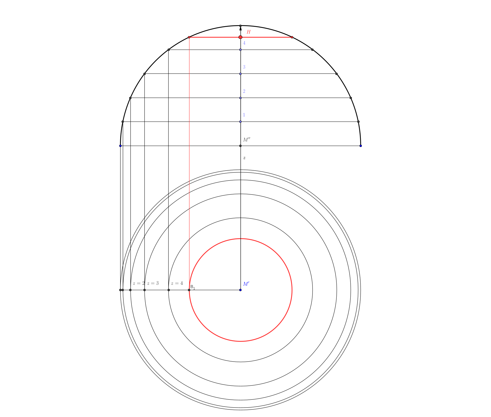

<!--
author:   Marco Hamann

email:    marco.hamann@htw-dresden.de

version:  0.0.1

language: de

comment:  Dieser Kurs richtet sich an Studierende der Hochschule für Technik und Wirtschaft Dresden im Studiengang Fahrzeugtechnik im 2. Semester.

import: https://raw.githubusercontent.com/liaTemplates/algebrite/master/README.md

import: https://raw.githubusercontent.com/LiaScript/CodeRunner/master/README.md

-->


# Mathematik 2 (I946)

Dieser Kurs richtet sich an Studierende der Hochschule für Technik und Wirtschaft Dresden im Studiengang Bachelor Maschinenbau im 2. Semester.

Sie können diesen Kurs auf [LiaScript](https://liascript.github.io/course/?https://github.com/marco-hamann/Mathe2/blob/main/README.md) oder [Opal](https://bildungsportal.sachsen.de/opal/auth/RepositoryEntry/42946134017) aufrufen. Das Repository zu diesem Kurs finden Sie unter

https://github.com/marco-hamann/Mathe2


## Integralrechnung


In diesem ersten Kapitel vertiefen Sie Ihre Kenntnisse in der Integration reeller Funktionen einer reellen Veränderlichen. Dazu zählen u. a.

* Integrationmethoden
* numerische Integration sowie 
* Anwendungen der Integralrechnung

Für einen Überblick über die Themen dieses Kapitels sehen Sie in der nachstehenden Graphik einige zentrale Begriffe. Schlagen Sie diese in diesem Abschnitt nach.

<!-- style="display: block; margin-left: auto; margin-right: auto; max-width: 1000px; " -->


Lernziele
-----


* Sie kennen verschiedene Methoden zur unbestimmten Integration und können diese anwenden.
* Sie kennen den Zusammenhang zwischen Integrierbarkeit einer Funktion und dem Infimum bzw. Supremum der Ober- bzw. Untersummen aller Zerlegungen des Integrationsintervalls.
* Sie leiten daraus Verfahren zur numerischen Integration ab wie die Trapezformel und die Simpsonsche Formel.
* Sie können bestimmte Integrale bei der Berechnung von Flächeninhalten, Volumen von Rotationskörpern, Massenschwerpunkten und Kurvenlängen etc. anwenden.


### Integrationsmethoden

Substitution der Veränderlichen
=====


>**Satz 1. ** Ist das unbestimmte Integral einer als stetig angenommenen Funktion $t\mapsto g(t)$ mit $t\in D\subseteq\mathbb{R}$ bekannt, d. h. $$
  \int{g(t)}\,\mathrm{d}t=G(t)+c
$$ worin $c\in\mathbb{R}$ die Integrationskonstante bezeichnet, so gilt für eine [stetig differenzierbare Funktion](https://de.wikipedia.org/wiki/Differenzierbarkeit) $f:x\mapsto t=f(x)$ mit Wertebereich $W_f\subset D$ $$
  \int{\left[g(f(x))\cdot f^\prime(x)\right]}\,\mathrm{d}x=G(f(x))+c
$$ worin $f^\prime$ die erste Ableitung von $f$ nach der unabhängigen Veränderlichen $x$ bezeichnet.[^1]

**Beweis.** Unter Benutzung der Differentiationsregel für verkettete Funktionen folgt für das unbestimmte Integral aus dem vorstehenden Satz $$
  \left(G(f(x))+c\right)^\prime=
  \frac{\mathrm{d}{G(f)}}{\mathrm{d}{f}}\cdot f^\prime(x)=g(f(x))\cdot f^\prime(x)
$$ $\square$

**Beispiel 1.** Zu berechnen ist das unbestimmte Integral $$
  \int{\left(\sin^3{x}\cdot\cos{x}\right)}\,\mathrm{d}{x}
$$ Der Integrand ist ein Produkt trigonometrischer Terme. Durch die Substitution $t=f(x)=\sin{x}$ im Integranden mit der ersten Ableitung $f^\prime(x)=\cos{x}$ bzw. dem Differential $\mathrm{d}t=\cos{x}\cdot\mathrm{d}x$, berechnet sich das Integral $$
  \int{\left(\sin^3{x}\cdot\cos{x}\right)}\,\mathrm{d}{x}=
  \int\left.{t^3}\,\mathrm{d}{t}\right|_{t=\sin{x}}=
  \left.\left[\frac{1}{4}\cdot{t^4}+c\right]\right|_{t=\sin{x}}=
  \frac{1}{4}\cdot{\sin^4(x)}+c
$$ worin $c\in\mathbb{R}$ die Integrationskonstante bezeichnet. Die Verwendung der Substitutionsvariable $t$ (statt $x$) im zweiten und dritten Schritt bedeutet, dass diese durch die Substitution $t=\sin{x}$ ersetzt gedacht werden muss. Dies ist durch den senkrechten Strich dargestellt.

Die Anwendung der Substitutionsmethode ist im folgenden Video noch einmal an konkreten Integralen erläutert.
!?[Substitutionmethode2](https://www.youtube.com/watch?v=eC8av8Tjoq8&list=PLLTAHuUj-zHiMVYEnrDcS_8mP36Zowezn&index=14)

**Bemerkung 1.** Wird in dem unbestimmten Integral $$
  \int{g(a\cdot x+b)}\;\mathrm{d}{x}
$$ mit reellen Parametern $a\not=0$ und $b$ die *lineare Substitution* $t=f(x)=a\cdot x+b$ durchgeführt, so ergibt sich unter Benutzung obigen Satzes und der Linearität des unbestimmten Integrals
>$$
  \int{g(a\cdot x+b)}\;\mathrm{d}{x}=
  \left.\frac{1}{a}\cdot\int{g(t)}\;\mathrm{d}{t}\right|_{t=a\cdot x+b}=
  \left.\left[\frac{1}{a}\cdot G(t)+c\right]\right|_{t=a\cdot x+b}=
  \frac{1}{a}\cdot G(a\cdot x+b)+c
$$
worin $G(t)+c$ mit $c\in\mathbb{R}$ das unbestimmte Integral von $g(t)$ bezeichnet.

Die Berechnung des unbestimmten Integrals lässt sich im nachfolgenden Berechnungsfenster unter Verwendung der Javascript-Bibliothek [Algebrite](http://algebrite.org) für beliebige Funktionen $g$ leicht verifizieren. Beachten Sie, dass das die Integrationskonstante nicht ausgegeben wird.

```javascript
g=sin(t)
f=a*x+b
integral(subst(f,t,g),x)
```
@Algebrite.eval

Die Anwendung der Substitutionsmethode am Beispiel der linearen Substitution ist im folgenden Video noch einmal an konkreten Integralen erläutert.
!?[Substitutionsmethode](https://www.youtube.com/watch?v=u7krzqeX1tw&list=PLLTAHuUj-zHiMVYEnrDcS_8mP36Zowezn&index=10)

**Beispiel 2.** Mittels Substitution sind die folgenden unbestimmten Integrale zu berechnen, die im Zusammenhang der später zu behandelnden Partialbruchzerlegung auftreten.[^2]

1. Gegeben ist die reelle Funktion $g:x\mapsto 1/(x-a)$ mit Definitionsbereich $D=\mathbb{R}\setminus\{a\}$, gesucht $$
  \int{g(x)}\,\mathrm{d}x=\int{\frac{1}{x-a}}\mathrm{d}x
$$ worin $a\in\mathbb{R}$ einen Parameter bezeichnet. Mittels linearer Substitution $t=x-a$ lässt sich das Integral in ein Grundintegral transformieren $$
\int{\frac{1}{x-a}}\mathrm{d}x=
  \left.\int{\frac{1}{t}}\mathrm{d}t\right|_{t=x-a}=
  \left.\left[\ln{|t|}+c\right]\right|_{t=x-a}=
  \ln{|x-a|}+c
$$ mit $c\in\mathbb{R}$.
2. Gegeben ist die reelle Funktion $g:x\mapsto 1/(x-a)^k$ ($k\in\mathbb{N}$, $k>1$), mit Definitionsbereich $D=\mathbb{R}\setminus\{a\}$, gesucht $$
  \int{g(x)}\,\mathrm{d}x=\int{\frac{1}{(x-a)^k}}\mathrm{d}x
$$ worin $a\in\mathbb{R}$ einen Parameter bezeichnet. Erneut lässt sich mittels linearer Substitution $t=x-a$ in ein Grundintegral transformieren $$
\int{\frac{1}{(x-a)^k}}\mathrm{d}x=
  \left.\int{\frac{1}{t^k}}\mathrm{d}t\right|_{t=x-a}=
  \left.\left[\frac{1}{1-k}\cdot\frac{1}{t^{k-1}}+c\right]\right|_{t=x-a}=
  \frac{1}{1-k}\cdot\frac{1}{(x-a)^{k-1}}+c
$$ mit $c\in\mathbb{R}$.
3. Gegeben ist die reelle Funktion $g:x\mapsto (M\cdot x+N)/(x^2+p\cdot x+q)$, die auf $d=\mathbb{R}$ erklärt sein soll. Die reellen Parameter $p$ und $q$ sind so zu wählen, dass der Nenner $x^2+p\cdot x+q\not=0$ für alle $x\in\mathbb{R}$ gilt. Gesucht ist das Integral $$
  \int{g(x)}\,\mathrm{d}x=\int{\frac{M\cdot x+N}{x^2+p\cdot x+q}}\mathrm{d}x
$$ worin $M\in\mathbb{R}$ und $N\in\mathbb{R}$ Parameter darstellen. Der Nenner wird mittels quadratischer Ergänzung umgeformt in $$
  x^2+p\cdot x+1=\left(x+\frac{p}{2}\right)^2+q-\frac{p^2}{4}
$$ Es wird die lineare Substitution $t=x+\frac{p}{2}$ ausgeführt, daneben wird der neue Parameter $a>0$ durch $a^2=q-\frac{p^2}{4}$ festgelegt. Damit lässt sich das gesuchte Integral unter Benutzung der Linearität transformieren in $$
  \int{\frac{M\cdot x+N}{x^2+p\cdot x+q}}\mathrm{d}x=
  \left.\frac{M}{2}\cdot\int{\frac{2\cdot t}{t^2+a^2}}\mathrm{d}t\right|_{t=x+\frac{p}{2}}+\left.\left(N-\frac{M\cdot p}{2}\right)\cdot\int{\frac{1}{t^2+a^2}}\mathrm{d}t\right|_{t=x+\frac{p}{2}}
$$ Das erste Integral auf der rechten Seite der Gleichung berechnet sich unter Benutzung einer weiteren Substitution $u=t^2+a^2$ mit $\mathrm{d}{u}=2t\cdot\mathrm{d}t$ zu $$
  \int{\frac{2\cdot t}{t^2+a^2}}\mathrm{d}t=
  \left.\int{\frac{1}{u}}\mathrm{d}u\right|_{u=t^2+a^2}=
  \ln{|t^2+a^2|}+c=\ln{(t^2+a^2)}+c
$$ während mittels $$
  t^2+a^2=a^2\cdot\left(1+\frac{t^2}{a^2}\right)
$$ und der Substitution $$
  v=\frac{t}{a}\,,\;\;\mathrm{d}v=\frac{1}{a}\cdot\mathrm{d}{t}
$$ sich das zweite Integral berechnet zu $$
  \int{\frac{1}{t^2+a^2}}\mathrm{d}t=
  \left.\frac{1}{a}\cdot\int{\frac{1}{1+v^2}}\mathrm{d}v\right|_{v=\frac{t}{a}}=
  \frac{1}{a}\cdot\arctan{\left(\frac{t}{a}\right)}+c
$$ Unter Rückersetzung von $t=x+p/2$ ergibt sich schließlich $$
  \int{\frac{M\cdot x+N}{x^2+p\cdot x+q}}\mathrm{d}x=
  \frac{M}{2}\cdot\ln{(x^2+p\cdot x+q)}+\frac{2\cdot N-M\cdot p}{\sqrt{4\cdot q-p^2}}\cdot\arctan{\left(\frac{2\cdot x+p}{\sqrt{4\cdot q-p^2}}\right)}+c
$$ Das unbestimmte Integral in dieser Nummer lässt sich also mittels Logarithmus- und Arkustangensfunktion berechnen.

Die Berechnung der vorstehenden unbestimmten Integrale lässt sich im nachfolgenden Berechnungsfenster unter Verwendung der Javascript-Bibliothek [Algebrite](http://algebrite.org) für beliebige Parameterwerte leicht verifizieren. Beachten Sie, die Parameterwerte $a$ und $k$ geeignet zu wählen. Ebenso, dass die Integrationskonstante nicht ausgegeben wird.

```javascript
clearall
a=3
k=1
g=1/(x-a)^k
integral(g,x)
```
@Algebrite.eval


Partielle Integration
=====

>**Satz 2. ** *Formel für die partielle Integration.* Gegeben sind zwei mindestens einmal stetig differenzierbare Funktionen über dem gemeinsamen Deffinitionsbereich $D\subseteq\mathbb{R}$ $$
  f:x\mapsto u=f(x)\quad\text{und}\quad g:x\mapsto v=g(x)
$$ Dann berechnet sich $$
  \int{\left(f^\prime(x)\cdot g(x)\right)}\,\mathrm{d}x=f(x)\cdot g(x)-\int{\left(f(x)\cdot g^\prime(x)\right)}\,\mathrm{d}x
$$ worin $f^\prime$ bzw. $g^\prime$ die ersten Ableitungen der Funktionen $f$ bzw. $g$ bezeichnen.

**Beweis.** Das Produkt $f\cdot g$ lässt sich mit Hilfe der Produktregel differenzieren. Es gilt für alle $x\in\mathbb{R}$ $$
  \left(f(x)\cdot g(x)\right)^\prime=f^\prime(x)\cdot g(x)+f(x)\cdot g^\prime(x)\quad\leftrightarrow\quad
  f^\prime(x)\cdot g(x)=\left(f(x)\cdot g(x)\right)^\prime-f(x)\cdot g^\prime(x)
$$ Werden nun die unbestimmten Integrale der linken bzw. rechten Seiten gebildet, so erhält man unter Nutzung der Linearität des unbestimmten Integrals die Gleichung aus Satz 2. Hierin ist $f(x)\cdot g(x)$ eine Stammfunktion von $\left(f(x)\cdot g(x)\right)^\prime$, die Integrationskonstante $c$ ist im zweiten $$
  \int{\left(f(x)\cdot g^\prime(x)\right)}\,\mathrm{d}x
$$ enthalten, so dass $c$ nicht extra ausgewiesen ist.

$\square$

**Beispiel 3.** Zu berechnen ist das unbestimmte Integral $$
  \int{(x\cdot\cos{x})}\,\mathrm{d}x
$$ Der Integrand ist ein Produkt mit den Faktoren $x$ und $\cos{x}$. Um eine geeignete Zuordnung zu den Ausdrücken in der Formel für die partielle Integration zu finden, ist zu überlegen, dass $x$ zu $1$ abgeleitet wird, jedoch das unbestimmte Integral $\int{x}\,\mathrm{d}x=\frac{1}{2}\cdot x^2+c$, d. h. quadratisch ist und damit eine Graderhöhung darstellt. Aus diesem Grund wird $$
  g(x)=x\,,\quad f^\prime(x)=\cos{x}
$$ gewählt. Hieraus lassen sich berechnen $$
  g^\prime(x)=1\,,\quad f(x)=\sin{x}
$$ Das gesuchte Integral berechnet sich hiernach mittels partieller Integration zu $$
  \int{(x\cdot\cos{x})}\,\mathrm{d}x=x\cdot\sin{x}-\int{1\cdot\sin{x}}\,\mathrm{d}x=x\cdot\sin{x}+\cos{x}+c
$$ worin $c\in\mathbb{R}$ die Integrationskonstante bezeichnet.

Die Berechnung des vorstehenden unbestimmten Integrals lässt sich im nachfolgenden Berechnungsfenster unter Verwendung der Javascript-Bibliothek [Algebrite](http://algebrite.org) leicht verifizieren. Beachten Sie, dass die Integrationskonstante nicht ausgegeben wird.

```javascript
clearall
integral(x*cos(x),x)
```
@Algebrite.eval

Im nachstehenden Video ist die Vorgehensweise bei der partiellen Integration an einem weiteren Beispiel erläutert.

!?[partielle-Integration](https://www.youtube.com/watch?v=eawyolvYa3E)

**Bemerkung 2.** Soll die Formel zur partiellen Integration verwendet werden, so muss der Integrand in zwei Faktoren zerlegt werden: in $f^\prime(x)$ und $g(x)$. Ersterer muss zur Anwendung der Formel integriert werden, der zweite differenziert. Für die Zuordnung muss überlegt werden, dass

* die Integration des Ausdrucks $f^\prime(x)$ möglich ist
* getroffene Wahl eine Vereinfachung des Integrals nach sich zieht.

**Beispiel 4.** Zu berechnen ist das unbestimmte Integral $$
  \int{(x^2\cdot\sin{x})}\,\mathrm{d}x
$$ Der Integrand ist ein Produkt mit den Faktoren $x^2$ und $\sin{x}$. Um eine geeignete Zuordnung zu den Ausdrücken in der Formel für die partielle Integration zu finden, ist zu überlegen, dass $x^2$ zu $2\cdot x$ abgeleitet wird, jedoch das unbestimmte Integral $\int{x^2}\,\mathrm{d}x=\frac{1}{3}\cdot x^3+c$, d. h. kubisch ist und damit eine Graderhöhung darstellt. Aus diesem Grund wird $$
  g(x)=x^2\,,\quad f^\prime(x)=\sin{x}
$$ gewählt. Hieraus lassen sich berechnen $$
  g^\prime(x)=2\cdot x\,,\quad f(x)=-\cos{x}
$$ Das gesuchte Integral berechnet sich hiernach mittels partieller Integration zu $$
  \int{(x^2\cdot\sin{x})}\,\mathrm{d}x=-x^2\cdot\cos{x}+2\cdot\int{\left(x\cdot\cos{x}\right)}\,\mathrm{d}x
$$ Der zweite Summand ist das im Beispiel 3 berechnete Integral, so dass sich unter nochmaliger partieller Integration ergibt $$
  \int{(x^2\cdot\sin{x})}\,\mathrm{d}x=-x^2\cdot\cos{x}+2\cdot\left(x\cdot\sin{x}+\cos{x}+c\right)=
  -x^2\cdot\cos{x}+2\cdot x\cdot\sin{x}+2\cdot\cos{x}+\tilde{c}
$$ worin $\tilde{c}=2\cdot c\; (\in\mathbb{R})$ die Integrationskonstante bezeichnet.

Die Berechnung des vorstehenden unbestimmten Integrals lässt sich im nachfolgenden Berechnungsfenster unter Verwendung der Javascript-Bibliothek [Algebrite](http://algebrite.org) leicht verifizieren. Beachten Sie, dass die Integrationskonstante nicht ausgegeben wird.

```javascript
clearall
integral(x^2*sin(x),x)
```
@Algebrite.eval

Im nachstehenden Video ist die Berechnung eines unbestimmten Integrals durch mehrfache partielle Integration erläutert.

!?[partielle-Integration-1](https://www.youtube.com/watch?v=OCZuMjW5Yx4)

**Beispiel 5.** Zu berechnen ist das unbestimmte Integral $$
  \int{\ln{x}}\,\mathrm{d}x
$$ Der Integrand ist hier zunächst ~~kein~~ Produkt, lässt sich aber als $1\cdot\ln{x}$ darstellen. Mit der Zuordnung $$
  g(x)=\ln{x}\,,\quad f^\prime(x)=1
$$ sowie $$
  g^\prime(x)=\frac{1}{x}\,,\quad f(x)=x
$$ berechnet sich das gesuchte Integral mittels partieller Integration zu $$
  \int{\ln{x}}\,\mathrm{d}x=x\cdot\ln{x}-\int{\left(\frac{1}{x}\cdot x\right)}\,\mathrm{d}x=x\cdot\ln{x}-x+c
$$ worin $c\in\mathbb{R}$ erneut die Integrationskonstante bezeichnet.

Die Berechnung des vorstehenden unbestimmten Integrals lässt sich im nachfolgenden Berechnungsfenster unter Verwendung der Javascript-Bibliothek [Algebrite](http://algebrite.org) leicht verifizieren. Beachten Sie, dass die Integrationskonstante nicht ausgegeben wird; der natürliche Logarithmus von $x>0$ wird als `log(x)` ausgegeben.

```javascript
clearall
integral(ln(x),x)
```
@Algebrite.eval


Partialbruchzerlegung
=====

Ziel dieses Abschnittes ist die Integration gebrochenrationaler Funktionen, d. h. $$
  \int{\frac{p(x)}{q(x)}}\,\mathrm{d}x
$$ worin $p(x)$ und $q(x)$ zwei reelle Polynome in der Variablen $x$ bezeichnen. Hier wird sich auf die Integration von echt gebrochenrationalen Funktionen beschränkt, d. h. es gilt $$
  \deg{p(x)}<\deg{q(x)}
$$ für die Grade der Polynome.

**Bemerkung 3.** Für unecht gebrochenrationale Funktionen gilt $$
  f:x\mapsto y=f(x)=\frac{p(x)}{q(x)}\,,\quad \deg{p(x)}\geq\deg{q(x)}
$$ Diese lassen sich zerlegen in eine Summe aus ganzrationaler und echt gebrochenrationaler Funktion, wie nachstehendes Beispiel zeigt. $$
  \frac{p(x)}{q(x)}=\frac{3\cdot x^3+x^2-6\cdot x+6}{3\cdot x^2-5\cdot x+4}=(x+2)-\frac{2}{3\cdot x^2-5\cdot x+4}
$$ Die hier ausgeführte Polynomdivision kann unter dem Link [Polynomdivision](https://www.arndt-bruenner.de/mathe/scripts/polynomdivision.htm) mit kommentiertem Lösungsweg nachvollzogen werden. Hierfür sind Dividend $p(x)$ und Divisor $q(x)$ in eine Eingabemaske einzugeben. Alternativ lassen sich der ganzrationale Anteil und der "Rest" unter Nutzung der Javascript-Bibliothek [Algebrite](http://algebrite.org/) berechnen.

```javascript
clearall
p=3*x^3+x^2-6*x+6
q=3*x^2-5*x+4
quotient(p,q,x)
p-q*quotient(p,q,x)
```
@Algebrite.eval

>**Satz 3.** [Hauptsatz von der Partialbruchzerlegung](https://de.wikipedia.org/wiki/Partialbruchzerlegung). Jede echt gebrochenrationale Funktion $f:x\mapsto y=f(x)=p(x)/q(x)$ mit $x\in D\subseteq\mathbb{R}$ lässt sich als Summe endlich vieler Partialbrüche der Form $$
  \frac{A}{x-a}\,,\quad
  \frac{B}{(x-a)^k}\,,\quad
  \frac{C\cdot x+D}{x^2+p\cdot x+q}\quad\text{und}\quad
  \frac{E\cdot x+F}{(x^2+p\cdot x+q)^k}
$$ darstellen, worin $(x-a)$ reeller Linearfaktor und $x^2+p\cdot x+q$ mit $$
  x^2+p\cdot x+q\not=0\quad\forall\; x\in \mathbb{R}
$$ quadratischer Faktor des Nenners $q(x)$ sind (d. h. der quadratische Faktor besitzt keine Lösungen über $\mathbb{R}$). Des Weiteren ist $k\in\mathbb{N}$ mit $k>1$ und $A$, $B$, ... , $F$ bezeichnen reelle Platzhalter.

**Beweis.** Ein gut lesbarer Beweis dieses Satzes kann beispielsweise bei G. M. Fichtenholz, Differential und Integralrechnung II, S. 41-44 nachgelesen werden.

**Beispiel 6.** Es lässt sich leicht zeigen, dass $$
  \frac{p(x)}{q(x)}=\frac{2\cdot x^2+2\cdot x+13}{(x-2)\cdot\left(x^2+1\right)^2}=
  \frac{1}{x-2}-\frac{x+2}{x^2+1}-\frac{3\cdot x+4}{\left(x^2+1\right)^2}
$$ Der Hauptnenner der Brüche auf der rechten Seite der Gleichung ist $$
  q(x)=(x-2)\cdot\left(x^2+1\right)^2
$$ entspricht also dem Nenner des echten Bruches auf der linken Seite der Gleichung.


Verfahren der Partialbruchzerlegung
-----

1. Es sind alle Lösungen des Nennerpolynoms $q(x)\;(=0)$ zu berechnen. Es ergeben sich darunter reelle Lösungen $x_i$ mit der Vielfachheit $n_i$ sowie paarweise komplexe nichtreelle Lösungen $(z_j,\bar{z}_j)$ mit jeweils der Vielfachheit $m_j$.[^3] Es gilt $$
  \deg{q(x)}=\sum_{i}{n_i}+2\cdot\sum_{j}{m_j}
$$ Der Nenner lässt sich als reelles Produkt der Linearfaktoren $(x-x_i)$ und der quadratischen Faktoren $$
  (x-z_j)\cdot(x-\bar{z}_j)=x^2-(2\cdot\mathrm{Re}{z_j})\cdot x-|z_j|^2=:x^2+p_j\cdot x+q_j
$$ darstellen, so dass sich ergibt $$
  q(x)=c\cdot\prod_i{(x-x_i)^{n_i}}\cdot\prod_j{(x^2+p_j\cdot x+q_j)^{m_j}}
$$ worin $c$ den Koeffizienten der höchsten Potenz von $x$ in $q(x)$ bezeichnet. Für die quadratischen Faktoren gilt $$
  x^2+p_j\cdot x+q_j\not=0\quad\forall\;x\in\mathbb{R}
$$ d. h. diese besitzen keine reellen Wurzeln / Lösungen.
2. Für jede Lösung aus Schritt 1 wird nun eine Summe von Partialbrüchen gebildet. Beispielsweise für eine reelle Lösung $x_i$ der Vielfachheit $n_i$ $$
  \frac{A_1}{(x-x_i)^1}+\frac{A_2}{(x-x_i)^2}+\quad...\quad+\frac{A_{n_i}}{(x-x_i)^{n_i}}
$$ also eine Summe von $n_i$ Brüchen der Form $1/(x-x_i)^k$ mit $k\in\{1,2,...,n_i\}$. Die auftretenden Koeffizienten $A_k$ sind im folgenden Schritt zu bestimmen. Für ein Paar komplex konjugierter, nichtreeller Lösungen entsprechend $$
  \frac{B_1\cdot x+ C_1}{(x^2+p_j\cdot x+q_j)^1}+\frac{B_2\cdot x+ C_2}{(x^2+p_j\cdot x+q_j)^2}+\quad...\quad+\frac{B_{m_j}\cdot x+ C_{m_j}}{(x^2+p_j\cdot x+q_j)^{m_j}}
$$ mit zu bestimmenden Koeffizienten $(B_l,C_l)$ mit $l\in\{1,2,...,{m_j}\}$.
3. Die für eine jede Lösung $x_i$ bzw. $(z_j,\bar{z}_j)$ gebildeten Summen sind nochmals zu summieren und $p(x)/q(x)$ gleichzusetzen $$
  \frac{p(x)}{q(x)}=\sum_i{\left(\sum_{k=1}^{n_i}{\frac{A_{k}}{(x-x_i)^{k}}}\right)}+
  \sum_j{\left(\sum_{l=1}^{m_j}{\frac{B_l\cdot x+ C_l}{(x^2+p_j\cdot x+q_j)^l}}\right)}
$$ Die Koeffizienten $A_k$, $B_l$ und $C_l$ in der Summe der rechten Seite der Gleichung sind zu bestimmen: Der Hauptnenner der Partialbrüche ist gerade $q(x)$, so dass nach Erweiterung der Partialbrüche die Zähler addiert werden. Diese ergeben ein zu $p(x)$ identisches Polynom. Durch Vergleich der Koeffizienten ergibt sich ein System linearer Gleichungen in den Unbekannten $A_k$, $B_l$ und $C_l$.

**Beispiel 7.** Die in Beispiel 6 gegebene Zerlegung der gebrochenrationalen Funktion $$
  \frac{p(x)}{q(x)}=\frac{2\cdot x^2+2\cdot x+13}{(x-2)\cdot\left(x^2+1\right)^2}=
  \frac{1}{x-2}-\frac{x+2}{x^2+1}-\frac{3\cdot x+4}{\left(x^2+1\right)^2}
$$ soll mit Hilfe des vorgestellten Verfahrens gezeigt werden.

1. Das Nennerpolynom liegt bereits als Produkt eines linearen und quadratischer Faktorn vor $$
  q(x)=(x-2)\cdot\left(x^2+1\right)^2
$$ aus welchen sich die Lösungen der Nennergleichung $q(x)=0$ bestimmen lassen $$
  x_1=2\,,\quad x_2=x_3=i\quad\text{und}\quad x_4=x_5=-i
$$ Hierin bezeichnet $i$ die imaginäre Einheit.
2. Die Lösung $x_1$ besitzt die Vielfachheit 'Eins', womit sich der Partialbruch (d. h. die Partialsumme besteht hier aus einem Partialbruch) $$
  \frac{A}{x-2}
$$ ergibt. Hierin bezeichnet $A$ einen noch nicht bestimmten reellen Koeffizienten. Die Lösungen $x_2$ und $x_4=\bar{x}_2$ treten jeweils doppelt auf, woraus mit $$
  (x-i)\cdot(x+i)=x^2+1
$$ die Partialsumme $$
  \frac{B_1\cdot x+C_1}{x^2+1}+\frac{B_2\cdot x+C_2}{(x^2+1)^2}
$$ gebildet werden kann. Die in den Zählern auftretenden Koeffizienten $B_1$, $C_1$, $B_2$ und $C_2$ sind ebenso im folgenden Rechenschritt zu berechnen.
3. Es werden die in Schritt 2 gebildeten Partialsummen werden summiert und der gebrochenrationalen Funktion gleichgesetzt. $$
  \frac{p(x)}{q(x)}=\frac{2\cdot x^2+2\cdot x+13}{(x-2)\cdot\left(x^2+1\right)^2}=
  \frac{A}{x-2}+
  \frac{B_1\cdot x+C_1}{x^2+1}+\frac{B_2\cdot x+C_2}{(x^2+1)^2}\quad\forall\; x\in\mathbb{R}\setminus\{2\}
$$ Durch Bildung des Hauptnenners $q(x)$ auf der rechten Seite der Ansatzgleichung erhält man $$
  \frac{A\cdot\color{red}{\left(x^2+1\right)^2}}{(x-2)\cdot\color{red}{\left(x^2+1\right)^2}}+
  \frac{(B_1\cdot x+C_1)\cdot\color{red}{(x-2)\cdot\left(x^2+1\right)}}{\left(x^2+1\right)\cdot\color{red}{(x-2)\cdot\left(x^2+1\right)}}+
  \frac{(B_2\cdot x+C_2)\cdot\color{red}{(x-2)}}{(x^2+1)^2\cdot\color{red}{(x-2)}}
$$ so dass sich nach Addition der neuen Zähler und anschließender Multiplikation beider Seiten der Gleichung ergibt $$
  p(x)=2\cdot x^2+2\cdot x+13=
  A\cdot\left(x^2+1\right)^2+
  (B_1\cdot x+C_1)\cdot(x-2)\cdot\left(x^2+1\right)+
  (B_2\cdot x+C_2)\cdot(x-2)
$$ Die rechte Seite dieser Polynomgleichung lässt sich nach Ausmultiplizieren in der (Monom-) Form $$
  \left(B_{1}+A\right)\cdot x^4
+\left(C_{1}-2\cdot B_{1}\right)\cdot x^3
+\left(-2\cdot C_{1}+B_{2}+B_{1}+2\cdot A\right)\cdot x^2
+\left(C_{2}+C_{1}-2\cdot B_{2}-2\cdot B_{1}\right)\cdot x
-2\cdot C_{2}-2\cdot C_{1}+A
$$ darstellen. Es ergibt sich ein Polynom vierten Grades, in welchem die Koeffizienten lineare Terme der zu bestimmenden Unbekannten sind. Dieses Polynom ist zu $p(x)$ identisch anzusehen, so dass deren Koeffizienten übereinstimmen müssen. Es ergeben sich die nachstehenden Bestimmungsgleichungen (Koeffizientenvergleich): $$
  \begin{array}{c|rrrrrrrrrrr}
    x^4 & 0  & = & & & & & & & B_{1} & + & A \\
    x^3 & 0  & = & & & C_{1} & & & - & 2\cdot B_{1} & & \\
    x^2 & 2  & = & & & -2\cdot C_{1} & + & B_{2} & + & B_{1} & + & 2\cdot A \\
    x^1 & 2  & = & C_{2} & + & C_{1} & - & 2\cdot B_{2} & - & 2\cdot B_{1} & & \\
    1   & 13 & = & -2\cdot C_{2} & - & 2\cdot C_{1} & & & & & + & A
  \end{array}
$$ Die Lösungen ergeben sich zu $$
  C_2=-4\,,\quad C_1=-2\,,\quad B_2=-3\,,\quad B_1=-1\quad\text{und}\quad A=1
$$ (Hier zunächst ohne Angabe des Rechenweges.)

Die Lösung lässt sich mit Hilfe der Javascript Bibliothek [Algebrite](http://algebrite.org/) leicht verifizieren: In den Matrizen $A$ bzw. $b$ sind die Koeffizienten bzw. Absolutglieder des Gleichungssystems einzutragen. Ein Nachweis des verwendeten Rechenverfahrens zur Lösung linearer Gleichungssysteme und der hierbei genutzten Objekte soll im Abschnitt [Lineare Algebra](#Lineare-Algebra) erfolgen.

```javascript
clearall
A=[[0,0,0,1,1],[0,1,0,-2,0],[0,-2,1,1,2],[1,1,-2,-2,0],[-2,-2,0,0,1]]
b=[0,0,2,2,13]
det(A)
B=inv(A)
inner(B,b)
```
@Algebrite.eval

In nachstehenden Video wird die Entwicklung einer echt gebrochen rationalen Funktion als Summe von Partialbrüchen an verschiedenen Beispielen erklärt.

!?[Partialbruchzerlegung-2](https://www.youtube.com/watch?v=6UAQDlsvU5Q)


Integration der Partialbrüche
-----

Die Zerlegung einer echt gebrochen rationalen Funktion in eine Summe von Partialbrüchen lässt sich u. a. zur Integration dieser Funktion benutzen. Im Beispiel 2 dieses Abschnittes sind die uneigentlichen Integrale der Partialbrüche $$
  \int{\frac{1}{x-a}}\,\mathrm{d}x\,,\quad
  \int{\frac{1}{(x-a)^k}}\,\mathrm{d}x\quad\text{sowie}\quad
  \int{\frac{M\cdot x+N}{x^2+p\cdot x+q}}\,\mathrm{d}x\quad\left(p^2-4\cdot q<0\right)
$$ berechnet worden.

**Bemerkung 4.** Für das unbestimmte Integral $$
  \int{\frac{M\cdot x+N}{(x^2+p\cdot x+q)^k}}\mathrm{d}x\,,\quad k\in\mathbb{N}\,,\;k>1
$$ mit $p^2-4\cdot q<0$ lassen sich nicht direkt Stammfunktionen bestimmen. Das Integral kann jedoch auf den Fall $$
  \int{\frac{L}{(x^2+p\cdot x+q)^{k-1}}}\mathrm{d}x\,,\quad k\in\mathbb{N}\,,\;k>1
$$ zurückgeführt werden, so dass sich das betrachtete Integral rekursiv berechnen lässt. Die Rekursionsvorschrift wird hier ohne Beweis angegeben.
>$$
  \int{\frac{M\cdot x+N}{(x^2+p\cdot x+q)^{\textcolor{red}{k}}}}\,\mathrm{d}x=
  \frac{(2\cdot N-p\cdot M)\cdot x+N\cdot p-2\cdot q\cdot M}{(k-1)\cdot(4\cdot q-p^2)\cdot(x^2+p\cdot x+q)^{k-1}}+
  \frac{(2\cdot N-p\cdot M)\cdot(2\cdot k-3)}{(k-1)\cdot(4\cdot q-p^2)}\cdot\int{\frac{1}{(x^2+px+q)^{\textcolor{red}{k-1}}}}\,\mathrm{d}x+c
$$

worin $c\in\mathbb{R}$ die Integrationskonstante bezeichnet.

**Beispiel 8.** Für die sich in Beispiel 7 ergebende Partialbruchzerlegung berechnen sich mit den Formeln aus Beispiel 2 $$
  \int{\frac{1}{x-2}}\,\mathrm{d}x=\ln{|x-2|}+c_1\quad\text{und}\quad
  \int{-\frac{x+2}{x^2+1}}\,\mathrm{d}x=-\frac{1}{2}\cdot\ln{(x^2+1)}-2\cdot\arctan{x}+c_2
$$ sowie unter Benutzung der vorstehenden Iterationsvorschrift für die Parameter $k=2$, $p=0$, $q=1$, $M=3$ und $N=4$ $$
  \int{-\frac{3\cdot x+4}{\left(x^2+1\right)^2}}\,\mathrm{d}x=
  -\frac{4\cdot x-3}{2\cdot(x^2+1)}-2\cdot\arctan{x}+c_3
$$ Damit ergibt sich das unbestimmte Integral $$
  \int{\left(\frac{2\cdot x^2+2\cdot x+13}{(x-2)\cdot\left(x^2+1\right)^2}\right)}\,\mathrm{d}x=
  \ln{|x-2|}
  -\frac{1}{2}\cdot\ln{(x^2+1)}-4\cdot\arctan{x}
  -\frac{4\cdot x-3}{2\cdot(x^2+1)}+c
$$ mit reeller Integrationskonstante $c=c_1+c_2+c_3$.

Die Partialbruchzerlegung zur Berechnung des unbestimmten Integrals einer echt gebrochen rationalen Funktion wird im nachstehendem Video an einem weiteren Beispiel erläutert.

!?[Partialbruchzerlegung-1](https://www.youtube.com/watch?v=E39ne4lX8s8)


Sicher gewusst
==============


Sie können Ihr Wissen gern bei der Beantwortung der nachstehenden Fragen testen.

**Frage 1.** Berechnen Sie die folgenden uneigentlichen Integrale, worin $x>0$ angenommen wird. Die in den Antwortoptionen verwendete Variable $c$ bezeichnet die reelle Integrationskonstante.

[[$\int{\frac{\ln{x}}{x}}\mathrm{d}x$] [$\int{\frac{1}{x\cdot\ln{x}}}\mathrm{d}x$] [$\int{\frac{1}{x\cdot(\ln{x})^2}}\mathrm{d}x$]]
[[ ] [ ] [X]]  $-\frac{1}{\ln{x}}+c$
[[X] [ ] [ ]]  $\frac{1}{2}\cdot(\ln{x})^2+c$
[[ ] [ ] [ ]]  $\frac{1}{\ln{x}}+c$
[[ ] [X] [ ]]  $\ln{|\ln{x}|}+c$
[[?]] Nutzen Sie zur Berechnung jeweils die Substitution $t=f(x)=\ln{x}$.
****************************************

Alle drei Integrale besitzen die Gestalt $$
  \int{\left(g(f(x))\cdot f^\prime(x)\right)}\mathrm{d}x=\int{\left(g(\ln{x})\cdot \frac{1}{x}\right)}\mathrm{d}x
$$ so dass die Substitution $t=f(x)=\ln{x}$ sinnvoll ist. Für das Differential gilt $$
  \mathrm{d}t=\frac{1}{x}\mathrm{d}x
$$ Damit berechnen sich im Einzelnen

1. $$\int{\frac{\ln{x}}{x}}\mathrm{d}x=\left.\int{t}\mathrm{d}t\right|_{t=\ln{x}}=
  \left.\frac{1}{2}\cdot t^2+c\right|_{t=\ln{x}}=
  \frac{1}{2}\cdot(\ln{x})^2+c
$$
2. $$\int{\frac{1}{x\cdot\ln{x}}}\mathrm{d}x=\left.\int{\frac{1}{t}}\mathrm{d}t\right|_{t=\ln{x}}=
  \left.\ln{|t|}+c\right|_{t=\ln{x}}=
  \ln{|\ln{x}|}+c
$$
3. $$\int{\frac{1}{x\cdot(\ln{x}})^2}\mathrm{d}x=\left.\int{\frac{1}{t^2}}\mathrm{d}t\right|_{t=\ln{x}}=
  \left.-t^{-1}+c\right|_{t=\ln{x}}=
  -\frac{1}{\ln{x}}+c
$$ Die dritte Antwortoption stimmt bis auf ein Vorzeichen mit der ersten Antwortoption überein, entspricht jedoch keinem der unbestimmten Integrale.

****************************************

**Frage 2.** Mittels partieller Integration wird berechnet $$
  \int{\left(1\cdot\frac{1}{x}\right)}\,\mathrm{d}x =
  x\cdot\frac{1}{x} - \int {\left(x\cdot\left(-\frac{1}{x^2}\right)\right)}\,\mathrm{d}x =  1 + \int {\left(\frac{1}{x}\right)}\,\mathrm{d}x
$$ Erklären Sie die entstandene Gleichung.

[( )] Das unbestimmte Integral $\int{\left(1\cdot\frac{1}{x}\right)}\,\mathrm{d}x$ existiert nicht. Daher besteht kein Widerspruch in der Gleichung.
[(X)] Im Sinne unbestimmter Integrale ist diese Gleichheit korrekt, da beide unbestimmte Integrale Stammfunktionen beschreiben, die sich nur um einen konstanten Summanden unterscheiden.
[[?]] Verwenden Sie die Definition des unbestimmten Integrals: $\int{f(x)}\,\mathrm{d}x=F(x)+c$ beschreibt die Menge aller Stammfunktionen der Funktion $f$, die sich nur um einen konstanten Summanden unterscheiden.
****************************************

Im Sinne unbestimmter Integrale ist diese Gleichheit korrekt, denn unter Benutzung der Linearität des unbestimmten Integrals gilt $$
  \int 1\cdot\frac{1}{x}\,\mathrm{d}x =  1 + \int \frac{1}{x}\,\mathrm{d}x\quad\leftrightarrow\quad
  \int 1\cdot\frac{1}{x}\,\mathrm{d}x - \int \frac{1}{x}\,\mathrm{d}x=
  \int{\left(1\cdot\frac{1}{x}-\frac{1}{x}\right)}\,\mathrm{d}x=\int{0}\,\mathrm{d}x=c=1
$$

****************************************

**Frage 3.** Gegeben ist eine echt gebrochenrationale Funktion $f:D\to\mathbb{R}$ mit $$
  f(x)=\frac{2\cdot x-6}{x\cdot (x-3)^2\cdot (x^2+2)^2}\,,\quad D\subset\mathbb{R}
$$ Geben Sie einen Ansatz zur Zerlegung der Funktion $f$ in eine Summe von Partialbrüchen an. (Die auftretenden Parameter $A$, $B$ etc. sind ~~nicht~~ zu bestimmen.)

[[ ]] $$ \frac{A}{x}+\frac{B}{(x-3)^2}+\frac{C\cdot x+D}{(x^2+2)^2} $$
[[X]] $$ \frac{A}{x}+\frac{B}{x-3}+\frac{C}{(x-3)^2}+\frac{D\cdot x+E}{x^2+2}+\frac{F\cdot x+G}{(x^2+2)^2} $$
[[X]] $$ \frac{A}{x}+\frac{B}{x-3}+\frac{C\cdot x+D}{x^2+2}+\frac{E\cdot x+F}{(x^2+2)^2} $$
[[?]] Für die Zerlegung in Partialbrüche sind die Polstellen der Funktion zu bestimmen.
****************************************

Der Funktionsterm $f(x)$ der echt gebrochen rationalen Funktion lässt sich darstellen $$
  f(x)=\frac{2\cdot(x-3)}{x\cdot (x-3)^2\cdot (x^2+2)^2}=\frac{2}{x\cdot (x-3)\cdot (x^2+2)^2}
$$ woraus sich die Polstellen $x_1=0$ (einfach), $x_2=3$ (einfach) und $x_{3,4}=\pm \sqrt{2}\cdot i\in\mathbb{C}\setminus\mathbb{R}$ (jeweils doppelt) bestimmen lassen.

Entsprechend ergeben sich für die einzelnen Polstellen die nachstehenden Summen von Partialbrüchen. $$
  x_1\;\sim\;\frac{A}{x}\,,\quad
  x_2\;\sim\;\frac{B}{x-3}\quad\text{und}\quad
  x_{3,4}\;\sim\;\frac{C\cdot x+D}{x^2+2}+\frac{E\cdot x+F}{(x^2+2)^2}
$$ Wird das Ausklammern und Kürzen des Faktors $(x-3)$ in Zähler und Nenner vergessen, kann hier auch der Ansatz 2 gewählt werden, in welchem $x_2$ zunächst doppelt angesetzt wird. (Der Parameter $C$ Berechnet sich im Koeffizientenvergleich zu 'Null'.)

****************************************

[^1]: Dieser Satz besagt, dass das unbestimmte Integral $$
  \int{g(t)}\,\mathrm{d}t=G(t)+c
$$ auch dann gültig bleibt, wenn $t$ durch eine stetig differenzierbare Funktion $f:x\mapsto t=f(x)$ ersetzt wird.

[^2]: Das unbestimmte Integral $$
  \int{\frac{M\cdot x+N}{(x^2+p\cdot x+q)^k}}\mathrm{d}x
$$ lässt sich für beliebige $k\in\mathbb{N}$ mit $k>1$ nur rekursiv lösen. Die Rechnung wird innerhalb des vorliegenden Beispiels nicht ausgeführt, kann aber beispielsweise unter [Partialbruchzerlegung](https://de.wikipedia.org/wiki/Partialbruchzerlegung) nachgelesen (ohne Beweis) werden.

[^3]: Mit jeder komplexen nichtreellen Lösung $z_j$ ist auch deren komplex konjugierte Zahl $\bar{z}_j$ eine Lösung von $q(x)=0$.


### Numerische Integration

Gegeben ist eine Funktion $f:[a,b]\to\mathbb{R}$, die nach oben und unten beschränkt ist, d. h. es gilt
$$
  m\leq f(x)\leq M
$$  
für alle $x\in[a,b]$ und Konstanten $m$ und $M$.

Hier ist $m\geq0$ vorausgesetzt, damit ist $f(x)\geq0$ für alle $x\in[a,b]$. Das bestimmte Integral ist dann als Flächeninhalt interpretierbar.
$$
  A=\int_{a}^b{f(x)}\,\mathrm{d}x
$$
Ziel ist, einen Näherungswert für den Flächeninhalt zu ermitteln.


Abschätzung des gesuchten Flächeninhaltes $A$
=============================================

1. Zerlegung $Z$ des Integrationsintervalls $[a,b]$ in Teilintervalle $[x_{k-1},x_k]$, $k\in\{1,2,\ldots,m\}$ mit $$ a=x_0<x_1<x_2<\ldots<x_{k-1}<x_k<\ldots<x_m=b $$
2. In $[x_{k-1},x_k]$ wird $f(x)$ durch einen festen Wert $f_k$ ersetzt. Dann ist $$ \sum_{k=1}^m{f_k\cdot\Delta x_k},\quad\Delta x_k=x_k-x_{k-1} $$ ein Näherungswert für den gesuchten Flächeninhalt A, worin $\Delta x_k$ die Intervallbreite bezeichnet.
3. Der Wert $f_k$ genügt wegen der Beschränktheit von $f$ der Bedingung $$ m_k=\inf_{x\in[x_{k-1},x_k]}{f(x)}\;\leq\; f_k\;\leq\; \sup_{x\in[x_{k-1},x_k]}{f(x)}=M_k $$ Die __Untersumme__ $s_Z$ und die __Obersumme__ $S_Z$ einer gegebenen Zerlegung $Z$ sind Schranken für den Flächeninhalt $A$. Es gilt: $$ s_Z=\sum_{k=1}^m{m_k\cdot\Delta_k}\;\leq\; A\;\leq\; \sum_{k=1}^m{M_k\cdot\Delta_k}=S_Z $$
4. Wird die Zerlegung $Z$ verfeinert, d. h. werden zusätzliche Stellen $x_j^\star\in[a,b]$, $j\in J$, hinzugefügt, entsteht eine verfeinerte Zerlegung $Z^\star$. Hierbei gilt: $$ s_Z\leq s_{Z^\star}\leq A \leq S_{Z^\star}\leq S_Z $$ d. h. die untere Schranke für $A$ wächst, wohingegen die obere Schranke für $A$ kleiner wird.[^1]
5. Existieren das Supremum der Untersummen und das Infimum der Obersummen aller Zerlegungen $Z$ $$ \sup_{\text{alle }Z}{s_Z}=\underline{A}\,,\quad \inf_{\text{alle }Z}{S_Z}=\overline{A} $$ so folgt $\underline{A}\leq A\leq\overline{A}$.

> Die Existenz des bestimmten Integrals $\int_a^b{f(x)}\mathrm{d}x$ kann gekoppelt werden an die Gleichheit $\underline{A}=\overline{A}$.

**Bemerkung.** Aus der Stetigkeit von $f$ auf $[a,b]$ folgt die Integrierbarkeit auf diesem Intervall.

Die Verwendung von Ober- bzw. Untersummen zur Berechnung eines bestimmten Integrals ist auch erklärt in dem nachstehenden Video.

!?[youtube](https://www.youtube.com/watch?v=2bW8Zr7oTlY)

Die Verwendung der Obersumme zur Zerlegungszahl $n$ bzw. für den Grenzübergang $n\to\infty$ ist an einem Beispiel in den nachstehenden Videos erläutert.

!?[youtube](https://www.youtube.com/watch?v=wyG4IJmmAmY)

!?[youtube](https://www.youtube.com/watch?v=MBsHRSxuDKM)


Einige numerische Berechnungsmethoden
=====================================

Rechteckregel
-------------

Das Integrationsintervall $[a,b]$ wird in $n$ Teilintervalle gleicher Länge $$ h=\frac{b-a}{n}\quad \left(n\in\mathbb{N}\,, n\geq1\right) $$ zerlegt. Für die Zerlegung $$
  Z:\,a=x_0<x_1<\ldots<x_n=b\,,\quad x_k=a+k\cdot h
$$ kann beispielsweise $$
  A=\int_{a}^b{f(x)}\,\mathrm{d}x \approx \sum_{k=1}^n{y_k\cdot h}\,,\quad y_k=f(x_k)
$$ gesetzt werden, d. h. das als Flächeninhalt unter dem Graph der Funktion interpretierbare bestimmte Integral wird mittels achsenparalleler __Rechteckflächen__ genähert, deren "Höhe" durch den Funktionswert an der rechten Intervallgrenze bestimmt ist.

Die vorstehende Formel liefert eine näherungsweise Berechnung des bestimmten Integrals unter Benutzung der Funktionswerte $y_k=f(x_k)$ der Zerlegung $Z$ und der Intervallbreite $h$.

**Bemerkung.** Die Festlegung der Höhe der Rechtecke in der Rechteckregel durch den Funktionswert $y_k=f(x_k)$ ist willkürlich und kann durch den Funktionswert an einer beliebigen Stelle $x_k^\star\in[x_{k-1},x_k]$ ersetzt werden, beispielsweise $$ f(x_{k-1})\quad\text{bzw.}\quad f\left(\frac{1}{2}\cdot(x_k+x_{k-1})\right) $$ für den Funktionswert der linken Intervallgrenze beziehungsweise der Intervallmitte.


Trapezregel
-----------

Mit dem Ansatz der Rechteckregel wird das arithmetische Mittel der Inhalte $$ y_k\cdot h\quad\text{und}\quad y_{k-1}\cdot h $$ der Rechteckflächen mit den Funktionswerten $y_k$ an rechter und $y_{k-1}$ an linker Grenze des Intervalls $[x_{k-1},x_k]$ als Höhen gebildet. Dies entspricht dem Flächeninhalt $$ \frac{1}{2}\cdot\left(y_{k-1}+y_k\right)\cdot h $$ eines __Trapez__ über dem Intervall $[x_{k-1},x_k]$.

Das bestimmte Integral kann somit genähert werden durch $$ A=\int_a^b{f(x)}\mathbb{d}x\,\approx\,\frac{h}{2}\cdot\sum_{k=1}^n{\left(y_{k-1}+y_k\right)}=\frac{h}{2}\cdot\left(y_0+y_n+2\cdot\sum_{k=1}^{n-1}{y_k}\right) $$

Die vorstehende Formel liefert eine näherungsweise Berechnung des bestimmten Integrals unter Benutzung der Funktionswerte $y_k=f(x_k)$ der Zerlegung $Z$ und der Intervallbreite $h$.


Simpson-Regel
-------------

Zu einer besseren Näherung des bestimmten Integrals kommt man, wenn jeweils drei zur Zerlegung $Z$ gehörende, benachbarte Punkte auf dem Funktionsgraph $$ (x_k,f(x_k))\,,\quad (x_{k+1},f(x_{k+1}))\,,\quad (x_{k+2},f(x_{k+2})) $$ durch eine quadratische Funktion (Parabel) interpoliert werden. Für eine Näherung des bestimmten Integrals ist das Integrationsintervall $[a,b]$ hierfür in eine gerade Anzahl $m=2\cdot n$, $n\in\mathbb{N}\setminus\{0\}$, von Teilintervallen der Breite $$ h=\frac{b-a}{2\cdot n} $$ zu zerlegen.

Das bestimmte Integral wird hierdurch genähert mittels $$ A=\int_a^b{f(x)}\mathbb{d}x\,\approx\,\frac{h}{3}\cdot\left(y_0+y_m+4\cdot\sum_{j=1}^{n}{y_{2\cdot j-1}}+2\cdot\sum_{k=1}^{n-1}{y_{2\cdot k}}\right) $$
(Nachweis, siehe Abschnitt [Simpson-Regel](#Simpson-Regel))

Wie bei den vorstehenden Methoden liefert diese Formel eine näherungsweise Berechnung des bestimmten Integrals unter Benutzung der Funktionswerte $y_k=f(x_k)$ der Zerlegung $Z$ und der Intervallbreite $h$.

**Bemerkung.** Die Näherungsformeln der Trapez- und Simpson-Regel gelten unabhängig ihrer geometrischen Interpretation für jede auf dem Intervall $[a,b]$ stetige Funktion $f$. Beide Näherungen konvergieren für $n\to\infty$ gegen den Wert des bestimmten Integrals.

Ein interaktives Beispiel zur Simpsonregel ist dargestellt unter [Simpsonregel](https://www.geogebra.org/m/GynQV3W6), ein Überblick über die dargestellten Verfahren zur numerischen Integration unter [Numerische Integration](https://www.geogebra.org/m/bgHmPgMf).


Sicher gewusst
==============


Sie können Ihr Wissen gern bei der Beantwortung der nachstehenden Fragen testen.

**Frage 1.** Die Berechnung des bestimmten Integrals $$ \int_a^b{f(x)}\,\mathrm{d}x $$ einer reellen Funktion einer reellen Variablen mittels der Simpson-Regel ist __exakt__ für

[( )] keine Funktion $f$.
[( )] jede auf dem Intervall $[a,b]$ stetige Funktion $f$.
[(X)] beliebige quadratische Funktion $f$.
[( )] jede lineare Funktion $f$.
[[?]] Bei Anwendung der Simpson-Regel lässt sich der Graph des Integranden $f$ im Integrationsintervall $[a,b]$ durch Parabelbögen durch je drei benachbarte Stützpunkte genähert interpretieren.
****************************************

Die Graphen quadratischer reeller Funktionen $f:x\mapsto y=a\cdot x^2+b\cdot x+c$, $D\subseteq\mathbb{R}$, sind Parabeln / -bögen, die mit den stückweise definierten quadratischen Funktionen übereinstimmen.

****************************************

**Frage 2.** Der bei der Berechnung des bestimmten Integrals $$ \int_0^\pi{\sin{x}}\,\mathrm{d}x $$ mittels Trapez-Regel für $n=2$ entstandene Fehler beträgt rund

[( )] $0.1$
[( )] $0.04$
[(X)] $0.4$
[[?]] Das bestimmte Integral kann als Flächeninhalt zwischen Sinuskurve und $x$-Achse interpretiert werden. Durch Anwendung der Trapez-Regel ergibt sich ein Dreieck mit den Eckpunkten $$ (0,0)\,,\quad \left(\frac{\pi}{2},1\right)\,,\quad (\pi,0) $$ als Ersatzfläche.
****************************************

Das bestimmte Integral berechnet sich unmittelbar zu $$\int_0^\pi{\sin{x}}\,\mathrm{d}x=2 $$ Durch Anwendung der Trapezregel für $n=2$ wird dieser Wert durch $\frac{\pi}{2}\approx1.57$ (Flächeninhalt) genähert.

****************************************

**Frage 3.** Ermitteln Sie - falls existent - den Grenzwert $$ \lim_{n\to\infty}{\frac{\pi}{2\cdot n}\cdot\left(\cos{\frac{\pi}{2\cdot n}}+\cos{\frac{2\cdot\pi}{2\cdot n}}+\cos{\frac{3\cdot\pi}{2\cdot n}}+\ldots+\cos{\frac{n\cdot\pi}{2\cdot n}}\right)} $$ unter Benutzung der geometrischen Interpretation der Rechteck-Regel.

[(X)] $1$
[( )] $\infty$
[( )] $2$
[[?]] Fassen Sie den Grenzwert (einer Summe) als bestimmtes Integral $$ \int_0^{\frac{\pi}{2}}{f(x)}\,\mathrm{d}x $$ auf. Bestimmen Sie $f(x)$.
****************************************

Die Summanden haben die Form $h\cdot\cos{\left(k\cdot h\right)} $ mit $$ h=\frac{\pi}{2\cdot n}=\frac{\frac{\pi}{2}-0}{n} $$ Die Summe im Argument des Limes kann als Inhaltssumme von $n$ im Intervall $$ \left[0,\frac{\pi}{2}\right] $$ entlang der $x$-Achse zusammenhängenden, achsenparallelen Rechtecken der Breite $h$ und der Höhe $y_k=\cos{(k\cdot h)}$ aufgefasst werden, also $$\int_0^{\frac{\pi}{2}}{\cos{x}}\,\mathrm{d}x=1 $$

****************************************


[^1]: Für zwei beliebige Zerlegungen $Z$ und $Z'$ und für die gemeinsame Verfeinerung $Z^\star$ gilt stets $$ s_Z\leq s_{Z^\star}\leq A\leq S_{Z^\star}\leq S_{Z'} $$


### Trapezregel

Die Berechnung eines Näherungswertes für das bestimmte Integral $$ \int_a^b{f(x)\,\mathrm{d}x} $$ über die Funktion $f$ mit $$ x\mapsto y=f(x)\,,\quad [a,b]\subseteq D_f\,,\quad f(x)\geq0\;\;\forall x\in[a,b] $$ mit Hilfe der Trapezformel erfolgt durch nachstehende Rechenschritte.


Rechenverfahren Trapezregel
----------------------------

1. Lege die Anzahl $n$ $(n\geq 1)$ der Teilintervalle gleicher Länge fest, in die das Integrationsintervall zerlegt werden soll. Berechne die __Länge__ eines Teilintervalls $$ h=\frac{b-a}{n} $$
2. Zerlege das Integrationsintervall $[a,b]$ in die Teilintervalle $$ [a,b]=[x_0,x_1]\cup[x_1,x_2]\cup\ldots\cup[x_{n-1},x_n] $$ worin sich die __Stützstellen__ berechnen mittels $$ x_i=a+h\cdot i\,,\quad i\in\{0,1,2,\ldots,n\} $$ Insbesondere sind $x_0=a$ und $x_n=b$.
3. Berechne die $n+1$ __Stützwerte__ $y_i=f(x_i)$, d. s. die Funktionswerte an den Stützstellen $x_i$.
4. Berechne einen Näherungswert für das bestimmte Integral mittels $$ \int_{a}^b{f(x)}\mathrm{d}x\approx \frac{h}{2}\cdot(y_0+y_1) + \frac{h}{2}\cdot(y_1+y_2) + \ldots \frac{h}{2}\cdot(y_{n-1}+y_n) $$ Es ergibt sich schließlich
> Trapezformel $$ \int_{a}^b{f(x)}\,\mathrm{d}x\approx\frac{h}{2}\cdot\left(y_0+y_n+2\cdot\sum_{k=1}^{n-1}{y_k}\right)$$

Eine Erklärung der Trapezregel zur näherungsweisen Berechnung des bestimmten Integrals ist im nachstehenden Video erklärt.

!?[Trapezregel](https://www.youtube.com/watch?v=6hqHufW0dD4)

**Bemerkung.** Die vorstehende Formel ist ein Spezialfall der _Gaußschen Trapezformel_, mit der sich der Flächeninhalt $A$ eines einfachen Polygons berechnen lässt. $$ 2\cdot A=\sum_{i=1}^n{\left(y_i+y_{i+1}\right)\cdot\left(x_i-x_{i+1}\right)} $$ Die Koordinaten $x_i$ und $y_i$ mit $i\in\{1,2,\ldots,n\}$ bezeichnen darin die Koordinaten der Eckpunkte des Polygons, des Weiteren sind in der Formel $x_{n+1}=x_1$ und $y_{n+1}=y_1$ zu setzen. Siehe auch [wikipedia](https://de.wikipedia.org/wiki/Gaußsche_Trapezformel).

**Beispiel.** Gegeben ist die Funktion $f:\mathbb{R}\to\mathbb{R}$ mit $$ x\mapsto y=f(x)=\exp{\left(x^2\right)} $$ sowie das Intervall $[a,b]=[0,1]$. Zu berechnen ist ein Näherungswert des bestimmten Integrals $$ \int_{0}^1{\exp{\left(x^2\right)}}\,\mathrm{d}x $$ für eine Zerlegung des Integrationsintervalls in $n=3$ Teilintervalle gleicher Länge.

1. Mit $n=3$ ergibt sich die Länge $$ h=\frac{1}{3} $$ der Teilintervalle.
2. Das Integrationsintervall wird zerlegt in $$ [0,1]=\left[0,\frac{1}{3}\right]\cup\left[\frac{1}{3},\frac{2}{3}\right]\cup\left[\frac{2}{3},1\right] $$ d. h. mit den Stützstellen $$ x_0=0\,,\quad x_1=\frac{1}{3}\,,\quad x_2=\frac{2}{3}\quad\text{und}\quad x_3=1 $$
3. Die Stützwerte berechnen sich zu $y_i=f(x_i)=\exp{\left((x_i)^2\right)}$ mit $$ y_0=1\,,\quad y_1\approx 1.1175\,,\quad y_2\approx 1.5596\quad\text{und}\quad y_3=\exp{1}\approx 2.7183 $$
4. Das bestimmte Integral besitzt den Näherungswert $$ \int_{0}^1{\exp{\left(x^2\right)}}\,\mathrm{d}x\approx \frac{h}{2}\cdot\left(y_0+y_3+2\cdot(y_1+y_2)\right)\approx 1.5121 $$

Wird hingegen eine Zerlegung von $[0,1]$ in $n=4$ Teilintervalle gleicher Länge vorgenommen, so ergibt sich mithilfe der Trapezregel ein Näherungswert $$\int_{0}^1{\exp{\left(x^2\right)}}\,\mathrm{d}x\approx 1.4907 $$

```javascript
n=4
h=1/n
f=exp(x^2)
float(h/2*(exp(0)+exp(1)+2*sum(subst(i*h,x,f),i,1,n-1)))
```
@Algebrite.eval

Halbiert man die Länge der Teilintervalle, d. h. verdoppelt man die Anzahl $n$ der Intervalle, so kann auf die vorangegangene Rechnung zurückgegriffen werden.


Verfahrensfehler Trapezregel
-----------------------------

Der mittels Trapezregel berechnete der Näherungswert $T_n(f)$ für das bestimmte Integral lässt sich darstellen $$ \int_a^b{f(x)}\,\mathrm{d}x = T_n(f)+\delta_n(f) $$ worin $\delta_n(f)$ den gemachten __Verfahrensfehler__ bezeichnet.

>Ist $f$ zweimal differenzierbar, so kann der Verfahrensfehler abgeschätzt werden mittels $$ |\delta_n(f)|\leq\frac{b-a}{12}\cdot h^2\cdot\max_{a\leq x\leq b}{|f^{\prime\prime}(x)|} $$

Hieraus lässt sich schließen, dass sich bei Halbierung der Länge der Teilintervalle die obere Schranke für $|\delta_n(f)|$ mit dem Faktor $\frac{1}{4}$ verkleinert. Durch sukzessives Verkleinern der Länge $h$ der Teilintervalle kann der Verfahrensfehler beliebig klein gemacht werden.


### Simpson-Regel

Zunächst ist die in der Simpson-Regel verwendete Approximation zu betrachten.

>**Satz.** Gelten für Punkte $(x_0,y_0)$, $(x_1,y_1)$ und $(x_2,y_2)$ die Beziehungen $$ x_0\not= x_2\quad\wedge\quad x_1=\frac{1}{2}\cdot(x_0+x_2) $$ so berechnet sich das bestimmte Integral der die Punkte interpolierenden quadratischen Funktion $$ \int_{x_0}^{x_2}{(a\cdot x^2+b\cdot x+c)}\,\mathrm{d}x=\frac{h}{3}\cdot(y_0+4\cdot y_1+y_2) $$ worin $h=x_2-x_1=x_1-x_0$ bedeutet.

**Beweisidee.** Die Koeffizienten $a$, $b$ und $c$ im Integranden sind durch die Koordinaten $(x_i,y_i)$ der zu interpolierenden Punkte eindeutig festgelegt. Für den Nachweis der Gleichheit von linker und rechter Seite reicht es jedoch aus:

* das bestimmte Integral auf der linken Seite mittels Hauptsatz der Differential- und Integralrechnung zu berechnen $$ \int_{x_0}^{x_2}{(a\cdot x^2+b\cdot x+c)}\,\mathrm{d}x=\frac{a}{3}\cdot \left(x_2^3-x_0^3\right)+\frac{b}{2}\cdot \left(x_2^2-x_0^2\right)+c\cdot\left(x_2-x_0\right) $$
* in der linken Seite $y_i=a\cdot x_i^2+b\cdot x_i+c$ mit $i\in\{0,1,2\}$ zu setzen sowie $x_1=\frac{1}{2}\cdot(x_0+x_2)$ zu verwenden

um die Gleichheit nachzuweisen. Die konkrete Gestalt der Koeffizienten wird hierfür nicht benötigt. $\square$


Rechenverfahren Simpson-Regel
----------------------------

Die Berechnung eines Näherungswertes für das bestimmte Integral $$ \int_a^b{f(x)\,\mathrm{d}x} $$ über die Funktion $f$ mit $$ x\mapsto y=f(x)\,,\quad [a,b]\subseteq D_f\,,\quad f(x)\geq0\;\;\forall x\in[a,b] $$ mit Hilfe der Simpson-Regel erfolgt analog zum vorigen Abschnitt durch nachstehende Rechenschritte.

1. Lege die Anzahl $m=2\cdot n$ $(n\geq 1)$[^1] der Teilintervalle gleicher Länge fest, in die das Integrationsintervall zerlegt werden soll. Berechne die __Länge__ eines Teilintervalls $$ h=\frac{b-a}{m}=\frac{b-a}{2\cdot n} $$
2. Zerlege das Integrationsintervall $[a,b]$ in die Teilintervalle $$ [a,b]=[x_0,x_1]\cup[x_1,x_2]\cup\ldots\cup[x_{2\cdot n-1},x_{2\cdot n}] $$ worin sich die __Stützstellen__ berechnen mittels $$ x_i=a+h\cdot i\,,\quad i\in\{0,1,2,\ldots,n\} $$ Insbesondere sind $x_0=a$ und $x_n=b$.
3. Berechne die $n+1$ __Stützwerte__ $y_i=f(x_i)$, d. s. die Funktionswerte an den Stützstellen $x_i$.
4. Berechne einen Näherungswert für das bestimmte Integral mittels $$ \int_{a}^b{f(x)}\mathrm{d}x\approx \frac{h}{3}\cdot(y_0+4\cdot y_1+y_2) + \frac{h}{3}\cdot(y_2+4\cdot y_3+y_4) + \ldots \frac{h}{3}\cdot(y_{2\cdot n-2}+4\cdot y_{2\cdot n-1}+y_{2\cdot n}) $$ Es ergibt sich schließlich

> Simpsonformel zur numerischen Integration $$ \int_a^b{f(x)}\,\mathbb{d}x\,\approx\,\frac{h}{3}\cdot\left(y_0+y_{(2\cdot n)}+4\cdot\sum_{j=1}^{n}{y_{(2\cdot j-1)}}+2\cdot\sum_{k=1}^{n-1}{y_{(2\cdot k)}}\right) $$

Eine Erklärung der Simpson-Regel zur näherungsweisen Berechnung des bestimmten Integrals ist erklärt in

!?[youtube](https://www.youtube.com/watch?v=N0kFSTDvDcw)

**Beispiel.** Weitgehend analog zum Beispiel in Abschnitt [Trapezregel](#Trapezregel) ist ein Näherungswert des bestimmten Integrals $$ \int_{0}^1{\exp{\left(x^2\right)}}\,\mathrm{d}x $$ für eine Zerlegung des Integrationsintervalls in $n=4$ (gerade Anzahl!) Teilintervalle gleicher Länge mithilfe der Simpson-Regel zu berechnen.

```javascript
n=2
m=2*n
h=1/m
f=exp(x^2)
float(h/3*(exp(0)+exp(1)+4*sum(subst((2*i-1)*h,x,f),i,1,n)+2*sum(subst((2*k)*h,x,f),k,1,n-1)))
```
@Algebrite.eval


Verfahrensfehler Simpson-Regel
------------------------------

Der mittels Simpson-Rregel berechnete der Näherungswert $S_n(f)$ für das bestimmte Integral lässt sich darstellen $$ \int_a^b{f(x)}\,\mathrm{d}x = S_n(f)+\delta_n(f) $$ worin $\delta_n(f)$ den gemachten __Verfahrensfehler__ bezeichnet. $\delta_n(f)$ ist um so kleiner, je kleiner die Länge $h$ der Teilintervalle ist.

>Ist $f$ viermal differenzierbar, so kann der Verfahrensfehler abgeschätzt werden mittels $$ |\delta_n(f)|\leq\frac{b-a}{180}\cdot h^4\cdot\max_{a\leq x\leq b}{|f^{(4)}(x)|} $$

Hieraus lässt sich schließen, dass sich bei Halbierung der Länge der Teilintervalle die obere Schranke für $|\delta_n(f)|$ mit dem Faktor $\frac{1}{16}$ verkleinert. Durch sukzessives Verkleinern der Länge $h$ der Teilintervalle kann der Verfahrensfehler beliebig klein gemacht werden.

[^1]: Die Anzahl der Teilintervall muss hier aufgrund der Interpolation der Stützpunkte $(x_i,y_i)\in G_f$ mittels Parabeln als gerade natürliche Zahl vorausgesetzt werden.


### Flächeninhalte

Zwischen Funktionsgraph und $x$-Achse eingeschlossenen Fläche
==============================================================

Ziel dieses Abschnitts ist die Berechnung von Flächeninhalten , die vom Graph einer reellen Funktion $f$ einer reellen Variablen und Geraden der Form $x=a$ mit $a\in\mathbb{R}$ begrenzt werden. Die Funktionen werden über dem betrachteten Intervall stetig vorausgesetzt.

Es werden die folgenden Fälle unterschieden.

1. Es gilt $$ f(x)\geq 0\;\;\forall x\in[a,b] $$ Durch den Funktionsgraph $G_f$ und die Geraden zu den Gleichungen $x=a$, $x=b$ mit $a<b$ sowie $y=0$ wird eine Fläche begrenzt. Der Inhalt $A$ der Fläche berechnet sich durch das bestimmte Integral $$ A=\int_a^b{f(x)}\,\mathrm{d}x\geq 0 $$ vergleiche Abschnitt [Numerische Integration](#Numerische-Integration).

2. Im Unterschied wird $$ f(x)\leq 0 \;\;\forall x\in[a,b] $$ angenommen. Die durch Funktionsgraph $G_f$ und Geraden zu $x=a$, $x=b$ mit $a<b$ sowie zu $y=0$ begrenzte Fläche besitzt den Inhalt $$ A=\int_a^b{((-1)\cdot f(x))}\,\mathrm{d}x\geq 0 $$

3. Subsummierend wird $$ f(x)\geq 0 \;\;\vee\;\; f(x)\leq 0\quad\forall x\in [a,b] $$ angenommen. O. B. d. A. gelte für ein $c\in[a,b]$ mit $$\begin{array}{rcl} f(x)\geq 0 & \text{für} & x\in[a,c) \\ f(x)=0 & \text{für} & x=c \\ f(x)\leq 0 & \text{für} & x\in(c,b] \end{array} $$ so berechnet sich der Inhalt der beiderseits der $x$-Achse gelegenen, durch $G_f$ begrenzten, Fläche mittels $$ A=A_1+A_2=\int_a^c{f(x)}\,\mathrm{d}x+\int_c^b{((-1)\cdot f(x))}\,\mathrm{d}x $$ Für die Berechnung der durch $G_f$ begrenzten Fläche ist also gegebenenfalls das Integrationsintervall $[a,b]$ in Teilintervalle zu zerlegen, in denen entweder Fall 1 oder Fall 2 gilt. Hierfür ist die Berechnung der Nullstellen von $f$ hilfreich.

> Allgemeine Formel $$ A=\int_a^b{|f(x)|}\,\mathrm{d}x \quad\text{mit}\quad |f(x)|=\left\{\begin{array}{rcl} f(x) & \text{falls} & f(x)\geq 0 \\ (-1)\cdot f(x) & \text{falls} & f(x)<0 \end{array}\right. $$ für $x\in[a,b]$.

**Beispiel.** Gegeben ist die Funktion $f:\mathbb{R}\to\mathbb{R}$ mit $$ f(x)=(x-1)^2-1 $$ Gesucht ist der durch $G_f$ im Intervall $[-1,3]$ mit der $x$-Achse begrenzte Flächeninhalt.

1. Berechnung der Nullstellen von $f$ im angegebenen Intervall $$ f(x)=x\cdot(x-2)=0\quad\leftrightarrow\quad x=0\;\vee\;x=2 $$
2. Zerlegung des Intervalls in Teilintervalle $$ [-1,3]=[-1,0]\cup[0,2]\cup[2,3] $$ Es gelten offensichtlich $$ f(x)\geq 0\quad\text{für}\quad x\in\left([-1,0]\cup[2,3]\right) $$ und $$ f(x)< 0\quad\text{für}\quad x\in(0,2) $$
3. Berechnung des Inhalts der durch $G_f$ und der $x$-Achse begrenzten Fläche $$ A=\int_{-1}^3{|f(x)|}\,\mathrm{d}x = \int_{-1}^0{\left((x-1)^2-1\right)}\,\mathrm{d}x + \int_{0}^2{\left(1-(x-1)^2\right)}\,\mathrm{d}x + \int_{2}^3{\left((x-1)^2-1\right)}\,\mathrm{d}x $$ Mit dem unbestimmten Integral $$ \int{\left((x-1)^2-1\right)}\,\mathrm{d}x=\frac{1}{3}\cdot(x-1)^3-x+C=\frac{1}{3}\cdot x^3-x^2+K $$ und $K=C-\frac{1}{3}\in\mathbb{R}$ ergibt sich der Flächeninhalt von $$ A=\frac{4}{3}+\frac{4}{3}+\frac{4}{3}=4 $$ Flächeneinheiten.

```javascript
f=(x-1)^2-1
roots(f=0)
factor(f)
integral(f,x)
defint(f,x,-1,0)+defint(-f,x,0,2)+defint(f,x,2,3)
defint(f,x,-1,3)
```
@Algebrite.eval

In den nachstehenden Videos wird das Verfahren zur Inhaltsberechnung einer durch $G_f$ und der $x$-Achse begrenzten Fläche mit Hilfe bestimmter Integrale erklärt.

!?[Inhaltsbestimmung1](https://www.youtube.com/watch?v=2zVgFO-z-nY)

!?[Inhaltsbestimmung2](https://www.youtube.com/watch?v=KBP6g7MoF54)

Von zwei Funktionsgraphen begrenzte Fläche
==========================================

Zur Berechnung des Inhalts $A$ einer Fläche, die in einem gegebenen Intervall $[a,b]$ durch die Graphen zweier Funktionen $f$ und $g$ begrenzt wird, sind zu unterscheiden:

1. Es wird angenommen $$ f(x)\geq g(x) \quad\forall x\in[a,b] $$ Damit bildet im Intervall $[a,b]$ der Funktionsgraph $G_f$ die obere und $G_g$ die untere Randkurve der begrenzten Fläche. Da sich der Inhalt nicht ändert, wenn alle begrenzenden Kurven um denselben Wert $a>0$ in Richtung der $y$-Achse verschoben werden, lässt sich $A$ durch eine Flächendifferenz berechnen $$ A=\int_a^b{f(x)}\,\mathrm{d}x-\int_a^b{g(x)}\,\mathrm{d}x=\int_a^b{(f(x)-g(x))}\,\mathrm{d}x $$ Vergleiche Eigenschaften des bestimmten Integrals.
2. Analog kann angenommen werden $$ f(x)\leq g(x) \quad\forall x\in[a,b] $$ Hier bildet im Intervall $[a,b]$ der Funktionsgraph $G_g$ die obere und $G_f$ die untere Randkurve der begrenzten Fläche. Der Inhalt $A$ kann berechnet werden mittels $$ A=\int_a^b{g(x)}\,\mathrm{d}x-\int_a^b{f(x)}\,\mathrm{d}x=(-1)\cdot\int_a^b{(f(x)-g(x))}\,\mathrm{d}x $$
3. Subsummierend können im Integrationsintervall $[a,b]$ obere und untere Randkurve wechseln. Für die Berechnung  des Inhaltes der begrenzten Fläche ist dieses so in Teilintervalle zu zerlegen, dass in jedem Teilintervall einer der beiden zuvor beschriebenen Fälle gilt. Hierfür ist die Berechnung der gemeinsamen Punkte von $G_f$ und $G_g$ hilfreich.[^1]

> Allgemeine Formel $$ A=\int_a^b{|f(x)-g(x)|}\,\mathrm{d}x $$ mit $$ |f(x)-g(x)|=\left\{\begin{array}{rcl} f(x)-g(x) & \text{falls} & (f(x)-g(x))\geq 0 \\ g(x)-f(x) & \text{falls} & (f(x)-g(x))<0 \end{array}\right. $$ für $x\in[a,b]$.

**Beispiel.** Gegeben sind die Funktionen $f:\mathbb{R}\to\mathbb{R}$ und $g:\mathbb{R}\to\mathbb{R}$ mit $$ f(x)=x\,,\quad g(x)=(x-1)^2-1 $$ Gesucht ist der durch $G_f$ und $G_g$ im Intervall $[-1,4]$ begrenzte Flächeninhalt.

1. Berechnung der Argumente der gemeinsamen Punkte von $G_f$ und $G_g$ im angegebenen Intervall $$ f(x)=g(x)\quad\leftrightarrow\quad x\cdot(x-3)=0 \quad\leftrightarrow\quad x=0\;\vee\;x=3 $$
2. Zerlegung des Intervalls in Teilintervalle $$ [-1,4]=[-1,0]\cup[0,3]\cup[3,4] $$ Es gelten offensichtlich $$ f(x)< g(x)\quad\text{für}\quad x\in\left([-1,0)\cup(3,4]\right) $$ und $$ f(x)\geq g(x)\quad\text{für}\quad x\in[0,3] $$
3. Berechnung des Inhalts der durch $G_f$ und $G_g$ begrenzten Fläche $$ A=\int_{-1}^3{|f(x)-g(x)|}\,\mathrm{d}x = \int_{-1}^0{\left(x^2-3\cdot x\right)}\,\mathrm{d}x + \int_{0}^3{\left(3\cdot x-x^2\right)}\,\mathrm{d}x + \int_{3}^4{\left(x^2-3\cdot x\right)}\,\mathrm{d}x $$ Mit dem unbestimmten Integral $$ \int{\left(x^2-3\cdot x\right)}\,\mathrm{d}x=\frac{1}{3}\cdot x^3-3\cdot x^2+C $$ und $C\in\mathbb{R}$ ergibt sich der Flächeninhalt von $$ A=\frac{11}{6}+\frac{27}{6}+\frac{11}{6}=\frac{49}{6} $$ Flächeneinheiten.

```javascript
f=x
g=(x-1)^2-1
roots(f=g)
factor(f-g)
f-g
integral(f-g,x)
defint(g-f,x,-1,0)+defint(f-g,x,0,3)+defint(g-f,x,3,4)
defint(g-f,x,-1,4)
```
@Algebrite.eval

Eine Visualisierung der Berechnung von Flächeninhalten mittels bestimmter Integrale kann man unter [Flächeninhalt](https://www.geogebra.org/m/hhdCS9FZ) betrachten.


Sicher gewusst
==============


Sie können Ihr Wissen gern bei der Beantwortung der nachstehenden Fragen testen.

**Frage 1.** Welchen Inhalt besitzt die Fläche, die vom Graph der Funktion $$ f:x\mapsto y=f(x)=x^3-3\cdot x^2+2\cdot x\,,\quad x\in\mathbb{R} $$ und der $x$-Achse eingeschlossen wird?

Nutzen Sie, falls nötig die nachstehenden Rechenbefehle. Sie können diese bei Bedarf anpassen.

```javascript
f=x^3-3*x^2+2*x
roots(f=0)
factor(f)
defint(f,x,a,b)
```
@Algebrite.eval

[( )] $-\frac{1}{2}$
[( )] $0$
[(X)] $\frac{1}{2}$
[[?]] Berechnen Sie die Nullstellen der Funktion $f$ und untersuchen Sie die Funktionswerte zwischen benachbarten Nullstellen.
****************************************

Die Funktion besitzt die Nullstellen $0$, $1$ und $2$. Wegen $$ f(x)=x\cdot(x-1)\cdot(x-2) $$ gelten offensichtlich $$ \left\{\begin{array}{rcl} f(x)\geq0 & \text{falls} & x\in[0,1] \\ f(x)<0 & \text{falls} & x\in(1,2) \end{array}\right. $$ Der Inhalt der von $G_f$ und $x$-Achse begrenzten Fläche berechnet sich somit $$ A=\int_0^1{f(x)}\,\mathrm{d}x-\int_1^2{f(x)}\,\mathrm{d}x=\frac{1}{4}-\left(-\frac{1}{4}\right)=\frac{1}{2} $$

****************************************

**Frage 2.** Welche der beiden Integralwerte ist größer?

[( )] $\int_0^1{\exp{(-x)}}\,\mathrm{d}x$
[(X)] $\int_0^1{\exp{\left(-x^2\right)}}\,\mathrm{d}x$
[[?]] Überlegen Sie sich den Verlauf der Graphen beider Integrandenfunktionen im Intervall $[0,1]$. Nutzen Sie hierfür die Monotonie von $x\mapsto \exp{x}$ sowie den Größenvergleich der Exponenten.
****************************************

Es ist $-x\leq -x^2$ für alle $x\in[0,1]$. Da $u\mapsto \exp{u}$ streng monoton wachsend ist, folgt $$
  \exp{(-x)}\leq\exp{(-x^2)}\quad\forall\;x\in[0,1] $$
Damit ist der Integralwert $$
  \int_0^1{\exp{\left(-x^2\right)}}\,\mathrm{d}x
$$ größer.

****************************************

[^1]: Es ist ausreichend, die Argumente der gemeinsamen Punkte von $G_f$ und $G_g$ zu bestimmen.


### Rotationsvolumen

Neben der Berechnung von [Flächeninhalten](#Flächeninhalte) lassen sich bestimmte Integrale zur Berechnung der Volumen von Rotationskörpern verwenden.

Hierfür werden die Rotationskörper mit Hilfe einer Profilkurve $k$ definiert, die sich als Graph einer reellen Funktion $$
  x\mapsto y=f(x)\,,\quad[a,b]\subseteq D_f\subset\mathbb{R}
$$ beschreiben lässt. Wird $k$ stetig um die $x$-Achse eines kartesischen Koordinatensystems mit Drehwinkel $\varphi\in[0,2\pi)$ gedreht, so lässt sich im betrachteten Intervall $[a,b]$ ein [Rotationsvolumen](https://www.geogebra.org/m/kh6pQ3M7 "info") begrenzen.

Der Profilschnitt des Volumens mit der $xy$-Ebene ergibt eine symmetrische (ebene) Fläche, deren obere und untere Randkurve durch Spiegelung an der $x$-Achse auseinander hervorgehen. In Richtung der $x$-Achse wird der Profilschnitt durch die Geraden $x=a$ und $x=b$ begrenzt.


Verfahren
=========

Zur näherungsweisen Berechnung des Volumeninhaltes $V$ wird das Rotationsvolumen in "flache" Drehzylinder (-Scheiben) um die $x$-Achse zerlegt, deren Volumen sich unter Verwendung der Funktionswerte $f(x)$ berechnen lässt.

Im Profilschnitt des Rotationsvolumens stellt sich diese Zerlegung als Zerlegung in Rechteckstreifen dar. Vergleiche Rechteckregel im Abschnitt [Numerische Integration](#Numerische-Integration).

1. Zerlege das Intervall $Z$ in Teilintervalle $[x_{k-1},x_k]$, $k\in\{1,2,...,n\}$ mit $$
  Z:\,a=x_0<x_1<\ldots<x_n=b
$$
2. Mit Hilfe der Höhe $\Delta{x_k}=x_k-x_{k-1}$ und dem Radius $r_k=|f(x_k^\star)|$ für ein $x_k^\star\in[x_{k-1},x_k]$ kann das Volumen der $k$-ten Drehzylinderscheibe berechnet werden nach der Formel *"Kreiszahl mal Quadrat des Radius mal Höhe"* $$
  \Delta{V_k}=\pi\cdot\left(f\left(x_k^\star\right)\right)^2\cdot\Delta{x_k}
$$
3. Das Volumen des Rotationskörpers berechnet sich näherungsweise als Summe über die Teilvolumen aller Drehzylinderscheiben $$
  V\approx V_n=\sum_{k=1}^n{\pi\cdot\left(f(x_k^\star)\right)^2\cdot\Delta{x_k}}=\pi\cdot\sum_{k=1}^n{\left(f(x_k^\star)\right)^2\cdot\Delta{x_k}}
$$

> **Rotationsvolumen.** Konvergiert die Folge der Volumen $V_n$ gegen den Grenzwert $$
  V=\lim_{n\to\infty}{V_n}
$$ so lässt sich aus der Näherungsformel die Formel zur Berechnung des Volumens $V$ mittels eines bestimmten Integrals ableiten $$
  V=\pi\cdot\int_a^b{\left(f(x)\right)^2}\,\mathrm{d}x
$$

**Bemerkung.** Wird der Graph einer reellen Funktion $$
  y\mapsto x=g(y)\,,\quad[c,d]\subseteq D_g\subset\mathbb{R}
$$ stetig um die $y$-Achse eines kartesischen Koordinatensystems mit Drehwinkel $\varphi\in[0,2\pi)$ gedreht, so lässt sich im betrachteten Intervall $[c,d]$ ein Rotationsvolumen begrenzen. Die Formel zur Berechnung des umschlossenen Volumens ergibt sich $$
  V_y=\pi\cdot\int_c^d{\left(g(y)\right)^2}\,\mathrm{d}y
$$
Zur Unterscheidung wird im Folgenden die Drehachse als Zeiger am Symbol für das Volumen gekennzeichnet: Wir unterscheiden hier $V_x$ beziehungsweise $V_y$ bezüglich der Rotation um die $x$-Achse beziehungsweise die $y$-Achse.

Eine Erläuterung der Volumenformeln für Rotationskörper ist auch im folgenden Video erklärt.

!?[Rotationsvolumen](https://www.youtube.com/watch?v=IOTNqGcHT1g&t=11s)

**Beispiel.** Zu berechnen ist das Volumen einer Kugelkappe zum Kugelradius $r>0$ und mit der Höhe $h>0$, wobei $2\cdot r\geq h$ gelten soll.

 als Teilvolumen einer Kugel.")<!-- style="width: 100%"-->

Als Profilkurve $k$ in der $xy$-Ebene kann verwendet werden $$
  x^2+y^2=r^2\quad\leftarrow\quad y=f(x)=\sqrt{r^2-x^2}
$$ wobei o. B. d. A. das Vorzeichen $+1$ gewählt wurde, und $x\in[r-h,r]$ eingeschränkt wird.

Durch stetige Rotation der Profilkurve $k$ um die $x$-Achse mit Drehwinkel $\varphi\in[0,2\pi)$ wird die Kugelkappe erhalten, die von der Ebene zur Gleichung $x=r-h$ begrenzt wird.

Das Volumen der Kugelkappe berechnet sich mit Hilfe des bestimmten Integrals $$
  V_x=\pi\cdot\int_{r-h}^r{\left(\sqrt{r^2-x^2}\right)^2}\,\mathrm{d}x
$$ Schrittweise berechnet sich unter Benutzung des Hauptsatzes der Differential- und Integralrechnung $$
  \begin{array}{rl}
    V_x & =\pi\cdot\left(r^2\cdot x-\frac{1}{3}\cdot x^3\right)|_{r-h}^r \\ & =\pi\cdot\left(r^3-\frac{1}{3}\cdot r^3-\left(r^2\cdot(r-h)\right)-\frac{1}{3}\cdot(r-h)^3\right) \\
    & = \frac{\pi}{3}\cdot h^2\cdot(3\cdot r-h)
  \end{array}
$$
Für $h=2\cdot r$ ergibt sich im Speziellen das Volumen der Kugel $V_x=\frac{4}{3}\cdot \pi\cdot r^3$.

```javascript
f=sqrt(r^2-x^2)
integral(pi*f^2,x)
V=defint(pi*f^2,x,r-h,r)
subst(2*r,h,V)
```
@Algebrite.eval


Sicher gewusst
==============


Sie können Ihr Wissen gern bei der Beantwortung der nachstehenden Fragen testen.

**Frage.** Bestimmen Sie die obere Grenze $b>0$ so, dass das durch den Graph zu $$ x\mapsto y=f(x)=\sqrt{x}\,,\quad x\geq0 $$ bei stetiger Rotation um die $x$-Achse umschlossene Volumen den Wert $2\cdot \pi$ besitzt.

[(X)] $2$
[( )] $\frac{1}{16\cdot\pi}$
[( )] $-2$


### Bogenlänge

Berechnet werden soll Bogenlänge einer ebenen Kurve $k$, die als Graph $G_f$ einer reellen Funktion aufgefasst werden kann $$
  x\mapsto y=f(x)\,,\quad [a,b]\subset D_f\subseteq\mathbb{R}
$$

Für eine näherungsweise Berechnung kann $G_f$ über dem Intervall $[a,b]$ durch ein Polygon mit Ecken $P_k(x_k,f(x_k))\in G_f$ ersetzt werden, dessen Länge eine Näherung der gesuchten Länge ist. Hierfür ist das Intervall in Teilintervalle $[x_{k-1},x_k]$, $k\in\{1,2,...,n\}$, mit $$
  Z:\quad a=x_0<x_1<x_2<...<x_{n-1}<x_n=b
$$ zu zerlegen.

Jede Strecke des Polygons ist eine Sehne des Funktionsgraphen $G_f$. Die Länge $\Delta{s_k}$ der Sehne über dem Teilintervall $[x_{k-1},x_k]$ kann dabei mit Hilfe des Satzes von Pythagoras berechnet werden $$
  \left(\Delta{s_k}\right)^2=\left(\Delta{x_k}\right)^2+\left(\Delta{y_k}\right)^2\quad\stackrel{\Delta{s_k}>0}{\longleftrightarrow}\quad \Delta{s_k}=\Delta{x_k}\cdot\sqrt{1+\left(\frac{\Delta{y_k}}{\Delta{x_k}}\right)^2}
$$ worin $\Delta{x_k}=x_k-x_{k-1}$ die Länge des Teilintervals und $\Delta{y_k}=f(x_{k})-f(x_{k-1})$ die Differenz der Stützwerte bezeichnen. Die Summe über alle Teillängen $$
  s_n=\sum_{k=1}^n{\Delta{s_k}}=\sum_{k=1}^n{\left(\Delta{x_k}\cdot\sqrt{1+\left(\frac{\Delta{y_k}}{\Delta{x_k}}\right)^2}\right)}
$$ ergibt eine Näherung der gesuchten Bogenlänge von $G_f$ über dem Intervall $[a,b]$.[^1]

Eine interaktive Darstellung dieses Näherungsansatzes kann unter [Bogenlänge](https://www.geogebra.org/m/YgRkYUET "Info") betrachtet werden.

Mit Hilfe dieses Ansatzes soll hier ein bestimmtes Integral zur Berechnung der Bogenlänge $s$ eines Funktionsgraphen $G_f$ über einem Intervall $[a,b]\subset D_f$ entwickelt werden. Hierfür ist $G_f$ lokal durch das Bogenlängenstück $\mathrm{d}s$ der Tangente zu ersetzen. Analog zu obigem erhält man $$
  \left(\mathrm{d}s\right)^2=\left(\mathrm{d}x\right)^2+\left(\mathrm{d}y\right)^2=\left(\mathrm{d}x\right)^2\cdot\left(1+\left(\frac{\mathrm{d}y}{\mathrm{d}x}\right)^2\right)=\left(\mathrm{d}x\right)^2\cdot\left(1+\left(f^\prime(x)\right)^2\right)
$$ unter Benutzung der Differentiale. Hieraus folgt unmittelbar $$
  \mathrm{d}s=\mathrm{d}x\cdot\sqrt{1+\left(f^\prime(x)\right)^2}
$$ für das Bogenelement $\mathrm{d}s$. Durch Integration über dem Intervall $[a,b]$ ergibt sich das gesuchte Integral zur Berechnung der Bogenlänge $s$.

> **Bogenlänge.** Die Bogenlänge einer reellen, über einem Intervall $[a,b]\subset D_f$ differenzierbaren Funktion $f$ berechnet sich $$
  s=\int_{a}^b{\sqrt{1+\left(f^\prime(x)\right)^2}}\,\mathrm{d}x
$$

**Beispiel 1.** Mit Hilfe der entwickelten Formel soll der Umfang eines Kreises $k$ vom Radius $r>0$ berechnet werden.

O. B. d. A. kann der Kreis $k$ mit Mittelpunkt im Ursprung eines kartesischen Koordinatensystems in der Ebene betrachtet werden. In dieser Lage ergibt sich aus der Kreisgleichung $$
  x^2+y^2=r^2\quad\leftarrow\quad y=f(x)=\sqrt{r^2-x^2}
$$ als Funktion für den oberen Halbkreis, worin $x\in(-r,r)$ zu wählen ist.

Die Berechnung der ersten Ableitung von $f$ ergibt $$
  f^\prime(x)=\frac{-2\cdot x}{2\cdot\sqrt{r^2-x^2}}
$$ woraus sich unmittelbar der Radikand des Zielintegrals ergibt $$
  \sqrt{1+\left(f^\prime(x)\right)^2}=\frac{r}{\sqrt{r^2-x^2}}
$$

```javascript
f=sqrt(r^2-x^2)
sqrt(simplify(1+d(f)^2))
```
@Algebrite.eval

Wegen der Symmetrie eines Kreises reicht es aus, die Bogenlänge nur von einem Viertelkreis zu berechnen. Das Zielintegral ergibt sich somit $$
  s=4\cdot\int_0^r{\frac{r}{\sqrt{r^2-x^2}}}\,\mathrm{d}x
$$ Mit Hilfe der Substitution $$
  x=r\cdot\sin{u}\,,\quad \mathrm{d}x=r\cdot\cos{u}\,\mathrm{d}u
$$ ergibt sich daraus schrittweise $$
  s=4\cdot\int_0^r{\frac{r}{\sqrt{r^2-x^2}}}\,\mathrm{d}x = \left.\left.4\cdot r\cdot\int{\frac{\cos{u}}{\cos{u}}}\,\mathrm{d}u\right]_{u=\arcsin{\left(\frac{x}{r}\right)}}\right]_{x=0}^r=2\cdot\pi\cdot r
$$

**Beispiel 2.** Die Berechnung der Bogenlänge eines Funktionsgraphen an einem weiteren Beispiel kann in folgendem Video betrachtet werden.

!?[Bogenlänge](https://www.youtube.com/watch?v=ail_ksSYZxc "Berechnung der Bogenlänge eines Funktionsgraphen für die Funktion $x\mapsto y=f(x)=x^2$.")

[^1]: Die Näherung $s_n$ der Bogenlänge $s$ von $G_f$ über $[a,b]$ ist abhängig von der Zerlegung $z$ des Intervalls $[a,b]$.


### Weitere Integralformeln

Mantelflächeninhalt eines Rotationskörpers
==========================================

Unter Verwendung der Ansätze aus den Abschnitten [Rotationsvolumen](#Rotationsvolumen) und [Bogenlänge](#Bogenlänge) kann der Mantelflächeninhalt eines Rotationskörpers berechnet werden.

Bezeichnet erneut $k\subseteq G_f$ die Profilkurve des Rotationskörpers, die durch die reelle Funktion $$
  x\mapsto y=f(x)\,,\quad [a,b]\subset D_f
$$ beschrieben ist, so lässt sich durch stetiges Drehen von $k$ um die $x$-Achse ein Rotationkörper festlegen.

Der Mantelflächeninhalt $M_x$ berechnet sich analog dem Volumen und der Bogenlänge mittels $$
  M_x=2\cdot\pi\cdot\int_a^b{f(x)\cdot\sqrt{1+\left(f^\prime(x)\right)^2}}\,\mathrm{d}x
$$
Im Vergleich der Formeln lässt sich erkennen, dass

* die Mantelfläche des Rotationskörpers mittels Zerlegungsansatz durch die Inhalte der Mantelflächen von Drehzylindern/-kegelstümpfen um die $x$-Achse genähert werden kann
* die Mantelfläche eines jeden Drehzylinders sich berechnet vermöge *"Umfang mal Höhe"*

Ein interaktives Beispiel zur Berechnung des Mantelflächeninhaltes kann unter [Mantelflächeninhalt](https://www.geogebra.org/m/zS6raea6) betrachtet werden.


Linearer Mittelwert einer Funktion
==================================

Der lineare Mittelwert einer reellen Funktion $$
  x\mapsto y=f(x)\,,\quad [a,b]\subset D_f
$$ im Intervall $[a,b]$ berechnet sich mittels $$
  \bar{y}=\frac{1}{b-a}\cdot\int_a^b{f(x)}\,\mathrm{d}x
$$
Ist $f(x)\geq0$ für alle $x\in[a,b]$, so lässt sich der Integralwert als "Breite/Höhe" eines zum Flächeninhalt
$$
  A=\int_a^b{f(x)}\,\mathrm{d}x
$$ inhaltsgleichen Rechteck der "Länge"
$b-a$ interpretieren.

**Beispiel.** Die Funktion $t\mapsto v=f(t)$ mit $t\in[t_1,t_2]$ beschreibt den stetigen Verlauf der Geschwindigkeit eines Fahrzeuges im Zeitintervall $[t_1,t_2]$.

Die Durchschnittsgeschwindigkeit $\bar{v}$ des Fahrzeuges im angegebenen Zeitintervall berechnet sich mittels $$
  \bar{v}=\frac{1}{t_2-t_1}\cdot\int_{t_1}^{t_2}{f(t)}\,\mathrm{d}t=\left.\frac{1}{t_2-t_1}\cdot s(t)\right]_{t_1}^{t_2}=\frac{s(t_2)-s(t_1)}{t_2-t_1}
$$


Sicher gewusst
==============


Sie können Ihr Wissen gern bei der Beantwortung der nachstehenden Fragen testen.

**Frage.** Bestimmen Sie den linearen (Integral-) Mittelwert zur Funktion $$ x\mapsto y=f(x)=x^2\,,\quad x\in[0,1] $$ im angegebenen Intervall.

[( )] $1$
[( )] $\frac{1}{2}$
[(X)] $\frac{1}{3}$
****************************************

Durch Anwendung der Formel ergibt sich $$
  \frac{1}{1-0}\cdot\int_0^1{x^2}\,\mathrm{d}x=\left.\frac{1}{3}\cdot x^3\right]_0^1=\frac{1}{3}
$$

****************************************


## Differentialrechnung 2


In diesem ersten Kapitel werden Grundbegriffe der Differentialrechnung auf reelle Funktionen mehrerer reeller Veränderlicher übertragen. Dazu zählen u. a. 

* Darstellungsformen für Funktionen mehrerer reeller Veränderlicher, z. B. der Graph einer Funktion
* die partielle Differenzierbarkeit / die Bildung der partiellen Ableitungen an einer Stelle des Definitionsbereiches
* das vollständige/totale Differential einer Funktion an einer Stelle des Definitionsbereiches
* lokale Minima bzw. Maxima einer Funktion
* Methode der kleinsten Quadrate / Regression
* lokale Extrema unter Nebenbedingungen

Für einen Überblick über die Themen dieses Kapitels sehen Sie in der nachstehenden Graphik einige zentrale Begriffe. Schlagen Sie diese in diesem Abschnitt nach.

<!-- style="display: block; margin-left: auto; margin-right: auto; max-width: 1000px; " -->


Lernziele
-----

* Sie leiten Darstellungsformen reeller Funktionen mehrerer reeller Veränderlicher aus den entsprechenden Formen von Funktionen einer reellen Veränderlichen ab.
* Sie kennen zentrale Begriffe wie partielle Differenzierbarkeit einer Funktion an einer Stelle des Definitionsbereiches und können die partiellen Ableitungen unter Nutzung der Regeln für das partielle Differenzieren bilden.
* Sie berechnen das vollständige Differential einer Funktion an einer differenzierbaren Stelle und können hiervon die Gleichung der Tangentialhyperebene ableiten.
* Sie untersuchen eine gegebene Funktion auf die Existenz lokaler Extrema und können die Art der lokalen Extrema nachweisen.
* Sie können spezifische Fragen im Zusammenhang reeller Funktionen mehrerer unabhängiger Variablen unter Verwendung analytischer Verfahren darstellen und lösen. Beispielsweise bei der Beschreibung von Extremwertaufgaben unter Nebenbedingungen.


### Grundbegriffe


Hängt eine Zielgröße funktional von mehreren unabhängigen Einflussgrößen ab, so spricht man von Funktionen mehrerer unabhängiger Veränderlicher. Im Folgenden werden reelle Funktionen $$
  f:D\to\mathbb{R},(x_1,x_2,\ldots,x_n)\mapsto y=f(x_1,x_2,...,x_n)
$$ Hierin heißen $x_i$ mit $i\in\{1,2,...,n\}$ unabhängige, reelle Variablen[^1], wohingegen $y$ die von diesen ~~eindeutig bestimmte~~ abhängige, reelle Variable bezeichnet. Der Definitionsbereich $D$ ist eine Teilmenge des $\mathbb{R}^n$, für den Wertebereich gilt $W\subseteq\mathbb{R}$.

**Beispiel 1.** Betrachtet wird die 'Höhenfunktion' $$
  f:(x,y)\mapsto z=f(x,y)=\sqrt{25-x^2-y^2}
$$ die zwei 'horizontalen' reellen Koordinaten $x$ und $y$ eindeutig die **Kote** $z$ zuordnet. Vergleiche *Darstellende Geometrie*.

Für den größtmöglichen reellen Definitionsbereich von $f$ ergibt sich $$
  25-x^2-y^2\geq0\quad\leftrightarrow\quad 25\geq x^2+y^2
$$ Dies entspricht den Punkten $(x,y)$ einer in der $xy$-Ebene liegenden Kreisscheibe um den Koordinatenursprung mit Radius $5$. Jedem Punkt dieser Kreisscheibe wird eindeutig die Kote $z=f(x,y)$ zugeordnet. Der Wertebereich ist das Intervall $W=[0,5]$.

Die Mengen aller Argumente $(x,y)$ zu festem Funktionswert $z_0\in[0,5]$ $$
  k_{z_0}=\left\{(x,y)\in D\;\left(f(x,y)=z_0\right)\right\}
$$ bilden konzentrische Kreise um $(0,0)$ mit Radien $r=\sqrt{25-z_0^2}$.


Darstellungsformen
==================

Anhand des voranstehenden Beispiels werden verschiedene Darstellungen reeller Funktionen aufgezeigt.


Analytische Darstellung
-----------------------

Die Funktion $f$ ist gegeben durch die explizite Darstellung $$ z=f(x,y)=\sqrt{25-x^2-y^2} $$ beziehungsweise durch die implizite Form $$ F(x,y,z)=25-x^2-y^2-z^2=0 $$ Erste lässt sich in die implizite Form umwandeln, umgekehrt ist dies nicht notwendig so.


Funktionstabelle
----------------

Für die Funktion $f$ kann folgende Tabelle angegeben werden. Die Einträge in der Tabelle entsprechen entsprechen den Funktionswerten $$ z=f(x,y)=\sqrt{25-x^2-y^2} $$ für die Argumente $x$ in der $0$-ten Spalte und $y$ in der $0$-ten Zeile.

<!--  
data-type="none"
data-title="Funktionswerte"
-->
| $(x,y)$   | $-5$   | $-3$   | $-1$   | $0$   | $1$   | $3$   | $5$   |
| :---: | :---: | :---: | :---: | :---: | :---: | :---: | :---: |
| $-5$     |       |       |       | 0    |       |       |      |
| $-3$     |       | $\sqrt{7}$     | $\sqrt{15}$     | $4$    | $\sqrt{15}$     | $\sqrt{7}$     |     |
| $-1$     |       | $\sqrt{15}$     | $\sqrt{23}$     | $2\cdot\sqrt{6}$    | $\sqrt{23}$     | $\sqrt{15}$     |     |
| $0$     |  $0$     | $4$     | $2\cdot\sqrt{6}$     | $5$    | $2\cdot\sqrt{6}$     | $4$     | $0$    |
| $1$     |       | $\sqrt{15}$     | $\sqrt{23}$     | $2\cdot\sqrt{6}$    | $\sqrt{23}$     | $\sqrt{15}$     |     |
| $3$     |       | $\sqrt{7}$     | $\sqrt{15}$     | $4$    | $\sqrt{15}$     | $\sqrt{7}$     |     |
| $5$     |       |       |       | 0    |       |       |      |

Zu beachten ist, dass im Beispiel nicht jeder Tabellenplatz belegt ist. Für Funktionen von mehr als zwei unabhängigen Variablen ist diese Darstellung ungeeignet.


Funktionsgraph
--------------

Der Funktionsgraph einer reellen Funktion $f:(x,y)\mapsto z=f(x,y)$ mit $(x,y)\in D\subseteq\mathbb{R}^2$ ist $$
  G_f=\left\{(x,y,z)\in\mathbb{R}^3\;\left(z=f(x,y)\wedge(x,y)\in D\right)\right\}
$$ Für die Funktion $f$ im Beispiel 1 entspricht $G_f$ der 'oberen' Hälfte einer Kugeloberfläche um den Koordinatenursprung: Für die abhängige Variable gilt $z\in[0,5]$.

Wird die Fläche $G_f$ mit einer Ebene  $z=z_0$ und $z_0\in[0,5]$ (fest) geschnitten, entstehen 'Schnittkurven' $k$. Diese in parallelen Ebenen zur $xy$-Ebene gelegenen Schnittgebilde werden **Niveaulinien** / Höhenlinien genannt. $$
  k_0=G_f\cap\epsilon_0\quad\text{mit}\quad \epsilon_0=\left\{(x,y,z)\in\mathbb{R}^3\;\left(z=f(x,y)=z_0\right)\right\}
$$ Die Gesamtheit aller orthogonal projizierten Höhenlinen in der $xy$-Ebene, d. h. $$
  h_0=\left\{(x,y)\in\mathbb{R}^2\;\left(f(x,y)=z_0\wedge z_0\in W\right)\right\}
$$ heißt **Niveauliniendiagramm** von $f$. Im Beispiel 1 sind dies konzentrische Kreise um den Koordinatenursprung in $z=0$ mit Radien $r=\sqrt{25-z_0^2}$. Vergleiche Darstellende Geometrie: Landkarte mit Höhenlinien.

**Bemerkung 1.** Werden in der $xy$-Ebene die projizierten Niveaulinien $h_0$ mit äquidistanten Werten $z_0\in W$ dargestellt, so verläuft $G_f$ bezüglich der $xy$-Ebene umso steiler, je enger 'benachbarte' Niveaulinien $h_0$ liegen.



**Bemerkung 2.** Eine Funktion $f:D\to\mathbb{R}$ mit $D\subseteq\mathbb{R}^3$ heißt räumliches skalares Feld. Die Zuordnung $$
  (x,y,z)\in D\mapsto f(x,y,z)\in\mathbb{R}
$$ ordnet hierbei jedem Ort $(x,y,z)$ eindeutig einen Skalar $f(x,y,z)$ zu, das **Potential** in $(x,y,z)$. Analog zum Niveaulinienplan ergeben sich hier **Äquipotentialflächen**.

**Beispiel 2.** Betrachtet wird das elektrostatische Potential in einem Punkt $P(x,y,z)$, dass durch eine Punktladung $Q$ im Koordinatenursprung erzeugt wird.
$$
  \varphi:(x,y,z)\mapsto \varphi(x,y,z)=\frac{Q}{4\cdot\pi\cdot\epsilon_0}\cdot\frac{1}{\sqrt{x^2+y^2+z^2}}
$$
worin $D=\mathbb{R}^3\setminus\{(0,0,0)\}$ der größtmögliche Definitionsbereich ist.[^2]

Für die Berechnung der Äquipotentialflächen ist $\varphi(x,y,z)=c>0$ zu setzen und alle Argumente $(x,y,z)$ zu berechnen, die diese Gleichung erfüllen. $$
  c=\frac{Q}{4\cdot\pi\cdot\epsilon_0}\cdot\frac{1}{\sqrt{x^2+y^2+z^2}}\quad\leftrightarrow\quad \left(\frac{Q}{4\cdot\pi\cdot\epsilon_0\cdot c}\right)^2=x^2+y^2+z^2
$$
Die rechte Seite der Äquivalenz ist entspricht der Gleichung einer Kugeloberfläche um den Koordinatenursprung $(0,0,0)$. Deren linke Seite ist für jede Wahl $c$ positiv und entspricht dem Quadrat des Radius dieser Kugeloberfläche. Die Äquipotentialflächen sind somit konzentrische Kugelschalen mit den Radien $$
  r=\left|{\frac{Q}{4\cdot\pi\cdot\epsilon_0\cdot c}}\right|
$$


Sicher gewusst
==============


Sie können gern Ihr Wissen bei der Beantwortung der nachstehenden Fragen testen.

**Frage 1.** Gegeben sind die reellen Funktionen $f:D\to\mathbb{R}$ mit $D\subseteq\mathbb{R}^2$ und $$
  f:(x,y)\mapsto z=f(x,y)
$$ worin $(x,y)$ die unabhängigen Variablen und $z$ die abhängige Variable (Funktionswert) bezeichnen.

Bestimmen Sie jene Paare $(x,y)\in\mathbb{R}^2$, für welche die nachstehenden Funktionensterme $z=f(x,y)$ ~~nicht~~ erklärt sind.

[[$z=\sqrt{x^2-y^2}$] [$z=\frac{x}{x+y}$] [$z=\arctan{\frac{y}{x}}$] [$z=\sqrt{x\cdot y-1}+\arccos{\frac{y}{x^2}}$]]
[( ) (X) ( ) ( )]  $y=-x$
[(X) ( ) ( ) ( )]  $(x> y\,\wedge\,x<-y)\,\vee\,(x< y\,\wedge\,x>-y)$
[( ) ( ) ( ) (X)]  $(x=0)\;\vee\; (x\cdot y<1)\;\vee\;\left(|y|>x^2\right)$
[( ) ( ) (X) ( )]  $x=0$
[[?]] Es ist zu prüfen, für welche Paare $(x,y)\in\mathbb{R}^2$ die Funktionsterme $z=f(x,y)$ nicht erklärt sind.
****************************************

1. Der Ausdruck $\sqrt{x^2-y^2}$ ist nur erklärt, wenn der Radikant größer bzw. gleich 'Null' ist. Dagegen gehören $(x,y)$ nicht zum Definitionsbereich, falls $x^2-y^2<0$. Unter Anwendung der Binomischen Formel $$
  x^2-y^2=(x-y)\cdot(x+y)
$$ gilt die letzte Bedingung für $$
  x+y>0\;\wedge\;x-y<0\quad\leftrightarrow\quad x>-y\;\wedge\;x<y
$$ beziehungsweise $$
  x+y<0\;\wedge\;x-y>0\quad\leftrightarrow\quad x<-y\;\wedge\;x>y
$$
2. Der Ausdruck $\frac{x}{x+y}$ ist nicht erklärt in dem Fall, in dem der Nenner 'Null' wird, d. h. $$
  x+y=0\quad\leftrightarrow\quad y=-x
$$
3. Die Funktion $\arctan$ lässt sich auf $D=\mathbb{R}$ definieren, d. h. $$
  \arctan:\mathbb{R}\to\left(-\frac{\pi}{2},\frac{\pi}{2}\right)
$$ Daraus folgt, dass $(y/x)\in\mathbb{R}$ gewählt werden darf, woraus die Einschränkung $x\not=0$ folgt.
4. Die Funktion $f$ mit dem Funktionsterm $$
  f(x,y)=\sqrt{x\cdot y-1}+\arccos{\frac{y}{x^2}}
$$ ist summ einer Wurzelfunktion und der Funktion $\arccos$. Der Funktionsterm $f(x,y)$ ist zum einen nicht erklärt, wenn der Radikant negativ ist, d. h. $$
  x\cdot y-1< 0\quad\leftrightarrow\quad x\cdot y< 1
$$ zum anderen, wenn das Argument $y/x^2$ nicht im Definitionsbereich der Funktion $$
  \arccos:[-1,1]\to(0,\pi)
$$ also $\left(y/x^2\right)\not\in[-1,1]$. Dies ist äquivalent zur Relation $|y|>x^2$.

****************************************

**Frage 2.** Geben Sie die Äquipotentialflächen des räumlichen skalaren Feldes zur Funktion $$
  f:(x,y,z)\mapsto w=f(x,y,z)=\frac{1}{x^2+y^2}\,,\quad x^2+y^2\not=0
$$ an.

[( )] Schar von Kreisen in der $xy$-Ebene mit gemeinsamen Mittelpunkt im Koordinatenursprung
[(X)] Schar von Drehzylindern um die $z$-Achse als Drehachse
[( )] Schar von Drehkegeln mit Spitze im Koordinatenursprung und der $z$-Achse als Drehachse
[[?]] Eine Äquipotentialfläche ist der geometrische Ort aller Punkte $(x,y,z)$, die das gleiche Potential $w=f(x,y,z)$ besitzen. Betrachten Sie also die Gleichung $w=f(x,y,z)$ mit beliebig, aber fest gewähltem $w$.
****************************************

Die Potentialgleichung lässt sich umformen $$
  w=f(x,y,z)=\frac{1}{x^2+y^2}\quad\leftrightarrow\quad x^2+y^2=\frac{1}{w}
$$ worin aus dem Wertebereich der Funktion $f$ die Relation $\frac{1}{w}>0$ folgt. Dies ist die Gleichung eines Drehzylinders um die $z$-Achse des räumlichen kartesischen Koordinatensystems mit Radius des Basiskreises $r=\frac{1}{w}\cdot\sqrt{w}$.

****************************************


[^1]: Ist $n=2$, so werden zur Vermeidung überflüssiger Indizes manchmal $(x,y)$ statt $(x_1,x_2)$ als unabhängige Variablen verwendet und $z=f(x,y)$ als von diesen abhängige Variable.

[^2]: Eine Division durch $\sqrt{0^2+0^2+0^2}=0$ ist nicht erlaubt.


### Partielle Ableitungen

In diesem Abschnitt werden Begriffe der Differentialrechnung von reellen Funktionen einer reellen Variablen auf reelle Funktionen mehrerer reeller Variablen übertragen.

Betrachtet wird eine reelle Funktion $f$, die von $k$ unabhängigen, reellen Variablen abhängt
$$
  f:D\to\mathbb{R},(x_1,x_2,\ldots,x_k)\mapsto y=f(x_1,x_2,...,x_k)
$$
worin $D\subseteq\mathbb{R}^k$ den Definitionsbereich von $f$ bezeichnet.

Für den Begriff der partiellen Ableitung wird der Grenzwert eines Differenzenquotienten untersucht
$$
  \frac{\partial{f}}{\partial{x_j}}:=
  \lim_{\Delta{x_j}\to 0}{
    \left(
      \frac{f(..,x_{j-1}^\star,x_{j}^\star+\Delta{x_j},x_{j+1}^\star,...)-f(..,x_{j-1}^\star,x_{j}^\star,x_{j+1}^\star,...)}{\Delta{x_j}}
    \right)
  }
$$
Hierbei werden alle Argumente $x_i$ mit $i\in\{1,..,k\}$ aber $i\not=j$ als fest angenommen.

>**Definition.** Existiert für die Funktion $f$ an der Stelle $x^\star=(x_1^\star,...,x_k^\star)\in D$ der Grenzwert $\frac{\partial{f}}{\partial{x_j}}\left(x^\star\right)$, so heißt $f$ an der Stelle $x^\star$ nach $x_j$ **partiell differenzierbar**.

Für eine reelle Funktion $f$ in $k$ unabhängigen, reellen Veränderlichen sind - sofern existent - $k$ partielle Ableitungen zu betrachten
$$
  \frac{\partial{f}}{\partial{x_1}}\,,\quad
  \frac{\partial{f}}{\partial{x_2}}\,,\quad...\quad \,, \frac{\partial{f}}{\partial{x_k}}
$$
jeweils ausgewertet an der Stelle $x^\star$.

Gebräuchliche Schreibweisen für die partiellen Ableitungen einer Funktion $f$ sind
$$
  \frac{\partial{f}}{\partial{x_j}}\left(x^\star\right)\,,\quad
  \left.\frac{\partial{f}}{\partial{x_j}}(x)\right|_{x=x^\star}\quad\text{und}\quad
  f_{x_j}\left(x^\star\right)
$$
letztere im Gegensatz zu $f'\left(x^\star\right)$.

**Bemerkung 1.** Die Funktion $f$ heißt auf ihrem Definitionsbereich $D$ partiell differenzierbar, falls sie an jeder Stelle $x^\star\in D$ nach den unabhängigen Variablen $x_j$ mit $j\in\{1,...,k\}$ partiell differenzierbar ist.

**Beispiel 1.** Betrachtet wird die Funktion $$
  f:(x,y)\mapsto z=f(x,y)=-4\cdot x^3\cdot y^2+3\cdot x\cdot y^4-3\cdot x+2\cdot y+5
$$ mit $(x,y)\in\mathbb{R}^2$. Berechnet werden die partiellen ersten Ableitungen von $f$ an der Stelle $x^\star=(1,2)$.

Die beiden partiellen (ersten) Ableitungen[^1] ergeben sich $$
  f_x(x,y)=-12\cdot x^2\cdot y^2+3\cdot y^4 -3\,,\quad
  f_y(x,y)=-8\cdot x^3\cdot y+12\cdot x\cdot y^3 +2
$$

Ausgewertet an der Stelle $x^\star$ ergeben sich die partiellen Ableitungen $$
  f_x(1,2)=-3\,,\quad f_y(1,2)=82
$$

```javascript
f=-4*x^3*y^2+3*x*y^4-3*x+2*y+5
p=d(f,[x,y])
p[1]
p[2]
subst(2,y,subst(1,x,p[1]))
subst(2,y,subst(1,x,p[2]))
```
@Algebrite.eval

Die Werte der partiellen Ableitungen lassen sich als Anstiege der Flächenkurven $$
  k_1:=\left\{(x,y,z)\in G_f\;\left(x=1\right)\right\}\quad\text{und}\quad
  k_2:=\left\{(x,y,z)\in G_f\;\left(y=2\right)\right\}
$$
geometrisch deuten.[^2] Hierbei entspricht jeweils $$
  f_x(1,2)\approx\tan{108.4^\circ}\quad\text{und}\quad
  f_y(1,2)\approx\tan{89.3^\circ}
$$

Eine interaktive Veranschaulichung der partiellen ersten Ableitungen einer reellen Funktion zweier reeller Veränderlicher wird unter [Partielle Ableitungen](https://www.geogebra.org/m/vkk8qtky) gegeben.


Ableitungsregeln
=================

Die von reellen Funktionen einer reellen Variablen bekannten Ableitungsregeln lassen sich sinngemäß auf partielle Ableitungen reeller Funktionen mehrerer reeller Variablen übertragen.


Produktregel
------------

Gegeben sei eine reelle Funktion $f$ in den unabhängigen, reellen Variablen $(x_1,x_2)$. Diese besitzt einen Funktionsterm der Form $$
  f(x_1,x_2)=u(x_1,x_2)\cdot v(x_1,x_2)
$$ d. h. ist als Produkt der Funktionen $u$ und $v$ darstellbar, und werde in $x^\star=\left(x_1^\star,x_2^\star\right)\in D$ partiell differenzierbar vorausgesetzt. Dann ergeben sich die partiellen Ableitungen $$
  f_{x_j}(x^\star)=\left(\frac{\partial{u}}{\partial{x_j}}\cdot v+\frac{\partial{v}}{\partial{x_j}}\cdot u\right)\left(x^\star\right)\,,\quad j\in\{1,2\}
$$


Kettenregel
------------

Gegeben sei eine reelle Funktion $f$ in den unabhängigen, reellen Variablen $(x_1,x_2)$. Diese besitzt einen Funktionsterm der Form $$
  f(x_1,x_2)=g(t(x_1,x_2))
$$ d. h. ist als Verkettung der Funktionen $g$ (äußere) und $t$ (innere) darstellbar, und werde in $x^\star=\left(x_1^\star,x_2^\star\right)\in D$ partiell differenzierbar vorausgesetzt. Dann ergeben sich die partiellen Ableitungen $$
  f_{x_j}(x^\star)=\left(\left.\frac{\mathrm{d}g}{\mathrm{d}t}\right|_{t(x_1,x_2)}\cdot\frac{\partial{t}}{\partial{x_j}}\right)\left(x^\star\right)\,,\quad j\in\{1,2\}
$$

**Beispiel 2.** Zu berechnen sind die partiellen (ersten) Ableitungen der Funktion $$
  f:(x_1,x_2)\mapsto y=f(x_1,x_2)=\exp{\left(-\frac{5}{2}\cdot x_1^2-(x_2-1)^2\right)}\,,\quad (x_1,x_2)\in\mathbb{R}^2
$$
Der Funktionsterm lässt sich einerseits darstellen als verkettete Funktion $f(x_1,x_2)=g(t(x_1,x_2))$ mit $$
  g(t)=\exp{t}\quad\text{und}\quad
  t(x_1,x_2)=-\frac{5}{2}\cdot x_1^2-(x_2-1)^2
$$
wonach sich die partiellen Ableitungen von $f$ mithilfe der Kettenregel berechnen $$
  f_{x_1}\left(x_1,x_2\right)=f\left(x_1,x_2\right)\cdot(-5\cdot x_1)\,,\quad
  f_{x_2}\left(x_1,x_2\right)=f\left(x_1,x_2\right)\cdot(-2\cdot (x_2-1))
$$
Anderseits lässt sich der Funktionsterm als Produkt darstellen $$
  f(x_1,x_2)=\exp{\left(-\frac{5}{2}\cdot x_1^2\right)}\cdot\exp{\left(-(x_2-1)^2\right)}
$$
d. h. in der Form $$
  f(x_1,x_2)=u(x_1)\cdot v(x_2)
$$
worin also jeder Faktor nur von einem der Argumente abhängt. Die partiellen Ableitungen von $f$ berechnen sich hier mithilfe von Produkt- und Kettenregel $$
  f_{x_1}\left(x_1,x_2\right)=(-5\cdot x_1)\cdot\exp{\left(-\frac{5}{2}\cdot x_1^2\right)}\cdot\exp{\left(-(x_2-1)^2\right)}=(-5\cdot x_1)\cdot f\left(x_1,x_2\right)
$$ sowie $$
  f_{x_2}\left(x_1,x_2\right)=\exp{\left(-\frac{5}{2}\cdot x_1^2\right)}\cdot(-2\cdot(x_2-1))\cdot\exp{\left(-(x_2-1)^2\right)}
  =f\left(x_1,x_2\right)\cdot(-2\cdot (x_2-1))
$$

```javascript
g=exp(t)
h=subst(-5/2*x^2-(y-1)^2,t,g)
d(h,[x,y])
```
@Algebrite.eval

Im nachstehenden Video werden Ableitungsregeln an Beispielen erläutert: Summen und Faktorregel im ersten, die Kettenregel im zweiten Video.

!?[Ableitungsregeln](https://www.youtube.com/watch?v=_3MxJ2XFq7g)

!?[Kettenregel](https://www.youtube.com/watch?v=Qy-3VO8VWhM&list=PLLTAHuUj-zHjLiDpSFclKW8OLU4a35A85&index=2)


Partielle Ableitungen höherer Ordnung
=====================================

Analog zur Differentialrechnung für reelle Funktionen einer reellen Variablen lassen sich für Funktionen mehrerer reeller Variablen partielle Ableitungen höherer Ordnung betrachten.

Sind die partiellen Ableitungen $f_{x_j}$ einer Funktion von $k$ unabhängigen, reellen Variablen $$
  f:D\to\mathbb{R},(x_1,x_2,\ldots,x_k)\mapsto y=f(x_1,x_2,...,x_k)
$$ selbst wieder partiell ableitbar nach einer unabhängigen Variablen $x_m$, $m\in\{1,...,k\}$, so lassen sich durch wiederholtes partielles Ableiten bilden $$
  f_{x_jx_m}:=\frac{\partial}{\partial{x_m}}\left({\frac{\partial{f}}{\partial{{x_j}}}}\right)
$$
Beispielsweise lassen sich für eine - hinreichend oft partiell differenzierbare - reelle Funktion $f$ in den unabhängigen, reellen Variablen $(x_1,x_2)$ aus den partiellen Ableitungen $1$-ter Ordnung $$
  f_{x_1}\quad\text{und}\quad f_{x_2}
$$
die vier partiellen Ableitungen $2$-ter Ordnung $$
  f_{x_1x_1}\,,\quad f_{x_1x_2}\,,\quad f_{x_2x_1}\quad\text{und}\quad f_{x_2x_2}
$$
berechnen, aus diesem dann die acht partiellen Ableitungen $3$-ter Ordnung $$
  f_{x_1x_1x_1}\,,\quad f_{x_1x_1x_2}\,,\quad f_{x_1x_2x_1}\,,\quad f_{x_1x_2x_2}\,,\quad f_{x_2x_1x_1}\,,\quad f_{x_2x_1x_2}\,,\quad f_{x_2x_2x_1}\,,\quad f_{x_2x_2x_2}
$$ und so weiter.

Wird nach verschiedenen Variablen partiell differenziert, beispielsweise in $$
  f_{x_1x_1x_2}=\frac{\partial}{\partial{x_2}}\left(\frac{\partial}{\partial{x_1}}\left(\frac{\partial{f}}{\partial{x_1}}\right)\right)
$$ so spricht man von **gemischten partiellen Ableitungen**, wohingegen $$
f_{x_2x_2}=\frac{\partial}{\partial{x_2}}\left(\frac{\partial{f}}{\partial{x_2}}\right)
$$ eine **reine partielle Ableitung** beschreibt.

**Beispiel 3.** Für die Funktion aus Beispiel 2 lassen sich auf diese Weise partielle Ableitungen der Ordnung $n\in\mathbb{N}$, $n>1$, bilden.

Unter Benutzung von Produkt- und Kettenregel lassen sich alle partiellen Ableitungen von $f$ berechnen. Aus den bereits im Beispiel 2 berechneten partiellen Ableitungen erster Ordnung ergeben sich die partiellen Ableitungen zweiter Ordnung durch nochmaliges partielles Differenzieren
$$
  f_{x_1x_1}\left(x_1,x_2\right)=(25\cdot x_1^2-5)\cdot f\left(x_1,x_2\right) \\
  f_{x_1x_2}\left(x_1,x_2\right)=10\cdot x_1\cdot(x_2-1)\cdot f\left(x_1,x_2\right)=f_{x_2x_1}\left(x_1,x_2\right) \\
  f_{x_2x_2}\left(x_1,x_2\right)=(4\cdot x_2^2-8\cdot x_2 +2)\cdot f\left(x_1,x_2\right)
$$
Analog ergeben sich vier wesentlich verschiedene partielle dritte Ableitungen
$$
  f_{x_1x_1x_1}\left(x_1,x_2\right)=(-125\cdot x_1^3+75\cdot x_1)\cdot f\left(x_1,x_2\right) \\
  f_{x_1x_1x_2}\left(x_1,x_2\right)=(50\cdot x_1^2-10-50\cdot x_1^2\cdot x_2+10\cdot x_2)\cdot f\left(x_1,x_2\right)=f_{x_1x_2x_1}\left(x_1,x_2\right)=f_{x_2x_1x_1}\left(x_1,x_2\right) \\
  f_{x_1x_2x_2}\left(x_1,x_2\right)=(-20\cdot x_2^2+40\cdot x_2-10)\cdot x_1\cdot f\left(x_1,x_2\right)=f_{x_2x_1x_2}\left(x_1,x_2\right)=f_{x_2x_2x_1}\left(x_1,x_2\right) \\
  f_{x_2x_2x_2}\left(x_1,x_2\right)=(-8\cdot x_2^3+24\cdot x_2^2-12\cdot x_2-4)\cdot f\left(x_1,x_2\right)
$$
Die hier angegebenen partiellen Ableitungen lassen sich im nachfolgenden Berechnungsfenster leicht verifizieren.

```javascript
h
simplify(d(h,x,y))
```
@Algebrite.eval

Im nachstehenden Video werden die partiellen ersten und zweiten Ableitungen an einem weiteren Beispiel erläutert. Bitte beachten Sie, dass im Video ein anderes Ableitungssymbol für die partiellen Ableitungen benutzt wird.

!?[Partielle-Ableitungen-2](https://www.youtube.com/watch?v=07HSCjjp4PI&list=PLLTAHuUj-zHjLiDpSFclKW8OLU4a35A85&index=4)

>**Satz.** ([Satz von Schwarz](https://de.wikipedia.org/wiki/Satz_von_Schwarz)) Ist eine Funktion $f$ von $k$ unabhängigen, reellen Variablen $$
  f:D\to\mathbb{R},(x_1,x_2,\ldots,x_k)\mapsto y=f(x_1,x_2,...,x_k)
$$ in einer offenen Menge des Definitionsbereiches $U\subseteq D\subseteq\mathbb{R}^k$ mindestens $n$-mal partiell differenzierbar und die $n$-ten partiellen Ableitungen von $f$ in $U$ stetig, so ist die Reihenfolge in allen $m$-ten partiellen Ableitungen mit $m\leq n$ unerheblich.

**Bemerkung 2.** Im Speziellen dürfen für Funktionen $f$ aus dem vorstehenden Satz mit $k=2$ und $n\geq 3$ die Indizes / Differentiationsschritte $$
  f_{x_1x_2}=f_{x_2x_1}\,,\quad
  f_{x_1x_2x_2}=f_{x_2x_1x_2}=f_{x_2x_2x_1}\,,\quad
  f_{x_1x_1x_2}=f_{x_1x_2x_1}=f_{x_2x_1x_1}
$$ vertauscht werden. Hierdurch ergeben sich im Allgemmeinen drei wesentlich verschiedene partielle Ableitungen zweiter Ordnung und vier wesentlich verschiedene partielle Ableitungen dritter Ordnung.

**Beispiel 4.** Die im Beispiel 1 betrachtete Funktion $f$ mit $$
  f(x,y)=-4\cdot x^3\cdot y^2+3\cdot x\cdot y^4-3\cdot x+2\cdot y+5
$$ ist eine (multivariate) Polynomfunktion in $(x,y)$. Die Funktion ist auf $\mathbb{R}^2$ partiell differenzierbar, alle partiellen Ableitungen sind stetig.

Nach dem Satz von Schwarz ist in allen gemischten partiellen Ableitungen die Reihenfolge der Differentiationsschritte beliebig vertauschbar.

```javascript
f
d(f,x,y)
d(f,x,y)-d(f,y,x)
```
@Algebrite.eval


Sicher gewusst
==============


Sie können gern Ihr Wissen bei der Beantwortung der nachstehenden Fragen testen.

**Frage 1.** Entscheiden Sie: Die partielle Ableitung einer Funktion $$
  f:(x_1,...,x_k)\mapsto y=f(x_1,...,x_k)\,,\quad D\subseteq\mathbb{R}^k
$$ nach der Variablen $x_j$, $j\in\{1,...,k\}$, an der Stelle $x^\star=(x_1^\star,...,x_k^\star)$ ist die gewöhnliche Ableitung der reellen Funktion $$
  x_j\mapsto y=f(x_1^\star,...,x_{j-1}^\star,x_j,x_{j+1}^\star,...,x_k^\star)\,,\quad D_j\subseteq\mathbb{R}
$$ an der Stelle $x_j^\star$.

[(X)] Wahr
[( )] Falsch
[[?]] Die partielle Funktion ist eine Funktion in der reellen Variablen $x_j$. Stellen Sie für diese den Differentialquotienten in $x_j^\star$ auf.
****************************************

Der Differentialquotient der partiellen Funktion $f_j$ an der Stelle $x_j^\star$ stellt sich dar als Grenzwert
$$
  \frac{\mathrm{d}f_j}{\mathrm{d}x_j}=
  \lim_{\Delta{x_j}\to 0}{
    \left(
      \frac{f(..,x_{j-1}^\star,x_{j}^\star+\Delta{x_j},x_{j+1}^\star,...)-f(..,x_{j-1}^\star,x_{j}^\star,x_{j+1}^\star,...)}{\Delta{x_j}}
    \right)
  }=\frac{\partial{f}}{\partial{x_j}}
$$

****************************************

**Frage 2.** Aus der Zustandsgleichung eines idealen Gases lässt sich die Funktion $$
  f:(V,T)\mapsto p=f(V,T)=\frac{R\cdot T}{V}
$$ angeben, worin $R$ die allgemeine Gaskonstante bezeichnet.

Geben Sie die partielle Ableitung $\frac{\partial{f}}{\partial{V}}$ an.

[( )] $\frac{R}{V}$
[(X)] $-\frac{R\cdot T}{V^2}$
[( )] $R\cdot T\cdot\ln{V}$
****************************************

Es berechnen sich $$
  \frac{\partial{f}}{\partial{T}}=\frac{R}{V}\,,\quad
  \frac{\partial{f}}{\partial{V}}=-\frac{R\cdot T}{V^2}
$$

****************************************


[^1]: Bei der partiellen Ableitung nach $x$ wird die unabhängige Variable $y$ im Funktionsterm $f(x,y)$ als konstanter Parameter angesehen, entsprechend bei der Bildung von $f_y$.

[^2]: Die Kurven $k_1$ und $k_2$ auf dem Funktionsgraphen $G_f$ lassen sich durch ebene Schnitte von $G_f$ mit den Ebenen $x=1$ und $y=2$ erzeugen.


### Totale Differenzierbarkeit

Aus der Differentialrechnung für reelle Funktionen einer reellen Variablen ist bekannt, dass die Differenzierbarkeit einer Funktion $f$ an einer Stelle $x^\star$ des Definitionsbereiches $ D\subseteq\mathbb{R}$ und die Bildung der Tangente an den Graph $G_f$ der Funktion in $P\left(x^\star,f\left(x^\star\right)\right)$ über das Differential
$$
  \mathrm{d}f=f'\left(x^\star\right)\cdot \mathrm{d}x
$$
gekoppelt sind. In diesem Abschnitt soll der Zusammenhang für reelle Funktionen mehrerer reeller Veränderlicher formuliert werden.


Tangentialebene
===============

Zunächst soll für partiell differenzierbare Funktionen zweier unabhängiger reeller Variablen
$$
  f:D\to\mathbb{R},(x_1,x_2)\mapsto y=f(x_1,x_2)\,,\quad D\subseteq\mathbb{R}^2
$$
eine Gleichung der Tangentialebene $\Delta_P$ im Punkt $P(x_1^\star,x_2^\star,f\left(x_1^\star,x_2^\star\right))$ an den Funktionsgraphen entwickelt werden.[^1] Diese wird aufgespannt durch die Tangenten an Kurven auf $G_f$ durch $P$.

Zur Herleitung der Gleichung von $\Delta_P$ wird eine lineare Gleichung in den Variablen $x_1$, $x_2$ und $y$ angesetzt
$$
  y=\alpha\cdot x_1+\beta\cdot x_2 + \gamma
$$
worin die auftretenden, reellen Koeffizienten $\alpha$, $\beta$ und $\gamma$ noch zu bestimmen sind. Wird diese Gleichung als Darstellung einer Funktion $g$ interpretiert mit
$$
  g:(x_1,x_2)\mapsto y=g(x_1,x_2)=\alpha\cdot x_1+\beta\cdot x_2 + \gamma
$$
so lassen sich die partiellen Ableitungen $$
  g_{x_1}(x_1^\star,x_2^\star)=\alpha\,,\quad g_{x_2}(x_1^\star,x_2^\star)=\beta
$$
bilden. Wird gefordert, dass $\Delta_P$ den Funktionsgraphen berührt, so müssen
$$
  g_{x_1}(x_1^\star,x_2^\star)=f_{x_1}(x_1^\star,x_2^\star)\quad\text{sowie}\quad g_{x_2}(x_1^\star,x_2^\star)=f_{x_2}(x_1^\star,x_2^\star)
$$
gelten. Außerdem folgt nach Einsetzen der Koordinaten des Berührpunktes $P$ in die Gleichung der Tangentialebene
$$
  \gamma=f\left(x_1^\star,x_2^\star\right)-\alpha\cdot x_1^\star-\beta\cdot x_2^\star
$$
Somit sind die Koeffizienten $\alpha$, $\beta$ und $\gamma$ vollständig bestimmt.

Die Gleichung der **Tangentialebene** an $G_f$ in $P$ besitzt die Gestalt
$$
  y-f\left(x_1^\star,x_2^\star\right)=f_{x_1}\left(x_1^\star,x_2^\star\right)\cdot(x_1-x_1^\star) + f_{x_2}\left(x_1^\star,x_2^\star\right)\cdot(x_2-x_2^\star) = \sum_{j=1}^2{f_{x_j}\left(x_1^\star,x_2^\star\right)\cdot(x_j-x_j^\star)}
$$

Die linke Seite dieser Gleichung beschreibt den 'Höhenzuwachs' $y-f\left(x_1^\star,x_2^\star\right)$ von $P$ in $\Delta_P$ bei einer Änderung der unabhängigen Variablen um jeweils $x_j-x_j^\star$. Unter Verwendung von Differentialen ergibt sich schließlich die Gleichung in der nachstehenden Form.

>**Totales Differential.** Das totale (vollständige) Differential der Funktion $f$ berechnet sich an der Stelle $\left(x_1^\star,x_2^\star\right)$ gemäß
>$$
  \mathrm{d}y =f_{x_1}\left(x_1^\star,x_2^\star\right)\cdot\mathrm{d}x_1 + f_{x_2}\left(x_1^\star,x_2^\star\right)\cdot\mathrm{d}x_2 = \sum_{j=1}^2{f_{x_j}\left(x_1^\star,x_2^\star\right)\cdot\mathrm{d}x_j}
$$ worin $\mathrm{d}x_j$ die Differentiale der unabhängigen Variablen, $\mathrm{d}y$ das Differential der abhängigen Variable bezeichnen.

**Beispiel 1.** Zu berechnen ist das totale Differential der Funktion $$
  f:(x_1,x_2)\mapsto y=f(x_1,x_2)=\exp{\left(-\frac{5}{2}\cdot x_1^2-(x_2-1)^2\right)}\,,\quad (x_1,x_2)\in\mathbb{R}^2
$$
an der Stelle $(x_1^\star,x_2^\star)=(-1,2.5)$.

Die partiellen ersten Ableitungen von $f$ lassen sich mithilfe der Kettenregel berechnen
$$
  f_{x_1}\left(x_1,x_2\right)=f\left(x_1,x_2\right)\cdot(-5\cdot x_1)\,,\quad
  f_{x_2}\left(x_1,x_2\right)=f\left(x_1,x_2\right)\cdot(-2\cdot (x_2-1))
$$
Vergleiche hierzu Beispiel 2 im Abschnitt [Partielle Ableitungen](#Partielle-Ableitungen). An der Stelle $(x_1^\star,x_2^\star)=(-1,2.5)$ berechnen sich diese zu
$$
  f_{x_1}\left(-1,2.5\right)=5\cdot\exp{\left(-\frac{19}{4}\right)}\,,\quad
  f_{x_2}\left(-1,2.5\right)=-3\cdot\exp{\left(-\frac{19}{4}\right)}
$$

Das totale Differential $\mathrm{d}f=\mathrm{d}y$ berechnet sich unter Verwendung der partiellen Ableitungen nach
$$
  \mathrm{d}y=5\cdot\exp{\left(-\frac{19}{4}\right)}\cdot\mathrm{d}x_1-3\cdot\exp{\left(-\frac{19}{4}\right)}\cdot\mathrm{d}x_2
$$
Hieraus lässt sich unmittelbar eine Gleichung der Tangentialebene an den Funktionsgraphen in $P\left(-1,2.5,\exp{\left(-\frac{19}{4}\right)}\right)$ ableiten: Werden die Differentiale in der in der vortehenden Darstellung ersetzt durch
$$
  \mathrm{d}y=y-f(-1,2.5)=y-\exp{\left(-\frac{19}{4}\right)}\,,\quad
  \mathrm{d}x_1=x_1-x_1^\star=x_1+1\,,\quad
  \mathrm{d}x_2=x_2-x_2^\star=x_2-2.5
$$
so formt sich die Gleichung des totalen Differentials unmittelbar um zu
$$
  y=5\cdot\exp{\left(-\frac{19}{4}\right)}\cdot x_1-3\cdot\exp{\left(-\frac{19}{4}\right)}\cdot x_2+\exp{\left(-\frac{19}{4}\right)}\cdot\frac{27}{2}
$$

**Beispiel 2.** Die Tangentialebene an den Graph $G_f$ der Funktion $$
  f:(x_1,x_2)\mapsto y=f(x_1,x_2)=x_1^2+x_2^2\,,\quad (x_1,x_2)\in\mathbb{R}^2
$$ in einem Punkt $\left(x_1^\star,x_2^\star,f\left(x_1^\star,x_2^\star\right)\right)$ berechnet sich mithilfe des totalen Differentials dieser Funktion, d. h. $$
  \mathrm{d}y=f_{x_1}\left(x_1^\star,x_2^\star\right)\cdot\mathrm{d}x_1+f_{x_2}\left(x_1^\star,x_2^\star\right)\cdot\mathrm{d}x_2=2\cdot x_1^\star\cdot\mathrm{d}x_1+2\cdot x_2^\star\cdot\mathrm{d}x_2
$$
Werden die auftretenden Differentiale ersetzt durch
$$
  \mathrm{d}x_1=x_1-x_1^\star\,,\quad
  \mathrm{d}x_2=x_1-x_2^\star\,,\quad
  \mathrm{d}y=y-f\left(x_1^\star,x_2^\star\right)
$$
so ergibt sich die Gleichung der Tangentialebene
$$
  0=2\cdot x_1^\star\cdot x_1+2\cdot x_2^\star\cdot x_2-y-(x_1^\star)^2-(x_2^\star)^2
$$
das ist eine lineare Gleichung in den auftretenden Variablen $x_1$, $x_2$ und $y$. Speziell für $\left(x_1^\star,x_2^\star\right)=(3,4)$ berechnet sich die Gleichung der Tangentialebene zu $$
  0=6\cdot x_1+8\cdot x_2-y-25
$$

Die Rechnung in den vorstehenden Beispielen kann unter Benutzung der Javascript Bibliothek [Algebrite](http://algebrite.org/) interaktiv nachvollzogen werden. Der letzte Befehl nutzt das [natürliche Skalarprodukt](#Euklidische-Vektorräume) von Vektoren und berechnet der Tangentialebene an den Funktionsgraph von $f$ im Punkt $P\left(x_0,y_0,f\left(x_0,y_0\right)\right)$, dargestellt in impliziter Form. Abweichend von den Beispielen werden hier die kartesischen Koordinaten $x$, $y$ und $z$ verwendet.

```javascript
f=x^2+y^2
x0=3
y0=4
f0=subst(x0,x,subst(y0,y,f))
g=d(f,[x,y])
g0=subst(x0,x,subst(y0,y,g))
h=[x-x0,y-y0]
dot(h,g0)-(z-f0)
```
@Algebrite.eval

Eine interaktive Darstellung der Tangentialebene in einem Punkt an den Funktionsgraphen dieser Funktion $f$ findet sich unter [Tangentialebene](https://www.geogebra.org/m/U2gTk4sZ). Durch Variation des Punktes auf dem Funktionsgraphen können Lage der Tangentialebene sowie deren Gleichung angepasst dargestellt werden.

Die *Herleitung* der Gleichung für die Tangentialebene einer reellen partiell differenzierbaren Funktion $f$ zweier reeller Veränderlicher - in Gegenüberstellung zur Gleichung einer Tangente für differenzierbare Funktionen einer reellen Veränderlichen - ist im nachstehenden Video erläutert. Ebenfalls der Zusammenhang mit dem totalen Differential der Funktion.

!?[Tangentialebene](https://www.youtube.com/watch?v=A-LUHtsehzs)

Die Anwendung des totalen Differentials zur Aufstellung der Gleichung der Tangentialebene ist an einem *Beispiel* in folgenden Videos erklärt.

!?[Tangentialebene-Beispiel-1](https://www.youtube.com/watch?v=cnocUU7qnEU)

!?[Tangentialebene-Beispiel-2](https://www.youtube.com/watch?v=exjabMv4ZwY)


Totales Differential
====================

Der Begriff des totalen (vollständigen) Differentials lässt sich allgemein für Funktionen von $k$ unabhängigen Veränderlichen fassen, wobei $k\in\mathbb{N}$ mit $k\geq1$ ist.

>**Definition 1.** Gegeben ist eine Funktion $$
  f:(x_1,...,x_k)\mapsto y=f(x_1,...,x_k)\,,\quad D\subseteq\mathbb{R}^k
$$ die an der Stelle $x^\star=(x_1^\star,...,x_k^\star)\in D$ partiell differenzierbar ist.
>
> Das totale Differential der Funktion $f$ an der Stelle $x^\star$ ist der Differentialausdruck $$
  \mathrm{d}y=\sum_{j=1}^k{f_{x_j}\left(x^\star\right)\cdot\mathrm{d}x_j}
$$ mit den Differentialen $\mathrm{d}x_j$ der unabhängigen Variablen $x_j$.

**Bemerkung.** Für $\mathrm{d}x_i\not=0$ mit $i\in\{1,...,k\}$ und $\mathrm{d}x_l=0$ für alle $l\in\{1,...,k\}$ mit $l\not=i$ entspricht $\mathrm{d}y$ dem Differential einer Funktion in der reellen Veränderlichen $x_i$.

Die Vorstellung der geometrischen Entsprechung eines tangentialen (affinen) Raumes an den $k$-dimensionalen Funktionsgraphen $G_f$ in $\mathbb{R}^{k+1}$ ist etwas schwieriger. Formal ergibt sich jedoch aus dem vollständigen Differential mit den zu ersetzenden Differentialen
$$
  \mathrm{d}x_j=x_j-x_j^\star\;\;\forall j\in\{1,...,k\}\quad\wedge\quad
  \mathrm{d}y=y-f\left(x_1^\star,...,x_k^\star\right)
$$
eine lineare Gleichung in den Variablen $x_1$, ..., $x_k$ und $y$
$$
  0=(y-f\left(x_1^\star,...,x_k^\star\right))-\sum_{j=1}^k{f_{x_j}\left(x^\star\right)\cdot(x_j-x_j^\star)}
$$
die als Gleichung einer **Tangentialhyperebene** an den Funktionsgraphen $G_f$ der Funktion $f$ im Punkt $P(x_1^\star,...,x_k^\star,f\left(x_1^\star,...,x_k^\star\right))$ gedeutet werden kann. Ist speziell $k=1$, so entspricht die vorstehende Gleichung der einer Tangente an den eindimensionalen Funktionsgraphen $G_f$ (Kurve!)
$$
  0=(y-f\left(x^\star\right))-f'(x^\star)\cdot(x-x^\star)\quad\leftrightarrow\quad
  y=f'(x^\star)\cdot x+f\left(x^\star\right)-f'(x^\star)\cdot x^\star
$$
worin $m=f'(x^\star)$ beziehungsweise $n=f\left(x^\star\right)-f'(x^\star)\cdot x^\star$ für den Anstieg beziehungsweise das Absolutglied stehen.


Fehlerfortpflanzung
===================

Das totale Differential einer Funktion soll 'Fortpflanzung' von Unsicherheiten / Fehlern bei zu messenden Größen angewendet werden. Vergleiche Physikalisches Praktikum.

Bei jeder Messung einer Größe $x$ sollte der Fehler $\Delta{x}>0$ aufgrund der Messanordnung geschätzt werden. Das Messergebnis ist in der Form $x\pm\Delta{x}$ festzuhalten. Dabei kann der Fehler selbst abgeschätzt werden.

1. $\delta{x}$ mit $\delta{x}\geq\Delta{x}$ bezeichnet den **absoluten Maximalfehler**
2. $\frac{\delta{x}}{|x|}$ bezeichnet den **relativen Maximalfehler**. Dieser ist einheitenlos.
3. $\frac{\delta{x}}{|x|}\cdot 100\%$ bezeichnet den **prozentualen Maximalfehler**. Dieser ist in $\%$ anzugeben.

Für Messgrößen $x$, $y$ usw. mit Einzelwerten $x_i$ beziehungsweise $y_i$ mit $i\in\{1,...,n\}$ (Nummer der Messung) und $n\in\mathbb{N}$, $n\geq1$, kann beispielsweise das arithmetische Mittel als Schätzwert der Messgröße angegeben werden.
$$
  \bar{x}=\frac{1}{n}\cdot\sum_{i=1}^n{x_i}
$$
der Mittelwert $\bar{y}$ analog. Die Standardabweichung $s_{\bar{x}}$ des Mittelwertes ist ein Maß für die Genauigkeit
$$
  s_{\bar{x}}=\sqrt{\frac{1}{n\cdot(n-1)}\cdot\sum_{i=1}^n{\left(x_i-\bar{x}\right)^2}}
$$
Vergleiche Beschreibende Statistik. Das Messergebnis wird schließlich in der Form $\bar{x}\pm s_{\bar{x}}$ festgehalten.

Nun soll eine Größe $u$ mit $u=f(x_1,...,x_k)$ aus den Messgrößen $x_1$, ... $x_k$ berechnet werden, d. h. es besteht eine funktionale Abhängigkeit der Größe $u$ von den zu messenden Größen. Es ist zu untersuchen, wie sich eine Schätzung für den Fehler der abhängigen Größe $u$ sinnvoll angeben lässt, d. h. wie sich die Fehler $\delta{x_1}$, ..., $\delta{x_k}$ der Messgrößen auf die Zielgröße 'fortpflanzen'.

Ist $f$ partiell differenzierbar vorausgesetzt, so kann das totale Differential der Funktion verwendet werden
$$
  \mathrm{d}u=\sum_{j=1}^k{f_{x_j}\cdot\mathrm{d}{x_j}}
$$
Der Fehler der mittelbaren Größe $u$ lässt sich hiermit schätzen
$$
  |\Delta{u}|\approx|\mathrm{d}{u}|=\left|\sum_{j=1}^k{f_{x_j}\cdot\mathrm{d}{x_j}}\right|\leq \sum_{j=1}^k{\left|f_{x_j}\right|\cdot\delta{x_j}}=:\delta{u}
$$
worin $\delta{x_j}$ die absoluten Maximalfehler der Messgrößen $x_j$ bezeichnen.

>**Definition 2.** Für einen funktionalen Zusammenhang $u=f(x_1,...,x_k)$ heißt $$
  \delta{u}=\sum_{j=1}^k{\left|f_{x_j}\right|\cdot\delta{x_j}}
$$ der **absolute Maximalfehler** der mittelbaren Größe $u$. $$
  \frac{\delta{u}}{|u|}\quad\text{bzw.}\quad \frac{\delta{u}}{|u|}\cdot100\%
$$ heißen **relativer -** beziehungsweise **prozentualer Maximalfehler** von $u$.

**Beispiel 3.** Gegeben sind die beiden Zeitspannen $$
  x=(20\pm 0.1)\mathrm{ms}\quad\text{und}\quad y=(15\pm 0.1)\mathrm{ms}
$$ worin $\delta{x}=\delta{y}=0.1\mathrm{ms}$ die absoluten Maximalfehler der Zeitspannen festhalten.

Zu berechnen ist der absolute Maximalfehler der Zeitdifferenz $t=f(x,y)=x-y$.

Zuerst ist das vollständige Differential der Funktion $f$ zu ermitteln. $f$ besitzt die partiellen ersten Ableitungen $$
  \frac{\partial{f}}{\partial{x}}=1\quad\text{und}\quad
  \frac{\partial{f}}{\partial{y}}=-1
$$ mit denen sich das vollständige Differential ergibt $$
  \mathrm{d}t=\frac{\partial{f}}{\partial{x}}\cdot\mathrm{d}x+\frac{\partial{f}}{\partial{y}}\cdot\mathrm{d}y=\mathrm{d}x-\mathrm{d}y
$$
Der absolute Maximalfehler $\delta{t}$ berechnet sich hieraus
$$
  \delta{t}=|1|\cdot\delta{x}+|-1|\cdot\delta{y}=0.1+0.1=0.2 (\mathrm{ms})
$$
Die absoluten Maximalfehler der Messgrößen addieren sich in diesem Fall zum absoluten Maximalfehler der mittelbaren Größe $t$.

**Beispiel 4.** Gegeben sind die Messergebnisse für die elektrische Spannung sowie für die elektrische Stromstärke
$$
  u=(220\pm2) \mathrm{V}\,,\quad i=(20\pm0.5) \mathrm{A}
$$
Unter Verwendung des totalen Differential für die Funktion
$$
  f:(u,i)\mapsto R=f(u,i)=\frac{u}{i}
$$
ist ein Näherungswert für den relativen Maximalfehler zu berechnen.

Für die partiellen Ableitungen der Funktion $f$ ergeben sich an den Stellen $(u^\star,i^\star)=(220,20)$
$$
  f_u(u^\star,i^\star)=\frac{1}{i^\star}=\frac{1}{20}\,,\quad f_i(u^\star,i^\star)=-\frac{u^\star}{(i^\star)^2}=-\frac{220}{400}=-\frac{11}{20}
$$
wonach sich das totale Differential von $f$ an der Stelle $(u^\star,i^\star)$ berechnet zu
$$
  \mathrm{d}R=\frac{1}{i^\star}\cdot\mathrm{d}u-\frac{u^\star}{(i^\star)^2}\cdot\mathrm{d}i=\frac{1}{20}\cdot\mathrm{d}u-\frac{11}{20}\cdot\mathrm{d}i
$$
Der absoluten Maximalfehler $\delta{R}$ ergibt sich hieraus mittels der Abschätzung
$$
  \delta{R}=\left|\frac{1}{i^\star}\right|\cdot\delta{u}+\left|-\frac{u^\star}{(i^\star)^2}\right|\cdot\delta{i}=
  \frac{1}{20}\cdot 2+\frac{11}{20}\cdot 0.5=\frac{3}{8}\,(\Omega)
$$
worin $\delta{u}=2$ und $\delta{i}=0.5$ festgesetzt sind.

Der relative Maximalfehler berechnet sich indes
$$
  \frac{\delta{R}}{|R|}=\left|\frac{i^\star}{u^\star}\right|\cdot\left(\left|\frac{1}{i^\star}\right|\cdot\delta{u}+\left|-\frac{u^\star}{(i^\star)^2}\right|\cdot\delta{i}\right)=
  \frac{\delta{u}}{\left|u^\star\right|}+\frac{\delta{i}}{\left|i^\star\right|}=
\frac{2}{220}+\frac{0.5}{20}=\frac{3}{88}
$$
dieser entspricht der Summe der relativen Maximalfehler der Messgrößen $u$ und $i$.

Allgemein gelten:

>**Satz 1.** Der absolute Maximalfehler einer Differenz oder Summe ist gleich der Summe der absoluten Maximalfehler der Einflussgrößen.

>**Satz 2.** Der relative Maximalfehler eines Produktes oder Quotienten ist gleich der Summe der relativen Maximalfehler der Einflussgrößen.

>**Satz 3.** Sind $u=u(v)$ und $v=v(x_1,...,x_k)$ zwei verkettete, mittelbare Größen und $x_j$ die Einflussgrößen, so gilt $$
  \delta{u}=\left|\frac{\mathrm{d}u}{\mathrm{d}v}\right|\cdot\left(\sum_{j=1}^k\left|\frac{\partial{v}}{\partial{x_j}}\right|\cdot\delta{x_j}\right)
$$ (Kettenregel).

**Beweis.** Hier für Satz 3.

Mit Hilfe der Kettenregel und dem totalen Differential der Funktion $v$ berechnet sich
$$
  \mathrm{d}u=\frac{\mathrm{d}u}{\mathrm{d}v}\cdot\mathrm{d}v=
  \frac{\mathrm{d}u}{\mathrm{d}v}\cdot\left(\sum_{i=1}^k{\frac{\partial{v}}{\partial{x_i}}\cdot\mathrm{d}x_i}\right)
$$
Hieraus lässt sich der absolute Maximalfehler $\delta{u}$ abschätzen
$$
  |\Delta{u}|\approx|\mathrm{d}u|=\frac{\mathrm{d}u}{\mathrm{d}v}\cdot\mathrm{d}v=\left|\frac{\mathrm{d}u}{\mathrm{d}v}\right|\cdot\left|\sum_{i=1}^k{\frac{\partial{v}}{\partial{x_i}}\cdot\mathrm{d}x_i}\right|\leq\left|\frac{\mathrm{d}u}{\mathrm{d}v}\right|\cdot\left(\sum_{i=1}^k{\left|\frac{\partial{v}}{\partial{x_i}}\right|\cdot\delta{x_i}}\right)=\delta{u}
$$
$\square$


Sicher gewusst
==============


Sie können Ihr Wissen gern bei der Beantwortung der nachstehenden Fragen testen.

**Frage 1.** Aus der Zustandsgleichung eines idealen Gases lässt sich die Funktion $$
  f:(V,T)\mapsto p=f(V,T)=\frac{R\cdot T}{V}
$$ angeben, worin $R$ die allgemeine Gaskonstante bezeichnet.

Berechnen Sie das totale Differential $\mathrm{d}f$ der Funktion $f$ an einer allgemeinen Stelle $(V^\star, T^\star)$ des Definitionsbereiches.

[( )] $\left.\frac{R}{V}\right|_{(V^\star, T^\star)}\cdot\mathrm{d}T$
[( )] $\left.-\frac{R\cdot T}{V^2}\right|_{(V^\star, T^\star)}\cdot\mathrm{d}V$
[(X)] $\left.-\frac{R\cdot T}{V^2}\right|_{(V^\star, T^\star)}\cdot\mathrm{d}V+\left.\frac{R}{V}\right|_{(V^\star, T^\star)}\cdot\mathrm{d}T$
[( )] $\left.-\frac{R\cdot T}{V^2}\right|_{(V^\star, T^\star)}\cdot\mathrm{d}T+\left.\frac{R}{V}\right|_{(V^\star, T^\star)}\cdot\mathrm{d}V$
****************************************

Das totale Differential der Funktion $f$ berechnet sich $$
  -\frac{R\cdot T}{V^2}\cdot\mathrm{d}V+\frac{R}{V}\cdot\mathrm{d}T
$$ und beschreibt die näherungsweise Änderung des Gasdrucks bei geringfügiger Änderung von $T$ um $\mathrm{d}T$ und $V$ um $\mathrm{d}V$.

Die ersten beiden Antwortoptionen betrachten jeweils nur das Differential der partiellen Funktionen $T\mapsto p=f(V^\star,T)$ beziehungsweise $V\mapsto p=f(V,T^\star)$.

In der letzten Antwortoption sind die gebildeten partiellen Ableitungen falsch zugeordnet.

****************************************

**Frage 2.** Gegeben ist eine Parallelschaltung aus zwei ohmschen Widerständen mit $R_1=(100\pm 10)\Omega$ und $R_2=(400\pm 20)\Omega$. Der elektriche Gesamtwiderstand $R$ der Parallelschaltung berechnet sich mittels der Formel $$
  R=\frac{R_1\cdot R_2}{R_1+R_2}
$$ Berechnen Sie unter Verwendung des vollständigen Differentials näherungsweise die maximale absolute Messunsicherheit $\delta R$ des elektrischen Widerstandes $R$ (in der Einheit $\Omega$).

[( )] $30$
[(X)] $\frac{36}{5}$
[( )] $\frac{20}{3}$
[[?]] Das vollständige Differential einer reellen Funktion $f:(x_1,x_2)\mapsto y=f(x_1,x_2)$ ist $$
  \mathrm{d}f =
  \frac{\partial f}{\partial x_1}\left(x_1^\ast,x_2^\ast\right)\cdot \mathrm{d}x_1 + \frac{\partial f}{\partial x_2}\left(x_1^\ast,x_2^\ast\right)\cdot \mathrm{d}x_2
$$ worin $(x_1^\ast,x_2^\ast)$ die Stelle bezeichnet, an welcher die partiellen ersten Ableitungen von $f$ - sofern sie existieren - ausgewertet werden.
****************************************

Das vollständige Differential $\mathrm{d}f$ der Funktion $$
  f:(R_1,R_2)\mapsto R=\frac{R_1\cdot R_2}{R_1+R_2}
$$ ergibt sich zu $$
  \mathrm{d}f =
   \frac{\partial f}{\partial R_1}\left(100,400\right)\cdot \mathrm{d}R_1 +
   \frac{\partial f}{\partial R_2}\left(100,400\right)\cdot \mathrm{d}R_2 =
   \left(\frac{R_2}{R_1+R_2}\right)^2\mid_{\left(100,400\right)}\cdot\, \mathrm{d}R_1 +
   \left(\frac{R_1}{R_1+R_2}\right)^2\mid_{\left(100,400\right)}\cdot\, \mathrm{d}R_2
$$ Unter Verwendung der maximalen absoluten Messunsicherheiten $\delta R_1=10\Omega$ und $\delta R_2=20\Omega$ ergibt sich $\delta R$ $$
  \delta R =\left(\frac{400}{500}\right)^2\cdot 10 + \left(\frac{100}{500}\right)^2\cdot 20 = \frac{36}{5} (\Omega)
$$

****************************************


[^1]: Der Funktionsgraph der Funktion $f$ ist eine Fläche im $\mathbb{R}^3$.


### Lokale Extrema

In diesem Abschnitt werden die Begriffe lokale Extrema - das sind lokale Maxima bzw. lokale Minima - einer reellen Funktion mehrerer reeller Veränderlicher untersucht.

Hierfür wird im Folgenden die Funktion
$$
  f:(x_1,...,x_k)\mapsto y=f(x_1,...,x_k)\,,\quad (x_1,...,x_k)\in D\subseteq\mathbb{R}^k
$$
betrachtet, worin $k\in\mathbb{N}\setminus\{0\}$. Wir setzen der besseren Lesbarkeit wegen $x=(x_1,...,x_k)$.

>**Definition 1.** Eine reelle Funktion $f$ besitzt an der Stelle $x^\star=(x_1^\star,...,x_k^\star)\in D$ ein **lokales Maximum**, falls eine Umgebung $U(x^\star)\subset D$ existiert, so dass $$
  f(x^\star)>f(x)\;\;\forall x\in U(x^\star)\setminus\{x^\star\}
$$ gilt. Analoges gilt für ein lokales Minimum von $f$ an einer Stelle $x^\star$.

**Bemerkung 1.** Gilt die in der vorstehenden Definition aufgeführte Ungleichung für alle $x\in D$, so liegt an der Stelle $x^\star$ ein **globales Maximum** vor. Analoges gilt für ein globales Minimum.


Der Fall $k=1$
==============

Für ein Verständnis und eine geometrische Vorstellung der zu übertragenden Begriffsbildung werden zunächst noch einmal reelle Funktionen einer reellen Variablen betrachtet.

Wird $f$ differenzierbar vorausgesetzt, so bildet die Bedingung
$$
  f^\prime(x^\star)=0\,,\quad x^\star\in D
$$
die *notwendige* Bedingung für ein lokales Extremum. Jede Lösung $x^\star$ der vorstehenden Gleichung heißt eine stationäre Stelle. Der Graph $G_f\subset\mathbb{R}^2$ der Funktion besitzt eine zur $x$-Achse parallele Tangente im Punkt $P(x^\star,f(x^\star))$, die analytisch durch das Differential der Funktion
$$
  \mathrm{d}y=f^\prime(x^\star)\cdot\mathrm{d}x=0
$$
beschrieben ist. Wird $\mathrm{d}y=y-f(x^\star)$ gesetzt, ergibt sich hieraus $y=f(x^\star)$.

Der Nachweis eines lokalen Extremums kann vermöge der zweiten Ableitung von $f$ nach $x$ in $x^\star$ erfolgen. Es gilt
$$
f^{\prime\prime}(x^\star)\left\{
  \begin{array}{ll}
    >0 & f(x^\star)\;\;\text{lokales Minimum} \\ <0 & f(x^\star)\;\;\text{lokales Maximum}
  \end{array}\right.
$$ für lokale Extrema.

.")<!-- style="scale:0.75"-->


Der Fall $k>1$
==============

Die Begriffsbildung soll nun auf reelle Funktionen in mehreren reellen Variablen übertragen werden. Der Funktionsgraph $G_f$ einer Funktion $f$ lässt sich als $k$-dimensionale (Hyper-) Fläche in $\mathbb{R}^{k+1}$ vorstellen. Ist $f$ differenzierbar vorausgesetzt, so beschreibt $$
  \mathrm{d}y=\sum_{j=1}^k{\left(\frac{\partial{f}}{\partial{x_j}}(x^\star)\cdot\mathrm{d}x\right)}
$$ die $G_f$ im Punkt $P(x^\star,f(x^\star))$ berührende $k$-dimensionale Hyperebene (Tangentialhyperebene).

>**Satz 1.** Falls $f$ in $x^\star\in D\subseteq\mathbb{R}^k$ stetig partiell differenzierbar ist und in $x^\star$ ein lokales Extremum besitzt, so gelten $$
  \frac{\partial{f}}{\partial{x_j}}(x^\star)=0\;\;\forall j\in\{1,...,k\}
$$ d. h. die partiellen ersten Ableitungen von $f$ sind in $x^\star$ gleich Null.

**Begründung.** Besitzt $f$ in $x^\star$ ein Extremum, ist die Tangentialhyperebene in $P(x^\star,f(x^\star))$ parallel zu $\mathbb{R}^k\supseteq D_f$ und besitzt die Darstellung $$
  \mathrm{d}y=\sum_{j=1}^k{\left(\frac{\partial{f}}{\partial{x_j}}(x^\star)\cdot\mathrm{d}x_j\right)}=0\quad\leftrightarrow\quad \frac{\partial{f}}{\partial{x_j}}(x^\star)=0 \quad\forall\; j\in\{1,2,...,k\}
$$ $\square$

Der vorstehende Satz beschreibt die notwendige Bedingung für lokale Extrema. Jede Lösung $x^\star$ der Gleichungen $$
  \frac{\partial{f}}{\partial{x_j}}(x^\star)=0
$$ heißt eine **stationäre Stelle**. Die Tangentialhyperebene an den Graph $G_f$ der Funktion $f$ im Punkt $P(x^\star,f(x^\star))$ ist parallel zum Unterraum $\mathbb{R}^k\supseteq D_f$.

Zum Nachweis eines lokalen Extremums ist die aus den partiellen zweiten Ableitungen gebildete **Hesse-Matrix** $H(x^\star)$ an der Stelle $x^\star\in D_f$ zu betrachten. Sie bildet das Analogon zur zweiten Ableitung einer reellen Funktion in einer reellen Variablen. Vergleiche Grundbegriffe und Eigenschaften einer Matrix im Abschnitt [Matrizen](#Matrizen).

$$ H(x^\star)=\left(\begin{array}{rrrr}
    \frac{\partial^2{f}}{\partial{x_1^2}}(x^\star) &
    \frac{\partial^2{f}}{\partial{x_1}\partial{x_2}}(x^\star) & ... &
    \frac{\partial^2{f}}{\partial{x_1}\partial{x_k}}(x^\star) \\
    \frac{\partial^2{f}}{\partial{x_2}\partial{x_1}}(x^\star) &
    \frac{\partial^2{f}}{\partial{x_2^2}}(x^\star) & ... &
    \frac{\partial^2{f}}{\partial{x_2}\partial{x_k}}(x^\star) \\
    \vdots & \vdots & \ddots & \vdots \\
    \frac{\partial^2{f}}{\partial{x_k}\partial{x_1}}(x^\star) &
    \frac{\partial^2{f}}{\partial{x_k}\partial{x_2}}(x^\star) & ... & \frac{\partial^2{f}}{\partial{x_k^2}}(x^\star)
  \end{array}\right)
$$ Ist die Funktion $f$ bis zur zweiten Ableitungsordnung stetig partiell differenzierbar in $x^\star$, so gilt für die partiellen zweiten Ableitungen $$
  \frac{\partial^2{f}}{\partial{x_i}\partial{x_j}}(x^\star)=\frac{\partial^2{f}}{\partial{x_j}\partial{x_i}}(x^\star)
$$ für alle $i\in\{1,2,...,k\}$ und $j\in\{1,2,...,k\}$, d. h. es gilt der [Satz von Schwarz](#Partielle-Ableitungen). Die Hesse-Matrix ist dann eine [symmetrische Matrix](https://de.wikipedia.org/wiki/Symmetrische_Matrix).

Für $k=2$ lässt sich der Nachweis wie folgt formulieren.

>**Definition 2.** Zu einer gegebenen Funktion $f:D_f\to\mathbb{R}$ mit $$
  f:(x_1,x_2)\mapsto z=f(x_1,x_2)
$$ und $(x_1^\star,x_2^\star)\in D_f$ heißt die der Hesse-Matrix eindeutig zugeordnete Zahl $$
  \det{{H}(x_1^\star,x_2^\star)}=f_{x_1x_1}(x_1^\star,x_2^\star)\cdot f_{x_2x_2}(x_1^\star,x_2^\star)-\left(f_{x_1x_2}(x_1^\star,x_2^\star)\right)^2
$$ die **Determinante der Hesse-Matrix** an der Stelle $(x_1^\star,x_2^\star)$.

Der Ansatz zur Berechnung der Hesse-Matrix zu einer gegebenen Funktion wird in folgendem Video erläutert.

!?[Hesse-Matrix](https://www.youtube.com/watch?v=TFrWs79YvLs "Berechnung der Hesse-Matrix zu einer gegebenen Funktion, Video von Daniel Jung.")

**Bemerkung 2.** Die Determinante einer quadratischen Matrix ist ein Begriff der linearen Algebra und wird im Abschnitt [Determinanten](#Determinanten) näher behandelt. Zur zweireihigen Hesse-Matrix $$
  H=\left(\begin{array}{rrrr}
    \textcolor{blue}{f_{x_1x_1}} & \textcolor{purple}{f_{x_1x_2}} \\
    \textcolor{purple}{f_{x_2x_1}} & \textcolor{blue}{f_{x_2x_2}}
  \end{array}\right)
$$ wird diese als Differenz der Produkte der Diagonalelemente gebildet, d. h. "*Produkt blauer Elemente* <!--style="color:blue"--> minus *Produkt purpurfarbener Elemente* <!--style="color:purple"-->".

>**Satz 2.** Gilt für die Determinante der Hesse-Matrix
>
>1. $\det{{H}(x_1^\star,x_2^\star)}>0$ so liegt ein lokales Extremum $f(x_1^\star,x_2^\star)$ vor.
>2. $\det{{H}(x_1^\star,x_2^\star)}<0$ so liegt ~~kein~~ lokales Extremum $f(x_1^\star,x_2^\star)$ vor.
>3. $\det{{H}(x_1^\star,x_2^\star)}=0$ so ist hiermit keine Entscheidung an der Stelle $(x_1^\star,x_2^\star)$ möglich.
>
> Liegt ein lokales Extremum vor, so ist $f(x_1^\star,x_2^\star)$ unter der Voraussetzung
>
>* $f_{x_1x_1}(x_1^\star,x_1^\star)>0$ ein lokales Minimum.
>* $f_{x_1x_1}(x_1^\star,x_1^\star)<0$ ein lokales Maximum.

**Begründung.** (Hier für den Fall 1.) Die Funktion $f$ besitze an der Stelle $x^\star=(x_1^\star,x_2^\star)\in D_f$ eine stationäre Stelle und wird dort zweimal stetig differenzierbar vorausgesetzt. In einer Umgebung $U(x^\star)$ wird $f$ durch die quadratische Funktion $T:(x_1,x_2)\mapsto y=T(x_1,x_2)$ mit $$
  \begin{split}
  T(x_1,x_2) & =f(x_1^\star,x_2^\star)+
  \left[f_{x_1}(x_1^\star,x_2^\star)\cdot(x_1-x_1^\star)+f_{x_2}(x_1^\star,x_2^\star)\cdot(x_2-x_2^\star)\right] \\
  & +\frac{1}{2!}\cdot\left[f_{x_1x_1}(x_1^\star,x_2^\star)\cdot(x_1-x_1^\star)^2+2\cdot f_{x_1x_2}(x_1^\star,x_2^\star)\cdot(x_1-x_1^\star)\cdot(x_2-x_2^\star)+f_{x_2x_2}(x_1^\star,x_2^\star)\cdot(x_2-x_2^\star)^2\right]
  \end{split}
$$ approximiert. Es gelten an der Stelle $(x_1^\star,x_2^\star)$ $$
  T(x_1^\star,x_2^\star)=f(x_1^\star,x_2^\star)\,,\quad
  T_{x_j}(x_1^\star,x_2^\star)=f_{x_j}(x_1^\star,x_2^\star)\quad\text{und}\quad
  T_{x_jx_m}(x_1^\star,x_2^\star)=f_{x_jx_m}(x_1^\star,x_2^\star)
$$ mit $j\in{1,2}$, $m\in{1,2}$ für die Funktionswerte und partiellen ersten und zweiten Ableitungen. D. h. es ist $T(x)\approx f(x)$ für $x=(x_1,x_2)\in U(x^\star)$. Für den Nachweis eines lokalen Extremums an der Stelle $x^\star$ ist nach Definition 1 die Differenz $f(x)-f(x^\star)$ zu untersuchen. Da $x^\star$ eine stationäre Stelle ist, ergibt sich $$
  \begin{split}
    f(x)-f(x^\star) & \approx T(x)-f(x^\star) \\
    & = \frac{1}{2}\cdot\left[f_{x_1x_1}(x_1^\star,x_2^\star)\cdot(x_1-x_1^\star)^2+2\cdot f_{x_1x_2}(x_1^\star,x_2^\star)\cdot(x_1-x_1^\star)\cdot(x_2-x_2^\star)+f_{x_2x_2}(x_1^\star,x_2^\star)\cdot(x_2-x_2^\star)^2\right]
  \end{split}
$$ Werden $\mathrm{d}{x_j}=x_j-x_j^\star$ sowie $$
  A:=f_{x_1x_1}(x_1^\star,x_2^\star)\,,\quad
  B:=f_{x_1x_2}(x_1^\star,x_2^\star)\quad\text{und}\quad
  C:=f_{x_2x_2}(x_1^\star,x_2^\star)
$$ für die partiellen zweiten Ableitungen von $f$ an der Stelle $x^\star$ gesetzt, ergibt sich mittels quadratischer Ergänzung $$
  \begin{split}
    2\cdot[T(x)-f(x^\star)] = &  A\cdot\mathrm{d}{x_1^2}+2B\cdot\mathrm{d}{x_1}\mathrm{d}{x_2}+C\cdot\mathrm{d}{x_2^2} \\
    \stackrel{A\not=0}{=} & A\cdot\left(\mathrm{d}{x_1^2}+\frac{2B}{A}\cdot\mathrm{d}{x_1}\mathrm{d}{x_2}+\left(\frac{B}{A}\cdot\mathrm{d}{x_2}\right)^2\right)-\frac{B^2}{A}\cdot\mathrm{d}{x_2^2}+\frac{CA}{A}\cdot\mathrm{d}{x_2^2} \\
    = & A\cdot\left(\mathrm{d}{x_1}+\frac{B}{A}\cdot\mathrm{d}{x_2}\right)^2+\left(CA-B^2\right)\cdot\frac{1}{A}\cdot\mathrm{d}{x_2^2} \\
    = & A\cdot\left(\mathrm{d}{x_1}+\frac{B}{A}\cdot\mathrm{d}{x_2}\right)^2+\det{H(x^\star)}\cdot\frac{1}{A}\cdot\mathrm{d}{x_2^2}
  \end{split}
$$

Es ergeben sich die folgenden Fälle:

1. Sind $\det{H(x^\star)}>0$ und $A>0$ in $U(x^\star)$ erfüllt, so ist dort $T(x)-f(x^\star)>0$. Es liegt ein *lokales Minimum* von $f$ vor.
2. Sind $\det{H(x^\star)}>0$ und $A<0$ in $U(x^\star)$ erfüllt, so ist dort $T(x)-f(x^\star)<0$. Es liegt ein *lokales Maximum* von $f$ vor.

$\square$

**Bemerkung 3.** Ist hingegen $\det{H(x^\star)}<0$, so nimmt $T(x)-f(x^\star)$ in jeder Umgebung positive und negative Werte an. Es liegt kein Extremum in $x^\star$ vor. Für $\det{H(x^\star)}=0$ kann keine Aussage über die Existenz eines lokalen Extremums an der Stelle $x^\star$ getroffen werden.

**Beispiel.** Zu untersuchen ist die reelle Funktion $f:\mathbb{R}^2\to\mathbb{R}$ mit $$
  f(x_1,x_2)=\frac{1}{3}\cdot x_1^3-4\cdot x_1\cdot x_2+x_2^2+3\cdot x_1-6\cdot x_2+\frac{1}{2}
$$ auf Existenz lokaler Extrema.

1. *Notwendig* für die Existenz eines lokalen Extremums ist, dass die partiellen ersten Ableitungen von $f$ verschwinden, also $$
  f_{x_1}(x_1,x_2)=x_1^2-4\cdot x_2+3=0\quad\text{sowie}\quad f_{x_2}(x_1,x_2)=-4\cdot x_1+2\cdot x_2-6=0
$$ Dies ist ein System von algebraischen Gleichungen in den Variablen $x_1$ und $x_2$. Wird das Doppelte der zweiten Gleichung zur ersten addiert, erhält man daraus die quadratische Gleichung $$
  x_1^2-8\cdot x_1-9=0
$$ Die Variable $x_2$ kommt durch den Umformungsschritt darin nicht mehr vor. Diese quadratische Gleichung besitzt die beiden reellen Lösungen $\bar{x}_1=9$ und $\tilde{x}_1=-1$. Rückwärtiges Einsetzen in die Bedingungsgleichungen ergeben $\bar{x}_2=21$ und $\tilde{x}_2=1$ und damit die beiden stationären Stellen $\bar{x}=(\bar{x}_1,\bar{x}_2)=(9,21)$ sowie $\tilde{x}=(\tilde{x}_1,\tilde{x}_2)=(-1,1)$.
2. *Hinreichend* für die Existenz eines lokalen Extremums ist, dass die Determinante der aus den partiellen Ableitungen gebildeten Hesse-Matrix an einer stationären Stelle positiv ist, also mit $$
  f_{x_1x_1}(x_1,x_2)=2\cdot x\,,\quad f_{x_2x_2}(x_1,x_2)=2\quad\text{und}\quad
  f_{x_1x_2}(x_1,x_2)=f_{x_2x_1}(x_1,x_2)=-4
$$ und $$
  H(x_1,x_2)=\left(\begin{array}{rr} 2\cdot x & -4 \\ -4 & 2 \end{array}\right)\quad\leadsto\quad
  \det{H(x_1,x_2)}=4\cdot x-16
$$ Es berechnen sich $\det{H(9,21)}=20>0$ und $\det{H(-1,1)}=-20<0$, womit an der Stelle $\bar{x}$ ein lokales Extremum der Funktion $f$ nachgewiesen ist, an der Stelle $\tilde{x}$ existiert hingegen kein lokales Extremum. Da für die Komponente der Hesse-Matrix gilt $f_{x_1x_1}(9,21)=18>0$, ist $$
  f(9,21)=\frac{1}{3}\cdot 9^3-4\cdot 9\cdot 21+21^2+3\cdot 9-6\cdot 21+\frac{1}{2}=-\frac{341}{2}
$$ ein lokales Minimum.

Die Rechnung im vorstehenden Beispiel kann unter Benutzung der Javascript Bibliothek [Algebrite](http://algebrite.org/) interaktiv nachvollzogen werden. Abweichend von den Beispielen werden hier die kartesischen Koordinaten $x$, $y$ und $z$ verwendet. Der letzte Befehl berechnet die Determinante der Hesse-Matrix in Abhängigkeit der unabhängigen Variablen $(x,y)$.

```javascript
f=1/3*x^3-4*x*y+y^2+3*x-6*y+1/2
f1=d(f,[x,y])
f1[1]
f1[2]
y0=roots(f1[1],y)
x0=roots(subst(y0,y,f1[2]),x)
x0
subst(x0[1],x,y0)
subst(x0[2],x,y0)
d(f1[1],x)*d(f1[2],y)-d(f1[2],x)*d(f1[1],y)
```
@Algebrite.eval

Der Graph der Funktion $f$ in einer Umgebung um die stationären Stellen ist zusammen mit den zu den Niveaulinien gehörenden Flächenkurven in den nachstehenden beiden Abbildungen dargestellt. Anhand des Niveaulinienplanes lässt sich erkennen, ob und welche Art von lokalen Extrema vorliegt.

=(9,21)$ mit lokalem Minimum $f(9,21)$. Dargestellt mit Niveaulinien zu bestimmten Koten $z$.")

=(-1,1)$. Dargestellt mit Niveaulinien zu bestimmten Koten $z$. Der Punkt $P(-1,1,f(-1,1))$ ist ein Sattelpunkt der Fläche.")


Eigenwerte der Hesse-Matrix
=====


Für eine reelle Funktion von $k>2$ unabhängigen reellen Variablen ist ein Nachweis lokaler Extrema vermöge der Determinante der Hesse-Matrix nicht möglich. Stattdessen werden die [Eigenwerte](https://de.wikipedia.org/wiki/Eigenwertproblem) der Hesse-Matrix untersucht.

>**Satz 3.** Bezeichnet $x^\star=(x^\star_1,x^\star_2,...,x^\star_n)$ eine stationäre Stelle der Funktion $$
  f:D\to\mathbb{R}\quad\text{mit}\quad f:(x_1,x_2,...,x_n)\mapsto y=f(x_1,x_2,...,x_n)
$$ und $x^\star\in D_f\subseteq\mathbb{R}$, so existiert an $x^\star$
>
>1. ein lokales Minimum $y_{min}=f(x^\star)$, falls ~~alle~~ Eigenwerte von $H_f(x^\star)$ größer 'Null' sind.
>2. ein lokales Maximum $y_{max}=f(x^\star)$, falls ~~alle~~ Eigenwerte von $H_f(x^\star)$ kleiner 'Null' sind.
>3. kein lokales Extremum, falls $H_f(x^\star)$ positive ~~und~~ negative Eigenwerte besitzt.
>
> Falls die Hesse-Matrix $H_f(x^\star)$ den Eigenwert 'Null' besitzt, so versagt dieses Kriterium und die Existenz eines lokalen Extremums an der Stelle $x^\star$ muss mit einer anderen Methode untersucht werden.
>
> (*ohne Beweis*)

**Bemerkung 4.** Für den Fall $n=2$ wurde zuvor in diesem Abschnitt der Nachweis lokaler Extrema einer Funktion $$
  f: D\subseteq\mathbb{R}^2\to\mathbb{R}
$$ mit Hilfe der Determinante der Hesse-Matrix $$
  H_f(x^\star)=\begin{pmatrix} f_{x_1x_1} & f_{x_1x_2} \\ f_{x_2x_1} & f_{x_2x_2} \end{pmatrix}(x^\star)
$$ geführt. Hierbei sind äquivalent

| Lokale Extrema | Determinante | Eigenwerte |
| :--------- | :--------- | :--------- |
| Minimum | $\det{H_f(x^\star)}>0\quad\wedge\quad f_{x_1x_1}(x^\star)>0$ | $\lambda_1>0\quad\wedge\quad\lambda_2>0$ |
| Maximum | $\det{H_f(x^\star)}>0\quad\wedge\quad f_{x_1x_1}(x^\star)<0$ | $\lambda_1>0\quad\wedge\quad\lambda_2<0$ |
| kein Extremum | $\det{H_f(x^\star)}<0$ | $\lambda_1\cdot\lambda_2<0$ (verschiedene Vorzeichen) |
| keine Entscheidung mit Kriterium möglich | $\det{H_f(x^\star)}=0$ | $\lambda_1\cdot\lambda_2=0$ (ein Eigenwert 'Null') |

was sich unter Benutzung der Formel $$
  \det{H_f(x^\star)}=\lambda_1\cdot\lambda_2
$$ und der Gleichung $$
  \operatorname{tr}{H_f(x^\star)}=f_{x1x1}(x^\star)+f_{x_2x_2}(x^\star)=\lambda_1+\lambda_2
$$ unmittelbar nachvollziehen lässt. Der Ausdruck $$
    \operatorname{tr}{H_f(x^\star)}=f_{x1x1}(x^\star)+f_{x_2x_2}(x^\star)
$$ wird Spur der Hesse-Matrix $H_f(x^\star)$ genannt, dessen Gleichheit zur Summe der Eigenwerte sich ergibt mittels Koeffizientenvergleich der Polynome $$
  \det{(H_f(x^\star)-\lambda\cdot E)}=\det{H_f(x^\star)}-\lambda\cdot\operatorname{tr}{H_f(x^\star)}+\lambda^2
$$ und $$
  \det{(H_f(x^\star)-\lambda\cdot E)}=\prod_{j=1}^2{(\lambda_j-\lambda)}=
  (\lambda_1\cdot\lambda_2)-\lambda\cdot(\lambda_1+\lambda_2)+\lambda^2
$$

Ab $n>2$ ist ein Nachweis mit Hilfe des Determinanten-Kriteriums ~~nicht~~ mehr möglich. Warum?


Sicher gewusst
==============


Sie können Ihr Wissen gern bei der Beantwortung der nachstehenden Fragen testen.

**Frage 1.** Gegeben ist die obere Kugelschale zur Funktion $$
  f:(x,y)\mapsto z=f(x,y)=\sqrt{1-x^2-y^2}\quad\text{mit}\quad (x,y)\in D\subseteq\mathbb{R}^2\,,\; 1-x^2-y^2>0
$$ Berechnen Sie die partiellen ersten Ableitungen von $f$ und geben Sie alle stationären Stellen $(x^\ast,y^\ast)\in D$ von $f$ an.

[( )] $$ f_x(x,y)=-\frac{4}{3}\cdot x\cdot\left(1-x^2-y^2\right)^\frac{3}{2}\,,\quad f_y(x,y)=-\frac{4}{3}\cdot y\cdot\left(1-x^2-y^2\right)^\frac{3}{2}\quad\text{und}\quad (x^\ast,y^\ast)=(0,0) $$
[( )] $$ f_x(x,y)=-\frac{x}{\sqrt{1-x^2-y^2}}\,,\quad f_y(x,y)=-\frac{y}{\sqrt{1-x^2-y^2}}\,,\quad\text{aber keine stationäre Stellen} \; (x^\ast,y^\ast) $$
[(X)] $$ f_x(x,y)=-\frac{x}{\sqrt{1-x^2-y^2}}\,,\quad f_y(x,y)=-\frac{y}{\sqrt{1-x^2-y^2}}\quad\text{und}\quad (x^\ast,y^\ast)=(0,0) $$
[[?]] Die stationären stellen berechnen sich - sofern diese existieren - als Lösungen der Gleichungen $f_x(x,y)=f_y(x,y)=0$.
****************************************

Die partiellen ersten Ableitungen der gegebenen Funktion berechnen sich unter Benutzung der Kettenregel zu $$
  f_x(x,y)=-\frac{x}{\sqrt{1-x^2-y^2}}\quad\text{bzw.}\quad f_y(x,y)=-\frac{y}{\sqrt{1-x^2-y^2}}
$$ Diese sind auf $D$ definiert. Beide partielle Ableitungen nehmen nur für $(x^\ast,y^\ast)=(0,0)$ den Wert Null an, genauer $$
  f_x(x,y)=0\;\leftrightarrow\; x=0 \quad\text{und}\quad f_y(x,y)=0\;\leftrightarrow\; y=0
$$

****************************************

**Frage 2.** Gegeben ist die reelle Funktion $$
  f:(x_1,x_2)\mapsto y=\exp{x_1}\cdot(2\cdot x_1+x_2^2)\,,\quad D=\mathbb{R}^2
$$ Das Koordinatenpaar $x^\star=(-1,0)\in D$ beschreibt eine stationäre Stelle von $f$.  Entscheiden Sie, ob in $x^\star$ ein lokales Extremum der Funktion $f$ existiert oder nicht. Bestimmen Sie ggf. die Art des lokalen Extremums an der Stelle $x^\star=(-1,0)$.

[( )] An der Stelle $x^\star$ liegt kein lokales Extremum vor.
[(X)] Lokales Minimum an der Stelle $x^\star$
[( )] Lokales Maximum an der Stelle $x^\star$
[[?]] Berechnen Sie die aus den partiellen zweiten Ableitungen der Funktion $f$ gebildete Hesse-Matrix. Bilden Sie die Determinante dieser Matrix an der Stelle $x^\star$. Prüfen Sie mit Hilfe von Satz 2.
****************************************

Die partiellen ersten Ableitungen der Funktion $f$ berechnen sich $$
  f_{x_1}(x_1,x_2)=\exp{x_1}\cdot(2\cdot x_1+x_2^2+4)\,,\quad
  f_{x_1}(x_1,x_2)=2\cdot x_2\cdot\exp{x_1}
$$ und die partiellen zweiten Ableitungen berechnen sich $$
  f_{x_1x_1}(x_1,x_2)=\exp{x_1}\cdot(2\cdot x_1+x_2^2+4)\,,\quad
  f_{x_1x_2}(x_1,x_2)=f_{x_1x_2}(x_2,x_1)=2\cdot x_2\cdot\exp{x_1}\quad\text{sowie}\quad
  f_{x_2x_2}(x_1,x_2)=2\cdot\exp{x_1}
$$ Die Hesse-Matrix ergibt sich danach $$
  H(x_1,x_2)=\exp{x_1}\cdot\begin{pmatrix} 2\cdot x_1+x_2^2+4 & 2\cdot x_2 \\ 2\cdot x_2 & 2 \end{pmatrix}
$$ Für die Determinante folgt $$
  \det{H}(x_1,x_2)=2\cdot\exp{(2\cdot x_1)}\cdot(2\cdot x_1-x_2^2+4)
$$ Somit sind $$
  \det{H}(-1,0)=\frac{4}{\exp{1}}>0\quad\text{sowie}\quad f_{x_1x_1}(-1,0)=\frac{2}{\exp{1}}>0
$$ An der Stelle $x^\star$ liegt ein lokales Minimum mit $f(-1,0)=-\frac{2}{\exp{1}}$.

****************************************

**Frage 3.** In der nachstehenden Abbildung ist der Graph der Funktion $$
  f:(x,y)\mapsto z=x\cdot y\,,\quad (x,y)\in\mathbb{R}^2
$$ in einem Gebiet des Definitionsbereichs mithilfe von Niveaulinien dargestellt, die eine farbliche Kodierung von Gelb nach Blau zu größer werdenden Koten $z$ aufweisen.

Entscheiden Sie unter Bezugnahme auf die graphische Darstellung, ob der Flächenpunkt $P(0,0,f(0,0))$ zu einem lokalen Extremum der Funktion $f$ gehören kann oder nicht.

[( )] $f(0,0)$ ist ein lokales Minimum der Funktion $f$.
[( )] $f(0,0)$ ist ein lokales Maximum der Funktion $f$.
[(X)] $f(0,0)$ ist kein lokales Extremum der Funktion $f$.
[[?]] Untersuchen Sie das Verhalten der Funktionswerte $f(x,y)$ in einer Umgebung von $(0,0)$ mithilfe geeigneter Flächenkurven auf dem Graph der Funktion $f$.
****************************************

Betrachtet werden Geraden $y=k\cdot x$ mit $k\in\mathbb{R}$ beziehungsweise $x=0$ in der $xy$-Ebene, die den Definitionsbereich von $f$ darstellt. Die Geraden enthalten alle den Punkt zum Koordinatenpaar $(0,0)$.

Werden die Flächenkurven über diesen Geraden betrachtet (Schneide den Graph der Funktion $f$ mit lotrechten Ebenen durch je eine dieser Geraden), so ergeben sich die Funktionswerte $$
  z=f(x,k\cdot x)=g(x)=k\cdot x^2\quad\text{zu}\quad y=k\cdot x
$$ beziehungsweise $$
  z=f(0,y)=h(y)=0\quad\text{zu}\quad x=0
$$ Die Flächenkurven sind demnach nach oben geöffnete Parabeln für $k>0$, nach unten geöffnete Parabeln für $k<0$ beziehungsweise Geraden $x=z=0$ und $y=z=0$.

Damit existieren in jeder noch so kleinen Umgebung $U$ von $(0,0)$ Paare $(x,y)\in U$ mit $$
f(x,y)>f(0,0)\,,\quad f(x,y)<f(0,0)\quad\text{beziehungsweise}\quad f(x,y)=f(0,0)
$$ wonach $f(0,0)$ kein lokales Extremum sein kann.

****************************************


### Kleinste Quadrate

Eine wichtige Anwendung der Bestimmung lokaler Extrema einer Funktion ist die *Methode der kleinsten Quadrate*. Sie wird hier im Zusammenhang der Berechnung einer Regressionsfunktion zu gegebenen Messpunkten behandelt.

Gegeben sind die Messpunkte $P_i(x_i,y_i)$ mit Index $i\in\{1,...,M\}$ und $M\in\mathbb{N}$, $M>0$, sowie $x_i\not=x_j$ für alle $i\not=j$. Gesucht ist ein Polynom $p$ vom Grad $N$, dass alle $M$ Punkte "möglichst gut" approximiert.


Regressionsgerade
=================

Zunächst soll ein die Messpunkte approximierendes Polynom zum Grad $N=1$, d. h. eine Gerade bestimmt werden. Diese soll die Lage aller (!) Messpunkte ausgleichen, falls die Summe der Fehler $|y_i-p(x_i)|$ über alle $i$ möglichst klein ist.[^1] Die Gerade wird [Ausgleichsgerade](https://www.geogebra.org/m/uRXrq7yY) (Regressionsgerade, Trendgerade) genannt.

Die Regressionsgerade besitzt unter den genannten Voraussetzungen die Gleichung
$$
  y=p_1(x)=b_0+b_1\cdot x
$$
worin die reellen Koeffizienten $b_0$ und $b_1$ zu bestimmen sind. Hierfür wird der Ansatz
$$
  F:(b_0,b_1)\mapsto F(b_0,b_1)=\sum_{i=1}^M{[y_i-(b_0+b_1\cdot x_i)]^2}\;\;\to\;\;\text{minimal}
$$
verwendet, worin jedem Paar $(b_0,b_1)\in\mathbb{R}^2$ die Summe $F(b_0,b_1)$ der Quadrate der eingeführten Abstände zugeordnet wird.[^2] Die Funktion $F$ ist auf lokale Minima zu untersuchen.

**Stationäre Stellen.** Die partiellen ersten Ableitungen der Funktion $F$ nach den Variablen $b_0$ bzw. $b_1$ berechnen sich zu
$$
  \begin{array}{lcc}
    F_{b_0}(b_0,b_1)=\sum_{i=1}^M{2\cdot[y_i-(b_0+b_1\cdot x_i)]\cdot(-1)} & = & 0 \\
    F_{b_1}(b_0,b_1)=\sum_{i=1}^M{2\cdot[y_i-(b_0+b_1\cdot x_i)]\cdot(-x_i)} & = & 0
  \end{array}
$$
und werden Null gesetzt. Dies ergibt ein System linearer Gleichungen in $b_0$ bzw. $b_1$, welches äquivalent in die Form
$$
\begin{array}{lclcl}
  \sum_{i=1}^M{y_i} & = & b_0\cdot M & + & b_1\cdot\left(\sum_{i=1}^M{x_i}\right) \\
  \sum_{i=1}^M{(x_i\cdot y_i)} & = & b_0\cdot\left(\sum_{i=1}^M{x_i}\right) & + &  b_1\cdot\left(\sum_{i=1}^M{(x_i)^2}\right)
\end{array}
$$
transformiert werden kann. Dieses System linearer Gleichungen lässt sich eindeutig lösen, die Lösungen bilden die stationären Stellen der Funktion $F$.

**Nachweis der Extrema.** Zum Nachweis der Art der Extrema wird die Hesse-Matrix der Funktion $F$ in den stationären Stellen berechnet. Die partiellen zweiten Ableitungen von $F$ nach $b_0$ bzw. $b_1$ berechnen sich unter Benutzung des [Satz von Schwarz](#Partielle-Ableitungen)
$$
  \begin{array}{rclclcl}
    F_{b_0b_0}(b_0,b_1) & = & 2\cdot\sum_{i=1}^M{1}=2\cdot M > 0 \\
    F_{b_1b_1}(b_0,b_1) & = & 2\cdot\sum_{i=1}^M{(x_i^2)} > 0 \\
    F_{b_0b_1}(b_0,b_1) & = & 2\cdot\sum_{i=1}^M{x_i}= F_{b_1b_0}
  \end{array}
$$
wobei die partiellen zweiten Ableitungen von $F$ nur von den Koordinaten der Messpunkte abhängen, also konstant sind. Die Hesse-Matrix besitzt demnach die die Gestalt
$$
  H(b_0,b_1)=\begin{pmatrix} 2\cdot M & 2\cdot\sum_{i=1}^M{x_i} \\ 2\cdot\sum_{i=1}^M{x_i} & 2\cdot\sum_{i=1}^M{(x_i^2)} \end{pmatrix}
$$

Die Determinante der Hesse-Matrix berechnet sich
$$
  \det{H(b_0,b_1)}=4\cdot M\cdot\sum_{i=1}^M{x_i^2}-4\cdot\left(\sum_{i=1}^M{x_i}\right)^2
$$
Unter Benutzung einer Indexsubstitution sowie der Umformung
$$
  M\cdot\sum_{i=1}^M{x_i^2}=\sum_{k=1}^M{\left(\sum_{i=1}^M{x_i^2}\right)}=\sum_{k=1}^M{\sum_{i=1}^M{x_i^2}}
$$
in eine Doppelsumme lässt sich die Determinante umformen in
$$
  \det{H(b_0,b_1)}=2\cdot\left(
    \sum_{k=1}^M{\sum_{i=1}^M{x_i^2}}+\sum_{i=1}^M{\sum_{k=1}^M{x_k^2}}-2\cdot\left(\sum_{i=1}^M{x_i}\right)\cdot\left(\sum_{k=1}^M{x_k}\right)
  \right)
$$
Der Subtrahend in der Klammer der vorstehenden Formel kann durch Ausmultiplizieren ebenso in eine Doppelsumme umgeformt werden
$$
  \left(\sum_{i=1}^M{x_i}\right)\cdot\left(\sum_{k=1}^M{x_k}\right)=\sum_{i=1}^M{\sum_{k=1}^M{\left(x_i\cdot x_k\right)}}
$$
woraus sich schließlich unter Benutzung der [Binomischen Formel](https://de.wikipedia.org/wiki/Binomische_Formeln) die Form
$$
  \det{H(b_0,b_1)}=2\cdot \sum_{i=1}^M{\sum_{k=1}^M{\left(x_i^2+x_k^2-2\cdot x_i\cdot x_k\right)}}=2\cdot\sum_{i=1}^M\sum_{k=1}^M{(x_i-x_k)^2}>0
$$
ergibt. Hieraus lässt sich unmittelbar die Existenz lokaler Extrema in den stationären Stellen begründen. Wegen $F_{b_0b_0}>0$ ($F_{b_1b_1}>0$) liegt an diesen Stellen ein lokales Minimum vor.

Die Methode der kleinsten Quadrate zur Berechnung der Regressionsgerade zu vorgegebenen Messpunkten ist in nachstehendem Video erklärt. Neben der Herleitung des Systems linearer Gleichungen zur Berechnung der stationären Stellen sowie einem Beispiel wird auch ein nichtlinearer Regressionsansatz motiviert und erläutert.

!?[Methode der kleinsten Quadrate](https://www.youtube.com/watch?v=Ekbw28n6IX0)

**Beispiel 1.** Für die sechs in der nachstehenden Wertetabelle angegebenen Messpunkte soll die *Regressionsgerade* berechnet werden.

<!--
data-type="scatterplot"
data-xlabel="x"
data-ylabel="y"
data-title="Messpunkte"
-->
| $x$ | $y$ |
| :---: | :---: |
| $0$ | $0$ |
| $1$ | $2$ |
| $2$ | $3$ |
| $3$ | $1$ |
| $4$ | $-1$ |
| $5$ | $-3$ |

Die Gleichung für die Regressionsgerade ist $y=b_0+b_1\cdot x$ mit zu bestimmenden Koeffizienten $b_0$ und $b_1$. Diese berechnen sich unter Benutzung der Methode der kleinsten Quadrate als Lösungen des Systems linearer Gleichungen
$$
\begin{array}{lclcl}
  \sum_{i=1}^M{y_i} & = & b_0\cdot M & + & b_1\cdot\left(\sum_{i=1}^M{x_i}\right) \\
  \sum_{i=1}^M{(x_i\cdot y_i)} & = & b_0\cdot\left(\sum_{i=1}^M{x_i}\right) & + &  b_1\cdot\left(\sum_{i=1}^M{(x_i)^2}\right)
\end{array}
$$
worin sich die auftretenden Koeffizienten direkt aus den Koordinaten der Messpunkte berechnen lassen.
$$
  \sum_{i=1}^6{y_i}=2\,,\quad \sum_{i=1}^6{x_i}=15\,,\quad
  \sum_{i=1}^6{(x_i)^2}=55\,,\quad \sum_{i=1}^6{(x_i\cdot y_i)}=-8
$$
Damit hat das vorstehende System linearer Gleichungen die Gestalt
$$
\begin{array}{rclcl}
  2 & = & b_0\cdot 6 & + & b_1\cdot 15 \\
  -8 & = & b_0\cdot 15 & + &  b_1\cdot 55
\end{array}
$$
Zur Berechnung der Lösung dieses Systems kann vom $5$-fachen der ersten Gleichung das $2$-fache der zweiten Gleichung subtrahiert werden.
$$
  26= 0\cdot b_0-35\cdot b_1\quad\leftrightarrow\quad b_1=-\frac{26}{35}
$$
anderseits kann $b_0$ berechnet werden mithilfe der Differenz des $3$-fachen der zweiten Gleichung vom $11$-fachen der zweiten Gleichung
$$
  46=21\cdot b_0+0\cdot b_1\quad\leftrightarrow\quad b_0=\frac{46}{21}
$$
Die einzige stationäre Stelle berechnet sich also zu
$$
  (b_0,b_1)=\left(\frac{46}{21},-\frac{26}{35}\right)
$$
Der Nachweis für ein lokales Minimum an dieser Stelle wurde bereits erbracht, so dass die Gleichung der Regressionsgerade angegeben werden kann zu
$$
  y=\frac{46}{21}-\frac{26}{35}\cdot x\approx 2.2-0.7\cdot x
$$
deren Funktionsgraph die Regressionsparabel bildet.


Regressionspolynom
==================

Wählt man den Grad des Regressionspolynoms $N>1$, so besitzt die Ausgleichsfunktion die Darstellung
$$
  x\mapsto y=p_N(x)=b_0+\sum_{i=1}^N{b_i\cdot x^i}
$$
mit zu bestimmenden Koeffizienten $b_j\in\mathbb{R}$ mit $j\in\{0,1,...,N\}$. Für $N=2$ ist eine Regressionsparabel zu berechnen, für $N=3$ eine kubische Regressionskurve.

Bei der Approximation der Messpunkte $P_i(x_i,y_i)$ mit $i\in\{1,...,M\}$ ergibt sich der Fehler
$$
  F(b_0,b_1,\ldots,b_N)=\sum_{i=1}^M{\left[y_i-p_N(x_i)\right]^2}
$$
Die stationären Stellen der Funktion $F$ ergeben sich als Lösungen des nachstehenden Systems linearer Gleichungen.
$$
  \begin{array}{lllllllll}
     \textcolor{magenta}{b_0}\cdot M & + &  \textcolor{magenta}{b_1}\cdot\sum_{i=1}^M{x_i} & + & \ldots & + & \textcolor{magenta}{b_N}\cdot\sum_{i=1}^M{x_i^N} & = & \sum_{i=1}^M{y_i} \\
     \textcolor{magenta}{b_0}\cdot\sum_{i=1}^M{x_i} & + &  \textcolor{magenta}{b_1}\cdot\sum_{i=1}^M{x_i^2} & + & \ldots & + & \textcolor{magenta}{b_N}\cdot\sum_{i=1}^M{x_i^{N+1}} & = & \sum_{i=1}^M{x_i\cdot y_i} \\ & & & & & & & \vdots & \\
     \textcolor{magenta}{b_0}\cdot\sum_{i=1}^M{x_i^N} & + &  \textcolor{magenta}{b_1}\cdot\sum_{i=1}^M{x_i^{N+1}} & + & \ldots & + & \textcolor{magenta}{b_N}\cdot\sum_{i=1}^M{x_i^{2\cdot N}} & = & \sum_{i=1}^M{x_i^N\cdot y_i}
  \end{array}
$$
Auf den Nachweis der Art des Extremums wird hier verzichtet.

Eine graphische Deutung der Methode der kleinsten Quadrate zur Berechnung einer Ausgleichskurve findet sich für die *lineare* Regression ($N=1$), die *quadratische* Regression ($N=2$) und die *kubische* Regression ($N=3$) unter [Regression](https://www.geogebra.org/m/HXWB4cMz).

**Beispiel 2.** Für die sechs in der nachstehenden Wertetabelle angegebenen Messpunkte soll die *Regressionsparabel* berechnet werden.

<!--
data-type="scatterplot"
data-xlabel="x"
data-ylabel="y"
data-title="Messpunkte"
-->
| $x$ | $y$ |
| :---: | :---: |
| $0$ | $0$ |
| $1$ | $2$ |
| $2$ | $3$ |
| $3$ | $1$ |
| $4$ | $-1$ |
| $5$ | $-3$ |

Die reellen Koeffizienten der zu bestimmenden quadratischen Funktion
$$
  x\mapsto y=p_2(x)=b_0+b_1\cdot x+b_2\cdot x^2
$$
lassen sich berechnen mit Hilfe des Systems linearer Gleichungen
$$
  \begin{array}{lllllll}
     b_0\cdot M & + &  b_1\cdot\textcolor{red}{\left(\sum_{i=1}^6{x_i}\right)} & + & b_2\cdot\textcolor{magenta}{\left(\sum_{i=1}^6{x_i^2}\right)} & = & \sum_{i=1}^6{y_i} \\
     b_0\cdot\textcolor{red}{\left(\sum_{i=1}^6{x_i}\right)} & + &  b_1\cdot\textcolor{magenta}{\left(\sum_{i=1}^6{x_i^2}\right)} & + & b_2\cdot\textcolor{blue}{\left(\sum_{i=1}^6{x_i^3}\right)} & = & \sum_{i=1}^6{y_i\cdot x_i} \\
     b_0\cdot\textcolor{magenta}{\left(\sum_{i=1}^6{x_i^2}\right)} & + &  b_1\cdot\textcolor{blue}{\left(\sum_{i=1}^6{x_i^3}\right)} & + & b_2\cdot\left(\sum_{i=1}^6{x_i^4}\right) & = & \sum_{i=1}^6{y_i\cdot x_i^2}
  \end{array}
$$
worin sich die Koeffizienten als Summen von Potenzen / Produkten der Koordinaten der Messpunkte berechnen lassen
$$
  \sum_{i=1}^6{x_i}=15\,,\quad
  \sum_{i=1}^6{x_i^2}=55\,,\quad
  \sum_{i=1}^6{x_i^3}=225\,,\quad
  \sum_{i=1}^6{x_i^4}=979
$$
sowie
$$
  \sum_{i=1}^6{y_i}=2\,,\quad
  \sum_{i=1}^6{y_i\cdot x_i}=-8\,,\quad
  \sum_{i=1}^6{y_i\cdot x_i^2}=-68
$$
Damit stellt sich das System linearer Gleichungen dar
$$
  \begin{array}{lllllll}
     b_0\cdot 6 & + &  b_1\cdot 15 & + & b_2\cdot 55 & = & 2 \\
     b_0\cdot 15 & + &  b_1\cdot 55 & + & b_2\cdot 225 & = & -8 \\
     b_0\cdot 55 & + &  b_1\cdot 225 & + & b_2\cdot 979 & = & -68
  \end{array}
$$

Die Berechnung der Koeffizienten dieses Systems dreier linearer Gleichungen erfolgt beispielsweise mit dem aus der Schulmathematik bekannten Einsetzungsverfahren.[^3]

```javascript
p1=6*b0+15*b1+55*b2-2
p2=15*b0+55*b1+225*b2+8
p3=55*b0+225*b1+979*b2+68
x0=roots(p1,b0)
x1=roots(subst(x0,b0,p2),b1)
B2=roots(subst(x1,b1,subst(x0,b0,p3)),b2)
B1=subst(B2,b2,x1)
B0=subst(B1,b1,subst(B2,b2,x0))
B0
B1
B2
g=B0+B1*x+B2*x^2
g
```
@Algebrite.eval

Die Regressionsfunktion besitzt damit die Darstellung
$$
  x\mapsto y=p_2(x)=\frac{2}{7}+\frac{74}{35}\cdot x-\frac{4}{7}\cdot x^2
$$


Sicher gewusst
==============


Sie können Ihr Wissen gern bei der Beantwortung der nachstehenden Fragen testen.

**Frage 1.** Zu den Messpunkten mit den in der Tabelle aufgeführten Koordinaten soll mit Hilfe der Methode der kleinsten Quadrate eine Regressionsparabel

$$
  x\mapsto y=p_2(x)=b_0+b_1\cdot x+b_2\cdot x^2\,,\quad x\in\mathbb{R}
$$

mit reellen Koeffizienten bestimmt werden.

<!--
data-type="scatterplot"
data-xlabel="x"
data-ylabel="y"
data-title="Messpunkte"
-->
| $x$ | $y$ |
| :---: | :---: |
| $-1$ | $4$ |
| $0$ | $3$ |
| $1$ | $4$ |
| $2$ | $5$ |

Welches der nachstehenden Systeme linearer Gleichungen kann zur Berechnung der Koeffizienten $b_0$, $b_1$ und $b_2$ der Regressionsfunktion verwendet werden?

[( )] $$   \begin{array}{lllllll} b_2\cdot 2 & + &  b_1\cdot 1 & + & b_0\cdot 3 & = & 8 \\ b_2\cdot 1 & + &  b_1\cdot 3 & + & b_0\cdot 4 & = & 5 \\ b_2\cdot 3 & + &  b_1\cdot 4 & + & b_0\cdot 9 & = & 14 \end{array} $$
[( )] $$   \begin{array}{lllllll} b_0\cdot 2 & + &  b_1\cdot 1 & = & 8 \\ b_0\cdot 1 & + &  b_1\cdot 3 & = & 5 \end{array} $$
[(X)] $$   \begin{array}{lllllll} b_0\cdot 2 & + &  b_1\cdot 1 & + & b_2\cdot 3 & = & 8 \\ b_0\cdot 1 & + &  b_1\cdot 3 & + & b_2\cdot 4 & = & 5 \\ b_0\cdot 3 & + &  b_1\cdot 4 & + & b_2\cdot 9 & = & 14 \end{array} $$
[[?]] Nutzen Sie den Ansatz zur Aufstellung des Systems linearer Gleichungen zur Berechnung der stationären Stellen der zu minimierenden Fehlerfunktion $$ (b_0,b_1,b_2)\mapsto F(b_0,b_1,b_2)=\sum_{i=1}^M{\left(y_i-p_2(x_i)\right)^2} $$
****************************************

Der Ansatz zur Berechnung der stationären Stellen für die Funktion $F$ lautet $$ \begin{array}{lllllll}
     b_0\cdot M & + &  b_1\cdot{\left(\sum_{i=1}^6{x_i}\right)} & + & b_2\cdot{\left(\sum_{i=1}^6{x_i^2}\right)} & = & \sum_{i=1}^6{y_i} \\
     b_0\cdot{\left(\sum_{i=1}^6{x_i}\right)} & + &  b_1\cdot{\left(\sum_{i=1}^6{x_i^2}\right)} & + & b_2\cdot{\left(\sum_{i=1}^6{x_i^3}\right)} & = & \sum_{i=1}^6{y_i\cdot x_i} \\
     b_0\cdot{\left(\sum_{i=1}^6{x_i^2}\right)} & + &  b_1\cdot{\left(\sum_{i=1}^6{x_i^3}\right)} & + & b_2\cdot\left(\sum_{i=1}^6{x_i^4}\right) & = & \sum_{i=1}^6{y_i\cdot x_i^2}
  \end{array} $$ mit den Koeffizienten $$
    \sum_{i=1}^4{x_i}=2\,,\quad
    \sum_{i=1}^4{x_i^2}=6\,,\quad
    \sum_{i=1}^4{x_i^3}=8\,,\quad
    \sum_{i=1}^4{x_i^4}=18 $$ sowie $$ \sum_{i=1}^4{y_i}=16\,,\quad
    \sum_{i=1}^4{y_i\cdot x_i}=10\,,\quad
    \sum_{i=1}^4{y_i\cdot x_i^2}=28 $$ Das Gleichungssystem der zweiten Auswahloption besitzt die falsche Dimension, im Gleichungssystem der ersten Auswahloption sind die Koeffizienten nicht korrekt zugeordnet.

****************************************

**Frage 2.** Zu einem Datensatz von Messpunkten $(x_i,y_i)$ mit $i\in\{1,2,...,M\}$ berechnet sich die Regressionsgerade mit der Gleichung $$
  x\mapsto y=p_2(x)=b_0+b_1\cdot x\,,\quad x\in\mathbb{R}
$$
und reellen Koeffizienten $b_0$, $b_1$ als Lösung des nachstehenden Systems linearer Gleichungen
$$
\begin{array}{lclcl}
  \sum_{i=1}^M{y_i} & = & b_0\cdot M & + & b_1\cdot\left(\sum_{i=1}^M{x_i}\right) \\
  \sum_{i=1}^M{(x_i\cdot y_i)} & = & b_0\cdot\left(\sum_{i=1}^M{x_i}\right) & + &  b_1\cdot\left(\sum_{i=1}^M{(x_i)^2}\right)
\end{array}
$$ Ermitteln Sie hieraus Formeln zur Berechnung von $b_0$ und $b_1$.

[(X)] $$
b_0=\frac{\left(\sum_{i=1}^M{y_i}\right)\cdot\left(\sum_{i=1}^M{(x_i)^2}\right)-\left(\sum_{i=1}^M{x_i\cdot y_i}\right)\cdot\left(\sum_{i=1}^M{x_i}\right)}{M\cdot\left(\sum_{i=1}^M{(x_i)^2}\right)-\left(\sum_{i=1}^M{x_i}\right)^2}\,,\quad
b_1=\frac{M\cdot\left(\sum_{i=1}^M{x_i\cdot y_i}\right)-\left(\sum_{i=1}^M{y_i}\right)\cdot\left(\sum_{i=1}^M{x_i}\right)}{M\cdot\left(\sum_{i=1}^M{(x_i)^2}\right)-\left(\sum_{i=1}^M{x_i}\right)^2}
$$
[( )] $$
b_0=\frac{M\cdot\left(\sum_{i=1}^M{x_i\cdot y_i}\right)-\left(\sum_{i=1}^M{y_i}\right)\cdot\left(\sum_{i=1}^M{x_i}\right)}{M\cdot\left(\sum_{i=1}^M{(x_i)^2}\right)-\left(\sum_{i=1}^M{x_i}\right)^2}\,,\quad
b_1=\frac{\left(\sum_{i=1}^M{y_i}\right)\cdot\left(\sum_{i=1}^M{(x_i)^2}\right)-\left(\sum_{i=1}^M{x_i\cdot y_i}\right)\cdot\left(\sum_{i=1}^M{x_i}\right)}{M\cdot\left(\sum_{i=1}^M{(x_i)^2}\right)-\left(\sum_{i=1}^M{x_i}\right)^2}
$$
[( )] $$
b_0=\frac{M\cdot\left(\sum_{i=1}^M{(x_i)^2}\right)-\left(\sum_{i=1}^M{x_i}\right)^2}{\left(\sum_{i=1}^M{y_i}\right)\cdot\left(\sum_{i=1}^M{(x_i)^2}\right)-\left(\sum_{i=1}^M{x_i\cdot y_i}\right)\cdot\left(\sum_{i=1}^M{x_i}\right)}\,,\quad
b_1=\frac{M\cdot\left(\sum_{i=1}^M{(x_i)^2}\right)-\left(\sum_{i=1}^M{x_i}\right)^2}{M\cdot\left(\sum_{i=1}^M{x_i\cdot y_i}\right)-\left(\sum_{i=1}^M{y_i}\right)\cdot\left(\sum_{i=1}^M{x_i}\right)}
$$
[[?]] Die Lösung des Gleichungssystems lässt sich beispielsweise mit Hilfe des Additionsverfahrens lösen. Siehe auch [Cramersche Regel](https://de.wikipedia.org/wiki/Cramersche_Regel).
****************************************

Werden linke und rechte Seite der ersten linearen Gleichung des Systems mit $\left(\sum_{i=1}^M{(x_i)^2}\right)$ multipliziert, ebenso die zweite Gleichung mit $\left(\sum_{i=1}^M{x_i}\right)$, so lässt sich in der anschließenden Differenz beider Zeilen $b_1$ eliminieren. Analog verfährt man bezüglich $b_0$.

****************************************

[^1]: Hier werden also die Abstände der Messpunkte $(x_i,y_i)$ von den Punkten auf der Ausgleichsgerade mit gleicher Abszisse $x_i$ betrachtet, d. h. die Abstände entlang der $y$-Achse.

[^2]: Durch die Quadrate der Abstände $$
  (|y_i-p(x_i)|)^2=(y_i-p(x_i))^2
$$ können die Absolutbeträge weggelassen werden.

[^3]: Im Abschnitt zu Systemen linearer Gleichungen werden Lösungsverfahren für große Zahlen linearer Gleichungen bzw. gesuchten Variablen entwickelt.


### Gradientenvektorfeld


In diesem Abschnitt wird der Zusammenhang zwischen den lokalen Extrema einer Funktion $f$ und dem Gradientenvektor hergestellt.

Hierfür wird erneut eine Funktion
$$
  f:(x_1,...,x_k)\mapsto y=f(x_1,...,x_k)\,,\quad (x_1,...,x_k)\in D\subseteq\mathbb{R}^k
$$
betrachtet. Wir setzen der besseren Lesbarkeit wegen $x=(x_1,...,x_k)$. Die Funktion $f$ wird an der Stelle $x^\star=(x_1^\star,...,x_k^\star)$ partiell differenzierbar vorausgesetzt.

> **Definition 1.** Der Vektor $\mathrm{grad}{f(x_1^\star,...,x_k^\star)}=:\nabla f(x_1^\star,...,x_k^\star)$ (lies: Nabla) mit $$
  \mathrm{grad}{f(x_1^\star,...,x_k^\star)}=\left(\begin{array}{c} \frac{\partial{f}}{\partial{x_1}} \\ \vdots \\\frac{\partial{f}}{\partial{x_k}} \end{array}\right)(x_1^\star,...,x_k^\star)
$$ heißt **Gradientenvektor** von $f$ an der Stelle $x^\star=(x_1^\star,...,x_k^\star)\in D$.[^1]

**Bemerkung 1.** Für eine *geometrische Interpretation* des Gradientenvektors ist hier $k=2$ angenommen. Bei einer Änderung der Argumente in $x^\star$ in einer beliebigen Richtung
$$
  \mathrm{d}x=\left(\begin{array}{c} x_1-x_1^\star \\ x_2-x_2^\star \end{array}\right)
$$
wird die Änderung des Funktionswertes $y=f(x^\star)$ näherungsweise entlang der Tangentialebene bestimmt mittels
$$
  \mathrm{d}y=\frac{\partial{f}}{\partial{x_1}}(x^\star)\cdot\mathrm{d}x_1+\frac{\partial{f}}{\partial{x_2}}(x^\star)\cdot\mathrm{d}x_2
$$
Siehe Abschnitt [Totale Differenzierbarkeit](#Totale-Differenzierbarkeit). Die rechte Seite lässt sich deuten als [Skalarprodukt](https://de.wikipedia.org/wiki/Skalarprodukt) des Änderungsvektors $\mathrm{d}x$ der Argumente mit dem Gradientenvektor
$$
  \mathrm{grad}{f(x^\star)}=\left(\begin{array}{c} \frac{\partial{f}}{\partial{x_1}} \\ \frac{\partial{f}}{\partial{x_2}} \end{array}\right)(x^\star)
$$
interpretieren. Zeigt $\mathrm{d}x$ beispielsweise in tangentialer Richtung der Niveaulinie durch $P(x^\star,f(x^\star))$, so ist $\mathrm{d}y=0$. Der Gradientenvektor $\mathrm{grad}{f(x^\star)}$ ist hier orthogonal zu $\mathrm{d}x$.

>Der Gradientenvektor zeigt in Richtung des (steilsten) Anstiegs des y-Wertes auf der Tangentialebene an den Funktionsgraph. Seine Länge entspricht der Stärke des Anstiegs.[^2]

Eine interaktive Darstellung von Gradientenvektoren und Niveaulinien zu einem selbstgewähltem Beispiel zu betrachten unter [Gradientenvektorfeld](https://www.geogebra.org/m/EhxYnn5B).

In den folgenden Videos werden unterschiedliche Schreibweisen sowie die geometrische Interpretation des Gradienten erläutert. Des Weiteren der Zusammenhang zu den partiellen ersten Ableitungen einer reellen Funktion.

!?[Gradient1](https://www.youtube.com/watch?v=Iav4s81ctWI)

!?[Gradient2](https://www.youtube.com/watch?v=sDXlFuma7CY)

**Beispiel 1.** Für die Funktion $f$ mit
$$
  f:(x_1,x_2)\mapsto y=f(x_1,x_2)=\sqrt{1-x_1^2-x_2^2}\,,\quad 1-x_1^2-x_2^2>0
$$
berechnet sich der Gradientenvektor zu
$$
  \mathrm{grad}{f(x_1^\star,x_2^\star)}=\begin{pmatrix}
    -\frac{x_1^\star}{\sqrt{1-(x_1^\star)^2-(x_2^\star)^2}} \\ -\frac{x_2^\star}{\sqrt{1-(x_1^\star)^2-(x_2^\star)^2}}
  \end{pmatrix}
$$
die Änderung des Funktionswertes in Richtung
$$
  \mathrm{d}x=\left(\begin{array}{c} x_1-x_1^\star \\ x_2-x_2^\star \end{array}\right)
$$
berechnet sich mithilfe des totalen Differentials
$$
  \mathrm{d}y=-\frac{x_1^\star}{\sqrt{1-(x_1^\star)^2-(x_2^\star)^2}}\cdot(x_1-x_1^\star)-\frac{x_2^\star}{\sqrt{1-(x_1^\star)^2-(x_2^\star)^2}}\cdot(x_2-x_2^\star)
$$

Die Berechnung des Gradientenvektors $\mathrm{grad}{f(x^\star)}$, der Näherung $\mathrm{d}y$ für die - / der exakten Änderung des Funktionswertes $y=f(x^\star)$ ist für individuell wählbare Werte
$$
  x^\star=(x_1^\star,x_2^\star)\in D\,,\quad (\mathrm{d}x_1,\mathrm{d}x_2)=(x_1-x_1^\star,x_2-x_2^\star)
$$
nachfolgend ausgeführt.

```javascript
f=sqrt(1-x^2-y^2)
x0=0.2
y0=0.3
x1=0.21
y1=0.32
g=d(f,[x,y])
g0=subst(x0,x,subst(y0,y,g))
g0
delta=[x1-x0,y1-y0]
dot(g0,delta)
subst(y1,y,subst(x1,x,f))-subst(y0,y,subst(x0,x,f))
```
@Algebrite.eval

Im folgenden Video wird an Beispielen der Zusammenhang zwischen dem Gradientenvektor und dem totalen Differential einer reellen Funktion erläutert, welches zur Berechnung einer Gleichung der Tangentialebene / Tangentialhyperebene an den Funktionsgraph benutzt werden kann.

!?[Gradient und totales Differential](https://www.youtube.com/watch?v=gpWbvsyn2jo)

>**Satz.** Sind $f$ und $g$ partiell differenzierbare, reelle Funktionen über demselben Definitionsbereich, so gilt $$
  \mathrm{grad}{(f\cdot g)}=(\mathrm{grad}{f})\cdot g+f\cdot \mathrm{grad}\,{g}
$$ Sind $\alpha$ und $\beta$ reelle Konstanten, so gilt desweiteren $$
  \mathrm{grad}{(\alpha\cdot f+\beta\cdot g)}=\alpha\cdot\mathrm{grad}{f}+\beta\cdot\mathrm{grad}{g}
$$ Ist $h$ eine reelle Funktion für die Werte von $f$, so gilt $$
  \mathrm{grad}{(h(f))}=\frac{\mathrm{d}h}{\mathrm{d}f}\cdot\mathrm{grad}{f}
$$

**Beispiel 2.** Ein räumliches skalares Feld $f$ (siehe Abschnitt [Grundbegriffe](#Grundbegriffe)) heißt *radialsymmetrisch*, falls $f(x,y,z)$ im Ort $(x,y,z)$ ausschließlich abhängt von $$
  r:=\sqrt{x^2+y^2+z^2}
$$ Die Äquipotentialflächen von $f$ sind bezüglich des Koordinatenursprungs konzentrische Kugelschalen.

1. Der Gradient $\mathrm{grad}{f}(x,y,z)$ berechnet sich mit Hilfe der Kettenregel in vorstehendem Satz $$
  \mathrm{grad}{f}(x,y,z)=\frac{1}{\sqrt{x^2+y^2+z^2}}\cdot \begin{pmatrix} x \\ y \\z \end{pmatrix}
$$
2. Unter Nutzung der Produktregel berechnet sich damit $$
  \mathrm{grad}{\left(\frac{(f(x,y,z))^2}{2}\right)}=\frac{1}{2}\cdot\left(\mathrm{grad}{f}(x,y,z)\cdot f(x,y,z)+f(x,y,z)\cdot \mathrm{grad}{f}(x,y,z)\right)=\begin{pmatrix} x \\ y \\z \end{pmatrix}
$$
3. Entsprechend berechnet sich $$
  \mathrm{grad}{\left(\ln{(f(x,y,z)}\right)}=\frac{1}{f(x,y,z)}\cdot\mathrm{grad}{f}(x,y,z)=\frac{1}{r^2}\cdot\begin{pmatrix} x \\ y \\z \end{pmatrix}
$$

Die Rechnung im vorstehenden Beispiel kann unter Benutzung der Javascript Bibliothek [Algebrite](http://algebrite.org/) interaktiv nachvollzogen werden. Für die Berechnung des Gradienten lässt sich der Behehl `d(f,[x,y,z])` benutzen, der die partiellen ersten Ableitungen einer Funktion $f$ nach den unabhängigen Variablen $x$, $y$ und $z$ berechnet und als Vektor ausgibt.

```javascript
r=sqrt(x^2+y^2+z^2)
f=log(r)
d(f,[x,y,z])
```
@Algebrite.eval

Mit Hilfe des Gradientenvektors an einer Stelle des Definitionsbereiches lässt sich erklären:

>**Definition 2.** Existiert an jeder Stelle $x^\star\in D$ der Gradientenvektor $\mathrm{grad}{f(x^\star)}$, so heißt $$
  \mathrm{grad}f:D\to \mathbb{R}^k, (x_1,...,x_k)\mapsto \mathrm{grad}{f(x_1,..,x_k)}
$$ das **Gradientenvektorfeld** von $f$ in $D$.

**Bemerkung 2.** Für die Festlegung beziehungsweise Berechnung lokaler Extrema folgt damit:

1. Besitzt $f$ in $x^\star\in D$ ein lokales Extremum, so ist $\mathrm{grad}{f(x^\star)}=o$ (Nullvektor).
2. Jede Lösung $x$ der vektorwertigen Gleichung $\mathrm{grad}{f(x)}=o$ mit $x\in D$ und einer existierenden Umgebung $U(x)\subset D$ liefert eine stationäre Stelle.

Gradientenvektoren lassen sich somit zur Untersuchung einer Funktion auf stationäre Stellen nutzen. Siehe nachstehende Rechnung für eine quadratische Funktion in den reellen Variablen $x$ und $y$.

```javascript
f=a*x^2+b*y^2+c*x
g=d(f,[x,y])
g1=g[1]
g2=g[2]
x1=roots(g1,x)
y1=subst(x1,x,g2)
y0=roots(y1,y)
x0=subst(y0,y,x1)
v=[x0,y0]
v
```
@Algebrite.eval


Sicher gewusst
==============


Sie können Ihr Wissen gern bei der Beantwortung der nachstehenden Fragen testen.

**Frage 1.** Berechnen Sie den Gradienten der reellen Funktion
$$
  f:(x_1,x_2)\mapsto y=f(x_1,x_2)=\sin{x_1}\cdot\cos{x_2}+2\,,\quad (x_1,x_2)\in\mathbb{R}^2
$$
an der Stelle $(0,0)$.

[( )] $\begin{pmatrix} 0 \\ 1 \end{pmatrix}$
[(X)] $\begin{pmatrix} 1 \\ 0 \end{pmatrix}$
[( )] $\begin{pmatrix} 0 \\ 0 \end{pmatrix}$
[[?]] Der Gradient von $f(x_1^\star,x_2^\star)$ berechnet sich mittels $$
  \mathrm{grad}{f(x_1^\star,x_2^\star)}=\begin{pmatrix} \frac{\partial{f}}{\partial{x_1}} \\ \frac{\partial{f}}{\partial{x_2}} \end{pmatrix}(x_1^\star,x_2^\star)
$$ d. h. unter Benutzung der partiellen ersten Ableitungen von $f$.
****************************************

Die partiellen ersten Ableitungen von $f$ sind $$
  \frac{\partial{f}}{\partial{x_1}}=\cos{x_1}\cdot\cos{x_2}\quad\text{und}\quad \frac{\partial{f}}{\partial{x_2}}=-\sin{x_1}\cdot\sin{x_2}
$$ An der Stelle $(0,0)$ ergibt sich der Gradient $$
  \mathrm{grad}{f(0,0)}=\begin{pmatrix} \frac{\partial{f}}{\partial{x_1}} \\ \frac{\partial{f}}{\partial{x_2}} \end{pmatrix}(0,0)=\begin{pmatrix} 1 \\ 0 \end{pmatrix}
$$

****************************************

**Frage 2.** Ist der Gradient einer reellen Funktion über $\mathbb{R}^2$ durch
$$
  \mathrm{grad}{f(x_1,x_2)}=\begin{pmatrix} \cos{x_1}\cdot\cos{x_2} \\ \sin{x_1}\cdot\sin{x_2} \end{pmatrix}
$$ gegeben, so sind folgende Stellen stationär.

[[X]] $x_1=\frac{2\cdot k+1}{2}\cdot\pi\;\;\wedge\;\;x_2=m\cdot\pi$ mit Parametern $(k,m)\in\mathbb{Z}^2$
[[ ]] $x_1=k\cdot\pi\;\;\wedge\;\;x_2=m\cdot\pi$ mit Parametern $(k,m)\in\mathbb{Z}^2$
[[X]] $x_1=k\cdot\pi\;\;\wedge\;\;x_2=\frac{2\cdot m+1}{2}\cdot\pi$ mit Parametern $(k,m)\in\mathbb{Z}^2$
[[ ]] $x_1=\frac{2\cdot k+1}{2}\cdot\pi\;\;\wedge\;\;x_2=\frac{2\cdot m+1}{2}\cdot\pi$ mit Parametern $(k,m)\in\mathbb{Z}^2$
[[ ]] Es gibt keine stationären Stellen.
[[?]] Jede Lösung $(x_1,x_2)\in\mathbb{R}^2$ der Gleichung $$ \mathrm{grad}{f(x_1,x_2)}=o$$ (Nullvektor) heißt stationäre Stelle.
****************************************

Das System trigonometrischer Gleichungen $$
  [\cos{x_1}\cdot\cos{x_2}=0\,,\,\sin{x_1}\cdot\sin{x_2}=0]\quad\leftrightarrow\quad[\cos{x_1}=0\,,\,\sin{x_2}=0]\quad\vee\quad[\cos{x_2}=0\,,\,\sin{x_1}=0]
$$ besitzt die Lösungen $$
  x_1=\frac{2\cdot k+1}{2}\cdot\pi\;\;\wedge\;\;x_2=m\cdot\pi
$$ und $$
  x_1=k\cdot\pi\;\;\wedge\;\;x_2=\frac{2\cdot m+1}{2}\cdot\pi
$$ mit Parametern $(k,m)\in\mathbb{Z}^2$.

****************************************

**Frage 3.** Gegeben ist das elektrostatische Potential eines Dipols vom Moment $(p,0,0)^\top$ am Ort $P(x,y,z)$ mit $$
  \phi(x,y,z)=\frac{p\cdot x}{4\cdot\pi\cdot\epsilon_0\cdot \sqrt{x^2+y^2+z^2}}
$$ Berechnen das zugehörige elektrische Feld $$
  \vec{E}=-\mathrm{grad}{\,\phi(x,y,z)}
$$

[( )] $$ \vec{E}=-\frac{p\cdot x}{4\cdot\pi\cdot\epsilon_0}\cdot\frac{1}{\sqrt{x^2+y^2+z^2}^3}\cdot\begin{pmatrix} x \\ y \\ z \end{pmatrix} $$
[(X)] $$ \vec{E}=\frac{p}{4\cdot\pi\cdot\epsilon_0}\cdot\left(\frac{1}{\sqrt{x^2+y^2+z^2}}\cdot\begin{pmatrix} 1 \\ 0 \\ 0 \end{pmatrix}-\frac{1}{\sqrt{x^2+y^2+z^2}^3}\cdot\begin{pmatrix} x \\ y \\ z \end{pmatrix}\cdot x\right) $$
[( )] $$ \vec{E}=\frac{p}{4\cdot\pi\cdot\epsilon_0}\cdot\left(\frac{1}{\sqrt{x^2+y^2+z^2}}\cdot\begin{pmatrix} 1 \\ 1 \\ 1 \end{pmatrix}-\frac{1}{\sqrt{x^2+y^2+z^2}^3}\cdot\begin{pmatrix} x \\ y \\ z \end{pmatrix}\cdot x\right) $$
[[?]] Nutzen Sie die Rechenregeln für Gradienten aus dem vorstehenden Satz. Verwenden Sie ggf. den in Beispiel 2 berechneten Gradienten $$
  \mathrm{grad}{\left(\sqrt{x^2+y^2+z^2}\right)}=\frac{1}{\sqrt{x^2+y^2+z^2}}\cdot \begin{pmatrix} x \\ y \\z \end{pmatrix}
$$
****************************************

Die Funktion $\phi(x,y,z)$ lässt sich darstellen als $$
  \phi(x,y,z)=\frac{p}{4\cdot\pi\cdot\epsilon_0}\cdot \frac{x}{r}
$$ mit $r(x,y,z)=\sqrt{x^2+y^2+z^2}$. Der erste Faktor ist konstant, so dass $\mathrm{grad}{(x/r)}$ zu bilden ist. Mit der Produktregel berechnet sich dieser zu $$
  \mathrm{grad}{\left(\frac{x}{r}\right)}=\mathrm{grad}{\,x}\cdot\frac{1}{r}+x\cdot\mathrm{grad}{\left(\frac{1}{r}\right)}=\frac{1}{\sqrt{x^2+y^2+z^2}}\cdot\begin{pmatrix} 1 \\ 0 \\ 0 \end{pmatrix}-\frac{1}{\sqrt{x^2+y^2+z^2}^3}\cdot\begin{pmatrix} x \\ y \\ z \end{pmatrix}\cdot x
$$

****************************************

[^1]: Die Komponenten des Gradientenvektors an einer Stelle $x^\star$ des Definitionsbereiches $D$ sind also die partiellen ersten Ableitungen der Funktion $f$, ausgewertet an der Stelle $x^\star\in D$.

[^2]: Für ein räumliches skalares Feldes lässt sich der Gradientenvektor entsprechend deuten. Ist dieser verschieden vom Nullvektor, so steht er senkrecht auf der Äquipotentialfläche, ist also ein Normalenvektor der Äquipotentialfläche.


### Extremwerte unter Nebenbedingungen

Bei der Berechnung lokaler Extremwerte einer reellen Funktion waren die unabhängigen Variablen bisher keinen Einschränkungen unterworfen. Speziell bei Funktionen einer unabhängigen reellen Variablen war diese als "frei" von Nebenbedingungen anzunehmen. Wir sprechen im Folgenden von Extremwerten **ohne** Nebenbedingungen.

Hier sollen nun reelle Funktionen mehrerer reeller Variablen, deren unabhängige Variablen durch eine / mehrere Kopplungsbedingungen miteinander verbunden sind, auf das Vorhandensein von Extremwerten untersucht werden. Im Unterschied zu obigen wird hier von Extremwertaufgaben **mit** Nebenbedingungen gesprochen.

Ein Beispiel zur Verdeutlichung der Begriffsbildung ist unter [Berliner Bogen](https://www.geogebra.org/m/amhmmqpk) zu finden.


Substitutionsmethode
====================

**Beispiel 1.** Ein Balken mit rechteckigem Profil soll aus einem kreisrunden Querschnitt gefertigt werden, so dass das Widerstandsmoment maximal ist.

<!-- style="width: 100%"-->

Das Widerstandsmoment $W$ des Balkens ist lässt sich als Funktion
$$
  f:(b,h)\mapsto W=f(b,h)=\frac{1}{6}\cdot b\cdot h^2\,,\quad (b,h)\in(0,\infty)^2
$$
betrachten. Hierin sind die Breite $b$ und die Höhe $h$ unabhängige Variablen von $f$. Wegen der Kopplung des rechteckigen Profils an den kreisrunden Querschnitt - letzterer ist Umkreis des rechteckigen Profils - besteht zwischen den Größen $b$ und $h$ die **Kopplungsbedingung** (Nebenbedingung)
$$
  \phi(b,h)=b^2+h^2-4\cdot R^2=0
$$
D. h. wird $b$ im Intervall $(0,2\cdot R)$ beliebig aber fest gewählt, so berechnet sich die Größe $h$ als positive Wurzel aus
$$
  h^2=4\cdot R^2-b^2
$$
Eingesetzt in den Funktionsterm $f$ ergibt sich schließlich $W$ als Funktion in der einzigen unabhängigen Variablen $b$
$$
  W=g(b)=\frac{1}{6}\cdot b\cdot (4\cdot R^2-b^2)=\frac{2}{3}\cdot b\cdot R^2-\frac{1}{6}\cdot b^3
$$
Die stationäre Stelle der Funktion $g$ berechnet sich vermöge der ersten Ableitung der Funktion $g$ nach der Variablen $b$
$$
  \frac{\mathrm{d}g}{\mathrm{d}b}(b)=\frac{2}{3}\cdot R^2-\frac{1}{2}\cdot b^2=0\quad\leftrightarrow\quad b^2=\frac{4}{3}\cdot R^2\quad\leftarrow\quad b=\frac{2}{3}\cdot\sqrt{3}\cdot R
$$
der Nachweis des Maximums vermöge der zweiten Ableitung von $g$ nach $b$
$$
  \frac{\mathrm{d}^2g}{\mathrm{d}b^{\,2}}(b)=-b<0
$$
An der stationären Stelle besitzt das Widerstandsmoment $W$ demnach einen Maximalwert
$$
  W_{max}=g\left(\frac{2}{3}\cdot\sqrt{3}\cdot R\right)=
  \frac{2}{3}\cdot\left(\frac{2}{3}\cdot\sqrt{3}\cdot R\right)\cdot R^2-\frac{1}{6}\cdot\left(\frac{2}{3}\cdot\sqrt{3}\cdot R\right)^3=\left(\frac{2}{3}\cdot R\right)^3\cdot\sqrt{3}
$$

**Bemerkung 1.** Die Berechnung des lokalen Extremums der Funktion $f$ in den reellen Variablen $b$ und $h$ mit der Kopplungsbedingung $\phi(b,h)=0$ erfolgt hier mittels **Substitution** von $h$ in $f(b,h)$: Hierzu ist die Kopplungsbedingung nach $h$ aufzulösen.

Ein weiteres Beispiel für die Substitutionsmethode zu Lösung einer Extremwertaufgabe mit Nebenbedingung für reelle Funktionen zweier reeller Variablen ist im nachstehenden Video erläutert.

!?[Substitutionsmethode](https://www.youtube.com/watch?v=3eyQgrPpY7g)

Probleme in Verallgemeinerung des dargestellten Vorgehens aus dem vorstehenden Beispiel treten auf, falls

1. die Kopplungsbedingung nicht oder nur unter großem Aufwand nach einer unabhängigen Variablen auflösbar ist
2. nach Substitution die Ableitungen nur schwer bildbar sind.


Methode der Lagrange-Multiplikatoren
====================================

Ziel der nach [Joseph-Louis Lagrange](https://de.wikipedia.org/wiki/Lagrange-Multiplikator) entwickelten Methode ist es, Extremwerte reeller Funktionen unter ein oder mehreren Nebenbedingungen zu bestimmen. Diese wird hier zunächst für Funktionen zweier reeller Veränderlicher dargestellt. Anschließend wird der allgemeinere Fall für Funktionen in $n\geq 2$ reellen Veränderlichen und $m<n$ Koppelbedingungen dieser Variablen skizziert.


Der Fall $n=2$ mit einer Koppelbedingung
----------------------------------------

Gegeben ist eine reelle Funktion $f$ zweier reeller Veränderlicher
$$
  f:(x,y)\mapsto z=f(x,y)\,,\quad (x,y)\in D\subseteq\mathbb{R}^2
$$
sowie eine Kopplungsbedingung der reellen Veränderlichen $x$ und $y$
$$
  \phi(x,y)=0
$$
in impliziter Form. Die Funktion $f$ wird wie auch $\phi$ - als Funktion in $x$ und $y$ - in $D$ hinreichend oft partiell differenzierbar vorausgesetzt.

Zunächst werden die totalen Differentiale aufgestellt
$$
  \mathrm{d}f=f_x(x,y)\cdot\mathrm{d}x+f_y(x,y)\cdot\mathrm{d}y\quad\text{und}\quad
  \mathrm{d}\phi=\phi_x(x,y)\cdot\mathrm{d}x+\phi_y(x,y)\cdot\mathrm{d}y
$$
Wegen der Nebenbedingung $\phi(x,y)=0$ folgt $\mathrm{d}\phi=0$ für das totale Differential. Hingegen verschwindet das totale Differential $\mathrm{d}f$ nur in den stationären Stellen $(x_0,y_0)\in D$, d. h.
$$
  f_x(x_0,y_0)\cdot\mathrm{d}x+f_y(x_0,y_0)\cdot\mathrm{d}y=0\quad\text{und}\quad
  \phi_x(x_0,y_0)\cdot\mathrm{d}x+\phi_y(x_0,y_0)\cdot\mathrm{d}y=0
$$
Dies ist ein System linearer Gleichungen in den Differentialen $\mathrm{d}x$ und $\mathrm{d}y$. Neben den trivialen Lösungen $\mathrm{d}x=0$ und $\mathrm{d}y=0$ existieren weitere Lösungen des Gleichungssystems, falls
$$
  (-1)\cdot f_x(x_0,y_0)\cdot \lambda=\phi_x(x_0,y_0)\quad\text{und}\quad
  (-1)\cdot f_y(x_0,y_0)\cdot \lambda=\phi_y(x_0,y_0)
$$
für ein $\lambda\in\mathbb{R}$ gelten, d. h. wenn die zweite Gleichung ein Vielfaches der ersten Gleichung ist.

Hieraus ergibt sich ein System von im Allgemeinen nichtlinearen Gleichungen zur Berechnung der stationären Stellen der Funktion $f$ in den reellen Variablen $x$ und $y$, die der Kopplungsbedingung $\phi(x,y)=0$ unterliegen
$$
  \begin{array}{llrrr}
    f_x(x,y) & + & \lambda\cdot \phi_x(x,y) & = & 0 \\
    f_y(x,y) & + & \lambda\cdot \phi_y(x,y) & = & 0 \\
    & & \phi(x,y) & = & 0
  \end{array}
$$
worin $x$, $y$ und $\lambda$ die Unbekannten bezeichnen.

>**Methode der Lagrange-Multiplikatoren.** Die stationären Stellen einer Funktion $f$ mit $$
  f:D\to\mathbb{R},(x,y)\mapsto z=f(x,y)\,,\quad (x,y)\in D\subseteq\mathbb{R}^2
$$ deren unabhängige Variablen $x$ und $y$ in der Koppelbedingung $\phi(x,y)=0$ gebunden sind, lassen sich nach dem folgenden Schema bestimmen:
>
>*Schritt 1.* Aus dem Funktionsterm $z=f(x,y)$ und der (implizit gegebenen!) Koppelbedingung $\phi(x,y)=0$ wird die reelle Hilfsfunktion $$
  F:(x,y,\lambda)\mapsto F(x,y,\lambda)=f(x,y)+\lambda\cdot\phi(x,y)
$$ gebildet. Der darin auftretende Faktor $\lambda$ heißt **Lagrange-Multiplikator**.
>
>*Schritt 2.* Die stationären Stellen der Funktion $F$ werden berechnet.[^1] Diese entsprechen den Lösungen des nachfolgend aufgeführten Gleichungssystems $$
  \begin{array}{ccllrrr}
    F_x(x,y,\lambda) & = & f_x(x,y) & + & \lambda\cdot \phi_x(x,y) & = & 0 \\
    F_y(x,y,\lambda) & = & f_y(x,y) & + & \lambda\cdot \phi_y(x,y) & = & 0 \\
    F_\lambda(x,y,\lambda) & = & \phi(x,y) & & & = & 0
  \end{array}
$$

**Beispiel 2.** Zum im Beispiel 1 betrachteten Paar aus reeller Funktion $f$ und der Koppelbedingung werden die lokalen Extrema berechnet.

*Schritt 1.* Hierzu ist zunächst die Hilfsfunktion $F$ mit
$$
  F(b,h,\lambda)=f(b,h)+\lambda\cdot\phi(b,h)=\frac{1}{6}\cdot b\cdot h^2+\lambda\cdot\left(b^2+h^2-4\cdot R^2\right)
$$
mit zu bestimmendem Lagrange-Multiplikator $\lambda$ zu bilden. Zu beachten ist, dass der Term $b^2+h^2-4\cdot R^2$ der linken Seite der Koppelbedingung $\phi(b,h)=0$ entspricht.

*Schritt 2.* Für die Berechnung der stationären Stellen sind zunächst die partiellen ersten Ableitungen von $F$ zu bestimmen. Mit Hilfe der Summenregel berechnen sich die Null zusetzenden Ableitungen
$$
  F_b(b,h,\lambda)=\frac{1}{6}\cdot h^2+2\cdot\lambda\cdot b=0
$$
beziehungsweise
$$
  F_h(b,h,\lambda)=\frac{1}{3}\cdot b\cdot h+2\cdot\lambda\cdot h=0
$$
beziehungsweise
$$
  F_\lambda(b,h,\lambda)=b^2+h^2-4\cdot R^2=0
$$
Letztere entspricht der Koppelbedingung $\phi(b,h,\lambda)=0$.

Um die Lösung des Gleichungssystems zu berechnen, löst man beispielsweise zunächst die zweite Gleichung nach dem Lagrange-Multiplikator auf
$$
  \frac{1}{3}\cdot b\cdot h+2\cdot\lambda\cdot h=0\quad\leftarrow\quad
  \lambda=-\frac{1}{6}\cdot b
$$
diese Lösung in die erste Gleichung eingesetzt liefert
$$
  \frac{1}{6}\cdot h^2+2\cdot\left(-\frac{1}{6}\cdot b\right)\cdot b=0\quad\leftrightarrow\quad h^2=2\cdot b^2
$$
Schließlich lässt sich $h^2=2\cdot b^2$ in die dritte Gleichung einsetzen, um $b$ zu berechnen.
$$
  b^2+\left(2\cdot b^2\right)-4\cdot R^2=3\cdot b^2-4\cdot R^2=0\quad\leftrightarrow\quad b=\pm\frac{2}{3}\cdot\sqrt{3}\cdot R
$$
Da $b>0$ vorausgesetzt ist, entfällt die negative Lösung. Hieraus kann nun $h$ mittels der zuvor gewonnenen Beziehung $h^2=2\cdot b^2$ berechnet werden.
$$
  h^2=2\cdot\left(\frac{4}{3}\cdot R^2\right)=\frac{8}{3}\cdot R^2\quad\leftrightarrow\quad h=\pm\frac{2}{3}\cdot\sqrt{6}\cdot R
$$
Da auch $h>0$ vorausgesetzt ist, entfällt auch hier wieder die negative Lösung. Der Lagrange-Multiplikator lässt sich einsichtig zu
$$
  \lambda=-\frac{1}{9}\cdot\sqrt{3}\cdot R
$$
berechnen.

Schließlich kann das Widerstandsmoment $W$ an dieser Stelle berechnet werden.
$$
  W=f\left(\frac{2}{3}\cdot\sqrt{3}\cdot R,\frac{2}{3}\cdot\sqrt{6}\cdot R\right)=\frac{1}{6}\cdot\left(\frac{2}{3}\cdot\sqrt{3}\cdot R\right)\left(\frac{8}{3}\cdot R^2\right)=\frac{8}{27}\cdot\sqrt{3}\cdot R^3
$$

Der Nachweis für die Existenz eines lokalen Maximums unter der Koppelbedingung kann hier graphisch anhand des Funktionsgraphen $G_f$ erfolgen. Siehe nachstehende Abbildung.

 und Flächenkurve zu gegebener Koppelbedingung $\phi(x,y)=0$ (magenta) sowie Punkt (blau) zu stationärer Stelle. Die stationäre Stelle gehört zu einem lokalen Maximum.[^2]")

Die Rechnung kann unter Benutzung der Javascript Bibliothek [Algebrite](http://algebrite.org/) nachvollzogen werden.

```javascript
f=1/6*x*y^2
phi=x^2+y^2-4*R^2
R=1
F=f+lambda*phi

A=d(F,[x,y,lambda])
lambda0=roots(A[2],lambda)
y2=roots(subst(lambda0,lambda,A[1]),y^2)
x2=roots(subst(y2,y^2,A[3]),x^2)
x0=sqrt(x2)
y0=sqrt(subst(x2,x^2,y2))

subst(y0,y,subst(x0,x,f))
```
@Algebrite.eval

**Bemerkung 2.** Der Lagrange-Multiplikator ist oft ohne nähere Bedeutung.

**Bemerkung 3.** Der Nachweis eines Extremums unter Nebenbedingung einer reellen Funktion $f$ in zwei reellen Veränderlichen lässt sich unter Verwendung des Niveaulinienplans von $G_f$ führen.[^3] Siehe [Extrema unter Nebenbedingung und Niveaulinien](https://www.geogebra.org/m/ugWHZuJC).

Ein weiteres Beispiel zur Berechnung der stationären Stellen unter Nebenbedingungen ist im nachstehenden Video erläutert.

!?[Extrema und Nebenbedingung](https://www.youtube.com/watch?v=6GOwRXK17Ds)


Der Fall $n>2$ mit $m<n$ Koppelbedingungen
------------------------------------------

Gegeben seien eine reelle Funktion in $n\geq2$ reellen Variablen
$$
  f:\left(x_1,x_2,\ldots,x_n\right)\mapsto y=f\left(x_1,x_2,\ldots,x_n\right)
$$
sowie die $m<n$ Nebenbedingungen
$$
  \phi_i\left(x_1,x_2,\ldots,x_n\right)\equiv0,\;\;i\in\{1,2,\ldots,m\}
$$
Die stationären Stellen von $f$ unter den Nebenbedingungen lassen sich nach folgendem Schema berechnen.

*Schritt 1.* Bilde die Hilfsfunktion $F$ mit
$$
  F\left(x_1,x_2,\ldots,x_n,\lambda_1,\lambda_2,\ldots,\lambda_m\right)=f\left(x_1,x_2,\ldots,x_n\right)+\sum_{i=1}^{m}{\left(\lambda_i\cdot\phi_i\left(x_1,x_2,\ldots,x_n\right)\right)}
$$
Die Koeffizienten $\lambda_i$ in der Linearkombination heißen Lagrange-Multiplikatoren.

*Schritt 2.* Berechne $x_1$, ..., $x_n$, $\lambda_1$, ..., $\lambda_m$ aus den Null gesetzten partiellen Ableitungen
$$
  F_{x_1}=0,\; \ldots,\; F_{x_n}=0\quad\text{sowie}\quad F_{\lambda_1}=\phi_1=0,\; \ldots,\; F_{\lambda_m}=\phi_m=0
$$


Sicher gewusst
==============


Sie können Ihr Wissen gern bei der Beantwortung der nachstehenden Fragen testen.

**Frage 1.** Gegeben ist die Funktion $f:\mathbb{R}^2\to\mathbb{R}$ mit
$$
  f:(x,y)\mapsto z=f(x,y)=x+y
$$
unter der Nebenbedingung
$$
  x^2+y^2=1
$$
Bestimmen Sie die Hilfsfunktion $F$ nach der Methode der Lagrange-Multiplikatoren.

[[X]] $$ F(x,y,\lambda)=x+y+\lambda\cdot(x^2+y^2-1) $$
[[ ]] $$ F(x,y,\lambda)=x^2+y^2-1+\lambda\cdot(x+y) $$
[[ ]] $$ F(x,y,\lambda)=x+y+\lambda\cdot(x^2+y^2) $$
[[X]] $$ F(x,y,\lambda)=x+y+\lambda\cdot(1-x^2-y^2) $$
[[?]] Die Nebenbedingung $\phi$ muss in impliziter Form vorliegen.
****************************************

In der ersten Antwortoption ist die Zuordnung von $f$ und $\phi$ korrekt vorgenommen, $\lambda$ bezeichnet den Lagrange-Multiplikator.

In der zweiten Antwortoption sind Funktion $f$ und Nebenbedingung $\phi$ vertauscht. Der Lagrange-Multiplikator ist Koeffizient am falschen Term.

In der dritten Antwortoption liegt die Nebenbedingung nicht in impliziter Form vor. (Die rechte Seite ist in nicht korrekter Weise "abgeschnitten".)

Natürlich lässt sich die Nebenbedingung auch $\phi(x,y)=1-x^2-y^2$ angeben. Korrekt!

****************************************

**Frage 2.** Gegeben ist die Funktion $f:\mathbb{R}^2\to\mathbb{R}$ mit
$$
  f:(x,y)\mapsto z=f(x,y)=x+y
$$
unter der Nebenbedingung
$$
  x^2+y^2=1
$$
Berechnen Sie alle stationären Stellen von $f$ unter der Nebenbedingung nach der Methode der Lagrange-Multiplikatoren.

[( )] $x_1=y_1=\frac{1}{2}\cdot\sqrt{2}$
[( )] $x_1=-y_1=\frac{1}{2}\cdot\sqrt{2}$ und $x_2=-y_2=-\frac{1}{2}\cdot\sqrt{2}$
[(X)] $x_1=y_1=\frac{1}{2}\cdot\sqrt{2}$ und $x_2=y_2=-\frac{1}{2}\cdot\sqrt{2}$
[[?]] Stellen Sie die Hilfsfunktion $F(x,y,\lambda)=f(x,y)+\lambda\cdot\phi(x,y)$ auf und berechnen Sie die partiellen ersten Ableitungen dieser Funktion. Elliminieren Sie möglichst früh den Lagrange-Multiplikator $\lambda$ beim Lösen des Gleichungssystems der Null gesetzten partiellen Ableitungen.
****************************************

Aus der Berechnung der partiellen Ableitungen von $F$ ergeben sich die Gleichungen
$$
  \begin{array}{lllll}
    F_x(x,y,\lambda) & = & 1+2\cdot\lambda\cdot x & = & 0 \\
    F_y(x,y,\lambda) & = & 1+2\cdot\lambda\cdot y & = & 0 \\
    F_\lambda(x,y,\lambda) & = & x^2+y^2-1 & = & 0
  \end{array}
$$
Aus $y\cdot F_x-x\cdot F_y=0$ folgt $x=y$, eingesetzt in die dritte Gleichung $$
  x=y=\pm\frac{1}{2}\cdot\sqrt{2}
$$

****************************************

**Frage 3.** Geben Sie den Niveaulinienplan der Funktion $f:\mathbb{R}^2\to\mathbb{R}$ mit
$$
  f:(x,y)\mapsto z=f(x,y)=x+y
$$
an.

[( )] $$ \left\{(x,y)\in\mathbb{R}^2\;\left(y=x+c\;\wedge\; c\in\mathbb{R}\right)\right\} $$
[(X)] $$ \left\{(x,y)\in\mathbb{R}^2\;\left(y=-x+c\;\wedge\; c\in\mathbb{R}\right)\right\} $$
[( )] $$ \left\{(x,y)\in\mathbb{R}^2\;\left(y=c\cdot x\;\wedge\; c\in\mathbb{R}\right)\right\} $$
[[?]] Die Niveaulinie einer Funktion $f$ zum Parameter $c\in W_f$ (Wertebereich von $f$) ist die Menge aller Argumente $(x,y)\in D_f$ mit $f(x,y)=c$.
****************************************

$$ f(x,y)=x+y=c\quad\leftrightarrow\quad y=-x+c $$

****************************************

[^1]: D. h. die partiellen Ableitungen von $F$ nach $x$ bzw. $y$ bzw. $\lambda$ werden gebildet und Null gesetzt. Das sich hieraus ergebende Gleichungssystem besteht im Allgemeinen aus nichtlinearen Gleichungen.

[^2]: Der Grundriss der Flächenkurve ist ein Kreis.

[^3]: Analytisch lässt sich der Nachweis auch unter Benutzung der  [geränderten Hesse-Matrix](https://de.wikipedia.org/wiki/Ger%C3%A4nderte_Hesse-Matrix) für die Funktion $F$ führen. Diese Methode wird im Themenkomplex der linearen Algebra erneut aufgegriffen.


## Mehrfachintegrale


In diesem ersten Kapitel wird die bestimmte Integration von reellen Funktionen einer reellen Variablen auf Funktionen in mehreren reellen Variablen übertragen. Dazu zählen u. a. 

* die Grundbegriffe eines Mehrfachintegrals, eines ebenen bzw. räumlichen Integrationsgebietes, insbesondere eines Normalbereiches bezogen auf ein Koordinatensystem
* die Berechnung von Mehrfachintegralen über Normalbereichen durch gewöhnliche Integration
* ebene und räumliche Koordinatensysteme, Wechsel zwischen Koorinatensystemen
* Doppel- bzw. Dreifachintegrale in kartesischen Koordinaten, - Polarkoordinaten bzw. Zylinderkoordinaten, Dreifachintegrale in sphärischen Koordinaten
* Substitutionsregel für Mehrfachintegrale

Für einen Überblick über die Themen dieses Kapitels sehen Sie in der nachstehenden Graphik einige zentrale Begriffe. Schlagen Sie diese in diesem Abschnitt nach.

<!-- style="display: block; margin-left: auto; margin-right: auto; max-width: 1000px; " -->


Lernziele
-----

* Sie kennen den Begriff eines Normalbereiches bezogen auf ein zugrundeliegendes ebenes / räumliches Koordinatensystem. Sie zerlegen Integrationsbereiche in Normalbereiche.
* Sie berechnen Mehrfachintegrale über Normalbereichen unter Benutzung der gewöhnlichen Integration.
* Sie verwenden bei der Berechnung von Mehrfachintegralen geeignete Koordinatensysteme, in denen sich der Integrationsbereich als Normalbereich darstellen lässt.  
* Sie transformieren ein gegebenes Integrale bezogen auf ein geeignetes Koordinatensystem unter Verwendung der Substitutionsregel. Sie berechnen hierzu die Determinante der Funktionalmatrix.
* Sie diskutieren verschiedene Anwendungen von Mehrfachintegralen in geometrischen, technischen und physikalischen Kontexten.


### Begriffsbildung


Gegeben ist eine reelle Funktion $f$ in $n$ reellen unabhängigen Veränderlichen
$$
  f:(x_1,...,x_n)\mapsto y=f(x_1,..,x_n)\,,\quad D\subseteq\mathbb{R}^n\,,\; W\subset\mathbb{R}
$$
die auf einem [abgeschlossenen](https://de.wikipedia.org/wiki/Abgeschlossene_Menge), [zusammenhängendem](https://de.wikipedia.org/wiki/Zusammenh%C3%A4ngender_Raum) Bereich $B\subseteq D$ des Definitionsbereiches $D$ stetig vorausgesetzt wird.

Gesucht ist eine Festlegung des Begriffs 'Bereichsintegral'
$$
  \iint..\int_B{f(x_1,..,x_n)}\,\mathrm{d}b:=
  \iint..\int_B{f(x_1,..,x_n)}\,\mathrm{d}x_1...\,\mathrm{d}x_n
$$
für eine Funktion $f$.


Summendefinition und Grenzwert
==============================

Für einen geometrischen Zugang wird zunächst eine reelle Funktion $f$ zweier reeller Veränderlicher betrachtet
$$
  f:(x_1,x_2)\mapsto y=f(x_1,x_2)\,,\quad D\subseteq\mathbb{R}^2\,,\; W\subset\mathbb{R}
$$
Hier wird $f(x_1,x_2)\geq0$ für alle $(x_1,x_2)\in B$ vorausgesetzt. Gesucht ist der Inhalt des Volumens "unter" dem Graph $G_f$, dass zusätzlich von der Ebene $y=0$ und dem auf dieser senkrecht stehenden, den Bereich $B$ umschließenden (allgemeinen) Zylinder begrenzt wird.


Schritt 1
---------

Das zu bestimmende Volumen $V$ wird zerlegt in "Zylindervolumen" über einer Zerlegung
$$
  Z=B_1\cup B_2\cup...\cup B_n
$$
des Bereiches $B$ in die Teilbereiche $B_i$: Es gelten
$$
  B_i\cap B_j=\emptyset\;\;\text{für}\;\;i\not= j\quad\text{sowie}\quad\bigcup_{i=1}^n{B_i}=B
$$
dass heißt, B ist disjunkte Vereinigung aller Teilbereiche $B_i$.


Schritt 2
---------

Das Volumen $V_{B_i}$ des "Zylinders" über dem Teilbereich $B_i$ berechnet sich näherungsweise vermöge
$$
  V_{B_i}\approx V_i:=f(x_1^i,x_2^i)\cdot\Delta{b_i}
$$
worin $\Delta{b_i}$ den Flächeninhalt des Teilbereiches $B_i$ und $f(x_1^i,x_2^i)\geq0$ den Funktionswert an einer beliebigen Stelle $(x_1^i,x_2^i)\in B_i$ bezeichnen. D. h. das Volumen $V_i$ berechnet sich als "Inhalt der Grundfläche mal Höhe".


Schritt 3
---------

Die Summe $V_Z$ aller Teilvolumen einer Zerlegung $Z$ ergibt einen Näherungswert für das gesuchte Volumen.
$$
  V\approx V_Z=\sum_{i=1}^n{V_i}=\sum_{i=1}^n{f(x_1^i,x_2^i)\cdot\Delta{b_i}}
$$
Die Summe $V_Z$ wird **Integralsumme der Zerlegung $Z$** genannt.


Schritt 4
---------

Werden Folgen $$
  (Z_m)_{m\in\mathbb{N}}\,=Z_1,Z_2,...,Z_j,Z_{j+1},...
$$ von Zerlegungen des Bereiches $B$ betrachtet, worin $Z_{j+1}$ eine Verfeinerung von $Z_j$ für alle Indexwerte $j$ darstellt, so gilt:

> **Definition.** Existiert der Grenzwert $$
  \lim_{m\to\infty}{V_{Z_m}}=g\,,\quad g\in\mathbb{R}
$$ für beliebige Folgen $(Z_m)_{m\in\mathbb{N}}$ von Zerlegungen des Bereiches $B=\bigcup_{i\in I_m}{B_i^m}$ in Teilbereiche $B_i^m$ mit Flächeninhalten[^1] $\Delta{b_i^m}$ und $$
\lim_{m\to\infty}\left(\left(\max_{i\in I_m}{\Delta{b_i^m}}\right)_{m\in\mathbb{N}}\right)=0
$$ so heißt $$
  g=:\iint_B{f(x_1,x_2)}\,\mathrm{d}b
$$ **ebenes Bereichsintegral**[^2] von $f$ über dem Bereich $B$. Der Ausdruck $\mathrm{d}b$ wird Flächendifferential bzw. Flächenelement genannt.

Eine Visualisierung des "unter" dem Funktionsgraph einer reellen Funktion zweier reeller Veränderlicher begrenzten Volumens ist unter [Doppelintegral](https://www.geogebra.org/m/tkQW0ybs) dargestellt.

Eine Gegenüberstellung der Integration zur Inhaltsberechnung "unter" dem Funktionsgraphen einer reellen Funktion einer bzw. zweier reeller Veränderlicher ist im nachstehendem Video erläutert.

!?[Doppelintegral](https://www.youtube.com/watch?v=jZAiGrJenDw)

[^1]: Der obere Index $m$ in $B_i^m$ beziehungsweise in $\Delta{b_i^m}$ kennzeichnet die Bezugnahme auf den $i$-ten Teilbereich beziehungsweise den Flächeninhalt des $i$-ten Teilbereichs in der Zerlegung $Z_m$.

[^2]: Andere Bezeichnungen sind Flächenintegral, Doppelintegral, $2$-dimensionales Gebiets- bzw. Bereichsintegral.


### Doppelintegrale

Ist das ebene Bereichsintegral aus Abschnitt [Begriffsbildung](#Begriffsbildung) in kartesischen Koordinaten dargestellt, so schreibt sich speziell
$$
  \iint_B{f(x_1,x_2)}\,\mathrm{d}b=\iint_B{f(x_1,x_2)}\,\mathrm{d}x_1\mathrm{d}x_2
$$
D. h. für das (gerichtete) Flächenelement in kartesischen Koordinaten gilt
$$
  \mathrm{d}b=\mathrm{d}x_1\mathrm{d}x_2
$$
Es lässt sich als differentielles (achsenparalleles) Rechteck mit den Abmessungen $\mathrm{d}x_1$ und $\mathrm{d}x_2$ interpretieren.

Im nachstehenden Video werden Flächenelemente in kartesischen Koordinaten sowie andere differentielle Elemente in verschiedenen Koordinatensystemen anschaulich erklärt.

!?[Differentielle Elemente](https://www.youtube.com/watch?v=7VMsSM5mAX0)


Bezeichnungen
=============

Die Bezeichnungen der im ebenen Bereichsintegral in kartesischen Koordinaten auftretenden Symbole sind in der nachstehenden Tabelle aufgeführt.

| Symbol | Bedeutung   |
| :--- | :--- |
| $x_1, x_2$ | (kartesische) Integrationsvariablen |
| $f(x_1,x_2)$ | Integrand |
| $\mathrm{d}x_1\mathrm{d}x_2$ | Flächendifferential |
| $B\subset D\subseteq\mathbb{R}^2$ | Integrationsbereich |


Berechnung für kartesische Normalbereiche
=========================================

Die Berechnung eines ebenen Bereichsintegrals als Grenzwert von Integralsummen einer Folge von Zerlegungen des Integrationsbereiches $B$ ist oft technisch schwierig und aufwendig: Die Grenzwertbildung fordert die Unabhängigkeit von der (konkreten) Zerlegungsfolge. Siehe Abschnitt [Begriffsbildung](#Begriffsbildung).

Eine Berechnung mittels zweimaliger (gewöhnlicher) Integration ist für kartesische [Normalbereiche](https://de.wikipedia.org/wiki/Schlichtes_Gebiet) möglich.

>**Definition.** Eine Teilmenge $B$ der Ebene $\mathbb{R}^2$ mit $$
  B=\left\{(x_1,x_2)\in\mathbb{R}^2\;\;\left(a\leq x_1\leq b\;\wedge\;h_u(x_1)\leq x_2\leq h_o(x_1)\right)\right\}
$$ heißt **ebener Normalbereich** in kartesischen Koordinaten bezüglich der $x_1$-Achse. Entsprechend heißt $$
  B=\left\{(x_1,x_2)\in\mathbb{R}^2\;\;\left(c\leq x_2\leq d\;\wedge\;k_l(x_2)\leq x_1\leq k_r(x_2)\right)\right\}
$$ ein ebener Normalbereich in kartesischen Koordinaten bezüglich der $x_2$-Achse.

**Bemerkung 1.** Die Graphen der als stetig vorausgesetzten Funktionen
$$
  h_u:[a,b]\to\mathbb{R},x_1\mapsto h_u(x_1)\quad\text{bzw.}\quad
  h_o:[a,b]\to\mathbb{R},x_1\mapsto h_o(x_1)
$$
aus der vorstehenden Definition können als *untere* beziehungsweise *obere Randkurve* von $B$ interpretiert werden. Diese begrenzen einen ebenen Normalbereich $B$ bezüglich der $x_1$-Achse zusammen mit den zur $x_2$-Achse parallelen Geraden $x_1=a$ und $x_1=b$. Analog werden
$$
  k_l:[c,d]\to\mathbb{R},x_2\mapsto k_l(x_2)\quad\text{bzw.}\quad
  k_r:[c,d]\to\mathbb{R},x_2\mapsto k_r(x_2)
$$
*linke* beziehungsweise *rechte Randkurve* genannt, die zusammen mit den zur $x_1$-Achse parallelen Geraden $x_2=c$ und $x_2=d$ einen ebenen Normalbereich $B$ bezüglich der $x_2$-Achse begrenzen.

Zur Berechnung eines ebenen Bereichsintegrals
$$
  I=\iint_B{f(x_1,x_2)}\,\mathrm{d}x_1\mathrm{d}x_2
$$
muss des Integrationsgebiet $B\subset\mathbb{R}^2$ als ebener Normalbereich bezüglich der $x_1$-Achse, der $x_2$-Achse beziehungsweise als Vereinigung mehrerer ebener Normalbereiche modelliert werden.

1. Ist das Integrationsgebiet $B$ ein ebener Normalbereich bezüglich der $x_1$-Achse, so berechnet sich $$
  I=\int_{x_1=a}^b{\left(\textcolor{magenta}{\int_{x_2=h_u(x_1)}^{h_o(x_1)}{{f(x_1,x_2)}\,\mathrm{d}x_2}}\right)}\mathrm{d}x_1
$$ Hierin stellt $$
  \textcolor{magenta}{I_1(x_1)=\int_{x_2=h_u(x_1)}^{h_o(x_1)}{{f(x_1,x_2)}\,\mathrm{d}x_2}}
$$ das "innere" Integral dar, wohingegen $$
  I=\int_{x_1=a}^b{I_1(x_1)\,\mathrm{d}x_1}\;\;(\in\mathbb{R})
$$ als "äußeres" Integral bezeichnet wird. Die Berechnung des Doppelintegrals erfolgt durch gewöhnliche Integration "von innen nach außen".
2. Ist das Integrationsgebiet $B$ ein ebener Normalbereich bezüglich der $x_2$-Achse, so berechnet sich $$
  I=\int_{x_2=c}^d{\left(\textcolor{magenta}{\int_{x_1=k_l(x_2)}^{k_r(x_2)}{{f(x_1,x_2)}\,\mathrm{d}x_1}}\right)}\mathrm{d}x_2
$$ Hierin stellt $$
  \textcolor{magenta}{I_2(x_2)=\int_{x_1=k_l(x_2)}^{k_r(x_2)}{{f(x_1,x_2)}\,\mathrm{d}x_1}}
$$ das "innere" Integral dar, wohingegen $$
  I=\int_{x_2=c}^d{I_2(x_2)\,\mathrm{d}x_2}\;\;(\in\mathbb{R})
$$ als "äußeres" Integral bezeichnet wird. Die Berechnung des Doppelintegrals erfolgt durch gewöhnliche Integration "von innen nach außen".
3. Ist $B$ nur als Vereinigung endlich vieler ebener Normalbereiche darstellbar, d. h. $$
  B=\bigcup_{i=1}^n{B_i}
$$ so ist das Integral zu berechnen vermöge $$
  I=\sum_{i=1}^n{\left(\iint_{B_i}{f(x_1,x_2)}\,\mathrm{d}b\right)}
$$

**Bemerkung 2.** Für eine geometrische Deutung der Berechnung eines ebenen Normalbereichs $B$, beispielsweise bezüglich der $x_1$-Achse, sei
$$
  f(x_1,x_2)\geq0\quad\forall (x_1,x_2)\in B
$$
vorausgesetzt. Das innere Integral $I_1(x_1)$ lässt sich als Flächeninhalt eines ebenen Schnittes des begrenzten Volumens mit der Ebene $x_1=c$ für ein $c\in[a,b]$ interpretiert. Mit Hilfe des äußeren Integrals wird über diese differentiellen "Flächenscheiben" integriert / summiert.

**Beispiel 1.** Sind ein ebener Normalbereich $B$ in kartesischen Koordinaten bezüglich der $x_1$-Achse sowie die Funktion $$
  f:B\to\mathbb{R}, (x_1,x_2)\mapsto y=f(x_1,x_2)=1
$$
gegeben, so berechnet sich das Doppelintegral schrittweise
$$
  \begin{array}{rl}
    I= & \int_{x_1=a}^b{\left(\int_{x_2=h_u(x_1)}^{h_o(x_1)}{{f(x_1,x_2)}\,\mathrm{d}x_2}\right)}\mathrm{d}x_1 \\
    = & \int_{x_1=a}^b{\left(\int_{x_2=h_u(x_1)}^{h_o(x_1)}{1\,\mathrm{d}x_2}\right)}\mathrm{d}x_1 \\
    = & \int_{x_1=a}^b{\left(h_o(x_1)-h_u(x_1)\right)}\mathrm{d}x_1 \\
    = & \int_{x_1=a}^b{h_o(x_1)}\,\mathrm{d}x_1-\int_{x_1=a}^b{h_u(x_1)}\,\mathrm{d}x_1
  \end{array}
$$
Das Integral $I$ lässt sich somit als Flächeninhalt von $B$ beziehungsweise als Volumen des Zylinders über $B$ der Höhe Eins interpretieren.

Analog ergibt sich die Rechnung und Interpretation für $f$ über einem ebenen Normalbereich in kartesischen Koordinaten bezüglich der $x_2$-Achse.

**Beispiel 2.** Gegeben sind eine achsenparallele Rechteckfläche $B$ mit
$$
  B=\left\{(x_1,x_2)\in\mathbb{R}^2\;\;\left(0\leq x_1\leq 1\;\wedge\;0\leq x_2\leq \frac{\pi}{4}\right)\right\}
$$
sowie die Funktion $$
  f:B\to\mathbb{R}, (x_1,x_2)\mapsto y=f(x_1,x_2)=x_1\cdot\cos{(2\cdot x_2)}
$$
Zu berechnen ist das Doppelintegral
$$
  I=\iint_B{f(x_1,x_2)}\,\mathrm{d}x_1\mathrm{d}x_2
$$

Das Integrationsintervall $B$ kann als ebener Normalbereich sowohl bezüglich der $x_1$- als auch der $x_2$-Achse aufgefasst werden. Damit berechnet sich ~~einerseits~~
$$
  I=\int_{x_1=0}^1{\left(\int_{x_2=0}^{\frac{\pi}{4}}{x_1\cdot\cos{(2\cdot x_2)}}\,\mathrm{d}x_2\right)}\mathrm{d}x_1
$$
mit innerem, von $x_1$ abhängigem Integral
$$
  I_1(x_1)=\int_{x_2=0}^{\frac{\pi}{4}}{x_1\cdot\cos{(2\cdot x_2)}}\,\mathrm{d}x_2=\left[x_1\cdot\frac{1}{2}\cdot\sin{(2\cdot  x_2)}\right]_{x_2=0}^{\frac{\pi}{4}}=\frac{1}{2}\cdot x_1\cdot\left(\sin{\left(\frac{\pi}{2}\right)}-\sin{0}\right)=\frac{1}{2}\cdot x_1
$$
und dem äußeren Integral
$$
  I=\int_{x_1=0}^1{\left(\frac{1}{2}\cdot x_1\right)}\mathrm{d}x_1=\left[\frac{1}{4}\cdot x_1^2\right]_{x_1=0}^1=\frac{1}{4}
$$
~~Anderseits~~ lässt sich $I$ in umgekehrter Integrationsreihenfolge berechnen mittels
$$
  I=\int_{x_2=0}^{\frac{\pi}{4}}{\left(\int_{x_1=0}^1{x_1\cdot\cos{(2\cdot x_2)}}\,\mathrm{d}x_1\right)}\mathrm{d}x_2
$$
Das innere, von $x_2$ abhängige Integral berechnet sich hierbei
$$
  I_2(x_2)=\int_{x_1=0}^1{x_1\cdot\cos{(2\cdot x_2)}}\,\mathrm{d}x_1=\left[\frac{1}{2}\cdot x_1^2\cdot\cos{(2\cdot  x_2)}\right]_{x_1=0}^1=\frac{1}{2}\cdot\cos{(2\cdot x_2)}
$$
das äußere Integral schließlich zu
$$
  I=\int_{x_2=0}^{\frac{\pi}{4}}{\left(\frac{1}{2}\cdot\cos{(2\cdot  x_2)} \right)}\mathrm{d}x_2
  =\left[\frac{1}{4}\cdot\sin{(2\cdot  x_2)}\right]_{x_2=0}^{\frac{\pi}{4}}=\frac{1}{4}
$$

```javascript
f=x*cos(2*y)
defint(f,y,0,pi/4,x,0,1)
defint(f,x,0,1,y,0,pi/4)
```
@Algebrite.eval

**Bemerkung 3.** Die Reihenfolge der Integration ist durch die Reihenfolge der Differentiale eindeutig festgelegt. Für konstante Integrationsgrenzen kann diese vertauscht werden.


Sicher gewusst
==============


Sie können Ihr Wissen gern bei der Beantwortung der nachstehenden Fragen testen.

**Frage.** Gegeben ist ein ebener Bereich $B$, der durch die Geraden $$
  x_1=0\,,\quad x_2=0\,,\quad x_2=-2\cdot x_1+2
$$ Zu bestimmen ist das Doppelintegral $$
  \int_{a}^b{\int_{c}^d{f(x_1,x_2)}\,\mathrm{d}x_1}\mathrm{d}x_2=
  \int_{m}^n{\int_{q}^r{f(x_1,x_2)}\,\mathrm{d}x_2}\mathrm{d}x_1
$$
worin in den Grenzen die Platzhalter $a$, $b$, $c$ und $d$ sowie $m$, $n$, $q$ und $r$ eingetragen sind.

Geben Sie alle Grenzen korrekt an.

[( )] $$ (a,b,c)=(0,1,0)\,,\;\; d=-2\cdot x_1+2\quad\text{sowie}\quad (m,n,q)=(0,2,0)\,,\;\;r=-\frac{1}{2}\cdot x_2+1 $$
[( )] $$ (a,b,c,d)=(0,1,0,2)\quad\text{sowie}\quad (m,n,q,r)=(0,2,0,1) $$
[(X)] $$ (a,b,c)=(0,2,0)\,,\;\; d=-\frac{1}{2}\cdot x_2+1\quad\text{sowie}\quad (m,n,q)=(0,1,0)\,,\;\;r=-2\cdot x_1+2 $$
[( )] $$ (a,b,c,d)=(0,2,0,1)\quad\text{sowie}\quad (m,n,q,r)=(0,1,0,2) $$
[[?]] Die Reihenfolge der Differentiale im Doppelintegral bestimmt die Reihenfolge bei der Integration. Die Doppelintegrale in der vorstehenden Formelzeile beziehen sich auf Normalbereiche in kartesischen Koordinaten bezogen auf die $x_1$-Achse beziehungsweise bezogen auf die $x_2$-Achse.
****************************************

Die begrenzende Gerade zur Gleichung $$
  x_2=-2\cdot x_1+2\quad\leftrightarrow\quad x_1=-\frac{1}{2}\cdot x_2+1
$$ scheidet die $x_1$-Achse im Punkt $(1,0)$ und die $x_2$-Achse im Punkt $(0,2)$. Zusammen mit den Koordinatenachsen begrenzt diese das Dreieck $B$.

****************************************


### Dreifachintegrale

Dreifachintegrale in kartesischen Koordinaten lassen sich analog zu Doppelintegralen einführen. Sie stellen sich dar als
$$
  \iiint_B{f(x_1,x_2,x_3)}\,\mathrm{d}b=\iiint_B{f(x_1,x_2,x_3)}\,\mathrm{d}x_1\mathrm{d}x_2\mathrm{d}x_3
$$
Für das (gerichtete) Volumenelement in kartesischen Koordinaten gilt hier
$$
  \mathrm{d}b=\mathrm{d}x_1\mathrm{d}x_2\mathrm{d}x_3
$$
Es lässt sich als differentieller (achsenparalleler) Quader mit den Abmessungen $\mathrm{d}x_1$, $\mathrm{d}x_2$ und $\mathrm{d}x_3$ interpretieren.


Bezeichnungen
=============

Die Bezeichnungen der im räumlichen Bereichsintegral in kartesischen Koordinaten auftretenden Symbole sind in der nachstehenden Tabelle aufgeführt.

| Symbol | Bedeutung   |
| :--- | :--- |
| $x_1, x_2, x_3$ | (kartesische) Integrationsvariablen |
| $f(x_1,x_2,x_3)$ | Integrand |
| $\mathrm{d}x_1\mathrm{d}x_2\mathrm{d}x_3$ | Volumendifferential |
| $B\subset D\subseteq\mathbb{R}^3$ | Integrationsbereich |


Berechnung für kartesische Normalbereiche
=========================================

Eine Berechnung mittels dreimaliger (gewöhnlicher) Integration ist für kartesische Normalbereiche möglich, die sich auf Basis ebener Normalbereiche in kartesischen Koordinaten konstruieren lassen.

Konstruktionsprinzip
--------------------

Durch die folgenden Schritte wird ein räumlicher Bereich $B_3$ festgelegt.

1. Begonnen wird mit einem ebenen Normalbereich $B_2$ in einer der Koordinatenebenen $x_i=0$, $i\in\{1,2,3\}$. Hier zum Beispiel: $$
  B_2=\left\{(x_1,x_2)\in\mathbb{R}^2\;\;\left(a\leq x_1\leq b\;\wedge\;h_u(x_1)\leq x_2\leq h_o(x_1)\right)\right\}
$$ d. h. einem Normalbereich in der $x_1x_2$-Ebene mit der Gleichung $x_3=0$.
2.Anschließend wird über $B_2$ der "Zylinder" in Richtung der $x_i$-Achse gebildet. Hier also in Richtung der $x_3$-Achse. Der Zylinder wird begrenzt durch die Ebenen $$
  x_1=a\quad\text{und}\quad x_1=b
$$ sowie durch die Zylinderflächen $$
  x_2=h_u(x_1)\quad\text{und}\quad x_2=h_o(x_1)
$$ Die Funktionen $h_u$ und $h_o$ werden auf $[a,b]\ni x_1$ stetig vorausgesetzt.
3. Der Zylinder wird hier in $x_3$-Richtung durch die stetigen Funktionen $$
  k_j:(x_1,x_2)\mapsto x_3=k_j(x_1,x_2)\,,\quad (x_1,x_2)\in B_2
$$ mit $j\in\{1,2\}$ und $$
  k_1(x_1,x_2)\leq k_2(x_1,x_2)\quad\forall\,(x_1,x_2)\in B_2
$$ begrenzt / geschnitten.

>**Definition.** Eine zu einem ebenen Normalbereich $$
  B_2=\left\{(x_1,x_2)\in\mathbb{R}^2\;\;\left(a\leq x_1\leq b\;\wedge\;h_1(x_1)\leq x_2\leq h_2(x_1)\right)\right\}
$$ gehörende Teilmenge $B$ des dreidimensionalen Raumes $\mathbb{R}^3$ mit $$
  B=\left\{(x_1,x_2,x_3)\in\mathbb{R}^3\;\;\left((x_1,x_2)\in B_2\;\wedge\;k_1(x_1,x_2)\leq x_3\leq k_2(x_1,x_2)\right)\right\}
$$ heißt **räumlicher Normalbereich** in kartesischen Koordinaten.
>
>Entsprechend ergeben sich durch Permutieren in den Koordinaten weitere räumliche Normalbereiche.

**Bemerkung 1.** Die Graphen der als stetig vorausgesetzten Funktionen
$$
  h_1:[a,b]\to\mathbb{R},x_1\mapsto x_2=h_1(x_1)\quad\text{bzw.}\quad
  h_2:[a,b]\to\mathbb{R},x_1\mapsto x_2=h_2(x_1)
$$
aus der vorstehenden Definition können als begrenzende Flächen von $B$ in "Richtung" der $x_2$-Achse interpretiert werden. (Die Koordinate $x_3$ darf beliebig gewählt werden.)

Analog begrenzen die auf $B_2$ stetig angenommenen Funktionen $k_1$ und $k_2$ den Normalbereich $B$ in Richtung der $x_3$-Achse.

Zusammen mit den zur Koordinatenebene $x_1=0$ parallelen Ebenen $x_1=a$ und $x_1=b$ begrenzen die Graphen dieser Funktionen einen räumlichen Normalbereich $B$ in den kartesischen Koordinaten $x_1$, $x_2$ und $x_3$.

Zur Berechnung eines räumlichen Bereichsintegrals
$$
  I=\iiint_B{f(x_1,x_2,x_3)}\,\mathrm{d}x_1\mathrm{d}x_2\mathrm{d}x_3
$$
muss des Integrationsgebiet $B\subset\mathbb{R}^3$ als räumlicher Normalbereich beziehungsweise als Vereinigung mehrerer räumlicher Normalbereiche modelliert werden.

Ist das Integrationsgebiet $B$ ein räumlicher Normalbereich wie beispielsweise in der vorstehenden Definition, so berechnet sich $$
  I=\int_{x_1=a}^b{\left(\textcolor{magenta}{\int_{x_2=h_1(x_1)}^{h_2(x_1)}}
  \textcolor{blue}{\int_{x_3=k_1(x_1,x_2)}^{k_2(x_1,x_2)}{f(x_1,x_2,x_3)}\,\mathrm{d}x_3}\,
  \textcolor{magenta}{\mathrm{d}x_2}\right)}\mathrm{d}x_1
$$ Hierin stellen $$
  \textcolor{blue}{I_{12}(x_1,x_2)=\int_{x_3=k_1(x_1,x_2)}^{k_2(x_1,x_2)}{{f(x_1,x_2,x_3)}\,\mathrm{d}x_3}}
$$ das "innere" Integral sowie $$
  \textcolor{magenta}{I_1(x_1)=\int_{x_2=h_1(x_1)}^{h_2(x_1)}{I_{12}(x_1,x_2)\,\mathrm{d}x_2}}
$$ das "mittlere" Integral dar, wohingegen $$
  I=\int_{x_1=a}^b{I_1(x_1)\,\mathrm{d}x_1}\;\;(\in\mathbb{R})
$$ als "äußeres" Integral bezeichnet wird. Die Berechnung des Dreifachintegrals erfolgt durch gewöhnliche Integration "von innen nach außen".

**Bemerkung 2.** Nach dem ersten Integrationsschritt (Integration nach $x_3$) hängt $I_{12}$ noch von den Variablen $x_1$, $x_2$ ab, nach dem zweiten Integrationsschritt (Integration nach $x_2$) hängt $I_{1}$ noch von der Variablen $x_1$ ab. Nach erfolgtem dritten (und letzten) Integrationsschritt (Integration nach $x_1$) wird $I\in\mathbb{R}$ erhalten.

**Beispiel 1.** Gesucht ist ein Dreifachintegral zur Berechnung des Volumens des [Tetraeders](https://de.wikipedia.org/wiki/Tetraeder) $B$ mit den Eckpunkten $$
  P(0,0,0)\,,\quad Q(1,0,0)\,,\quad R(0,1,0)\quad\text{und}\quad S(0,0,1)
$$ Das Integral ist zu berechnen.

Je drei der Punkte liegen in einer Koordinatenebene, in diesen wird $B$ durch gleichschenklig rechtwinklige Dreiecke (mit Kathetenlängen $1$) begrenzt. Zusätzlich bilden die Punkte $Q$, $R$ und $S$ ein gleichseitiges Dreieck (Seitenlänge $\sqrt{2}$) in der Ebene zur Gleichung $$ x_1+x_2+x_3=1 $$ Somit kann $B$ auf $2\cdot 3=6$ verschiedene Weisen[^1] als räumlicher Normalbereich festgelegt werden. Dessen Volumen lässt sich unter Verwendung der [Volumenformel für Pyramiden](https://de.wikipedia.org/wiki/Volumen#Volumen-Berechnung) direkt angeben
$$
  V=\frac{1}{3}\cdot G\cdot h=\frac{1}{3}\cdot \frac{1}{2}\cdot 1=\frac{1}{6}
$$
Hierin bezeichnen $G$ den Inhalt der / einer Grundfläche und $h$ die Höhe der Pyramide bezogen auf die Grundfläche. Das Ergebnis der Rechnung steht also bereits fest.

Wird als ebener Normalbereich $B_2$ zu $B$ beispielsweise das begrenzende Dreieck in der Ebene $x_3=0$ gewählt, und dieses als beispielsweise als Normalbereich bezogen auf die $x_1$-Achse gewählt, so ergibt sich $$
  B_2=\left\{
    (x_1,x_2)\in\mathbb{R}^2\;\;\left(
        0\leq x_1\leq 1\;\;\wedge\;\; 0\leq x_2\leq 1-x_1
      \right)
    \right\}
$$ Hieraus ergibt sich $B$ als Normalbereich bezogen auf $B_2$
$$
B=\left\{
  (x_1,x_2,x_3)\in\mathbb{R}^3\;\;\left(
      (x_1,x_2)\in B_2\;\;\wedge\;\; 0\leq x_3\leq 1-x_1-x_2
    \right)
  \right\}
$$
Als Volumendifferential ist somit $\mathrm{d}b=\mathrm{d}x_3\mathrm{d}x_2\mathrm{d}x_1$ zu wählen.

Zur Berechnung des Volumens von $B$ ist der Integrand $f(x_1,x_2,x_3)=1$ zu wählen. Vergleiche hierzu Abschnitt [Doppelintegrale in kartesischen Koordinaten](#Doppelintegrale). In der Wahl der Integrationsreihenfolge, im Übertragen der Grenzen von $B$ und dem gewählten Integranden ergibt sich das Zielintegral[^2]
$$
  I=\int_{x_1=0}^1{\left(
    \textcolor{magenta}{\int_{x_2=0}^{1-x_1}}
      \textcolor{blue}{\int_{x_3=0}^{1-x_1-x_2}{1}\,\mathrm{d}x_3}\,
    \textcolor{magenta}{\mathrm{d}x_2}
    \right)}\mathrm{d}x_1
$$
Einsichtig berechnen sich schrittweise
$$
  \textcolor{blue}{I_{12}(x_1,x_2)\int_{x_3=0}^{1-x_1-x_2}{1}\,\mathrm{d}x_3}=\left[x_3\right]_{x_3=0}^{1-x_1-x_2}=1-x_1-x_2
$$
sowie
$$
  \textcolor{magenta}{I_{1}(x_1)=\int_{x_2=0}^{1-x_1}{\left(1-x_1-x_2\right)}\,\mathrm{d}x_2}=\left[(1-x_1)\cdot x_2-\frac{1}{2}\cdot x_2^2\right]_{x_2=0}^{1-x_1}=\frac{1}{2}\cdot(1-x_1)^2
$$
Schließlich berechnet sich
$$
  I=\int_{x_1=0}^1{\left(\frac{1}{2}\cdot(1-x_1)^2\right)}\mathrm{d}x_1=
  \left[-\frac{1}{6}\cdot(1-x_1)^3\right]_0^1=\frac{1}{6}
$$

Das Dreifachintegral lässt sich mithilfe mathematischer Software berechnen, hier unter Benutzung der Javascript Bibliothek *Algebrite* für symbolisches Rechnen. (Beachten Sie die Notation zum Ausführen der drei Integrationsschritte.)

```javascript
f=1
defint(f,z,0,1-x-y,y,0,1-x,x,0,1)
```
@Algebrite.eval


Sicher gewusst
==============


Sie können Ihr Wissen gern bei der Beantwortung der nachstehenden Fragen testen.

**Frage 1.** Der Bereich $B$ aus Beispiel 1 wird begrenzt durch die Ebenen
$$
  x_1=0\,,\quad x_2=0\,,\quad x_3=0\quad\text{und}\quad x_1+x_2+x_3=1
$$
Stellen Sie das Dreifachintegral
$$
  I=\int_{a}^b{
      \int_{c}^{d}{
        \int_{m}^{n}{f(x_1,x_2,x_3)}\,\mathrm{d}x_2}\,
      \mathrm{d}x_1}\,
    \mathrm{d}x_3
$$
auf und geben Sie die Grenzen an.

[(X)] $$ (a,b,c,d,m,n)=(0,1,0,1-x_3,0,1-x_1-x_3) $$
[( )] $$ (a,b,c,d,m,n)=(0,1,0,1-x_2,0,1-x_1-x_2) $$
[( )] $$ (a,b,c,d,m,n)=(0,1-x_1-x_3,0,1-x_3,0,1) $$
[[?]] Die Reihenfolge der Differentiale im Dreifachintegral bestimmt die Reihenfolge der Integrationsschritte. Die Anzahl der verbleibenden Variablen muss sich bei jedem Integrationsschritt verringern.
****************************************

Die begrenzende Ebene zur Gleichung $$
  x_1+x_2+x_3=1\quad\leftrightarrow\quad x_2=1-x_1-x_3
$$ schneidet die Koordinatenebene $x_2=0$ in der Geraden $$ x_1=1-x_3 $$ Zusammen mit den Koordinatenachsen begrenzt diese den zu $B$ gehörenden ebenen Normalbereich $B_2$ in der Ebene $x_2=0$.

****************************************

**Frage 2.** Geben Sie den Wert des bestimmten Integrals $$
  \iiint_{B}{(x_1\cdot x_2\cdot x_3)}\,\mathrm{d}x_1\mathrm{d}x_2\mathrm{d}x_3
$$ über den Bereich $$
  B=[0,1]^3\subset\mathbb{R}^3
$$

[( )] $\frac{1}{2}$
[( )] $\frac{1}{4}$
[(X)] $\frac{1}{8}$
[[?]] Die Berechnung des bestimmten Integrals kann durch wiederholte "einfache" Integration von $$ x_i\mapsto g_i(x_i)=\lambda_i\cdot x_i $$ nach $x_1$, $x_2$ bzw. $x_3$ erfolgen, worin der Parameter $\lambda_i$ nicht von $x_i$ abhängt.
****************************************

$$ \int_{x_3=0}^1{\left(\int_{x_2=0}^1{\left(\int_{x_1=0}^1{(x_1\cdot x_2\cdot x_3)}\,\mathrm{d}x_1\right)}\mathrm{d}x_2\right)}\mathrm{d}x_3=\left(\frac{1}{2}\right)^3=\frac{1}{8}
$$

****************************************


[^1]: Das Tetraeder $B$ wird in den Koordinatenebenen durch Dreiecke begrenzt. Gemäß Definition lassen sich somit je zwei ebene Normalbereiche $B_2$ pro Koordinatenebene $x_j=0$ mit $j\in\{1,2,3\}$ zur Festlegung von $B$ als räumlichen Normalbereich verwenden.

[^2]: Ein Bereichsintegral besitzt einen (möglicherweise negativen) reellen Wert. Zur Berechnung eines Inhaltes muss ggf. der Absolutbetrag des Integrals betrachtet werden.


### Räumliche Koordinatensysteme

Dreifachintegrale kommen häufig in physikalischen und technischen Anwendungen vor, u. a. zur Berechnung von der [elektischen Ladung](https://de.wikipedia.org/wiki/Elektrische_Ladung) aus einer in einem Bereich $B$ bekannten Ladungsdichte $$
  Q=\iiint_B{\rho}\,\mathrm{d}V
$$ oder des [Trägheitsmomentes](https://de.wikipedia.org/wiki/Tr%C3%A4gheitsmoment#Beispielrechnung:_Tr%C3%A4gheitsmoment_der_homogenen_Vollkugel) eines Körpers $B$ mit der Massenverteilung $\rho$ bezogen auf eine Drehachse $$
  I=\iiint_B{r^2\cdot\rho}\,\mathrm{d}V
$$ Der senkrechte Abstand eines Masseelementes von der Drehachse wird hierin mit $r$ bezeichnet.

Hier werden neben den kartesischen Koordinatensystemen weitere räumliche Koordinatensysteme betrachtet, in denen sich die Integrandenfunktionen geeignet parametrisieren lassen. Ziel ist es, Umrechnungen eines in ein anderes räumliches Koordinatensystem anzugeben.


Zylinderkoordinaten
===================

Zunächst werden kartesische Koordinaten $(x_1,x_2)$ eines Punktes $P$ der Ebene mit dessen Polarkoordinaten $(\varphi,r)$ in Zusammenhang gebracht. Eine interaktive Darstellung des Zusammenhangs ist unter [Polarkoordinaten](https://www.geogebra.org/m/MHb9fNNt) angegeben.

Bezeichnen bezogen auf ein zugrunde gelegtes kartesisches Koordinatensystem

1. $r$ den Abstand eines Punktes $P$ vom Koordinatenursprung, d. h. unter Benutzung des Ortsvektors $p$ zu $P$ ist $r=|p|$ (Länge von $p$), ~~und~~
2. $\varphi$ den zwischen der positiv orientierten $x_1$-Achse und dem Ortsvektor $p$ eingeschlossenen (orientierten!) Winkel

so lässt sich eine Abbildung
$$
  f:(\varphi,r)\mapsto (x_1,x_2)=f(\varphi,r)\,,\quad (\varphi,r)\in[0,2\cdot\pi)\times(0,\infty)
$$
angeben mit
$$
  (x_1,x_2)=f(\varphi,r)=(r\cdot\cos{\varphi},r\cdot\sin{\varphi})
$$
dessen Umkehrabbildung durch
$$
  (\varphi,r)=f^{-1}(x_1,x_2)\,,\quad (x_1,x_2)\in\mathbb{R}^2\setminus{(0,0)}
$$
mit
$$
  r=\sqrt{x_1^2+x_2^2}\quad\text{und}\quad \varphi=\left\{\begin{array}{rrl}  
    +\arccos{\left(\frac{x_1}{\sqrt{x_1^2+x_2^2}}\right)} & \text{für} & x_2\geq 0 \\
    -\arccos{\left(\frac{x_1}{\sqrt{x_1^2+x_2^2}}\right)} & \text{für} & x_2< 0
  \end{array}\right.
$$

Zylinderkoordinaten eines Punktes $P$ im dreidimensionalen Raum mit den kartesischen Koordinaten $(x_1,x_2,x_3)$ lassen sich unter Verwendung der Funktion $f:(\varphi,r)\mapsto (x_1,x_2)$ einfach festlegen. Sie eignen sich u. a. zur Parametrisierung (von Teilbereichen) drehsymmetrischer räumlicher Bereiche.

>**Zylinderkoordinaten.**  Die Zylinderkoordinaten eines Punktes $P(x_1,x_2,x_3)$ bezogen auf die $x_3$-Achse eines räumlichen kartesischen Koordinatensystems ist das Tripel $$
  (\varphi,r,x_3)\in[0,2\cdot\pi)\times(0,\infty)\times\mathbb{R}
$$ worin $(\varphi,r)$ die Polarkoordinaten des Grundrisses $P'$ von $P$ in der Ebene $x_3=0$ bezeichnen.[^1]

**Beispiel 1.** Die Zylinderkoordinaten $(\varphi,r,x_3)$ des Punktes $P$ mit den kartesischen Koordinaten $P(2,0,5)$ bezogen auf die $x_3$-Achse berechnen sich vermöge der Funktion $f^{-1}$
$$
  r=\sqrt{2^2+0^2}=2\,,\quad \varphi=\arccos{\left(\frac{2}{2}\right)}=0\,,\quad x_3=5
$$
Analog berechnen sich die Zylinderkoordinaten des Punktes $Q$ mit den kartesischen Koordinaten $Q(0,2,5)$ bezogen auf die $x_3$-Achse $$
  r=\sqrt{0^2+2^2}=2\,,\quad \varphi=\arccos{\left(\frac{0}{2}\right)}=\frac{\pi}{2}\,,\quad x_3=5
$$

Die Umrechnung von kartesischen Koordinaten $(x_1,x_2,x_3)$ in Zylinderkoordinaten $(r,\varphi,x_3)$ mittels der Javascript Bibliothek [Algebrite](http://algebrite.org/) ist nachfolgend aufgeführt und kann für beliebige Tripel kartesischer Koordinaten (verschieden von $(0,0,0)$) ausgeführt werden.

```javascript
k=[0,2,5]
sqrt(k[1]^2+k[2]^2)
test(
	k[2]>=0,arccos(k[1]/sqrt(k[1]^2+k[2]^2)),
	k[2]<0,-arccos(k[1]/sqrt(k[1]^2+k[2]^2))
		)
k[3]
```
@Algebrite.eval

**Beispiel 2.** Die Umrechnung von Zylinderkoordinaten in kartesische Koordinaten erfolgt unter Benutzung der Funktion $f$: Für einen Punkt $R$ mit den Zylinderkoordinaten $$
  (\varphi,r,x_3)=\left(\frac{\pi}{2},3,-7\right)
$$ (bezogen auf die $x_3$-Achse) berechnen sich dessen kartesische Koordinaten mittels
$$
  x_1=r\cdot\cos{\varphi}=3\cdot\cos{\left(\frac{\pi}{2}\right)}=0\,,\quad
  x_2=r\cdot\sin{\varphi}=3\cdot\sin{\left(\frac{\pi}{2}\right)}=3\,,\quad
  x_3=-7
$$
d. h. $R(0,3,-7)$.

Die Umrechnung von Zylinderkoordinaten $(\varphi,r,x_3)$ in kartesische Koordinaten $(x_1,x_2,x_3)$ mittels der Javascript Bibliothek [Algebrite](http://algebrite.org/) ist nachfolgend aufgeführt und kann für beliebige Tripel von Zylinderkoordinaten ausgeführt werden.

```javascript
z=[pi/2,3,-7]
z[2]*cos(z[1])
z[2]*sin(z[1])
z[3]
```
@Algebrite.eval

In den nachstehenden Videos werden Polar- und Zylinderkoordinaten eines Punktes der Ebene / des dreidimensionalen Raumes erläutert.

!?[Zylinderkoordinaten](https://www.youtube.com/watch?v=3lFxl9fGhgY)

!?[Zylinderkoordinaten2](https://www.youtube.com/watch?v=Dl4nfuYSfNE)


Kugelkoordinaten
================

Als Kugelkoordinaten $(r,\varphi,\theta)$ eines Punktes $P$ des dreidimensionalen Raumes werden bezogen auf ein zugrunde gelegtes kartesisches Koordinatensystem festgelegt:

1. der Abstand des $r=\overline{OP}$ des Punktes $P$ vom Ursprung $O$ des kartesischen Koordinatensystems
2. der in der Ebene $x_3=0$ definierte, bezogen auf die positive $x_3$-Achse orientierte (!) Winkel $\varphi$ zwischen der positiven Richtung der $x_1$-Achse und dem Vektor $\overrightarrow{OP'}$ mit $\varphi\in[-\pi,\pi)$
3. der zwischen der positiven Richtung der $x_3$-Achse und dem Vektor $\overrightarrow{OP}$ eingeschlossene Winkel $\theta\in[0,\pi]$

Es lässt sich eine Abbildung
$$
  g:(r,\varphi,\theta)\mapsto (x_1,x_2,x_3)=g(r,\varphi,\theta)\,,\quad (r,\varphi,\theta)\in(0,\infty)\times[-\pi,\pi)\times[0,\pi]
$$
angeben mit
$$
  (x_1,x_2,x_3)=g(r,\varphi,\theta)=(r\cdot\cos{\varphi}\cdot\sin{\theta},r\cdot\sin{\varphi}\cdot\sin{\theta},r\cdot\cos{\theta})
$$
dessen Umkehrabbildung durch
$$
  (r,\varphi,\theta)=g^{-1}(x_1,x_2,x_3)\,,\quad (x_1,x_2,x_3)\in\mathbb{R}^3\setminus{(0,0,0)}
$$
mit[^2]
$$
  r=\sqrt{x_1^2+x_2^2+x_3^2}\,,\quad
  \theta=\arccos{\left(\frac{x_3}{\sqrt{x_1^2+x_2^2+x_3^2}}\right)}\quad\text{und}\quad
  \varphi=\left\{\begin{array}{rrl}  
    +\arccos{\left(\frac{x_1}{\sqrt{r^2-x_3^2}}\right)} & \text{für} & x_2\geq 0 \\
    -\arccos{\left(\frac{x_1}{\sqrt{r^2-x_3^2}}\right)} & \text{für} & x_2< 0
  \end{array}\right.
$$

Kugelkoordinaten eines Punktes $P$ im dreidimensionalen Raum mit den kartesischen Koordinaten $(x_1,x_2,x_3)$ lassen sich unter Verwendung der Funktion $g$ einfach festlegen. Sie eignen sich u. a. zur Parametrisierung (von Teilbereichen) kugelsymmetrischer räumlicher Bereiche.

>**Kugelkoordinaten.**  Die Kugelkoordinaten eines Punktes $P(x_1,x_2,x_3)$ bezogen auf die $x_3$-Achse eines räumlichen kartesischen Koordinatensystems ist das Tripel $$
  (r,\varphi,\theta)\in(0,\infty)\times[-\pi,\pi)\times[0,\pi]
$$

Im nachstehenden Video werden die Kugelkoordinaten eines Punktes des dreidimensionalen Raumes sowie deren Umrechnung in kartesische Koordinaten geometrisch visualisiert.

!?[Kugelkoordinaten geometrisch](https://www.youtube.com/watch?v=94OZ4vXEmug)

**Bemerkung.** Die Kugelkoordinaten eines Punktes $P$ des dreidimensionalen Raumes besitzen Ähnlichkeiten zu den *geographischen Koordinaten* eines Punktes auf der Erde, d. s. dessen geographische Länge $\lambda$ und geographische Breite $\beta$.

Für den Ort Dresden sind $\lambda_D\approx 15^\circ$ O und $\beta_D\approx 51^\circ$ N. Wird $\varphi$ für Punkte auf dem Nullmeridian Null gesetzt und entspricht $\varphi\in(0,\pi)$ einer östlichen geographischen Länge (Orientierung!), dann entspricht
$$
  \varphi_D\approx\frac{15^\circ}{180^\circ}\cdot\pi\quad\text{und}\quad
  \theta_D\approx\frac{90^\circ-51^\circ}{90^\circ}\cdot\frac{\pi}{2}
$$
sowie $r_D\approx6378$ (Kilometer) für die Kugelkoordinaten von Dresden.

**Beispiel 3.** Die Umrechnung von Kugelkoordinaten in kartesische Koordinaten erfolgt unter Benutzung der Funktion $g$: Für einen Punkt $S$ mit den Kugelkoordinaten $$
  (r,\varphi,\theta)=\left(3,\frac{\pi}{2},-\frac{\pi}{4}\right)
$$ berechnen sich dessen kartesische Koordinaten mittels
$$
  x_1=r\cdot\cos{\varphi}\cdot\sin{\theta}=3\cdot\cos{\left(\frac{\pi}{2}\right)}\cdot\sin{\left(-\frac{\pi}{4}\right)}=0
$$
sowie
$$
  x_2=r\cdot\sin{\varphi}\cdot\sin{\theta}=3\cdot\sin{\left(\frac{\pi}{2}\right)}\cdot\sin{\left(-\frac{\pi}{4}\right)}=-\frac{3}{2}\cdot\sqrt{2}
$$
und
$$
x_3=r\cdot\cos{\theta}=3\cdot\cos{\left(-\frac{\pi}{4}\right)}=\frac{3}{2}\cdot\sqrt{2}
$$
d. h. $S\left(0,-\frac{3}{2}\cdot\sqrt{2},\frac{3}{2}\cdot\sqrt{2}\right)$.

Die Umrechnung von Kugelkoordinaten $(r,\varphi,\theta)$ in kartesische Koordinaten $(x_1,x_2,x_3)$ mittels der Javascript Bibliothek [Algebrite](http://algebrite.org/) ist nachfolgend aufgeführt und kann für beliebige Tripel von Kugelkoordinaten ausgeführt werden.

```javascript
q=[3,pi/2,-pi/4]
q[1]*cos(q[2])*sin(q[3])
q[1]*sin(q[2])*sin(q[3])
q[1]*cos(q[3])
```
@Algebrite.eval

Im nachstehenden Video werden Kugelkoordinaten eines Punktes des dreidimensionalen Raumes eingeführt und die Umrechnung in dessen kartesische Koordinaten erläutert.

!?[Kugelkoordinaten](https://www.youtube.com/watch?v=pW8hjgR0E5Y)


Sicher gewusst
==============


Sie können Ihr Wissen gern bei der Beantwortung der nachstehenden Fragen testen.

**Frage 1.** Geben Sie einen Kreisring $B$ in der Ebene mit den Radien $r_i=1$ und $r_a=3$ um den Koordinatenursprung $O(0,0)$ unter Verwendung von Polarkoordinaten an.

[(X)] $$ B=\left\{ (r,\varphi)\in(0,\infty)\times[0,2\cdot\pi)\;\;\left(1\leq r\leq 3\right)\right\} $$
[( )] $$ B=\left\{ (r,\varphi)\in(0,\infty)\times[0,2\cdot\pi)\;\;\left(1< r< 3\right)\right\} $$
[( )] $$ B=\left\{ (r,\varphi)\in(0,\infty)\times[0,\pi)\;\;\left(1\leq r\leq 3\right)\right\} $$
****************************************

---

Für die Polarkoordinaten von $B$ gelten $$
  r\in[1,3]\quad\text\quad \varphi\in[0,2\cdot\pi)
$$ d. h. $B$ stellt sich in Polarkoordinaten als Normalbereich sowohl bezüglich $\varphi$, als auch bezüglich $r$ dar.

Die zweite Anwortoption beschreibt $B$ ohne Ränder, die dritte die "obere" Hälfte des Kreisrings.

****************************************

**Frage 2.** Durch die Transformation $$
  g:(u,v)\mapsto (x,y)
$$ mit den Gleichungen in kartesischen Koordinaten $(x,y)$ $$
  x=u^2-v^2\,,\quad y=u\cdot v
$$ lassen sich 'neue' Koordinaten $(u,v)$ in der Ebene einführen.

Bestimmen Sie eine Gleichung der Koordinatenlinie $u=1$ in kartesischen Koordinaten.

[( )] $x=y^2-1$
[( )] $y=1-x^2$
[(X)] $x=1-y^2$
[[?]] Setzen Sie in den Transformationsgleichungen $u=1$ und eliminieren Sie anschließend die Variable $v$.
****************************************

---

Nach Ersetzen von $u=1$ in den Transformationsgleichungen $u=1$ ergibt sich das Gleichungssystem
$$
  \left\{\begin{array}{lll} x & = & 1-v^2 \\ y & = & v \end{array}\right.
$$ Nach Einsetzen der zweiten in die erste Gleichung ($v$ wird ersetzt) wird die Gleichung $$
  x=1-y^2
$$ erhalten. Diese Gleichung beschreibt eine Normalparabel zur $x$-Achse als Parabelachse, die in Richtung der negativen $x$-Achse geöffnet ist und um eine Einheit aus dem Koordinatenursprung in Richtung der positiven $x$-Achse verschoben ist.

****************************************

**Frage 3.** Stellen Sie das Volumen der - bezogen auf die $x_3$-Achse eines kartesischen Koordinatensystems - *oberen* Hälfte einer Kugel mit Mittelpunkt im Koordinatenursprung und Radius $r=1$ als räumlichen Normalbereich $B_3$ in sphärischen Koordinaten dar.

[( )] $$ B_3:\; (\varphi,\theta,r)\in[-\pi,\pi)\times\left[\frac{\pi}{2},\pi\right]\times[0,1] $$
[(X)] $$ B_3:\; (\varphi,\theta,r)\in[-\pi,\pi)\times\left[0,\frac{\pi}{2}\right]\times[0,1] $$
[( )] $$ B_3:\; (\varphi,\theta,r)\in[0,\pi]\times\left[0,\pi\right]\times[0,1] $$
[[?]] Sphärische Koordinaten lassen sich vermöge der Substitutionsfunktion $g=(g_1,g_2,g_3)$ mit $$
  x_1=g_1(\varphi,\theta,r)=r\cdot\cos{\varphi}\cdot\sin{\theta}\,,\quad
  x_2=g_2(\varphi,\theta,r)=r\cdot\sin{\varphi}\cdot\sin{\theta}\quad\text{und}\quad
  x_3=g_3(\varphi,\theta,r)=r\cdot\cos{\theta}
$$ in kartesischen Koordinaten transformieren. Hierbei wird das Grundintervall $$
  r>0\,,\quad \varphi\in[-\pi,\pi)\quad\text{und}\quad \theta\in\left[0,\pi\right]
$$ gesetzt. Das Koordinatenpaar $(\varphi,\theta)$ lässt sich in gewisser Analogie zu den geographischen Koordinaten 'Länge' und 'Breite' betrachten.
****************************************

---

Für die 'obere' Hälfte der Kugel gilt $$
  x_3\geq0\quad\leftrightarrow\quad r\cdot\cos{\theta}\geq0
$$ was über dem Grundintervall $\theta\in\left[0,\frac{\pi}{2}\right]$ voraussetzt. Für die übrigen beiden Koordinaten muss gelten:

1. $r\in[0,1]$, da jeder Punkt des Kugelhälfte einen Abstand kleiner gleich 'Eins' vom Kugelmittelpunkt besitzt ~~und~~
2. $\varphi\in[-\pi,\pi)$ wegen der Drehsymmetrie der oberen Kugelhälfte um $x_3$-Achse des Koordinatensystems

Also ist Antwortoption 2 korrekt.

Die erste Antwortoption beschreibt mit analoger Begründung die 'untere' Hälfte der Kugel, während die dritte Antwortoption wegen $$
  x_2\geq0\quad\leftrightarrow\quad r\cdot\sin{\varphi}\cdot\sin{\theta}\geq0\quad\leftrightarrow\quad (\varphi,\theta)\in[0,\pi]^2
$$ die 'rechte' Kugelhälfte als räumlichen Bereich beschreibt.

****************************************

**Frage 4.** Stellen Sie das Volumen der - bezogen auf die $x_3$-Achse eines kartesischen Koordinatensystems - *oberen* Hälfte einer Kugel mit Mittelpunkt im Koordinatenursprung und Radius $r=1$ als räumlichen Normalbereich $B_3$ in Zylinderkoordinaten dar.

[[X]] $$ B_3:\; (\varphi,r,x_3)\in[0,2\pi)\times\left[0,\sqrt{1-x_3^2}\right]\times[0,1] $$
[[ ]] $$ B_3:\; (\varphi,r,x_3)\in[0,\pi]\times\left[0,\sqrt{1-x_3^2}\right]\times[-1,1] $$
[[ ]] $$ B_3:\; (\varphi,r,x_3)\in[0,2\pi)\times\left[0,1\right]\times[0,1] $$
[[X]] $$ B_3:\; (\varphi,r,x_3)\in[0,2\pi)\times[0,1]\times\left[0,\sqrt{1-r^2}\right] $$
[[?]] Zylinderkoordinaten lassen sich vermöge der Substitutionsfunktion $f=(f_1,f_2,f_3)$ mit $$
  x_1=f_1(\varphi,r,x_3)=r\cdot\cos{\varphi}\,,\quad
  x_2=f_2(\varphi,r,x_3)=r\cdot\sin{\varphi}\quad\text{und}\quad
  x_3=f_3(\varphi,r,x_3)=x_3
$$ in kartesischen Koordinaten transformieren. Hierbei wird das Grundintervall $$
  r>0\,,\quad \varphi\in[0,2\pi)\quad\text{und}\quad x_3\in\mathbb{R}
$$ gesetzt. Die Koordinaten $(\varphi,r)$ lassen sich als Polarkoorinaten von Punkten in der Ebene $x_3=0$ interpretieren.
****************************************

---

Für die 'obere' Hälfte der Kugel gilt $x_3\geq0$. Für die übrigen beiden Koordinaten muss gelten:

1. $r\in\left[0,\sqrt{1-x_3^2}\right]$, da in Abhängigkeit von der Koordinate $x_3$ für Punkte der Kugeloberfläche gilt $$
  x_3^2+r^2=1\quad\leftrightarrow\quad r=\pm\sqrt{1-x_3^2}
$$ ~~und~~
2. $\varphi\in[0,2\pi)$ wegen der Drehsymmetrie der oberen Kugelhälfte um $x_3$-Achse des Koordinatensystems

Also ist Antwortoption 1 korrekt. Alternativ lässt sich in Abhängigkeit von $r\in[0,1]$ die Koordinate $x_3$ für Punkte der Kugeloberfläche berechnen vermöge $$
  x_3^2+r^2=1\quad\leftrightarrow\quad x_3=\pm\sqrt{1-r^2}
$$ woraus für Punkte $P\in B_3$ die Abschätzung $x_3\in\left[0,\sqrt{1-r^2}\right]$ folgt. Die Antwortoption 4 ist ebenso korrekt.

Die zweite Antwortoption beschreibt mit selbiger Begründung mit $$
  x_3\times[-1,1]\quad\wedge\quad \varphi\in[0,\pi]
$$ die 'rechte' Kugelhälfte als räumlichen Bereich beschreibt.

Die dritte Antwortoption beschreibt ein auf der Ebene $x_3=0$ stehenden Zylinder mit Radius 'Eins' und Höhe 'Eins'.

****************************************


[^1]: Analog lassen sich die Zylinderkoordinaten bezüglich einer anderen Koordinatenachse angeben.

[^2]: Die mathematische Funktion $\arctan2$ ist eine Erweiterung der inversen Winkelfunktion *Arkustangens*. Siehe [Arkustangens](https://de.wikipedia.org/wiki/Arctan2)


### Substitutionsregel

In diesem Abschnitt wird eine Substitutionsregel für Mehrfachintegrale entwickelt, wenn von einem in ein anderes Koordinatensystem gewechselt wird. Soll beispielsweise über einen Bereich integriert werden, der sich in kartesischen Koordinaten nicht als Normalbereich darstellen lässt, wohl aber in Zylinderkoordinaten, so bietet es sich an, das Mehrfachintegral in Zylinderkoordinaten zu transformieren.

Wie in den Abschnitten zuvor wird als Integrand eine reelle Funktion $f$ in $n\in\mathbb{N}$ reellen unabhängigen Veränderlichen betrachtet $$
  f:(x_1,...,x_n)\mapsto y=f(x_1,...,x_n)
$$
die im betrachteten Integrationsgebiet $B\subseteq D\subset\mathrm{R}^n$ stetig vorausgesetzt wird.


Der Fall $n=1$
==============

Für $n=1$ ist $f$ reelle Funktion einer reellen unabhängigen Variablen. Diese wird auf einem Intervall $(a,b)\subseteq D$ stetig vorausgesetzt.

Nun wird eine stetig differenzierbare Substitutionsfunktion
$$
  g:t\mapsto x=g(t)\,,\quad t\in(\alpha,\beta)
$$
mit Werten
$$
  g(\alpha)=a\quad\text{und}\quad g(\beta)=b
$$
betrachtet. Deren Differential stellt sich dar als
$$
  \mathrm{d}x=\frac{\mathrm{d}g}{\mathrm{d}t}(t_0)\cdot\mathrm{d}t=:\dot{g}(t_0)\cdot\mathrm{d}t\,,\quad t_0\in(\alpha,\beta)
$$
Die Funktion $g$ ist auf $I=(\alpha,\beta)$ als umkehrbar vorauszusetzen, woraus folgt
$$
  \dot{g}(t)\not=0\quad\forall\; t\in(\alpha,\beta)
$$

Das bestimmte Integral kann (durch die bekannte Substitutionsregel) transformiert werden in
$$
  \int_{x=a}^b{f(x)}\,\mathrm{d}x=\int_{t=\alpha}^\beta{f(g(t))\cdot\dot{g}(t)}\,\mathrm{d}t
$$
d. h. im bestimmten Integral auf der linken Seite sind zu ersetzen

1. die unabhängige Variable $x$ im Integranden durch den Term der Substitutionsfunktion $x=g(t)$
2. das Differential $\mathrm{d}x$ durch das Differential der Substitutionsfunktion $\mathrm{d}x=\dot{g}(t_0)\cdot\mathrm{d}t$
3. die untere Grenze $$
  x=g(\alpha)=a\;\;\leftrightarrow\;\;t=g^{-1}(a)=\alpha
$$ sowie die obere Grenze $$
  x=g(\beta)=b\;\;\leftrightarrow\;\;t=g^{-1}(b)=\beta
$$

Zur Berechnung des bestimmten Integrals über dem Intervall $f(I)$ sind die nachstehenden Fälle zu unterschieden.

1. Es wird $\dot{g}(t)>0$ für alle $t\in (\alpha,\beta)$ angenommen, womit $a<b$ und somit $$
  \int_{g(I)}{f(x)}\,\mathrm{d}x=\int_{x=a}^b{f(x)}\,\mathrm{d}x=
  \int_{t=\alpha}^\beta{f(g(t))\cdot\dot{g}(t)}\,\mathrm{d}t=
  \int_{t=\alpha}^\beta{f(g(t))\cdot\left|\dot{g}(t)\right|}\,\mathrm{d}t
$$ folgen.
2. Es wird $\dot{g}(t)<0$ für alle $t\in (\alpha,\beta)$ angenommen, womit $a>b$ und somit $$
  \int_{g(I)}{f(x)}\,\mathrm{d}x=\int_{x=b}^a{f(x)}\,\mathrm{d}x=
  -\int_{x=a}^b{f(x)}\,\mathrm{d}x=
  -\int_{t=\alpha}^\beta{f(g(t))\cdot\dot{g}(t)}\,\mathrm{d}t=
  \int_{t=\alpha}^\beta{f(g(t))\cdot\left|\dot{g}(t)\right|}\,\mathrm{d}t
$$ folgen.

**Beispiel 1.** Zu berechnen ist das bestimmte Integral $$
  \int_{t=\frac{\pi}{6}}^{\frac{\pi}{3}}{\tan{t}}\,\mathrm{d}t
$$

Mit der Definition des Tangens $$ \tan{t}=\frac{\sin{t}}{\cos{t}} $$ lässt sich der Integrand umformen. Wird anschließend substituiert mittels
$$
  x=g(t)=\cos{t}\quad\text{mit}\quad \mathrm{d}x=-\sin{t}\,\mathrm{d}t
$$
so lässt sich dass unbestimmte Integral transformieren in
$$
  \int{\tan{t}}\,\mathrm{d}t=-\int{-\frac{\sin{t}}{\cos{t}}}\,\mathrm{d}t=-\int{\frac{1}{x}}\,\mathrm{d}x
$$
Wegen $\dot{g}(t)<0$ für alle Werte im Integrationsintervall, gilt
$$
  \left(\frac{\pi}{6}<\frac{\pi}{3}\right)\quad\leftrightarrow\quad
  \left(g\left(\frac{\pi}{6}\right)=
  \cos{\left(\frac{\pi}{6}\right)}=
  \frac{1}{2}\cdot\sqrt{3}>\frac{1}{2}=\cos{\left(\frac{\pi}{3}\right)}=g\left(\frac{\pi}{3}\right)\right)
$$
Hieraus folgt für die Berechnung des bestimmten Integrals
$$
  \int_{t=\frac{\pi}{6}}^{\frac{\pi}{3}}{\tan{t}}\,\mathrm{d}t=-\int_{x=\frac{1}{2}\cdot\sqrt{3}}^{\frac{1}{2}}{\left(\frac{1}{x}\right)}\,\mathrm{d}x=
  \int_{x=\frac{1}{2}}^{\frac{1}{2}\cdot\sqrt{3}}{\left(\frac{1}{x}\right)}\,\mathrm{d}x=\left[\ln{\left|x\right|}\right]_{x=\frac{1}{2}}^{\frac{1}{2}\cdot\sqrt{3}}=\frac{1}{2}\cdot\ln{3}
$$

Das Ergebnis der Rechnung kann unter Benutzung der Javascript Bibliothek [Algebrite](http://algebrite.org/) nachvollzogen werden.

```javascript
defint(tan(t),t,pi/6,pi/3)
```
@Algebrite.eval


In den nachstehenden Videos wird die Substitutionsmethode für reelle Funktionen einer reellen Variablen an Beispielen erläutert. Machen Sie sich noch einmal bewusst.

1. Nach Substitution dürfen Integrand und Differential nur noch von der (neuen) Substitutionsvariablen abhängen.
2. Die Grenzen der bestimmten Integration sind vermöge der Substitutionsfunktion zu transformieren.[^1]

!?[Substitution1](https://www.youtube.com/watch?v=RBmd786shrQ)

!?[Substitution2](https://www.youtube.com/watch?v=3tVvI5I49uU)

!?[Substitution3](https://www.youtube.com/watch?v=FAO1aFB1fmg)


Der Fall $n>1$
==============

In diesem Abschnitt wird in Analogie zum Fall $n=1$ die Substitutionmethode zur Berechnung von Mehrfachintegralen über reelle Funktionen mehrerer reeller Veränderlicher diskutiert. Ziel ist es, die Berechnung des Mehrfachintegrals durch Übergang zu neuen Integrationsvariablen zu vereinfachen.

Die Substitutionsformel soll zunächst für den Fall $n=2$ plausibel gemacht werden.


Flächenelement
--------------

1. Ausgehend von kartesischen Koordinaten der Ebene $(x_1,x_2)\in\mathbb{R}^2$ lassen sich die Koordinatenlinien $$
  x_1=x_1^\star\quad\text{beziehungsweise}\quad x_2=x_2^\star
$$ (konstant) zu verschiedenen Werten $x_j^\star$ als ~~geradliniges Koordinatennetz~~ auffassen. Das Flächenelement $\mathrm{d}x_1\mathrm{d}x_2$ gestattet eine Deutung als differentielles achsenparalleles Rechteck. Siehe Abschnitt [Doppelintegrale in kartesischen Koordinaten](#Doppelintegrale).
2. Nun werden neue Koordinaten $(u,v)$ vermöge der Funktion $$
  g:(u,v)\mapsto(x_1,x_2)=g(u,v)\,,\quad (u,v)\in D
$$ eingeführt, wobei die Funktion $g$ in $D$ stetig partiell differenzierbar vorausgesetzt wird. Die Gleichungen $$ u=u^\star\quad\text{beziehungsweise}\quad v=v^\star $$ (konstant) zu verschiedenen Werten $u^\star$ beziehungsweise $v^\star$ bilden ein im Allgemeinen ~~krummliniges Koordinatennetz~~. Durch die Koordinatenlinien $$
  u=u^\star\,,\quad v=v^\star\,,\quad u=u^\star+\Delta u\quad\text{und}\quad v=v^\star +\Delta v
$$ ist ein Flächenelement bestimmt, dessen Inhalt näherungsweise unter Verwendung der Tangentenvektoren $$
  \begin{pmatrix}
    \frac{\partial{x_1}}{\partial{u}} \\ \frac{\partial{x_2}}{\partial{u}}
  \end{pmatrix}\cdot\Delta{u}\quad\text{sowie}\quad
  \begin{pmatrix}
    \frac{\partial{x_1}}{\partial{v}} \\ \frac{\partial{x_2}}{\partial{v}}
  \end{pmatrix}\cdot\Delta{v}
$$ bestimmt werden kann. Diese spannen ein Parallelogramm auf, dessen Flächeninhalt über die Norm des Vektorproduktes (Kreuzproduktes) $$
  \left\Vert\begin{pmatrix}
    \frac{\partial{x_1}}{\partial{u}} \\ \frac{\partial{x_2}}{\partial{u}} \\ 0
  \end{pmatrix}\cdot\Delta{u}\times
  \begin{pmatrix}
    \frac{\partial{x_1}}{\partial{v}} \\ \frac{\partial{x_2}}{\partial{v}} \\ 0
  \end{pmatrix}\cdot\Delta{v}\right\Vert=
  \left\Vert\begin{pmatrix}
    0 \\ 0 \\ \left(\frac{\partial{x_1}}{\partial{u}}\cdot\frac{\partial{x_2}}{\partial{v}}-\frac{\partial{x_2}}{\partial{u}}\cdot\frac{\partial{x_1}}{\partial{v}}\right)\cdot\Delta{u}\cdot\Delta{v}
  \end{pmatrix}\right\Vert=
  \left\vert
    \left(\frac{\partial{x_1}}{\partial{u}}\cdot\frac{\partial{x_2}}{\partial{v}}-\frac{\partial{x_2}}{\partial{u}}\cdot\frac{\partial{x_1}}{\partial{v}}\right)
  \right\vert\cdot\Delta{u}\cdot\Delta{v}
$$ berechnet werden kann. Hierbei entspricht $$
  G:=\frac{\partial{x_1}}{\partial{u}}\cdot\frac{\partial{x_2}}{\partial{v}}-\frac{\partial{x_2}}{\partial{u}}\cdot\frac{\partial{x_1}}{\partial{v}}=\det{
    \begin{pmatrix}
      \frac{\partial{x_1}}{\partial{u}} & \frac{\partial{x_1}}{\partial{v}} \\
      \frac{\partial{x_2}}{\partial{u}} & \frac{\partial{x_2}}{\partial{v}}
    \end{pmatrix}
  }
$$ der Determinante einer zweireihigen Matrix.[^2] Diese wird **Funktionaldeterminante** $G$ der Funktion $g:(u,v)\mapsto (x_1,x_2)(u,v)$ an der Stelle $(u^\star,v^\star)$ genannt.

Durch beliebige Verfeinerungen des Koordinatennetzes erhält man

>**Flächenelement.** Wird vermöge der Substitutionsfunktion $g$ von kartesischen Koordinaten zu neuen Koordinaten übergegangen $$
  x_1=x_1(u,v)\,,\quad x_2=x_2(u,v)
$$ so ist im Integral $$
  \iint_B{f(x_1,x_2)}\,\mathrm{d}b
$$ das Flächenelement $\mathrm{d}b=\mathrm{d}x_1\mathrm{d}x_2$ durch $$
  \mathrm{d}b=\vert G(u,v)\vert\mathrm{d}u\mathrm{d}v
$$ zu ersetzen, worin $$
  G(u,v)=\det{
    \begin{pmatrix}
    \frac{\partial{x_1}}{\partial{r}} & \frac{\partial{x_1}}{\partial{\varphi}} \\
    \frac{\partial{x_2}}{\partial{r}} & \frac{\partial{x_2}}{\partial{\varphi}}
    \end{pmatrix}(u,v)
  }
$$ die Funktionaldeterminante der Substitution $g$ ist. $G$ wird in $(u,v)$ verschieden von Null vorausgesetzt.

**Beispiel 2.** Für den Übergang von kartesischen in [Polarkoordinaten](https://www.geogebra.org/m/MHb9fNNt) der Ebene $$
  g:(r,\varphi)\mapsto (x_1,x_2)=(r\cdot \cos{\varphi},r\cdot \sin{\varphi})
$$ berechnet sich die Funktionaldeterminante $$
  G(r,\varphi)=\det{
    \begin{pmatrix}
    \frac{\partial{x_1}}{\partial{r}} & \frac{\partial{x_1}}{\partial{\varphi}} \\
    \frac{\partial{x_2}}{\partial{r}} & \frac{\partial{x_2}}{\partial{\varphi}}
    \end{pmatrix}
  }=\det{
    \begin{pmatrix}
    \cos{\varphi} & \sin{\varphi} \\ -r\cdot\sin{\varphi} & r\cdot\cos{\varphi}
    \end{pmatrix}
  }=
  r\cdot\left(\cos{\varphi}\right)^2+r\cdot\left(\sin{\varphi}\right)^2=r\cdot\left(\cos^2{\varphi}+\sin^2{\varphi}\right)=r
$$ Die Determinante ist offenbar unabhängig von der Koordinate $\varphi$. Das Flächenelement in Polarkoordinaten ergibt sich damit zu $$
  \mathrm{d}b=|r|\cdot\mathrm{d}r\mathrm{d}\varphi=r\cdot\mathrm{d}r\mathrm{d}\varphi
$$


Substitution in Polarkoordinaten
--------------------------------

Am Beispiel der Substitution $g$ von kartesischen Koordinaten in der Ebene durch Polarkoordinaten wird hier die Transformation des Integrationsbereiches $B$ betrachtet. Darüber hinaus wird eine Substitutionsregel zur Berechnung eines Zweifachintegrals bei Übergang von kartesischen Koordinaten in Polarkoordinaten gegeben.

**Beispiel 3.** Der Sektor eines Kreisringes $B$ soll als Normalbereich $B_g$ in Polarkoordinaten dargestellt werden.

 zu den Polarkoordinaten $\varphi\in[\varphi_1,\varphi_2]$ sowie $r\in[r_1,r_2]$.")

Für den Übergang von kartesischen in Polarkoordinaten der Ebene wird die Funktion $g$ mit $$
  g:(r,\varphi)\mapsto (x_1,x_2)=(r\cdot \cos{\varphi},r\cdot \sin{\varphi})
$$ verwendet, worin für den Bereich $B$ in kartesischen Koordinaten die Polarkoordinaten $$
  \varphi\in[\varphi_1,\varphi_2]\subset[0,2\cdot\pi)\quad\text{sowie}\quad r\in[r_1,r_2]\subset(0,\infty)
$$ zu wählen sind. Dem Bereich $B$ in kartesischen Koordinaten entspricht somit ein Bereich $B_g$ von Polarkoordinaten $(r,\varphi)$, deren Bild unter $g$ in $B$ liegt $$
  B_g=\left\{(r,\varphi)\in(0,\infty)\times[0,2\cdot\pi)\;\left(\varphi\in[\varphi_1,\varphi_2]\wedge r\in[r_1,r_2]\right)\right\}
$$ Dies ist ein **Normalbereich in Polarkoorinaten** (sowohl bezogen auf die $r$-Koordinatenachse als auch auf die $\varphi$-Koordinatenachse).[^3]

Hiermit lässt sich ein Zweifachintegral in kartesischen Koordinaten über einem Sektor $B$ eines Kreisrings transformieren in ein Zweifachintegral in Polarkoordinaten über einem vermöge der Substitutionsfunktion $g$ zugeordneten Normalbereich $B_g$. $$
  \iint_{g(B_g)}{f(x_1,x_2)}\,\mathrm{d}x_1\mathrm{d}x_2=
  \int_{\varphi=\varphi_1}^{\varphi_2}{\int_{r=r_1}^{r_2}{f(x_1(r,\varphi),x_2(r,\varphi))}\cdot r\,\mathrm{d}r}\,\mathrm{d}\varphi
$$

Normalbereiche in Polarkoordinaten und Substitutionsregel lassen sich allgemeiner festlegen.

>**Definition.** Eine Teilmenge $B$ der Ebene $\mathbb{R}^2$ mit der Darstellung in Polarkoordinaten $$
  B_g=\left\{(r,\varphi)\in(0,\infty)\times[0,2\cdot\pi)\;\left(\varphi\in[\varphi_1,\varphi_2]\wedge 0<h_1(\varphi)\leq r\leq h_2(\varphi)\right)\right\}
$$ heißt ebener **Normalbereich in Polarkoordinaten** bezüglich der Koordinate $\varphi$. Entsprechend heißt $$
  B_g=\left\{(r,\varphi)\in(0,\infty)\times[0,2\cdot\pi)\;\left(r\in[r_1,r_2]\wedge 0<k_1(r)\leq \varphi\leq k_2(r)\right)\right\}
$$ ebener Normalbereich in Polarkoordinaten bezüglich der Koordinate $r$.

> **Substitutionsregel.** Durch Übergang von kartesischen Koordinaten in Polarkoordinaten transformiert sich das Zweifachintegral gemäß $$
  \iint_{g(B_g)}{f(x_1,x_2)}\,\mathrm{d}x_1\mathrm{d}x_2=
  \iint_{B_g}{f(x_1(r,\varphi),x_2(r,\varphi))}\cdot r\,\mathrm{d}r\,\mathrm{d}\varphi
$$

Vorausgesetzt wurde hierbei, dass

1. die Substitutionsfunktion $g$ auf $B_g$ stetig partiell differenzierbar ist (wegen Funktionaldeterminante)
2. zu $g$ die Umkehrabbildung $g^{-1}$ auf $B$ existiert $$
  (r,\varphi)=g^{-1}(x_1,x_2)\quad\text{mit}\quad
  r=\sqrt{x_1^2+x_2^2}\,,\quad \varphi=\pm\arccos{\left(\frac{x_1}{\sqrt{x_1^2+x_2^2}}\right)}
$$ Hieraus ist abzulesen, dass für den Integrationsbereich $B\not\ni O$ vorauszusetzen ist.


Substitution in Zylinderkoordinaten
-----------------------------------

Der Übergang von kartesischen Koordinaten $(x_1,x_2,x_3)$ in Zylinderkoordinaten $(r,\varphi,x_3)$ bezogen auf die $x_3$-Koordinatenachse ist beschrieben durch die Substitutionsfunktion $$
  g:\begin{pmatrix} r \\ \varphi \\ x_3 \end{pmatrix}\mapsto
  \begin{pmatrix} x_1 \\ x_2 \\ x_3 \end{pmatrix}=
  \begin{pmatrix} g_1(r,\varphi,x_3) \\ g_2(r,\varphi,x_3) \\ g_3(r,\varphi,x_3) \end{pmatrix}=
  \begin{pmatrix} r\cdot\cos{\varphi} \\ r\cdot\sin{\varphi} \\ x_3 \end{pmatrix}
$$
Die Funktionaldeterminante $G(r,\varphi,x_3)$ der Substitutionsfunktion $g$ berechnet sich zu $$
  G(r,\varphi,x_3)=\det{
    \begin{pmatrix} \frac{\partial{g_1}}{\partial{r}} & \frac{\partial{g_1}}{\partial{\varphi}} & \frac{\partial{g_1}}{\partial{x_3}} \\ \frac{\partial{g_2}}{\partial{r}} & \frac{\partial{g_2}}{\partial{\varphi}} & \frac{\partial{g_2}}{\partial{x_3}} \\ \frac{\partial{g_3}}{\partial{r}} & \frac{\partial{g_3}}{\partial{\varphi}} & \frac{\partial{g_3}}{\partial{x_3}}
    \end{pmatrix}
  }(r,\varphi,x_3)=\det{
    \begin{pmatrix} \cos{\varphi} & -r\cdot\sin{\varphi} & 0 \\ \sin{\varphi} & r\cdot\cos{\varphi} & 0 \\ 0 & 0 & 1
    \end{pmatrix}
  }(r,\varphi,x_3)=\textcolor{magenta}{r}
$$ und ist unabhängig von den beiden Zylinderkoordinaten $(\varphi,x_3)$. Vergleiche Abschnitt [Determinanten](#Determinanten).

>**Substitutionsregel.** Ein Dreifachintegral in kartesischen Koordinaten transformiert sich unter der Substitution in Zylinderkoordinaten vermöge der Substitutionsregel $$
\iiint_{g(B_g)}{f(x_1,x_2,x_3)}\,\mathrm{d}x_1\mathrm{d}x_2\mathrm{d}x_3=\iiint_{B_g}{f(g_1(r,\varphi,x_3),g_2(r,\varphi,x_3),g_3(r,\varphi,x_3))}\,\textcolor{magenta}{r}\,\mathrm{d}r\,\mathrm{d}\varphi\,\mathrm{d}x_3
$$

**Beispiel 4.** Zu berechnen ist das Volumen eines trichterförmigen Rotationskörpers $B$, der durch stetiges Drehen der Profilkurve $$
  x_2=0\quad\wedge\quad 0\leq x_3\leq 2 \quad\wedge\quad x_1=x_3^2
$$ um die $x_3$-Koordinatenachse entsteht. Der Rotationskörper kann unter Verwendung der Software [Geogebra](https://www.geogebra.org/m/xmaSSRCs) interaktiv dargestellt werden.

Unter Benutzung von Zylinderkoordinaten bezogen auf die $x_3$-Achse kann der Rotationskörper $B$ als räumlicher Normalbereich dargestellt werden $$
  B_g=\left\{
    (r,\varphi,x_3)\;\left(\varphi\in[0,2\pi)\;\wedge\;r\in[0,4]\;\wedge\;x_3\in[\sqrt{r},2]\right)
  \right\}
$$
Hieraus ergibt sich unter Benutzung der Substitutionsformel für Zylinderkoordinaten $$
  V=\iiint_{g(B_g)}{1}\,\mathrm{d}x_1\mathrm{d}x_2\mathrm{d}x_3=
  \iiint_{B_g}{1}\cdot r\,\mathrm{d}r\mathrm{d}\varphi\mathrm{d}x_3=
  \int_{\varphi=0}^{2\cdot\pi}{
    \int_{r=0}^4{
      \int_{x_3=\sqrt{r}}^2{1}\cdot r\,\mathrm{d}x_3
    }\,\mathrm{d}r
  }\,\mathrm{d\varphi}
$$ Die Reihenfolge der Integrationsschritte wird hierbei durch den Normalbereich $B_g$ bestimmt.

1. $$ \int_{x_3=\sqrt{r}}^2{1}\cdot r\,\mathrm{d}x_3=\left[r\cdot x_3\right]_{x_3=\sqrt{r}}^2=2\cdot r-r^{\frac{3}{2}} $$
2. $$ \int_{r=0}^4{2\cdot r-r^{\frac{3}{2}}}\,\mathrm{d}r=\left[r^2-\frac{2}{5}\cdot r^{\frac{5}{2}}\right]_{r=0}^4=16-\frac{2}{5}\cdot 4^{\frac{5}{2}}=\frac{80-64}{5}=\frac{16}{5} $$
3. $$ \int_{\varphi=0}^{2\cdot\pi}{\frac{16}{5}}\,\mathrm{d}\varphi=\left[\frac{16}{5}\cdot\varphi\right]_{\varphi=0}^{2\cdot\pi}=\frac{32}{5}\cdot\pi
$$

Alternativ lässt sich $B_g$ darstellbar mittels $$
  B_g=\left\{
    (r,\varphi,x_3)\;\left(\varphi\in[0,2\pi)\;\wedge\;r\in[0,x_3^2]\;\wedge\;x_3\in[0,2]\right)
  \right\}
$$
Hieraus ergibt sich unter Benutzung der Substitutionsformel für Zylinderkoordinaten $$
  V=\iiint_{g(B_g)}{1}\,\mathrm{d}x_1\mathrm{d}x_2\mathrm{d}x_3=
  \iiint_{B_g}{1}\cdot r\,\mathrm{d}r\mathrm{d}\varphi\mathrm{d}x_3=
  \int_{\varphi=0}^{2\cdot\pi}{
    \int_{x_3=0}^2{
      \int_{r=0}^{x_3^2}{1}\cdot r\,\mathrm{d}r
    }\,\mathrm{d}x_3
  }\,\mathrm{d\varphi}
$$ Die Reihenfolge der Integrationsschritte kann durch die Darstellung von $B_g$ anders gewählt werden.

1. $$ \int_{r=0}^{x_3^2}{r}\,\mathrm{d}r=\left[\frac{1}{2}\cdot r^2\right]_{r=0}^{x_3^2}=\frac{1}{2}\cdot x_3^4 $$
2. $$ \int_{x_3=0}^2{\frac{1}{2}\cdot x_3^4}\,\mathrm{d}x_3=\left[\frac{1}{10}\cdot x_3^5\right]_{x_3=0}^2=\frac{32}{10}=\frac{16}{5} $$
3. $$ \int_{\varphi=0}^{2\cdot\pi}{\frac{16}{5}}\,\mathrm{d}\varphi=\left[\frac{16}{5}\cdot\varphi\right]_{\varphi=0}^{2\cdot\pi}=\frac{32}{5}\cdot\pi
$$


Substitution in Kugelkoordinaten
--------------------------------

Der Übergang von kartesischen Koordinaten $(x_1,x_2,x_3)$ in Kugelkoordinaten $(r,\varphi,\theta)$ ist beschrieben durch die Substitutionsfunktion $$
  g:\begin{pmatrix} r \\ \varphi \\ \theta \end{pmatrix}\mapsto
  \begin{pmatrix} x_1 \\ x_2 \\ x_3 \end{pmatrix}=
  \begin{pmatrix} g_1(r,\varphi,\theta) \\ g_2(r,\varphi,\theta) \\ g_3(r,\varphi,\theta) \end{pmatrix}=
  \begin{pmatrix} r\cdot\cos{\varphi}\cdot\sin{\theta} \\ r\cdot\sin{\varphi}\cdot\sin{\theta} \\ r\cdot\cos{\theta} \end{pmatrix}
$$
Die Funktionaldeterminante $G(r,\varphi,\theta)$ der Substitutionsfunktion $g$ berechnet sich zu $$
  G(r,\varphi,x_3)=\det{
    \begin{pmatrix} \frac{\partial{g_1}}{\partial{r}} & \frac{\partial{g_1}}{\partial{\varphi}} & \frac{\partial{g_1}}{\partial{\theta}} \\ \frac{\partial{g_2}}{\partial{r}} & \frac{\partial{g_2}}{\partial{\varphi}} & \frac{\partial{g_2}}{\partial{\theta}} \\ \frac{\partial{g_3}}{\partial{r}} & \frac{\partial{g_3}}{\partial{\varphi}} & \frac{\partial{g_3}}{\partial{\theta}}
    \end{pmatrix}
  }(r,\varphi,x_3)=\det{
    \begin{pmatrix} \cos{\varphi}\cdot\sin{\theta} & -r\cdot\sin{\varphi}\cdot\sin{\theta} & r\cdot\cos{\varphi}\cdot\cos{\theta} \\ \sin{\varphi}\cdot\sin{\theta} & r\cdot\cos{\varphi}\cdot\sin{\theta} & r\cdot\sin{\varphi}\cdot\cos{\theta} \\ \cos{\theta} & 0 & -r\cdot\sin{\theta}
    \end{pmatrix}
  }(r,\varphi,x_3)=\textcolor{magenta}{-r^2\cdot\sin{\theta}}
$$ und ist unabhängig von der Koordinaten $\varphi$.

>**Substitutionsregel.** Ein Dreifachintegral in kartesischen Koordinaten transformiert sich unter der Substitution in Kugelkoordinaten vermöge der Substitutionsregel $$
\iiint_{g(B_g)}{f(x_1,x_2,x_3)}\,\mathrm{d}x_1\mathrm{d}x_2\mathrm{d}x_3=\iiint_{B_g}{f(g_1(r,\varphi,\theta),g_2(r,\varphi,\theta),g_3(r,\varphi,\theta))}\,\textcolor{magenta}{r^2\cdot\sin{\theta}}\,\mathrm{d}r\,\mathrm{d}\varphi\,\mathrm{d}\theta
$$

**Beispiel 5.** Zu berechnen ist das Volumen $V$ einer Kugelhälfte vom Radius $R$ $$
  x_1^2+x_2^2+x_3^2\leq R^2\quad \wedge\quad x_3\geq0
$$ Unter Verwendung von Kugelkoordinaten kann der beschriebene Körper als Normalbereich dargestellt werden $$
  B_g=\left\{
    (r,\varphi,\theta)\;\left(
        r\in(0,R]\;\wedge\;\varphi\in[0,2\cdot\pi)\;\wedge\;\theta\in\left[0,\frac{\pi}{2}\right]
      \right)
  \right\}
$$ Das Dreifachintegral zur Berechnung des Volumens der Kugelhälfte transformiert sich beispielsweise gemäß $$
  \iiint_{g(B_g)}{1}\,\mathrm{d}x_1\mathrm{d}x_2\mathrm{d}x_3=
  \int_{\varphi=0}^{2\cdot\pi}{
    \int_{r=0}^R{
      \int_{\theta=0}^{\frac{\pi}{2}}{
        r^2\cdot\sin{\theta}
      }\,\mathrm{d}\theta
    }\,\mathrm{d}r
  }\,\mathrm{d}\varphi
$$ Die einzelnen Integrationsschritte ergeben

1. $$ \int_{\theta=0}^{\frac{\pi}{2}}{r^2\cdot\sin{\theta}}\,\mathrm{d}\theta=r^2\cdot\left[-\cos{\theta}\right]_{\theta=0}^{\frac{\pi}{2}}=r^2 $$
2. $$ \int_{r=0}^R{r^2}\,\mathrm{d}r=\left[\frac{1}{3}\cdot r^3\right]_{r=0}^R=\frac{1}{3}\cdot R^3 $$
3. $$ \int_{\varphi=0}^{2\cdot\pi}{\frac{1}{3}\cdot R^3}\,\mathrm{d}\varphi=\frac{2}{3}\cdot\pi\cdot R^3 $$


Substitutionsregel
==================

Die für spezielle Substitutionsfunktionen $g$ durchgeführten Integraltransformationen können zusammengefasst und allgemein betrachtet werden.

>**Satz.** Gegeben sei eine stetig partiell differenzierbare vektorwertige Funktion $$
  g:(v_1,v_2,\ldots,v_n)\mapsto(x_1,x_2,\ldots,x_n)
$$ in den unabhängigen, "neuen" Variablen $$
  (v_1,v_2,\ldots,v_n)\in B_g\subseteq\mathbb{R}^n
$$ mit den abhängigen, "alten" Variablen $$
 (x_1,x_2,\ldots,x_n)=\left(g_1\left(v_1,v_2,\ldots,v_n\right),g_2\left(v_1,v_2,\ldots,v_n\right),\ldots,g_n\left(v_1,v_2,\ldots,v_n\right)\right)
$$ worin $$
  (x_1,x_2,\ldots,x_n)\in B\subseteq\mathbb{R}^n
$$ Die Funktion besitze auf $g(B_g)=B$ die Umkehrfunktion $g^{-1}$.
>
> Das Mehrfachintegral transformiert sich mittels $$
  {\int{\ldots\int{\int}_{g(B_g)}{f\left(x_1,x_2,\ldots,x_n\right)\,\mathrm{d}x_1}\,\mathrm{d}x_2}\ldots\mathrm{d}x_n}= {\int{\ldots\int{\int}_{B_g}{f\left(g\left(v_1,v_2,\ldots,v_n\right)\right)\cdot \vert\det{G}\vert\,\mathrm{d}v_1}\,\mathrm{d}v_2}\ldots\mathrm{d}v_n}
$$ worin $$
  \vert\det\mathrm{G}(v_1,v_2,\ldots,v_n)\vert
$$ der Betrag der **Funktionaldeterminante** $$
  G(v_1,v_2,\ldots,v_n)=\left(
   \begin{array}{ccc}
    \frac{\partial g_1}{\partial v_1}(v_1,v_2,\ldots,v_n) & \ldots & \frac{\partial g_1}{\partial v_n}(v_1,v_2,\ldots,v_n) \\
    \vdots & \ddots & \vdots \\
    \frac{\partial g_n}{\partial v_1}(v_1,v_2,\ldots,v_n) & \ldots & \frac{\partial g_n}{\partial v_n}(v_1,v_2,\ldots,v_n)
   \end{array}\right)
$$ ist.


Sicher gewusst
==============


Sie können Ihr Wissen gern bei der Beantwortung der nachstehenden Fragen testen.

**Frage 1.** Der Übergang von kartesischen Koordinaten $(x_1,x_2,x_3)$ in Zylinderkoordinaten $(r,\varphi,x_3)$ bezogen auf die $x_3$-Koordinatenachse ist beschrieben durch die Substitutionsfunktion $$
  g:\begin{pmatrix} r \\ \varphi \\ x_3 \end{pmatrix}\mapsto
  \begin{pmatrix} x_1 \\ x_2 \\ x_3 \end{pmatrix}=
  \begin{pmatrix} g_1(r,\varphi,x_3) \\ g_2(r,\varphi,x_3) \\ g_3(r,\varphi,x_3) \end{pmatrix}=
  \begin{pmatrix} r\cdot\cos{\varphi} \\ r\cdot\sin{\varphi} \\ x_3 \end{pmatrix}
$$
Berechnen Sie die Funktionaldeterminante $G(r,\varphi,x_3)$ der Substitutionsfunktion $g$ $$
  G(r,\varphi,x_3)=\det{
    \begin{pmatrix} \frac{\partial{g_1}}{\partial{r}} & \frac{\partial{g_1}}{\partial{\varphi}} & \frac{\partial{g_1}}{\partial{x_3}} \\ \frac{\partial{g_2}}{\partial{r}} & \frac{\partial{g_2}}{\partial{\varphi}} & \frac{\partial{g_2}}{\partial{x_3}} \\ \frac{\partial{g_3}}{\partial{r}} & \frac{\partial{g_3}}{\partial{\varphi}} & \frac{\partial{g_3}}{\partial{x_3}}
    \end{pmatrix}
  }(r,\varphi,x_3)
$$

[( )] $1$
[(X)] $r$
[( )] $r^2\cdot\sin{\varphi}$
[[?]] Die Funktionaldeterminante $G$ wird bei der Berechnung von Mehrfachintegralen unter Anwendung der Substitutionsregel benutzt. Erstere hängt eng mit dem Begriff 'Volumenelement' zusammen. Siehe 'Substitution in Zylinderkoordinaten' im Abschnitt [Substitutionsregel](#Substitutionsregel).
****************************************

---

Mit Hilfe der [Regel von Sarrus](https://de.wikipedia.org/wiki/Regel_von_Sarrus) berechnet sich
$$ G(r,\varphi,x_3)=\det{
  \begin{pmatrix} \frac{\partial{g_1}}{\partial{r}} & \frac{\partial{g_1}}{\partial{\varphi}} & \frac{\partial{g_1}}{\partial{x_3}} \\ \frac{\partial{g_2}}{\partial{r}} & \frac{\partial{g_2}}{\partial{\varphi}} & \frac{\partial{g_2}}{\partial{x_3}} \\ \frac{\partial{g_3}}{\partial{r}} & \frac{\partial{g_3}}{\partial{\varphi}} & \frac{\partial{g_3}}{\partial{x_3}}
  \end{pmatrix}
}(r,\varphi,x_3)=\det{
    \begin{pmatrix} \cos{\varphi} & -r\cdot\sin{\varphi} & 0 \\ \sin{\varphi} & r\cdot\cos{\varphi} & 0 \\ 0 & 0 & 1
    \end{pmatrix}
  }(r,\varphi,x_3)=
  r\cdot(\cos{\varphi})^2-(-r\cdot(\sin{\varphi})^2)=
  r\cdot\left(\cos{\varphi})^2+\sin{\varphi})^2\right)=r
$$ Die Funktionaldeterminante ist damit unabhängig von den beiden Zylinderkoordinaten $(\varphi,x_3)$.

****************************************


[^1]: Wird vor dem Einsetzen der Grenzen zurück ersetzt (Rücksubstitution), so können die Grenzen der "ursprünglichen" Integrationsvariablen eingesetzt werden.

[^2]: Die Berechnung einer Determinante ist bereits im Abschnitt [Lokale Extrema](#Lokale-Extrema) zum Nachweis lokaler Extrema von reellen Funktionen zweier reeller Veränderlicher verwendet worden. Determinanten werden im folgenden Kapitel zur Linearen Algebra untersucht.

[^3]: Im Gegensatz hierzu ist $B$ in diesem Beispiel kein Normalbereich in kartesischen Koordinaten.


## Vektoranalysis


### Vektorfelder


In diesem Abschnitt werden räumliche Vektorfelder betrachtet.

>**Definition 1.** Abbildungen des dreidimensionalen Raumes $$
  v:\mathbb{R}^3\to\mathbb{R}^3\quad\text{mit}\quad x\mapsto v(x)
$$ die dem Ortsvektor $x$ eines jeden Punktes den (ortgebundenen) Vektor $v(x)$ eindeutig zuordnen, heißen **räumliches Vektorfeld**.

Im nachstehenden Video wird der Begriff eines (räumlichen) Vektorfeldes kurz erläutert.

!?[Vektorfeld](https://www.youtube.com/watch?v=sQDDQ2dab2k)

Unter [räumliche Vektorfelder](https://www.geogebra.org/m/M9SEYXSy) beziehungsweise [ebene Vektorfelder](https://www.geogebra.org/m/GsxSTgrE) finden Sie interaktive Beispiele.

Werden die Vektoren $x$ und $v$ unter Benutzung ihrer Komponenten dargestellt, so lässt sich die Abbildung darstellen als $$
  x=\begin{pmatrix} x_1 \\ x_2 \\ x_3 \end{pmatrix}\mapsto
  v(x_1,x_2,x_3)=\begin{pmatrix} v_1 \\ v_2 \\ v_3 \end{pmatrix}(x_1,x_2,x_3)=
  \begin{pmatrix} g_1(x_1,x_2,x_3) \\ g_2(x_1,x_2,x_3) \\ g_3(x_1,x_2,x_3) \end{pmatrix}
$$ worin $g_j(x_1,x_2,x_3)$ mit $j\in\{1,2,3\}$ die $j$-te Koordinatenfunktion der Abbildung $v$ beschreibt.

>**Definition 2.** Existiert eine differenzierbare Funktion $f:\mathbb{R}^3\to\mathbb{R}$ mit $$
  v(x)=\operatorname{grad}{f}(x)\quad\text{bzw.}\quad v(x)=-\operatorname{grad}{f}(x)\quad\forall\; x\in\mathbb{R}^3
$$ so heißt $f$ ein **Potential** des Vektorfeldes $v$. Es gilt dann: $$
  g_j(x_1,x_2,x_3)=\frac{\partial f}{\partial x_j}(x_1,x_2,x_3)
$$ für die Koordinatenfunktionen des Vektorfeldes $v$.

**Bemerkung 1.** Die im Abschnitt [Gradientenvektorfeld](#Gradientenvektorfeld) konstruierten räumlichen Vektorfelder $$
  x\mapsto v(x)=\operatorname{grad}{f(x)}
$$ zu differenzierbaren Funktionen $f:D\subseteq\mathbb{R}^n\to\mathbb{R}$ sind so genannte *Gradientenvektorfelder*. Die Funktion $f$ ist nach Definition 2 also ein zu $v$ gehöhrendes Potential.

Hier wird nun die umgekehrte Frage gestellt: Existiert zu einem gegebenen Vektorfeld ein Potential?

Nach Definition 2 lässt sich das Potential $f$ eines Vektorfeldes berechnen vermöge $$
  f(x_1,x_2,x_3)=\left\{
    \begin{array}{ll}
      \int{g_{\red 1}(x_1,x_2,x_3)}\,\mathrm{d}{{\red {x_1}}}+c_{\red 1}({\purple {x_2}},{\blue {x_3}}) & \text{und} \\
      \int{g_{\purple 2}(x_1,x_2,x_3)}\,\mathrm{d}{{\purple {x_2}}}+c_{\purple 2}({\blue {x_3}},{\red {x_1}}) & \text{und} \\
      \int{g_{\blue 3}(x_1,x_2,x_3)}\,\mathrm{d}{{\blue {x_3}}}+c_{\blue 3}({\red {x_1}},{\purple {x_2}})
    \end{array}
  \right.
$$ Jedes (!) der angegebenen unbestimmten Integrale muss dem Potential $f$ entsprechen, wobei die 'Integrationskonstanten' $c_1$, $c_2$ beziehungsweise $c_3$ jeweils an der unbestimmten Integration nichtbeteiligte Variablen enthalten dürfen.

**Beispiel 1.** Gegeben ist das räumliche Vektorfeld $$
  (x_1,x_2,x_3)\mapsto v(x_1,x_2,x_3)=
  (x_1+x_2\cdot x_3,-x_2+x_1\cdot x_3,x_1\cdot x_2)^\top
$$ d. h. mit den Koordinatenfunktionen $$
  g_1(x_1,x_2,x_3)=x_1+x_2\cdot x_3\,,\quad
  g_2(x_1,x_2,x_3)=-x_2+x_1\cdot x_3\quad\text{und}\quad
  g_3(x_1,x_2,x_3)=x_1\cdot x_2
$$ Durch gewöhnliche Integration ergeben sich $$
  \int{g_1(x_1,x_2,x_3)}\,\mathrm{d}{x_1}=
  \int{(x_1+x_2\cdot x_3)}\,\mathrm{d}{x_1}=
  \frac{1}{2}\cdot x_1^2+x_1\cdot x_2\cdot x_3+c_1(x_2,x_3)
$$ ebenso $$
  \int{g_2(x_1,x_2,x_3)}\,\mathrm{d}{x_2}=
  \int{(-x_2+x_1\cdot x_3)}\,\mathrm{d}{x_2}=
  -\frac{1}{2}\cdot x_2^2+x_1\cdot x_2\cdot x_3+c_2(x_1,x_3)
$$ und schließlich $$
  \int{g_3(x_1,x_2,x_3)}\,\mathrm{d}{x_3}=
  \int{(x_1\cdot x_2)}\,\mathrm{d}{x_3}=
  x_1\cdot x_2\cdot x_3+c_3(x_1,x_2)
$$ Aus den Integralen lässt sich durch geeignete Wahl der 'Integrationskonstanten' eine differenzierbare Funktion $$
  f:\mathbb{R}^3\to\mathbb{R}
$$ angeben mit $$
  f(x_1,x_2,x_3)=\frac{x_1^2-x_2^2}{2}+x_1\cdot x_2\cdot x_3+c\,,\quad c\in\mathbb{R}
$$ Nach Definition 2 ist $f$ Potential zum gegebenen Vektorfeld $v$, $v$ ist Gradientenvektorfeld von $f$.

**Beispiel 2.** Ähnlich zu dem räumlichen Vektorfeld in Beispiel 1 wird hier $$
  (x_1,x_2,x_3)\mapsto w(x_1,x_2,x_3)=
  (x_1+x_2\cdot x_3,-x_2,x_1\cdot x_2)^\top
$$ d. h. mit den Koordinatenfunktionen $$
  g_1(x_1,x_2,x_3)=x_1+x_2\cdot x_3\,,\quad
  g_2(x_1,x_2,x_3)=-x_2\quad\text{und}\quad
  g_3(x_1,x_2,x_3)=x_1\cdot x_2
$$ betrachtet. Die Koordinatenfunktionen $g_1$ und $g_3$ gleichen denen in Beispiel 1, so dass sich wie oben $$
  \int{g_1(x_1,x_2,x_3)}\,\mathrm{d}{x_1} = \frac{1}{2}\cdot x_1^2+x_1\cdot x_2\cdot x_3+c_1(x_2,x_3)
$$ ebenso $$
  \int{g_3(x_1,x_2,x_3)}\,\mathrm{d}{x_3} = x_1\cdot x_2\cdot x_3+c_3(x_1,x_2)
$$ ergeben. Abweichend von Beispiel 1 berechnet sich hingegen $$
  \int{g_2(x_1,x_2,x_3)}\,\mathrm{d}{x_2}=
  \int{(-x_2)}\,\mathrm{d}{x_2}=
-\frac{1}{2}\cdot x_2^2+k_2(x_1,x_3)
$$ worin $k_2$ einen Term in den Variablen $x_1$ und $x_2$ bezeichnet. Hieraus folgt, das das räumliche Vektorfeld $w$ kein Potential besitzt, da das letzte Integral außer $-1/2\cdot x_2^2$ keinen weiteren Term in $x_2$ enthält.

Der Zusammenhang zwischen einem räumlichen Vektorfeld und einem Potential sowie die Berechnung eines Potentials zu einem gegebenen räumlichen Vektorfeld ist im nachstehenden Video an einem Beispiel erläutert.

!?[Potential](https://www.youtube.com/watch?v=GRbglyWL5j4)

**Beispiel 3.** Gegeben ist der Differentialausdruck $$
  (x+y)\cdot\mathrm{d}x+(x-y)\cdot\mathrm{d}y
$$ Zu prüfen ist, ob dieser totales Differential $$
  \mathrm{d}f=\frac{\partial f}{\partial x}(x,y)\cdot\mathrm{d}x+\frac{\partial f}{\partial y}(x,y)\cdot\mathrm{d}y
$$ eines Potentials $(x,y)\mapsto z=f(x,y)$ mit $(x,y)\in D\subseteq\mathbb{R}^2$ ist.

Das Differential einer Funktion berechnet sich vermöge des Skalarproduktes $$
  \mathrm{d}f=\operatorname{grad} f\cdot\begin{pmatrix} \mathrm{d}x \\ \mathrm{d}y \end{pmatrix}\quad\text{mit}\quad
  \operatorname{grad}f=\begin{pmatrix} \frac{\partial f}{\partial x} \\ \frac{\partial f}{\partial y} \end{pmatrix}
$$ Ein Potential $f$ existiert, falls für die partiellen ersten Ableitungen gelten $$
  \frac{\partial f}{\partial x}=x+y\quad\text{und}\quad \frac{\partial f}{\partial y}=x-y
$$ Hieraus ergibt sich $$
  f(x,y)=\int{(x+y)}\,\mathrm{d}x=\frac{1}{2}\cdot x^2+x\cdot y+c_1(y)
$$ Wird dieser Ausdruck partiell nach $y$ abgeleitet und dem Term $x-y$ gleichgesetzt, lässt sich $c_1(y)$ berechnen. $$
  \frac{\partial f(x,y)}{\partial y}=\frac{\partial}{\partial y}{\left(\frac{1}{2}\cdot x^2+x\cdot y+c_1(y)\right)}=
  x+\frac{\partial c_1(y)}{\partial y}=x-y\quad\leadsto\quad \frac{\partial c_1(y)}{\partial y}=-y\quad\leftrightarrow\quad
  c_1(y)=-\frac{1}{2}\cdot y^2+c\quad (c\in\mathbb{R})
$$ Damit existiert zu gegebenem Differentialausdruck ein Potential $f$ mit $$
  f(x,y)=\frac{1}{2}\cdot x^2+x\cdot y+-\frac{1}{2}\cdot y^2+c=\frac{x^2-y^2}{2}+x\cdot y+c
$$


### Kurvenintegrale


Begriffsbildung
=====

In diesem Abschnitt soll der Begriff eines *Kurvenintegrals* am Beispiel der durch Wirkung einer Kraft entlang eines Weges verrichteten mechanischen Arbeit hergeleitet werden. Aus methodischer Sicht wird beginnend mit einem Spezialfall hin zur allgemeinen Begriffsbildung gearbeitet.

**Beispiel 1.** Es soll die mechanische Arbeit $W$ berechnet werden, die durch Wirkung einer Kraft entlang eines Weges verrichtet wird.

1. Kraft und Weg sind durch die konstanten, ~~gleichgerichteten~~ Vektoren $\vec{F}$ beziehungsweise $\vec{s}$ gegeben, d. h. es gelten $$
  \vec{F}=\lambda\cdot\vec{s}\,,\;\lambda\in[0,\infty)\quad\text{und}\quad F=\vert\vec{F}\vert=const.\,,\; s=\vert\vec{s}\vert=const.
$$ Die verrichtete Arbeit $W$ lässt sich als Produkt der 'Beträge' berechnen, $$
  W=\vert\vec{F}\vert\cdot\vert\vec{s}\vert=F\cdot s
$$
2. Sind hingegen Kraft und Weg zwar konstant, jedoch ~~nicht gleichgerichtet~~, so lässt sich $W$ unter Verwendung des Skalarproduktes der Vektoren $\vec{F}$ und $\vec{s}$ berechnen $$
  W=\vec{F}\cdot\vec{s}=\vert\vec{F}\vert\cdot\vert\vec{s}\vert\cdot\cos{\varphi}\,,\quad
  \varphi=\measuredangle{(\vec{F},\vec{s})}
$$ da für die in Wegrichtung $\vec{s}$ wirkende Kraftkomponente $\vec{F}_s$ von $\vec{F}$ gilt $$
  \vec{F}_s=\frac{\vec{F}\cdot\vec{s}}{\vec{s}\cdot\vec{s}}\cdot\vec{s}\quad\leadsto\quad
  W=\vert\vec{F}_s\vert\cdot\vert\vec{s}\vert=\vec{F}\cdot\vec{s}
$$ Siehe [Projektion auf einen Vektor](https://de.wikipedia.org/wiki/Orthogonalprojektion) und die nachstehende Abbildung. 
3. Nun lässt sich anstelle des konstanten Vektors $\vec{s}$ das Polygon $k$ mit der Eckenliste $$
  k:\;[P_1,P_2...,P_n,P_{n+1}]=[P_1,P_2]\cup[P_2,P_3]\cup...\cup[P_{n},P_{n+1}]
$$ betrachtet, dessen Strecken $[P_j,P_{j+1}]$ die Wegrichtung $\vec{s}_j$ bestimmen. Die entlang $\vec{s}_j$ wirkende Kraft werde mit $\vec{F}_j$ bezeichnet. Die entlang $k$ verrichtete Arbeit $W$ wird nach dem vorangegangenen Gliederungspunkt berechnet mittels $$
  W=\sum_{j=1}^{n}{\vec{F}_j\cdot\vec{s}_j}
$$ d. h. als Summe der Skalarprodukte $\vec{F}_j\cdot\vec{s}_j$. Siehe nachstehende Abbildung. 
4. In Verallgemeinerung des vorstehenden Falls ist hier der Weg durch eine differenzierbare ('glatte') Kurve $k$ im dreidimensionalen Raum gegeben. Diese besitze die Parametrisierung $$
  k:D\to\mathbb{R}^3\,,\; t\mapsto x(t)\,,\quad t\in[t_1,t_2]\subseteq D\subseteq{R}
$$ des Weiteren bezeichne $\dot{x}$ den Tangentenvektor an $k$ in $x(t)$. Daneben ist die entlang $k$ wirkende, im Allgemeinen veränderliche Kraft $\vec{F}$ durch ein räumliches Vektorfeld gegeben $$
  v:x\mapsto v(x)=\vec{F}_x
$$ Die entlang $k$ verrichtete mechanische Arbeit $W$ berechnet sich dann nach einem zu vollziehenden Grenzprozess mittels $$
  W=\int_{t=t_1}^{t_2}{\left(v(x)\cdot\dot{x}\right)}\,\mathrm{d}t
$$

>**Definition 1.** Unter dem [Kurvenintegral](https://de.wikipedia.org/wiki/Kurvenintegral) eines stetigen Vektorfeldes $$
  v:\mathbb{R}^3\to\mathbb{R}^3\,,\; x\mapsto v(x)
$$ längs eines stetig differenzierbaren Integrationsweges $k$ mit $$
  k:D\to\mathbb{R}^3\,,\; t\mapsto x(t)\,,\quad t\in[t_1,t_2]\subseteq D\subseteq{R}
$$ versteht man das Integral $$
  \int_k{v(x)}\,\mathrm{d}x=
  \int_{t=t_1}^{t_2}{\left(v(x(t))\cdot\dot{x}(t)\right)}\,\mathrm{d}t
$$ beziehungsweise - unter Benutzung der Komponentendarstellung von $v(x)$ und $\dot{x}$ - $$
  \int_k{v(x)}\,\mathrm{d}x=
  \int_{t_1}^{t_2}{\left(
    \begin{pmatrix} v_1(x_1(t),x_2(t),x_3(t)) \\ v_2(x_1(t),x_2(t),x_3(t)) \\ v_3(x_1(t),x_2(t),x_3(t)) \end{pmatrix}\cdot\begin{pmatrix} \dot{x}_1(t) \\ \dot{x}_2(t) \\ \dot{x}_3(t) \end{pmatrix}
  \right)}\,\mathrm{d}t
$$ Das Multiplikationszeichen im Integranden bedeutet die Skalarmultiplikation der beteiligten Vektoren.

**Bemerkung 1.**

1. Die vorstehende Definition gilt sinngemäß auch für ebene Vektorfelder $v$ und ebene Integrationswege $k$.
2. Wird über einen geschlossenen Weg $k$ integriert, so schreibt man für das Kurvenintegral $$
  \oint_k{v(x)}\,\mathrm{d}x
$$ In technischen Anwendungen wird ein solches Kurvenintegralauch als *Zirkulation* des Vektorfeldes $v(x)$ über einen geschlossenen Integrationsweg $k$ bezeichnet.

>**Satz 1.** Eigenschaften von Kurvenintegralen
>
>1. Für beliebige Vektorfelder $v$ und $w$ im Sinne von Definition 1 gilt $$
  \int_k\left[v(x)+w(x)\right]\,\mathrm{d}x=
  \int_k{v(x)}\,\mathrm{d}x+
  \int_k{w(x)}\,\mathrm{d}x
$$ sowie für Skalare $\lambda\in\mathbb{R}$ $$
  \int_k{[\lambda\cdot v(x)]}\,\mathrm{d}x=
  \lambda\cdot\int_k{v(x)}\,\mathrm{d}x
$$ Diese beiden Eigenschaften werden als *Linearität* des Kurvenintegrals bezeichnet.
>2. Wird der Integrationsweg $k$ in umgekehrter Richtung durchlaufen (symbolisch $-k$), so ist das Kurvenintegral mit $(-1)$ zu multiplizieren $$
  \int_{-k}{v(x)}\,\mathrm{d}x=(-1)\cdot\int_k{v(x)}\,\mathrm{d}x
$$
>3. Setzt sich der Integrationsweg $k$ aus den Wegen $k_1$ und $k_2$ zusammen (symbolisch $k_1+k_2$), so berechnet sich $$
  \int_{k_1+k_2}{v(x)}\,\mathrm{d}x=
  \int_{k_1}{v(x)}\,\mathrm{d}x+
  \int_{k_2}{v(x)}\,\mathrm{d}x
$$


Berechnung von Kurvenintegralen
=====


Zur Berechnung der Kurvenintegrale aus Definition 1 ist das Skalarprodukt des Integranden zu berechnen. Für ein räumliches Vektorfeld mit $$
  v(x)\vert_k=v(x(t))=\begin{pmatrix} v_1(x_1(t),x_2(t),x_3(t)) \\ v_2(x_1(t),x_2(t),x_3(t)) \\ v_3(x_1(t),x_2(t),x_3(t))\end{pmatrix}
$$ und den infinitesimalen Vektor $$
  \mathrm{d}x\vert_k=
  \begin{pmatrix} \mathrm{d}x_1(t) \\ \mathrm{d}x_2(t) \\ \mathrm{d}x_3(t) \end{pmatrix}=
  \begin{pmatrix} \dot{x}_1(t)\cdot\mathrm{d}t \\ \dot{x}_2(t)\cdot\mathrm{d}t \\ \dot{x}_3(t)\cdot\mathrm{d}t \end{pmatrix}=
  \begin{pmatrix} \dot{x}_1(t) \\ \dot{x}_2(t) \\ \dot{x}_3(t) \end{pmatrix}\cdot\mathrm{d}t
$$ berechnet sich das Skalarprodukt zu $$
  \begin{pmatrix} v_1(x_1(t),x_2(t),x_3(t)) \\ v_2(x_1(t),x_2(t),x_3(t)) \\ v_3(x_1(t),x_2(t),x_3(t))\end{pmatrix}\cdot
  \begin{pmatrix} \dot{x}_1(t) \\ \dot{x}_2(t) \\ \dot{x}_3(t) \end{pmatrix}=
  \sum_{j=1}^3{\left(v_j(x_1(t),x_2(t),x_3(t))\cdot\dot{x}_j(t) \right)}
$$ worin das Multiplikationszeichen in der Summe die gewöhnliche Multiplikation in $\mathbb{R}$ bezeichnet. (Zu bilden ist also die Summe der Produkte aus den einzelnen Komponenten der Vektoren.)

**Beispiel 2.** Zu berechnen ist die an einem Massepunkt $X$ verrichtete Arbeit, der entlang einer Schraublinie $k$ mit der Parametrisierung $$
  t\mapsto x(t)=\left(R\cdot\cos{t},R\cdot\sin{t},\frac{h}{2\cdot\pi}\cdot t\right)^\top\,,\quad t\in[0,2\cdot\pi]
$$ bewegt wird, d. h. $x(t)$ bezeichnet den Ortsvektor des Ortes $X$ zur Zeit $t$. Der Massepunkt befindet sich in einem Kraftfeld $\vec{F}$, das durch das räumliche Vektorfeld $$
  v:x\mapsto v(x)=\vec{F}(x)\quad\text{mit}\quad v(x)=-m\cdot g\cdot e_3-D\cdot x\,,\;
  e_3=\begin{pmatrix} 0 \\ 0 \\ 1 \end{pmatrix}
$$ beschrieben ist. Hierin bezeichnen $m>0$ die Masse des Massepunktes, $g$ die Schwerebeschleunigung und $D\not=0$ eine weitere Konstante. Der Anteil $$
  \vec{F}_1:\; v_1(x)=m\cdot g\cdot e_3
$$ ist unabhängig vom Ort $x$ des Massepunktes, während der zweite Anteil $$
  \vec{F}_2:\; v_2(x)=-d\cdot x
$$ mit dem Betrag $$
  |v_2(x)|=\vert-D\cdot x\vert=|D|\cdot\vert x\vert
$$ letzterer ist um so größer, je weiter der Massepunkt vom Ursprung des Koordinatensystems entfernt ist.


Die zu berechnende Arbeit ergibt sich mit Satz 1 als der Summe der nachstehenden Kurvenintegrale $$
  W=\int_0^{2\cdot\pi}{\left[(v_1(x(t))+v_2(x(t)))\cdot \dot{x}(t)\right]}\,\mathrm{d}t=
  \int_0^{2\cdot\pi}{\left[v_1(x(t))\cdot \dot{x}(t)\right]}\,\mathrm{d}t+
  \int_0^{2\cdot\pi}{\left[v_2(x(t))\cdot \dot{x}(t)\right]}\,\mathrm{d}t=:W_1+W_2
$$ Mit dem Ableitungsvektor / Tangentenvektor $$
  \dot{x}(t)=\left(-R\cdot\sin{t},R\cdot\cos{t},\frac{h}{2\cdot\pi}\right)^\top
$$ ergibt sich zum einen der Arbeitsanteil $W_1$ aus dem Kraftfeld $\vec{F}_1$ $$
  W_1=\int_0^{2\cdot\pi}{\left[v_1(x(t))\cdot \dot{x}(t)\right]}\,\mathrm{d}t=-m\cdot g\cdot\int_0^{2\cdot\pi}{\left[\begin{pmatrix} 0 \\ 0 \\ 1 \end{pmatrix}\cdot\begin{pmatrix} -R\cdot\sin{t} \\ R\cdot\cos{t} \\ \frac{h}{2\cdot\pi} \end{pmatrix}\right]}\,\mathrm{d}t=-m\cdot g\cdot\int_0^{2\cdot\pi}{\frac{h}{2\cdot\pi}}\,\mathrm{d}t=-m\cdot g\cdot h
$$ der sich als verrichtete *Hubarbeit* interpretieren lässt, währenddessen sich der Anteil $W_2$ der verrichteten Arbeit mittels $$
  W_2=\int_0^{2\cdot\pi}{\left[v_2(x(t))\cdot \dot{x}(t)\right]}\,\mathrm{d}t=-D\cdot\int_0^{2\cdot\pi}{\left[\begin{pmatrix} R\cdot\cos{t} \\ R\cdot\sin{t} \\ \frac{h}{2\cdot\pi}\cdot t \end{pmatrix}\cdot\begin{pmatrix} -R\cdot\sin{t} \\ R\cdot\cos{t} \\ \frac{h}{2\cdot\pi} \end{pmatrix}\right]}\,\mathrm{d}t=
  -D\cdot\frac{h^2}{4\cdot\pi^2}\cdot\int_0^{2\cdot\pi}{t}\,\mathrm{d}t=
  -D\cdot\frac{h^2}{2}
$$ berechnet und als *Spannarbeit* interpretieren lässt.


### Oberflächenintegrale

>**Definition 1.** Ein kompaktes Gebiet mit glattem Rand ist eine Teilmenge $G\subset\mathbb{R}^n$ ($n\in\mathbb{N}, n>1$), welche beschränkt und abgeschlossen ist und deren Rand $\partial G$ lokal Graph einer
>stetig differenzierbaren Funktion ist.


## Stochastik


### Zufällige Ereignisse


In diesem Abschnitt wird untersucht, wie sich ein konkret gegebenes Zufallsgeschehen mathematisch beschreiben lässt.

>**Definition 1.** Ein [Zufallsversuch](https://de.wikipedia.org/wiki/Zufallsexperiment) ist ein Vorgang,
>
>1. der unter Beibehaltung eines festen Komplex' von Bedeingungen beliebig oft wiederholbar ist
>2. in dem verschiedene (bereits vorab bekannte) Ausgänge möglich sind
>3. dessen konkreter Ausgang (unter allen möglichen) ungewiss ist
>
> Jeder Ausgang eines Zufallsversuchs wird **zufälliges Ereignis** genannt.

**Beispiel 1.** Die in Definition 1 angegebenen Eigenschaften lassen sich kennzeichnen bei:

1. standardisierten Herstellertests zur Ermittlung der 'Laufleistung' $s$ (in Kilomenter) eines bestimmten Modells eines PKW-Reifens
2. der Erfassung der Anzahl der Ausschussteile, die auf einer bestimmten Maschine während einer Schicht produziert werden. Die Anzahl $$
  k\in\{0,1,2,...,n\}
$$ worin $n\in\mathbb{N}$ die maximale Zahl der produzierbaren Objekte bezeichnet. Daneben könnten bei diesem Zufallsversuch auch $$
  \begin{array}{rcl}
  A_k & ... & \text{In der Schicht traten mehr als $k$ Ausschussteile auf.} \\
  B_s & ... & \text{In der Schicht traten nicht mehr als $s$ Ausschussteile auf.}
  \end{array}
$$ interessieren.

**Bemerkung 1.** Für die Bezeichnung eines zufälligen Ereignisses werden hier lateinische Großbuchstaben verwendet, gegebenenfalls unter Verwendung von Indizes, also etwa $$
  A,B,C,...,A_k,B_s,...
$$ Alle Möglichkeiten des Ausgangs eines Zufallsversuchs werden in der Ergebnismenge $\Omega$ zusammengefasst. Das mit dieser identische [sichere Ereignis](https://de.wikipedia.org/wiki/Ereignis_&lpar;Wahrscheinlichkeitstheorie&rpar;) bezeichnet jenes zufällige Ereignis eines Zufallsversuchs, das bei jeder Wiederholung eintritt. Im Gegensatz dazu wird mit der leeren Menge $\emptyset$ das identische [unmögliche Ereignis](https://de.wikipedia.org/wiki/Ereignis_&lpar;Wahrscheinlichkeitstheorie&rpar;) bezeichnet.

Nachfolgend wird genutzt, dass sich zufällige Ereignisse stets als Menge auffassen lassen. Unter Benutzung der für Mengen bekannten [Operationen](https://de.wikipedia.org/wiki/Mengenlehre#Definitionen) lassen sich neue Ereignisse konstruieren und Relationen zwischen zufälligen Ereignissen herstellen.

<!-- style="background-color: lightgray;"-->
>**Relationen.** Seien $A$ und $B$ zufällige Ereignisse. Dann bezeichnen:
>
>| Bezeichnung | Sprechweise | Definition |
>| :--------- | :--------- | :--------- |
>| $A\cup B$ | "Summe von $A$ und $B$" bzw.  "$A$ oder $B$" | zufälliges Ereignis, das eintritt, wenn wenigstens eines der zufälligen Ereignisse $A$ oder $B$ eintritt |
>| $A\cap B$ | "Produkt von $A$ und $B$" bzw. "$A$ und $B$" |zufälliges Ereignis, das eintritt, wenn sowohl $A$ als auch $B$ eintreten |
>| $A\setminus B$ | "Differenz von $A$ und $B$" bzw. "$A$ minus $B$" | zufälliges Ereignis, das eintritt, wenn $A$ eintritt jedoch $B$ nicht eintritt |
>| $\bar{A}$ | "Komplement zu $A$ bezüglich $\Omega$" | zufälliges Ereignis, das eintritt, wenn $A$ nicht eintritt |
>| $A\subseteq B$ | "$A$ zieht $B$ nach sich" | wenn $A$ eintritt, so tritt auch $B$ ein |
>| $A=B$ | "$A$ gleich $B$" | $A$ tritt genau dann ein, wenn $B$ eintritt |

Die Operationen sind im nachstehenden Video mit Blick auf die Mengenlehre kurz erläutert.

!?[Ereignisse und Operationen](https://www.youtube.com/watch?v=lmJFEh72TT0&list=PLLTAHuUj-zHhB8UnwPOJzUVHV6_AJ9tz3&index=27 "Daniel Jung, Übersicht Mengen, Schnitt, Differenz, Vereinigung, Komplementär, Disjunkt, Teilmenge.")

**Bemerkung 2.** Summe und Produkte können ebenfalls für endlich viele beziehungsweise abzählbar unendlich viele zufällige Ereignisse erklärt werden, zum Beispiel $$
  C=\bigcup_{j=1}^n{A_j}\;(n\in\mathbb{N}^\times)\quad\text{sowie}\quad D=\bigcup_{k=1}^\infty{A_j}
$$

>**Proposition 1.**  Für beliebige zufällige Ereignisse $A$, $B$ und $C$ eines Zufallsversuches gelten für die *Summe* von zufälligen Ereignissen folgende Gleichheiten
>
>* $A\cup A=A$
>* $A\cup\Omega=\Omega$
>* $A\cup\emptyset=A$
>* $(A\cup B)=(B\cup A)$ --- die Summenbildung ist kommutativ
>* $A\cup(B\cup C)=(A\cup B)\cup C$ --- die Bildung der Summe ist assoziativ
>
> beziehungsweise für das *Produkt* von zufälligen Ereignissen
>
>* $A\cap A=A$
>* $A\cap\Omega=A$
>* $A\cap\emptyset=\emptyset$
>* $(A\cap B)=(B\cap A)$ --- die Produktbildung ist kommutativ
>* $A\cap(B\cap C)=(A\cap B)\cap C$ --- die Bildung des Produktes ist assoziativ
>
> Daneben gelten für unter Nutzung beider Operationen $$
  A\cup(B\cap C)=(A\cup B)\cap(A\cup C)\quad\text{sowie}\quad A\cap(B\cup C)=(A\cap B)\cup(A\cap C)
$$

**Beweis.** Der Nachweis lässt sich unter Interpretation der zufälligen Ereignisse als Mengen mengentheoretisch ziehen.

>**Definition 2.** Gilt für zwei zufällige Ereignisse $A$ und $B$ eines Zufallsversuchs $A\cap B=\emptyset$, so heißen $A$ und $B$ **unvereinbar**.
>
>Das gleichzeitige Eintreten der zufälligen Ereignisse $A$ und $B$ ist unmöglich.

**Beispiel 2.** Speziell sind die nachstehenden Paare unvereinbar:

1. $A$ und $\bar{A}$, da $A\cap\bar{A}=\emptyset$ für ein beliebiges zufälliges Ereignis $A$ gilt.
2. $\emptyset$ und $\Omega$, da $\emptyset\cap\Omega=\emptyset$ nach der vorstehenden Proposition gilt.

>**Proposition 2.** Für beliebige zufällige Ereignisse $A$, $B$ und $C$ eines Zufallsversuchs gelten die nachstehenden Relationen:
>
>1. $\overline{A\cup B}=\overline{A}\cap\overline{B}$
>2. $\overline{A\cap B}=\overline{A}\cup\overline{B}$

**Beweis.** Für den Beweis wird hier die aussagenlogische Äquivalenz $$
  X=Y\quad\leftrightarrow\quad(X\subseteq Y)\wedge(Y\subseteq X)
$$ für zufällige Ereignisse $X$ und $Y$ benutzt. Des Weiteren wird das Komplement $A\cup B$ zu $\overline{A\cup B}$ betrachtet. Es ergeben sich unter wiederholter Benutzung der Rechenregeln aus Proposition 1

1. für den Nachweis $(\overline{A}\cap\overline{B})\subseteq(\overline{A\cup B})$: $$
  \begin{split}
    (A\cup B)\cap \left(\overline{A}\cap\overline{B}\right)
    & = \left(A\cap\left(\overline{A}\cap\overline{B}\right)\right)\cup\left(B\cap\left(\overline{A}\cap\overline{B}\right)\right) \\
    & = \left(\left(A\cap\overline{A}\right)\cap B\right)\cup\left(\left(B\cap\overline{B}\right)\cap\overline{A}\right) \\
    & = \emptyset\cup\emptyset \\
    & = \emptyset
  \end{split}
$$ Die zufälligen Ereignisse $A\cup B$ und $\overline{A}\cap\overline{B}$ sind demnach unvereinbar, woraus schließlich $$
  (\overline{A}\cap\overline{B})\subseteq(\overline{A\cup B})
$$ folgt.
2. für den Nachweis $(\overline{A\cup B})\subseteq(\overline{A}\cap\overline{B})$: $$
  \begin{split}
    (A\cup B)\cup \left(\overline{A}\cap\overline{B}\right)
    & = \left(A\cup\left(\overline{A}\cap\overline{B}\right)\right)\cup\left(B\cup\left(\overline{A}\cap\overline{B}\right)\right) \\
    & = \left(\left(A\cup\overline{A}\right)\cap\left(A\cup\overline{B}\right)\right)\cup\left(\left(B\cup\overline{A}\right)\cap\left(B\cup\overline{B}\right)\right) \\
    & = \left(\Omega\cap\left(A\cup\overline{B}\right)\right)\cup\left(\left(B\cup\overline{A}\right)\cap\Omega\right) \\
    & = \left(A\cup\overline{B}\right)\cup\left(B\cup\overline{A}\right) \\
    & = \left(A\cup\overline{A}\right)\cup\left(B\cup\overline{B}\right) \\
    & = \Omega
  \end{split}
$$ Die Summe der zufälligen Ereignisse $A\cup B$ und $\overline{A}\cap\overline{B}$ ist demnach das sichere Ereignis, woraus schließlich $$
  (\overline{A\cup B})\subseteq(\overline{A}\cap\overline{B})
$$ folgt.

$\square$

**Beispiel 3.** Für eine stochastische Betrachtung der störungsfreien Arbeit eines Systems von $n\in\mathbb{N}^\times$ unabhängig arbeitenden Komponenten werden folgende zufällige Ereignisse betrachtet: $$
  \begin{array}{rcl}
  A & ... & \text{Das System arbeitet zur Zeit $t$.} \\
  A_j & ... & \text{Die $j$-te Komponente des Systems arbeitet zur Zeit $t$, worin $j\in\{1,2,...,n\}$ ist.}
  \end{array}
$$ Betrachtet werden die nachstehenden zwei Konfigurationen der $n$ Komponenten.

1. *Reihenschaltung* von $n$ Komponenten: Unter Beachtung von Proposition 2 ergeben sich: $$
  A=A_1\cap A_2\cap ...\cap A_n=\bigcap_{j=1}^n{A_j}\quad\text{sowie}\quad
  \bar{A}=\overline{\left(\bigcap_{j=1}^n{A_j}\right)}=\bar{A}_1\cup\bar{A}_2\cup ...\cup\bar{A}_n=\bigcup_{j=1}^n{\bar{A}_j}
$$ D. h. das System arbeitet zur Zeit $t$ nicht, wenn ~~wenigstens eine~~ der Komponenten nicht arbeitet.
2. *Parallelschaltung*von $n$ Komponenten: Unter Beachtung von Proposition 2 ergeben sich: $$
  A=A_1\cup A_2\cup ...\cup A_n=\bigcup_{j=1}^n{A_j}\quad\text{sowie}\quad
  \bar{A}=\overline{\left(\bigcup_{j=1}^n{A_j}\right)}=\bar{A}_1\cap\bar{A}_2\cap ...\cap\bar{A}_n=\bigcap_{j=1}^n{\bar{A}_j}
$$ D. h. das System arbeitet zur Zeit $t$ nicht, wenn ~~keine~~ der Komponenten arbeitet.
3. *'gemischte' Schaltung* von $n=8$ Komponenten, siehe nachstehende Abbildung. Unter Beachtung von Proposition 2 ergeben sich: $$
    A=A_1\cap\left(A_2\cup A_3\cup A_4\right)\cap\left(A_5\cup\left(A_6\cap A_7\right)\right)\cap A_8 \quad\text{sowie}\quad
    \bar{A}=\bar{A}_1\cup\left(\bar{A}_2\cap \bar{A}_3\cap \bar{A}_4\right)\cup\left(\bar{A}_5\cap\left(\bar{A}_6\cup \bar{A}_7\right)\right)\cup \bar{A}_8
$$


>**Definition 3.** Die zufälligen Ereignisse $A_j$ mit $j\in\{1,2,...,n\}$ und $n\in\mathbb{N}^\times$ eines Zufallsversuchs bilden ein [vollständiges System](https://www.lntwww.de/Stochastische_Signaltheorie/Mengentheoretische_Grundlagen%23Vollst.C3.A4ndiges_System) von zufälligen Ereignissen, wenn die beiden Bedingungen
>
>1. $A_i\cap A_j=\emptyset$ für jede Wahl der Indizies in $(i,j)$ mit $i\in\{1,2,...,n\}$ und $i\not=j$
>2. $\bigcup_{j=1}^n{A_j}=\Omega$
>
>gelten. (Bedingung 1 stellt die Unvereinbarkeit der zufälligen Ereignisse dar, Bedingung 2 die Relation, dass das Summenereignis aller $A_j$ gleich dem sicherem Ereignis ist.)

**Beispiel 4.** Gegeben sind zwei beliebige, zufällige Ereignisse $A$ und $B$ eines Zufallsversuchs. Zu zeigen ist, dass die zufälligen Ereignisse $$
  (A\cap B)\,,\quad \left(\bar{A}\cap B\right)\,,\quad \left(A\cap\bar{B}\right)\quad\text{und}\quad \left(\overline{A\cup B}\right)
$$ ein vollständiges System von Ereignissen bilden.

1. Nach Definition 3 ist zu prüfen, dass die Summe der vier zufälligen Ereignisse gleich dem sicherem Ereignis ist. Es ergibt sich schrittweise $$
  \begin{split}
    & (A\cap B)\cup\left(\bar{A}\cap B\right)\cup\left(A\cap\bar{B}\right)\cup\left(\overline{A\cup B}\right) \\
    = & \left[\left(A\cup\bar{A}\right)\cap B\right]\cup\left(A\cap\bar{B}\right)\cup\left(\bar{A}\cap\bar{B}\right) \\
    = & \left[\left(A\cup\bar{A}\right)\cap B\right]\cup \left[\left(A\cup\bar{A}\right)\cap \bar{B}\right] \\
    = & \left(A\cup\bar{A}\right)\cap\left(B\cup\bar{B}\right) \\
    = & \Omega
  \end{split}
$$ unter Nutzung der Rechenregeln aus Proposition 1 und 2.
2. Des Weiteren ist nach Definition 3 die paarweise Unvereinbarkeit der vier zufälligen Ereignisse zu prüfen. So ergeben sich: $$
  \begin{split}
    (A\cap B)\cap\left(\bar{A}\cap B\right) & = (A\cap\bar{A})\cap\left(B\cap B\right)=\emptyset\cap B=\emptyset \\
    (A\cap B)\cap\left(A\cap\bar{B}\right) & = (A\cap A)\cap\left(B\cap\bar{B}\right)=A\cap\emptyset=\emptyset \\
    (A\cap B)\cap\left(\bar{A}\cap\bar{B}\right) & = (A\cap\bar{A})\cap\left(B\cap\bar{B}\right)=\emptyset\cap\emptyset=\emptyset \\
    (\bar{A}\cap B)\cap\left(A\cap\bar{B}\right) & = (\bar{A}\cap A)\cap\left(B\cap\bar{B}\right)=\emptyset\cap\emptyset=\emptyset \\
    (\bar{A}\cap B)\cap\left(\bar{A}\cap\bar{B}\right) & = (\bar{A}\cap \bar{A})\cap\left(B\cap\bar{B}\right)=\bar{A}\cap\emptyset=\emptyset \\
    (A\cap \bar{B})\cap\left(\bar{A}\cap\bar{B}\right) & = (A\cap\bar{A})\cap\left(\bar{B}\cap\bar{B}\right)=\emptyset\cap\bar{B}=\emptyset
  \end{split}
$$

$\square$

Die beiden Aussagen des vorstehenden Beispiels lassen sich in einem Mengendiagramm grafisch darstellen.

$-Schraffur, $A\cap\bar{B}\sim$ Bereich mit ausschließlich $45^\circ$-Schraffur, $\bar{A}\cap B\sim$ Bereich mit ausschließlich $135^\circ$-Schraffur, $\bar{A}\cap\bar{B}\sim$ Bereich mit $0^\circ$-Schraffur.")

>**Definition 4.** Ein zufälliges Ereignis $A$ eines Zufallsversuchs wird [atomares Ereignis](https://de.wikipedia.org/wiki/Ereignis_%28Wahrscheinlichkeitstheorie%29%23Spezielle_Ereignisse) genannt, wenn kein zufälliges Ereignis $B$ des Zufallsversuchs mit $B\not=\emptyset$ und $B\not=A$ existiert, für das $B\subseteq A$ gilt.


Sicher gewusst
==============


Sie können Ihr Wissen gern bei der Beantwortung der nachstehenden Fragen testen.

**Frage 1.** Eine bei einem physikalischen Experiment gemessene Größe $\theta$ unterliegt zufälligen Einflüssen, d. h. zeigt bei Wiederholung des Experimentes unterschiedliche Werte. Betrachtet werden die nachstehenden Ereignisse. $$
  A=\left\{\theta\in\Omega|30<\theta\leq45\right\}\,,\quad
  B=\left\{\theta\in\Omega|45<\theta\leq60\right\}\quad\text{und}\quad
  C=\left\{\theta\in\Omega|50<\theta\right\}
$$

Berechnen Sie die nachstehenden Ereignisse.

[[$\bar{A}$] [$\bar{B}$] [$A\cap B$] [$B\cap C$] [$A\cup B$] [$B\cup C$]]
[( ) ( ) ( ) ( ) ( ) (X)]  $\left\{\theta\in\Omega|45<\theta\right\}$
[( ) (X) ( ) ( ) ( ) ( )]  $\left\{\theta\in\Omega|\theta\leq45\right\}\cup\left\{\theta\in\Omega|60<\theta\right\}$
[( ) ( ) (X) ( ) ( ) ( )]  $\emptyset$
[(X) ( ) ( ) ( ) ( ) ( )]  $\left\{\theta\in\Omega|\theta\leq30\right\}\cup\left\{\theta\in\Omega|45<\theta\right\}$
[( ) ( ) ( ) (X) ( ) ( )]  $\left\{\theta\in\Omega|50<\theta\leq60\right\}$
[( ) ( ) ( ) ( ) (X) ( )]  $\left\{\theta\in\Omega|30<\theta\leq60\right\}$
[[?]] Durch $A$, $B$ und $C$ sind Mengen beschrieben. Bilden Sie die angegebenen Vereinigungsmengen, Durchschnitte und Komplemente (bezüglich $\Omega$) dieser Mengen.
****************************************

Es gelten:

* $(45<\theta)\quad\leftrightarrow\quad(45<\theta\leq60)\vee(50<\theta)$
* $(\theta\leq45)\vee(60<\theta)\quad\sim\quad\Omega\setminus B$
* $\emptyset\quad\sim\quad(30<\theta)\wedge(\theta\leq45)\wedge(45<\theta)\wedge(\theta\leq60)$
* $(\theta\leq30)\vee(45<\theta)\quad\sim\quad\Omega\setminus A$
* $(50<\theta\leq60)\quad\leftrightarrow\quad(45<\theta)\wedge(\theta\leq60)\wedge(50<\theta)$
* $(30<\theta\leq60)\quad\leftrightarrow\quad(30<\theta\leq45)\vee(45<\theta\leq60)$

****************************************

**Frage 2.** Zu zwei Zahlenmengen $A=\left\{1,2,3\right\}$ und $B=\left\{3,6,7,8,9\right\}$ der Grundmenge $\Omega=\left\{1,2,3,4,5,6,7,8,9\right\}$ werden die folgenden Teilmengen gebildet $$
  C:=\left(A\cap\bar{B}\right)\cup\left(\bar{A}\cap B\right)\,,\quad
  D:=A\cap B\quad\text{und}\quad
  E:=\bar{A}\cap \bar{B}
$$ worin $\bar{A}$ das Komplement von $A$ bezüglich $\Omega$ bezeichnet (entsprechend für $\bar{B}$ und $\bar{C}$).

Geben Sie die Teilmengen unter Angabe ihrer Elemente an.

[[$C$] [$D$] [$E$]]
[( ) (X) ( )]  $\{3\}$
[( ) ( ) (X)]  $\{4,5\}$
[(X) ( ) ( )]  $\{1,2,6,7,8,9\}$
[[?]] Die Aufgabe lässt sich durch Bilden der Teilmengen $C$, $D$ und $E$ lösen. Durch Interpretation der Mengen als zufällige Ereignisse eines Zufallsversuchs besitzt die Aufgabe auch eine Bedeutung innerhalb der Wahrscheinlichkeitstheorie.
****************************************

1. $C=\left(A\cap\bar{B}\right)\cup\left(\bar{A}\cap B\right)=\{1,2\}\cup\{6,7,8,9\}=\{1,2,6,7,8,9\}$
2. $D=A\cap B=\{1,2,3\}\cap\{3,6,7,8,9\}=\{3\}$
3. $E=\bar{A}\cap \bar{B}=\{4,5,6,7,8,9\}\cap\{1,2,4,5\}=\{4,5\}$

****************************************

Entscheiden Sie, ob die Teilmengen $C$, $D$ und $E$ ein vollständiges System bilden.

[( )] Nein
[(X)] Ja
[[?]] Prüfen Sie die Bedingungen in Definition 3 für die Mengen $C$, $D$ und $E$, um zu prüfen, ob diese ein vollständiges System bilden.
****************************************

Es gelten offenbar im Beispiel der konkreten Aufgabe $C\cup D\cup E=\omega$ sowie $C\cap D=\emptyset$, $C\cap E=\emptyset$ und $D\cap E=\emptyset$. Die Teilmengen beziehungsweise die zufälligen Ereignisse $C$, $D$ und $E$ bilden somit ein vollständiges System.

Allgemein gilt für beliebige zufällige Ereignisse $A$ und $B$ eines Zufallsversuchs:

1. Die aus $A$ und $B$ gebildeten zufälligen Ereignisse $$
  C:=\left(A\cap\bar{B}\right)\cup\left(\bar{A}\cap B\right)\,,\quad
  D:=A\cap B\quad\text{und}\quad
  E:=\bar{A}\cap \bar{B}
$$ sind paarweise unvereinbar, denn es berechnen sich unter Verwendung der Rechengesetze aus Proposition 1 $$
  \begin{split}
  D\cap E & =(A\cap B)\cap(\bar{A}\cap \bar{B})=A\cap B\cap\bar{A}\cap \bar{B}=(A\cap \bar{A})\cap(B\cap \bar{B})=\emptyset\cap\emptyset=\emptyset \\
  C\cap D & = \left(\left(A\cap\bar{B}\right)\cup\left(\bar{A}\cap B\right)\right)\cap (A\cap B)=
  \left((A\cap\bar{B})\cap (A\cap B)\right)\cup\left((\bar{A}\cap B)\cap (A\cap B)\right)=\left(A\cap(B\cap\bar{B})\right)\cup\left(B\cap(A\cap\bar{A})\right)=\emptyset\cup\emptyset=\emptyset \\
  C\cap E & = \left(\left(A\cap\bar{B}\right)\cup\left(\bar{A}\cap B\right)\right)\cap (\bar{A}\cap \bar{B})=
  \left((A\cap\bar{B})\cap (\bar{A}\cap \bar{B})\right)\cup\left((\bar{A}\cap B)\cap (\bar{A}\cap \bar{B})\right)=\left((A\cap\bar{A})\cap\bar{B}\right)\cup\left(\bar{A}\cap(B\cap\bar{B})\right)=\emptyset\cup\emptyset=\emptyset
  \end{split}
$$
2. Die Summe der zufälligen Ereignisse ist gleich dem sicheren Ereignis, denn es berechnen sich unter Verwendung der Rechengesetze aus Proposition 1 $$
  C\cup D\cup E=\left(\left(A\cap\bar{B}\right)\cup\left(\bar{A}\cap B\right)\right)\cup(A\cap B)\cup\left(\bar{A}\cap \bar{B}\right)=
  \left(\left(A\cap\bar{B}\right)\cup(A\cap B)\right)\cup\left(\left(\bar{A}\cap B\right)\cup\left(\bar{A}\cap \bar{B}\right)\right)=
  \left(A\cap(B\cup\bar{B}\right)\cup\left(\bar{A}\cap(B\cup\bar{B})\right)=\left(A\cup\bar{A}\right)\cap\left(B\cup\bar{B}\right)=\Omega\cap\Omega=\Omega
$$

****************************************


### Wahrscheinlichkeit


In diesem Abschnitt wird untersucht, wie sich zufälligen Ereignissen $A$ eines Zufallsversuchs Wahrscheinlichkeiten $P(A)$ zuordnen lassen, d. h. ein Maß zu finden, welches das Zufallsgeschehen beim Zufallsversuch abbildet.


Definitionen und Begriffe
===


Hierfür ist es wichtig, ein System $\mathcal{F}$ von zufälligen Ereignissen festzulegen, so dass für jedes $A\in\mathcal{F}$ eine Wahrscheinlichkeit $P(A)$ in konsistenter Weise zugeordnet werden kann.

>**Definition 1.** Es sei $\Omega$ die Ergebnismenge eines Zufallsversuchs mit $\Omega\not=\emptyset$. Ein System $\mathcal{F}\subset\mathfrak{P}(\Omega)$ von Teilmengen mit den Eigenschaften
>
>1. $\Omega\in\mathcal{F}$
>2. $A\in\mathcal{F}\;\rightarrow\;\bar{A}\in\mathcal{F}\;$ (Komplement zu $A$ bezüglich $\Omega$)
>3. $A_1\,,\;A_2\,,\; ... \in\mathcal{F}\;\rightarrow\;\bigcup_{i\geq 1}{A_i}\in\mathcal{F}\;$ (Summen abzählbar unendlich vieler $A_i$)
>
> heißt [$\sigma$-Algebra](https://de.wikipedia.org/wiki/%CE%A3-Algebra) in $\Omega$. Das Paar $(\Omega,\mathcal{F})$ wird [Ereignisraum](https://de.wikipedia.org/wiki/Ereignissystem) genannt.

**Bemerkung 1.**

4. Mit den ersten beiden Eigenschaften in vorstehender Definition ist auch $\emptyset\in\mathcal{F}$.
5. Wegen der dritten Eigenschaft mit $$
  A\cup B\cup\emptyset\cup\emptyset\cup...
$$ auch $A\cup B\in\mathcal{F}$
6. Mit den vorgenannten Eigenschaften folgen schließlich $A\cap B=\overline{\bar{A}\cup\bar{B}}\in\mathcal{F}$ sowie $A\setminus B=A\cap\bar{B}\in\mathcal{F}$.
7. Ebenso gilt auch für abzählbar viele zufällige Ereignisse $$
  \bigcap_{i\geq1}{A_i}=A_1\cap A_2\cap ...\;\in\mathcal{F}
$$

>**Definition 2.** Sei $(\omega,\mathcal{F})$ ein Ereignisraum. Eine Funktion $$
  P:\mathcal{F}\to[0,1]
$$ mit den Eigenschaften
>
>1. $P(\Omega)=1\;$ (Normierung)
>2. Für zufällige Ereignisse $A_1$, $A_2$, ... aus $\mathcal{F}$ mit $A_i\cap A_j=\emptyset$[^1] für alle $i\not=j$ ist $$
  P\left(\bigcup_{i\geq1}{A_i}\right)=\sum_{i\geq1}{P(A_i)}\quad\text{($\sigma$-Additivität)}
$$
>
>heißt [Wahrscheinlichkeitsverteilung](https://de.wikipedia.org/wiki/Wahrscheinlichkeitsma%C3%9F#Wahrscheinlichkeitsverteilungen_und_Wahrscheinlichkeitsverteilungen_einer_Zufallsvariable) beziehungsweise Wahrscheinlichkeitsmaß auf dem Ereignisraum $(\Omega,\mathcal{F})$.
>
>Das Tripel $(\Omega,\mathcal{F},P)$ wird **Wahrscheinlichkeitsraum** genannt.

**Beispiel 1.** Für $\Omega=\{1,2,3\}$ ist mit der *Gleichverteilung* $P(\{i\})=\frac{1}{3}$ ein einfaches Beispiel für einen Wahrscheinlichkeitsraum gegeben. Die Wahrscheinlichkeitsverteilung ergibt sich hierbei

1. Potenzmenge $\mathfrak{P}(\Omega)$, bestehend aus allen Teilmengen von $\Omega$ $$
  \mathfrak{P}(\Omega)=\left\{\emptyset,\{1\},\{2\},\{3\},\{1,2\},\{1,3\},\{2,3\},\{1,2,3\}\right\}=\mathcal{F}
$$
2. Es sind die Wahrscheinlichkeiten $$
  P(\{1\})=P(\{2\})=P(\{3\})=\frac{1}{3}
$$ gewählt. Mit Hilfe der $\sigma$-Additivität lassen sich daraus ableiten $$
  P(\left\{1,2\right\})=P(\{1\})+P(\{2\})=\frac{2}{3}\,,\quad\text{ebenso}\quad P(\left\{1,3\right\})=P(\left\{2,3\right\})=\frac{2}{3}
$$ die Normierungsbedingung ist bei den gegebenen Wahrscheinlichkeiten ebenso erfüllt $$
  P(\left\{1,2,3\right\})=P(\{1\})+P(\{2\})+P(\{3\})=1
$$ Mit $\Omega\cup\emptyset=\Omega$ und $\Omega\cap\emptyset=\emptyset$ folgt schließlich $P(\emptyset)=0$.
Anstelle der Gleichverteilung wäre auch eine andere Verteilung vermöge $$
  P(\{1\})=p_1\in[0,1]\,,\quad P(\{2\})=p_2\in[0,1]\quad\text{und}\quad P(\{3\})=p_3\in[0,1]
$$ mit der Normierungsbedingung $p_1+p_2+p_3=1$ möglich.

**Beispiel 2.** Für eine abzählbar unendliche Menge $\Omega=\{0,1,2,3,...\}$ ist durch $$
  P(\{i\})=\frac{1}{2^{1+i}}
$$ ein Wahrscheinlichkeitsmaß gegeben, denn $$
  P(\Omega)=P(\{1,2,3,...\})=\sum_{i=0}^\infty{\left(\frac{1}{2^{1+i}}\right)}=\lim_{n\to\infty}{\left(\frac{1}{2}\cdot\frac{1-\left(\frac{1}{2}\right)^n}{1-\frac{1}{2}}\right)}=1
$$

**Bemerkung 2.** Das zuvor eingeführte Wahrscheinlichkeitsmaß wird oft assoziiert mit dem Grad der Sicherheit des Eintretens eines zufälligen Ereignisses $A$ beziehungsweise der *relativen Häufigkeit*, mit der $A$ unter gleichen Bedingungen eintritt. Tritt $A$ bei $n$ Wiederholungen eines Zufallsversuchs genau $h_n(A)$-mal auf, so berechnet sich die relative Häufigkeit gemäß $$
  r_n=\frac{h_n(A)}{n}
$$ Der Zähler in der vorstehenden Formel wird *absolute Häufigkeit* des Eintretens von $A$ genannt. Es gelten hierbei offensichtlich $$
  0\leq r_n(A)\leq 1\,,\quad r_n(\emptyset)=0\,,\quad r_n(\Omega)=1\quad\text{sowie}\quad (A\subseteq B)\;\rightarrow\; (r_n(A)\leq r_n(B))
$$ Zu beachten ist, dass aus $r_n(A)=1$ beziehungsweise $r_n(A)=0$ nicht $A=\Omega$ beziehungsweise $A=\emptyset$ geschlossen werden darf, da $h_n(A)=n$ beziehungsweise $h_n(A)=1$ möglich sind. Für die Summe zweier zufälliger Ereignisse $A$ und $B$ eines Zufallsversuchs gelten $$
  r_n(A\cup B)=r_n(A)+r_n(B)-r_n(A\cap B)
$$ Gilt speziell $B=\bar{A}$, so folgt aus dieser Gleichung mit $A\cap\bar{A}=\emptyset$ die Gleichung $1=r_n(A)+r_n(\bar{A})$.

Die Begriffe 'absolute' und 'relative Häufigkeit' werden im nachstehenden Video noch einmal kurz angesprochen.

!?[Häufigkeit](https://www.youtube.com/watch?v=kIZ9-mGbuN8 "Daniel Jung, absolute und relative Häufigkeit, Statistik")

Die Eigenschaften für relative Häufigkeiten motivieren entsprechende Eigenschaften für Wahrscheinlichkeiten.

> **Satz 1.** (Rechenregeln) Jedes  Wahrscheinlichkeitsmaß auf einem Ereignisraum $(\Omega,\mathcal{F})$ besitzt die Eigenschaften
>
>1. $P(\emptyset)=0$
>2. $P(A\cup B)+P(A\cap B)=P(A)+P(B)$ für beliebige zufällige Ereignisse $A\in\mathcal{F}$ und $B\in\mathcal{F}\;$ (endliche Additivität)
>3. $(A\subseteq B)\;\rightarrow\; (P(A)\leq P(B))\;$ (Monotonie)
>4. Für zufällige Ereignisse $A_1$, $A_2$, ... aus $\mathcal{F}$ ist $$
  P\left(\bigcup_{i\geq1}{A_i}\right)\leq\sum_{i\geq1}{P(A_i)}\quad\text{($\sigma$-Subadditivität)}
$$

**Beweis.** Der Beweis kann hierzu beispielsweise im Buch 'Stochastik' von Hans-Otto Georgii, Seite 15 nachgelesen werden.


Laplacesche Ereignisräume
===


Die $\sigma$-Algebra ist hier endlich vorausgesetzt und jedes atomare zufällige Ereignis ist gleich wahrscheinlich. Vergleich Beispiel 1.

Bezeichnen $A_i$ mit $i\in\{1,2,...,n\}$ die atomaren Ereignisse, so berechnen sich deren Wahrscheinlichkeiten gemäß Definition 2 $$
  P\left(\bigcup_{i=1}^n{A_i}\right)=\sum_{i=1}^n{P(A_i)}=n\cdot P(A_i)=1\quad\leftrightarrow\quad P(A_i)=\frac{1}{n}\;\forall i
$$ Für ein beliebiges zufälliges Ereignis $A=\bigcup_{i=1}^k$ - ggf. durch geeignetes Umsortieren der $A_i$ erreichbar - ist $$
  P(A)=P\left(\bigcup_{i=1}^k{A_i}\right)=\sum_{i=1}^k{P(A_i)}=k\cdot\frac{1}{n}=\frac{\textcolor{blue}{k}}{\textcolor{purple}{n}}
$$ d. h. die Wahrscheinlichkeit von $A$ wird gebildet als Quotient "*Anzahl aller $A_i$ mit $A_i\subseteq A$* <!--style="color:blue"--> durch *Anzahl aller $A_i$* <!--style="color:purple"-->".

Im nachstehenden Video wird ein einfaches Beispiel einer Laplaceschen Wahrscheinlichkeit erläutert.

!?[Laplace](https://www.youtube.com/watch?v=-mh5nBMyZPk "Daniel Jung, Stochastik Grundlagen, Wahrscheinlichkeit.")

Für große Zahlen $k$ beziehungsweise $n$ erweist es sich oft günstig, Hilfsmittel aus der Kombinatorik zu nutzen. Im folgenden wird die Anzahl aller Möglichkeiten zu folgender Aufgabe berechnet:

<!-- style="background-color: lightgray;"-->"Wähle aus $n$ unterscheidbaren Elementen $k$ Elemente aus."

<!-- data-type="none" -->
|     | ~~mit~~ Wiederholung | ~~ohne~~ Wiederholung |
| :--- | :--- | :--- |
| ~~mit~~ Berücksichtigung der Reihenfolge  | $$ n^k=\underbrace{n\cdot n\cdot ...\cdot n}_{k\, \text{Faktoren}} $$ | $$ \underbrace{n\cdot (n-1)\cdot ...\cdot (n-(k-1))}_{k\, \text{Faktoren}}=\frac{n!}{(n-k)!} $$ |
| ~~ohne~~ Berücksichtigung der Reihenfolge | $$ \binom{n+k-1}{k} $$ | $$ \frac{n!}{(n-k)!}\textcolor{red}{\cdot\frac{1}{k!}}=:\binom{n}{k} $$ |

**Erläuterung.** Die vorstehende Aufgabe wird unter den aufgeführten Bedingungen gelöst. Für die Erläuterung der Plausibilität werden die einzelnen Fälle wie nachfolgend angeordnet betrachtet.

1. "*~~Mit~~ Berücksichtigung der Reihenfolge & ~~mit~~ Wiederholung*." Für die Wahl eines jeden Elementes aus der Grundgesamtheit stehen - durch 'Zurücklegen' - erneut $n$ Elemente zur Verfügung. Die $k$ nacheinander gewählten Elemente bilden ein geordnetes $k$-Tupel, von denen es $n^k$ verschiedene Tupel gibt.
2. "*~~Mit~~ Berücksichtigung der Reihenfolge & ~~ohne~~ Wiederholung*." Für die Wahl des ersten Elementes aus der Grundgesamtheit stehen $n$ Elemente zur Verfügung, durch 'Nicht-Zurücklegen' für das zweite $n-1$ - , für das dritte $n-2$ - usw. bis zur Wahl des $k$-ten Elementes noch $n-(k-1)=n-k+1$ Elemente zur Auswahl. Die $k$ nacheinander gewählten Elemente bilden ein geordnetes $k$-Tupel, von denen es $$
  n\cdot(n-1)\cdot(n-2)\cdot ... \cdot(n-k+1)=\frac{n\cdot (n-1)\cdot(n-2)\cdot (n-(k-1))\textcolor{red}{\cdot (n-k)\cdot (n-(k+1))\cdot ...\cdot 2\cdot 1}}{\textcolor{red}{(n-k)\cdot (n-(k+1))\cdot ...\cdot 2\cdot 1}}=\frac{n!}{(n-k)!}
$$ verschiedene Tupel gibt. Ist speziell $k=n$, so ergibt sich insbesondere $$
  n\cdot(n-1)\cdot(n-2)\cdot...\cdot 2\cdot 1=n!
$$ für die Anzahl aller möglichen Anordnungen von $n$ Elementen. Diese werden [Permutationen](https://de.wikipedia.org/wiki/Permutation) genannt.
3. "*~~Ohne~~ Berücksichtigung der Reihenfolge & ~~ohne~~ Wiederholung*." Bleibt im Unterschied zum zuvor betrachteten Fall 2. die Reihenfolge bei der Auswahl unberücksichtigt, so sind die $k!$ verschiedenen Anordnungen der $k$ gewählten Elemente zu identifizieren. Hiermit lässt sich die zu 2. gehörende Formel für die Anzahl in diesem Fall entwickeln $$
  \frac{n!}{(n-k)!}\textcolor{red}{\cdot\frac{1}{k!}}=:\binom{n}{k}
$$ Der Ausdruck auf der rechten Seite wird [Binomialkoeffizient](https://de.wikipedia.org/wiki/Binomialkoeffizient) genannt.
4. "*~~Ohne~~ Berücksichtigung der Reihenfolge & ~~mit~~ Wiederholung*." Da die Reihenfolge bei der Auswahl unberücksichtigt bleiben soll, interessiert nur, wie oft jedes Element gewählt wird: Wird die zum Element $i$ gehörende Anzahl mit $a_i$ bezeichnet, so gilt $\sum_{i=1}^k{a_i}=k$. Hiermit lässt sich nun ein geordnetes $(n-1+k)$-Tupel konstruieren $$
  (\underbrace{0,...,0}_{a_1},1,\underbrace{0,...,0}_{a_2},1,\quad...\quad ,1,\underbrace{0,...,0}_{a_n})
$$ mit $n-1$ Einsen als Trenner und $k$ Nullen für das Tupel $(a_1,a_2,...,a_n)$ der jeweiligen Anzahl. Für die Wahl von $n-1$ Positionen aus $n-1+k$ möglichen Positionen ~~ohne~~ Wiederholung und ~~ohne~~ Berücksichtigung der Reihenfolge ergeben sich $$
  \binom{n-1+k}{n-1}=\frac{(n-1+k)!}{(n-1+k-(n-1))!\cdot(n-1)!}=\frac{(n-1+k)!}{k!\cdot(n-1)!}=\binom{n-1+k}{k}
$$ viele Möglichkeiten. $\square$

**Bemerkung 3.** Aus der Definition des Binomialkoeffizienten ergeben sich für beliebige Zahlen $n\in\mathbb{N}$ und $k\in\mathbb{N}$ mit $k\leq n$ unter anderem:

1. $$ \binom{0}{0}=1\,,\quad\binom{n}{0}=1 $$
2. $$ \binom{n}{k}=\frac{n-k-1}{k}\cdot\binom{n}{k-1} $$
3. $$ \binom{n}{k}=\frac{n}{k}\cdot\binom{n-1}{k-1} $$
4. $$ \binom{n+1}{k+1}=\binom{n}{k}+\binom{n}{k+1} $$

Mit Hilfe der ersten und vierten Eigenschaft lassen sich die Binomialkoeffizienten rekursiv berechnen.


Geometrische Wahrscheinlichkeit
===


Die Wahrscheinlichkeit $P(A)$ für das Ereignis, dass ein zufällig aus einem Gebiet $S$ mit Flächeninhalt $F_S$ gewählter Punkt in einem Gebiet $s\subseteq S$ mit Flächeninhalt $F_s$ liegt, ist gegeben durch $$
  P(A)=\frac{F(s)}{F(S)}\in[0,1]
$$ Es gilt: Gebiete mit gleichem Flächeninhalt gehören zu gleich wahrscheinlichen zufälligen Ereignissen.

Anstelle des Flächeninhaltes lässt sich ebenso ein anderes geometrisches Maß wie 'Länge', 'Volumen' etc. zur Definition einer Wahrscheinlichkeitsverteilung verwenden.

**Beispiel 3.** Zu zwei beliebigen Zeitpunkten innerhalb einer Zeitdifferenz $\Delta t$ sollen in einem Empfänger gleich wahrscheinlich Signale ertönen. Das Gerät trennt nicht mehr, wenn die Zeitdifferenz zwischen Signalen kleiner als $\tau$ ist. Gesucht ist die Wahrscheinlichkeit für das zufällige Ereignis $A$, dass das Gerät für Empfang unbrauchbar ist.

1. Bezeichnen $x$ beziehungsweise $y$ jeweils die Zeit für den Empfang des $1$-ten beziehungsweise $2$-ten Signals, so gilt für deren Differenz $$
  \begin{split}
    \vert x-y\vert <\tau \quad & \leftrightarrow \quad \left\{\begin{array}{rcl} x-y<\tau & \text{falls} & x-y\geq 0 \\ y-x<\tau  & \text{falls} & x-y < 0 \end{array}\right. \\
    & \leftrightarrow \quad \left\{\begin{array}{rcl} y> x-\tau & \text{falls} & x\geq y \\ y< x+\tau  & \text{falls} & x<y \end{array}\right.
  \end{split}
$$
2. Unter Benutzung der Standardisierung $\Delta t=T-0$ mit $T>0$ lässt sich die Wahrscheinlichkeit $P(A)$ geometrisch visualisieren: Jedes Paar $(x,y)$ von Zeitpunkten entspricht den kartesischen Koordinaten eines Punktes der Ebene. In der vorgegebenen Standardisierung ist $$
  (x,y)\in[0,T]^2
$$ Innerhalb des Quadrates gelten die im Teilschritt 1 erhaltenen Ungleichungen $$
  y>x-\tau\; \wedge\; y<x+\tau
$$ Hierdurch wird eine Sechseckfläche beschrieben. Siehe nachstehende Abbildung. Für die Flächeninhalte der Gebiete folgen dann $$
  S=[0,T]^2\;\to\; F_S=T^2\quad\text{sowie}\quad s=\left\{(x,y)\in S||x-y|<\tau\right\}\;\to\; F_s=F_S-2\cdot\left(\frac{1}{2}\cdot(T-\tau)^2\right)=T^2-(T-\tau)^2
$$ und somit für die Wahrscheinlichkeit von $A$ $$
  P(A)=\frac{T^2-(T-\tau)^2}{T^2}=1-\left(1-\frac{\tau}{T}\right)^2
$$

$ von Zeitpunkten und damit der Betrag der Zeitdifferenz $|x-y|$ entspricht einem Punkt der Ebene. Dargestellt sind die geometrischen Bereiche für Signale innerhalb $\Delta t=T-0$, sowie für den Fall, dass der Empfänger die Signale nicht mehr trennen kann (schraffiert).")


Sicher gewusst
==============


Sie können Ihr Wissen gern bei der Beantwortung der nachstehenden Fragen testen.

**Frage 1.** Die atomaren zufälligen Ereignisse eines Ereignisraums seien $A$, $B$ und $C$.

Aus wie vielen zufälligen Ereignissen besteht der daraus zu bildende 'kleinste' Ereignisraum?

[( )] $6$
[(X)] $8$
[( )] $3$
[[?]] Versuchen Sie mit Hilfe von Definition 1 und Bemerkung 1 den Ereignisraum zur Ergebnismenge $\Omega=\{A,B,C\}$ zu konstruieren.
****************************************

Der zu $\Omega=\{A,B,C\}$ konstruierte, 'kleinste' Ereignisraum $$ \mathfrak{P}(\Omega)=\left\{\emptyset,\Omega,A,B,C,A\cup B, A\cup C, B\cup C\right\}=\mathcal{F} $$ besitzt acht Elemente.

****************************************

**Frage 2.** Lassen sich die Wahrscheinlichkeiten für die unter Frage 1 konstruierten Ereignisse in $\mathcal{F}$ bestimmen, falls gegeben sind:

[[Ja] [Nein]]
[(X) ( )]  $\left\{P(A),P(B)\right\}$
[( ) (X)]  $\left\{P(A),P(\bar{A})\right\}$
[(X) ( )]  $\left\{P(A\cup B),P(A)\right\}$
[[?]] Verwenden Sie zur Berechnung die Rechenregeln aus Satz 1.
****************************************

Verschiedene atomare Ereignisse sind Definition paarweise unvereinbar, d. h. zum Beispiel $A\cap B=\emptyset$. Damit ist $$
  P(A)+P(B)+P(C)=P(\Omega)=1
$$

1. Aus den gegebenen Wahrscheinlichkeiten $\left\{P(A),P(B)\right\}$ berechnet sich zunächst $$
  P(C)=P(\Omega)-P(A)-P(B)
$$ und hiermit schrittweise $$
  P(A\cup B)=P(A)+P(B)\,,\quad P(A\cup C)=P(A)+P(C)\,,\quad P(B\cup C)=P(B)+P(C)
$$ Daneben ist nach Definition $P(\Omega)=1$ (Normierung) und $P(\emptyset)=0$ nach Satz 1.
2. Sind $\left\{P(A),P(\bar{A})\right\}$ gegeben, so gilt offensichtlich $P(A)+P(\bar{A})=P(\Omega)=1$. Hieraus lässt sich $$
  P(B)+P(C)=P(\bar{A})
$$ für die gesuchten Wahrscheinlichkeiten $P(B)$ und $P(C)$ ableiten, jedoch sind diese einzelnen nicht bestimmt.
3. Aus den gegebenen Wahrscheinlichkeiten $\left\{P(A\cup B),P(A)\right\}$ folgt unmittelbar $$ P(B)=P(A\cup B)-P(A) $$ Damit wie in Teilaufgabe 1 weiter.

****************************************

[^1]: Die zufälligen Ereignisse $A_1$, $A_2$, ... sind paarweise unvereinbar, siehe Definition 2 im Abschnitt [Zufällige Ereignisse](#Zufällige-Ereignisse).


### Bedingte Wahrscheinlichkeit


In diesem Abschnitt wird der Begriff 'bedingte Wahrscheinlichkeit' eingeführt. Dieser lässt sich anhand eines mehrstufigen Zufallsexperiments erläutern, in dem Abhängigkeiten von zufälligen Ereignissen betrachtet werden. Neben Eigenschaften bedingter Wahrscheinlichkeiten werden zufällige Ereignisse betrachtet, die 'unabhängig' von anderen zufälligen Ereignissen sind.

Unter einer Interpretation der Wahrscheinlichkeit $P(A)$ eines zufälligen Ereignisses $A$ als relative Häufigkeit, mit der $A$ unter den gleichen äußeren Bedingungen einzutreten pflegt, wird zunächst der Begriff der bedingten Wahrscheinlichkeit motiviert. Hierfür seien zwei beliebige zufällige Ereignisse $A$ und $B$ eines Zufallsversuchs vorausgesetzt. Wir betrachten das Eintreten von $A$ unter der Bedingung, dass das Ereignis $B$ eingetreten ist.

 und $B$ (rechts, Schraffur mit Winkel $135^\circ$) eines Zufallversuchs als Mengen: Das Produktereignis $A\cap B$ (lies: $A$ und $B$) besitzt beide Schraffuren.")

Treten nun bei insgesamt $n\in\mathbb{N}$ Wiederholungen ($n>0$) das Ereignis $B\setminus A$ (lies: $B$ aber nicht $A$) $k_1$-mal und das Ereignis $A\cap B$ $k_2$-mal auf, so folgen die nachstehenden Aussagen:

1. Für die relativen Häufigkeiten beider zufälliger Ereignisse ergeben sich $$ r_n(B\setminus A)=\frac{k_1}{n}\quad\text{bzw.}\quad r_n(A\cap B)=\frac{k_2}{n} $$
2. Die beiden zufälligen Ereignisse $B\setminus A$ und $A\cap B$ sind unvereinbar, denn mit Proposition 1 aus Abschnitt [Zufällige Ereignisse](#Zufällige-Ereignisse) berechnet sich $$ (B\setminus A)\cap(A\cap B)=(B\cap\bar{A})\cap(A\cap B)=(A\cap\bar{A})\cap B=\emptyset\cap B=\emptyset $$ worin $\bar{A}$ das Komplement von $A$ (bezüglich $\Omega$) bezeichnet. Nach Satz 1 des vorigen Abschnitts folgt in der Interpretation der Wahrscheinlichkeit für die relative Häufigkeit $$ r_n(B)= r_n(B\setminus A)+r_n(A\cap B)=\frac{k_1+k_2}{n} $$
3. Wird für die relative Häufigkeit des Eintretens von $A$ unter der Bedingung, dass $B$ eingetreten ist, das Symbol $r_n(A|B)$ verwendet, so berechnet sich $$ r_n(A|B)=\frac{k_2}{k_1+k_2}=\frac{k_2}{n}\cdot\frac{n}{k_1+k_2}=\frac{r_n(A\cap B)}{r_n(B)} $$ Der Ausdruck $$r_n(A|B)$$ wird **bedingte relative Häufigkeit** des Eintretens von $A$ unter der Bedingung, dass $B$ eingetreten ist, genannt.

>**Definition 1.** Für zwei zufällige Ereignisse $A\in\mathcal{F}$ und $B\in\mathcal{F}$ eines Wahrscheinlichkeitsraums $(\Omega,\mathcal{F},P)$ mit $P(B)>0$ heißt $$ P(A|B)=\frac{P(A\cap B)}{P(B)} $$ [bedingte Wahrscheinlichkeit](https://de.wikipedia.org/wiki/Bedingte_Wahrscheinlichkeit) für das Eintreten von $A$ unter der Bedingung, dass $B$ eingetreten ist. Ist $P(B)=0$, so setzt man für die bedingte Wahrscheinlichkeit $P(A|B)=0$.

**Bemerkung 1.** Analog wird unter der Voraussetzung $P(A)>0$ $$ P(B|A)=\frac{P(B\cap A)}{P(A)}=\frac{P(A\cap B)}{P(A)} $$ bedingte Wahrscheinlichkeit für das Eintreten von $B$ unter der Bedingung, dass $A$ eingetreten genannt. Hieraus ist zu erkennen, dass gilt $$ P(A|B)=P(B|A)\quad\leftrightarrow\quad P(A)=P(B) $$ d. h. im Allgemeinen stimmen $P(A|B)$ und $P(B|A)$ nicht überein.

Aus der vorstehenden Definition der bedingte Wahrscheinlichkeit lassen sich die nachstehenden Eigenschaften ableiten.

>**Satz 1.**  Für beliebige zufällige Ereignisse $A\in\mathcal{F}$ und $B\in\mathcal{F}$ mit $P(B)>0$ eines Wahrscheinlichkeitsraums $(\Omega,\mathcal{F},P)$ gelten die nachstehenden Eigenschaften.[^1]
>
>1. $0\leq P(A|B)\leq 1$
>2. Speziell gelten $P(\Omega|B)=P(\Omega)=1$ sowie $P(\emptyset|B)=P(\emptyset)=0$.
>3. Für zufällige Ereignisse $\{A_1,A_2,...,A_n\}\subset\mathcal{F}$ mit $A_i\cap A_j=\emptyset$ für alle $i,j\in\{1,2,...,n\}$ und $i\not=j$[^2] gilt $$ P\left(\left.\left(\bigcup_{i=1}^n{A_i}\right)\right|B\right)=\sum_{i=1}^n{P\left(A_i|B\right)} $$
>4. Aus Eigenschaft 3 folgt speziell für $\{A,\bar{A}\}$ $$ 1=P(\Omega|B)=P\left(\left(A\cup\bar{A}\right)|B\right)=P(A|B)+P\left(\bar{A}|B\right) $$
>5. Für $B\subseteq A$ gilt $$ P(A|B)=\frac{P(A\cap B)}{P(B)}=\frac{P(B)}{P(B)}=1 $$

Die Eigenschaft 2 kann als Sonderfall für $A=\Omega$ beziehungsweise $A=\emptyset$ angesehen werden. Weitere Sonderfälle ergeben sich 

1. Für $A\cap B=\emptyset$ ergibt sich $$ P(A\mid B)=\frac{P(A\cap B)}{P(B)}=\frac{P(\emptyset)}{P(B)}=\frac{0}{P(B)}=0 $$ Wenn $B$ eingetreten ist, kann daher $A$ nicht eintreten.
2. Für $A\cap B=A$ berechnet sich $$ P(A\mid B)=\frac{P(A\cap B)}{P(B)}=\frac{P(A)}{P(B)} $$ Hier genügt die Kenntnis der Wahrscheinlichkeiten $P(A)$ und $P(B)$.
3. Für $A\cap B$ ergibt sich $$ P(A\mid B)=\frac{P(A\cap B)}{P(B)}=\frac{P(B)}{P(B)}=1 $$ Wenn $B$ eingetreten ist, muss daher auch $A$ eintreten.

>**Definition 2.** Gilt für zwei zufällige Ereignisse $A\in\mathcal{F}$ und $B\in\mathcal{F}$ eines Wahrscheinlichkeitsraums $(\Omega,\mathcal{F},P)$ die Relation $$ P(A)=P(A|B) $$ dann heißt $A$ [(stochastisch) unabhängig](https://de.wikipedia.org/wiki/Stochastisch_unabh%C3%A4ngige_Ereignisse) vom zufälligen Ereignis $B$.

**Bemerkung 2.** Wird in vorstehender Definition zusätzlich $P(B)>0$ vorausgesetzt, so ist $$ P(A)=P(A|B)=\frac{P(A\cap B)}{P(B)}\quad\leftrightarrow\quad P(A\cap B)=P(A)\cdot P(B) $$ Unter der Annahme $P(A)>0$ und $P(B)>0$ folgt hieraus unmittelbar, dass die stochastische Unabhängigkeit zweier zufälliger Ereignisse wechselseitig ist: Mit der Unabhängigkeit $A$ von $B$ ist dann auch $B$ unabhängig von $A$.

Wird zusätzlich angenommen, dass $P(A)<1$ und $P(B)<1$ gelten[^3], sind mit $(A,B)$ sowohl auch die zufälligen Ereignisse $\left(\bar{A},\bar{B}\right)$ als auch $\left(\bar{A},B\right)$ sowie $\left(A,\bar{B}\right)$ stochastisch unabhängig, da z. B. gilt $$ P(A)=P(A|B) \quad\leftrightarrow\quad 1-P(A)=1-P(A|B) \quad\leftrightarrow\quad P\left(\bar{A}\right)=P\left(\left.\bar{A}\right|B\right) $$ unter Anwendung von Regel 4 aus Satz 1.

<!-- style="background-color: lightgray;"-->
> Die Unabhängigkeit eines zufälligen Ereignisses $A$ von einem zufälligen Ereignis $B$ besagt, dass das Eintreten von $B$ nicht das Eintreten von $A$ beeinflusst bzw. genauer, dass die Wahrscheinlichkeit für das Eintreten von $A$ sich nicht ändert, wenn $B$ eintritt. Die stochstische Unabhängigkeit ist somit eine Aussage über Ereignisse ~~und~~ deren Wahrscheinlichkeiten. 

Ein einfaches Beispiel für stochastische Unabhängigkeit im Maschinenbau soll dies verdeutlichen:

**Beispiel 1.** In einem mechanischen System werden zwei Bauteile verwendet. Das erste ist ein wichtiger Bestandteil eines Getriebes. Das zweite Bauteil ist Teil einer anderen mechanischen Komponente, die unabhängig vom Getriebe arbeitet. Wird angenommen, dass die Wahrscheinlichkeit, dass das erste Bauteil ausfällt (Ereignis $A_1$), bei $P(A_1)=0.05$ liegt und die Wahrscheinlichkeit, dass das zweite Bauteil ausfällt (Ereignis $A_2$), bei $P(A_2)=0.03$, so berechnet sich die Wahrscheinlichkeit, dass beide Bauteile (gleichzeitig) ausfallen, als Produkt der Einzelwahrscheinlichkeiten, d. h. $$ P(A_1\cap A_2)=P(A_1)\cdot P(A_2)=0.05\cdot0.03 = 0.0015 $$ Beide zufällige Ereignisse - $A_1$ und $A_2$ - sind hier stochastisch unabhängig voneinander.

**Bemerkung 3.** Es ist nicht unwichtig zu betonen, dass das Konzept der stochastischen Unabhängigkeit von zufälligen Ereignissen nicht mit kausaler Unabhängigkeit[^4] gleichzusetzen ist: Während die stochastische Unabhängigkeit wechselseitig ist, ist dies bei kausaler Unabhängigkeit nicht so. Vergleichen Sie hierzu auch [Unabhängigkeit und Kausalität](https://de.wikipedia.org/wiki/Stochastisch_unabh%C3%A4ngige_Ereignisse#Unabh%C3%A4ngigkeit_und_Kausalit%C3%A4t).

Außerdem ist zu erwähnen, dass stochstische Unabhängigkeit zufälliger Ereignisse von der Unvereinbarkeit zufälliger Ereignisse zu unterscheiden ist. Denn sind zwei zufällige Ereignissse $A$ und $B$ unvereinbar, d. h. gilt $A\cap B=\emptyset$ und wird $P(A)>0$ sowie $P(B)>0$ angenommen, so folgt unmittelbar $$ 0=P(\emptyset)=P(A\cap B)\not=P(A)\cdot P(B) $$ wonach die zufälligen Ereignisse $A$ und $B$ stochastisch abhängig (also nicht stochastisch unabhängig) sind. Vergleiche hierzu Definition 2 im Abschnitt [Zufällige Ereignisse](#Zufällige-Ereignisse).

Bisher wurde die stochastische Unabhängigkeit für zwei zufällige Ereignisse definiert. Nun soll noch die Unabhängigkeit von mehreren zufälligen Ereignissen ergänzt werden.

>**Definition 3.** Eine Menge zufälliger Ereignisse $(A_j)_{j\in J}\subset\mathcal{F}$ mit nichtleerer Indexmenge $J\subseteq\mathbb{N}$ eines Wahrscheinlichkeitsraums $(\Omega,\mathcal{F},P)$ heißt **unabhängig**, falls $$ P\left(\bigcap{\left(A_{j_k}\right)_{j_k\in I}}\right)=\prod_{j_k\in I}{P(A_{j_k})} $$ für jede nichtleere Teilmenge $I\subset J$ mit $|I|<\infty$ gilt.


Multiplikationssatz
===


Durch die Umformung der definierenden Formel für die bedingte Wahrscheinlichkeit erhält man unmittelbar $$ P(A\cap B)=P(A|B)\cdot P(B) $$ Wird das Eintreten der zufälligen Ereignisse $A$ ("bedingt") und $B$ ("bedingend") in einem zweistufigen Zufallsexperiment dargestellt, so lässt sich in einem [Baumdiagramm](https://de.wikipedia.org/wiki/Baumdiagramm) die vorstehende Formel als Produkt der Wahrscheinlichkeiten entlang des Pfades zum Ereignis $A\cap B$ deuten. Dies motiviert den nachstehenden Satz.

 sowie $A$ bzw. $A^c$ (Komplement von $A$). Abbildung von <a href="//commons.wikimedia.org/wiki/User:Erzbischof" title="User:Erzbischof">Erzbischof</a> - <span class="int-own-work" lang="de">Eigenes Werk</span>, <a href="http://creativecommons.org/publicdomain/zero/1.0/deed.en" title="Creative Commons Zero, Public Domain Dedication">CC0</a>, <a href="https://commons.wikimedia.org/w/index.php?curid=26349319">Link</a> ")

>**Satz 2.** ([Multiplikationssatz](https://de.wikipedia.org/wiki/Bedingte_Wahrscheinlichkeit#Multiplikationssatz)) Gegeben sind die zufälligen Ereignisse $A_1$, $A_2$, ..., $A_n$ mit $n\in\mathbb{N}$ eines Wahrscheinlichkeitsraums $(\Omega,\mathcal{F},P)$. Für das Produktereignis aller $A_k$ erhält man die Wahrscheinlichkeit $$ 
\begin{split}
P\left( \bigcap_{k = 1}^n A_k \right)=P\left(A_1\cap A_2\cap\dotsb\cap A_n\right)
& = P\left( A_1 \right)\cdot \prod_{k=2}^n P \left(A_k \left| \bigcap_{j = 1}^{k-1} A_j \right. \right) \\
& = P\left(A_1\right)\cdot\frac{P\left(A_1\cap A_2\right)}{P\left(A_1\right)}\cdot\frac{P\left(A_1\cap A_2\cap A_3\right)}{P\left(A_1\cap A_2\right)}\cdot\;\;\ldots\;\;\cdot\frac{P\left(A_1\cap\dotsb\cap A_n\right)}{P\left(A_1\cap\dotsb\cap A_{n-1}\right)} \\
& = P(A_1)\cdot P\left(A_2\mid A_1\right)\cdot P\left(A_3\mid A_1\cap A_2\right) \cdot\;\;\ldots\;\;\cdot P\left(A_n\mid A_1\cap\dotsb\cap A_{n-1}\right)
\end{split} $$ Dabei ist vorausgesetzt, dass alle bedingenden Ereignisse positive Wahrscheinlichkeit besitzen.

Die Formel des Multiplikationssatzes stellt sich für unterschiedlich viele zufällige Ereignisse wie in der nachstehenden Tabelle dar. Eine Interpretation als Produkt der Wahrscheinlichkeiten entlang des Pfades zum Ereignis $A_1\cap A_2\cap ...\cap A_n$ ist analog zu $n=2$ möglich.

| $$n$$ | $$P\left(A_1\cap A_2\cap ...\cap A_n\right)$$ |
| :---: | :--------- |
| $2$ | $P\left(A_1\cap A_2\right)=P(A_1)\cdot P\left(A_2\mid A_1\right)$ |
| $3$ | $P\left(A_1\cap A_2\cap A_3\right)=P(A_1)\cdot P\left(A_2\mid A_1\right)\cdot P\left(A_3\mid A_1\cap A_2\right)$ |
| $4$ | $P\left(A_1\cap A_2\cap A_3\cap A_4\right)=P(A_1)\cdot P\left(A_2\mid A_1\right)\cdot P\left(A_3\mid A_1\cap A_2\right)\cdot P\left(A_4\mid A_1\cap A_2\cap A_3\right)$ |


Fallunterscheidungsformel
===


>**Satz 3.** Gegeben ist ein vollständiges System[^5] von abzählbar vielen zufälligen Ereignissen $A_j\in\mathcal{F}$ mit $j\in J\subseteq\mathbb{N}$ eines Wahrscheinlichkeitsraums $(\Omega,\mathcal{F},P)$, für das $P(A_j)>0$ für alle $j$ angenommen wird. Die Wahrscheinlichkeit $P(B)$ eines beliebigen zufälligen Ereignisses $B\in\mathcal{F}$ berechnet sich gemäß der Formel $$ P(B)=\sum_{j\in J}{\left(P(B\mid A_j)\cdot P(A_j)\right)} $$ unter Benutzung der bedingten Wahrscheinlichkeiten $P(B\mid A_j)$ und der bedingenden Wahrscheinlichkeiten $P(A_j)$. Mit Blick auf die Berechnung wird $P(B)$ auch **totale Wahrscheinlichkeit** genannt.
>
> Speziell für die komplementären zufälligen Ereignisse $(A,\bar{A})$ mit $P(A)\in(0,1)$ ergibt sich $$ P(B)=P(B\mid A)\cdot P(A)+P(B\mid \bar{A})\cdot P(\bar{A}) $$

**Beweis.** Der Nachweis der Formel lässt sich unmittelbar durch Anwendung der Definition der Formel für die bedingte Wahrscheinlichkeit und der $\sigma$-Additivität von $P$ erbringen. Vergleiche hierzu Definition 2 im Abschnitt [Wahrscheinlichkeit](#Wahrscheinlichkeit).


Formel von Bayes
===


>**Satz 4.** Gegeben ist ein vollständiges System[^5] von abzählbar vielen zufälligen Ereignissen $A_j\in\mathcal{F}$ mit $j\in J\subseteq\mathbb{N}$ eines Wahrscheinlichkeitsraums $(\Omega,\mathcal{F},P)$. Für ein betrachtetes zufälliges Ereignis $B\in\mathcal{F}$ mit $P(B)>0$ gilt die Formel $$ P(A_j\mid B)=\frac{P(A_j)\cdot P(B\mid A_j)}{P(B)}=\frac{P(A_j)\cdot P(B\mid A_j)}{\sum_{j\in J}{\left(P(B\mid A_j)\cdot P(A_j)\right)}} $$ für alle $j\in J$.

**Beweis.** Der Nachweis der Formel lässt sich unmittelbar durch Anwendung der Fallunterscheidungsformel (Satz 3) und der Definition der bedingten Wahrscheinlichkeit erbringen. Denn $$ P(A_j\mid B)=P(B\mid A_j)\quad\leftrightarrow\quad P(B)\cdot P(A_j\mid B)=P(A_j)\cdot P(B\mid A_j)\quad\leftrightarrow\quad P(A_j\mid B)=\frac{P(A_j)\cdot P(B\mid A_j)}{P(B)} $$ falls $P(B)>0$ angenommen werden kann.

$\square$

**Bemerkung 4.** Mit der Formel von Bayes im vorstehenden Satz lassen sich die Wahrscheinlichkeiten $P(B\mid A_j)$ und $P(A_j\mid B)$ miteinander in Beziehung setzen. Wird $B$ als Beobachtung eines Ereignisses interpretiert, dass mit den Ereignissen $A_j$ in statistischer Abhängigkeit steht, so lässt sich aus $B$ der Wissensstand über die (nicht notwendig bekannten) zufälligen Ereignisse $A_j$ ableiten. Die Wahrscheinlichkeiten $P(B\mid A_j)$ werden in dieser Interpretation auch [a-priori-Wahrscheinlichkeiten](https://de.wikipedia.org/wiki/A-priori-Wahrscheinlichkeit) bzw. $P(A_j\mid B)$ [a-posteriori-Wahrscheinlichkeiten](https://de.wikipedia.org/wiki/A-posteriori-Wahrscheinlichkeit) genannt. Diese dürfen im Wesen nicht mit Ursache und Wirkung verwechselt werden. Siehe Bemerkung 3 und Frage 1 im Reflexionsteil.

**Beispiel 2.** Ein Erzeugnis wird auf vier Maschinen hergestellt. Es seien:

| Maschine   | $1$ | $2$ | $3$ | $4$ |
| :--------- | :--------- | :--------- | :--------- | :--------- |
| Anteil (in $\%$)  | $40$ | $30$ | $20$ | $10$ |
| Ausschuss (in $\%$)  | $1$ | $2$ | $4$ | $5$ |

Für die folgenden Fragen werden die beiden nachstehenden zufälligen Ereignisse betrachtet.

* $A_j$ ... Das Erzeugnis wurde auf Maschine $j$ gefertigt.
* $B$ ... Das Erzeugnis entspricht nicht den Qualitätsanforderungen.

1. Zunächst soll die Wahrscheinlichkeit dafür berechnet werden, dass ein Erzeugnis ~~nicht~~ den Qualitätsanforderungen genügt, in diesem Sinn also "Ausschuss" ist. Hierfür werden aus den statistischen Daten der vorstehenden Tabelle die entsprechenden Wahrscheinlichkeiten abgeleitet $$ P(A_1)=0.4\,,\quad P(A_2)=0.3\,,\quad P(A_3)=0.2\quad\text{und}\quad P(A_4)=0.1 $$ für den Anteil eines (z. B. im Rahmen einer Stichprobe) entnommenen Erzeugnisses an der Produktion sowie $$ P(B\mid A_1)=0.01\,,\quad P(B\mid A_2)=0.02\,,\quad P(B\mid A_3)=0.04\quad\text{und}\quad P(B\mid A_4)=0.05 $$ für den Ausschuss unter der Bezugnahme auf die jeweilige Maschine (bedingte Wahrscheinlichkeit!). Zur Berechnung der Ausschusswahrscheinlichkeit $P(B)$ wird die Fallunterscheidungsformel verwendet, also $$ P(B)=P(B\mid A_1)\cdot P(A_1)+P(B\mid A_2)\cdot P(A_2)+P(B\mid A_3)\cdot P(A_3)+P(B\mid A_4)\cdot P(A_4)=0.4\cdot0.01+0.3\cdot0.02+0.2\cdot0.04+0.1\cdot0.05=0.023 $$ Dies entspricht einer totalen (prozentualen) Wahrscheinlichkeit von $2.3$ Prozent, dass ein zufällig entnommenes Erzeugnis nicht den Qualitätsanforderungen entspricht (ohne Bezugnahme auf eine Maschine).
2. Nun sind die Wahrscheinlichkeiten zu berechnen, dass entnommenes Erzeugnis, das nicht den Qualitätsanforderungen entspricht, auf der $j$-ten Maschine ($j\in\{1,2,3,4\}$) gefertigt wurde. Hierfür wird die Formel von Bayes verwendet, die den Zusammenhang zwischen den a-priori und den a-posteriori Wahrscheinlichkeiten herstellt. Unter Verwendung des Ergebnisses in der ersten Teilaufgabe ergibt sich $$ P(A_j\mid B)=\frac{P(A_j)\cdot P(B\mid A_j)}{P(B)}\,,\quad j\in\{1,2,3,4\} $$ und somit $$ \begin{split} P(A_1\mid B) & =\frac{P(A_1)\cdot P(B\mid A_1)}{P(B)}=\frac{0.4\cdot 0.01}{0.023}\approx 0.174\,,\quad P(A_2\mid B)=\frac{P(A_2)\cdot P(B\mid A_2)}{P(B)}=\frac{0.3\cdot 0.02}{0.023}\approx 0.261\,, \\ P(A_3\mid B) & =\frac{P(A_3)\cdot P(B\mid A_3)}{P(B)}=\frac{0.2\cdot 0.04}{0.023}\approx 0.348\,,\quad P(A_4\mid B)=\frac{P(A_4)\cdot P(B\mid A_4)}{P(B)}=\frac{0.1\cdot 0.05}{0.023}\approx 0.217 \end{split} $$ Diese lassen sich deuten als Wahrscheinlichkeiten, "dass ein Erzeugnis, welches nicht den Qualitätsanforderungen entspricht, auf Maschine $j$ gefertigt wurde".


Sicher gewusst
===


Sie können Ihr Wissen gern bei der Beantwortung der nachstehenden Fragen testen.

**Frage 1.** Aus einer [Urne](https://de.wikipedia.org/wiki/Urnenmodell) mit zwei Kugeln - die eine mit der Aufschrift „$0$", die andere mit der „$1$“ - werde dreimal nacheinander eine Kugel gezogen, die Aufschrift notiert und die Kugel anschließend wieder zurückgelegt. Die nachfolgenden zufälligen Ereignisse werden betrachtet:

* $A$: Der erste Wurf zeigt eine „$0$“
* $B$: Die Summe der Aufschriften ist $2$

Entscheiden Sie, ob die zufälligen Ereignisse stochastisch beziehungsweise kausal unabhängig sind.

[[Ja] [Nein]]
[( ) (X)]  stochasische Unabhängigkeit
[(X) ( )]  kausale Unabhängigkeit
[[?]] Berechnen Sie die Wahrscheinlichkeiten der Ereignisse $A$, $B$ und $A\cap B$. Prüfen Sie außerdem auf kausale Unabhängigkeit, vergleiche Bemerkung 3.
****************************************

Die möglichen Wurfresultate sind - angegeben als geordnete Tripel der Aufschrift - $000$, $001$, $010$, $011$, $100$, $101$, $110$ sowie $111$. Es ist weder so, dass man von $A$ auf $B$ schließen kann noch von $B$ auf $A$. Die beiden Ereignisse sind mithin kausal unabhängig. 

Andererseits sind sie wegen $$ P(A)=\frac{1}{2}\,,\quad P(B)=\frac{3}{8}\quad\text{und}\quad P(A\cap B)=\frac{1}{8} $$ nicht stochastisch unabhängig.

****************************************

**Frage 2.** Für die zufälligen Ereignisse $A$ und $B$ gelten die Relation $A\subset B$ sowie die Wahrscheinlichkeiten $P(A)=0.6$ und $P(B)=0.8$. Berechnen Sie die Wahrscheinlichkeiten der nachstehenden Ereignisse.

[[$P(A\cap B)$] [$P(A\mid B)$] [$P(B\mid A)$] [$P(\bar{A}\mid B)$] [$P(B\mid \bar{A})$]]
[( ) ( ) (X) ( ) ( )] $1$ 
[(X) ( ) ( ) ( ) ( )] $0.6$
[( ) ( ) ( ) ( ) ( )] $$ 
[( ) (X) ( ) ( ) (X)] $0.5$ 
[( ) ( ) ( ) (X) ( )] $0.25$ 
[[?]] Nutzen Sie zur Berechnung die Definition der bedingten Wahrscheinlichkeit, deren Eigenschaften sowie die Formel von Bayes.
****************************************

1. Wegen $A\subset B$ ist $A\cap B=A$ berechnet sich $P(A\cap B)=P(A)=0.6$.
2. Mit der Definition der bedingten Wahrscheinlichkeit berechnet sich $P(A\mid B)=\frac{P(A\cap B)}{P(B)}=\frac{P(A)}{P(B)}=\frac{0.6}{0.8}=0.75$.
3. Mit Hilfe der Formel von Bayes berechnet sich $$ P(B\mid A)=\frac{P(A\mid B)\cdot P(B)}{P(A)}\overset{(b)}{=}\frac{0.75\cdot 0.8}{0.6}=1 $$ oder - alternativ - unter Benutzung der Definition der bedingten Wahrscheinlichkeit $$ P(B\mid A)=\frac{P(B\cap A)}{P(A)}=\frac{P(A)}{P(A)}=1 $$
4. Unter Nutzung der Eigenschaft 4 aus Satz 1 berechnet sich $P(\bar A\mid B)=1-P(A\mid B)=1-0.75=0.25$.
5. Mit Hilfe der Formel von Bayes berechnet sich $$ P(B\mid \bar A)=\frac{P(\bar A\mid B)\cdot P(B)}{P(\bar A)}=\frac{0.25\cdot 0.8}{0.4}=0.5 $$

****************************************


[^1]: Die Eigenschaften 1 bis 4 gleichen dabei den entsprechenden Eigenschaften für nichtbedingte Wahrscheinlichkeiten, vergleiche Definition 2 und Satz 1 im Abschnitt [Wahrscheinlichkeit](#Wahrscheinlichkeit).
[^2]: Die Ereignisse $A_j$ mit $A_i\cap A_j=\emptyset$ für alle $i,j\in\{1,2,...,n\}$ und $i\not=j$ sind paarweise unvereinbar, vergleiche Definition 2 im Abschnitt [Zufällige Ereignisse](#Zufällige-Ereignisse).
[^3]: Mit der zuvor getätigten Annahme wird also $P(A)\in(0,1)$ und $P(B)\in(0,1)$ vorausgesetzt.
[^4]: Zwei Aussagen können *kausal abhängig* genannt werden, wenn aus der einen die andere oder das logische Gegenteil der anderen folgt. Zwei Aussagen sind dann *kausal unabhängig* genau dann, wenn sie nicht kausal voneinander abhängig sind.
[^5]: Siehe Abschnitt [Zufällige Ereignisse](#Zufällige-Ereignisse), Definition 3.
